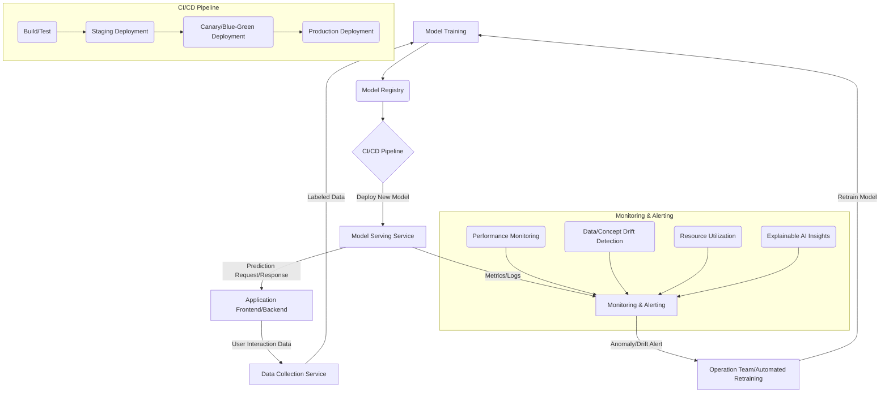

AI 모델의 가치는 개발 완료 시점이 아닌 실제 환경에 배포되어 비즈니스 성과를 창출할 때 비로소 완성됩니다. 특히 실시간으로 사용자 요청에 응답해야 하는 AI 서비스의 경우, 모델 배포의 신속성과 안정성, 그리고 지속적인 성능 관리가 핵심 성공 요인으로 작용합니다. 이러한 요구사항을 충족하기 위해 **실시간 AI 모델 배포 및 모니터링 시스템**은 현대 MLOps (Machine Learning Operations)의 필수적인 구성 요소입니다.

## 실시간 AI 모델 배포의 중요성

전통적인 소프트웨어 배포와 달리 AI 모델은 코드뿐만 아니라 데이터와 모델 가중치에 의해 성능이 좌우됩니다. 이로 인해 다음과 같은 복잡성이 발생하며, 이를 관리하기 위한 체계적인 시스템이 필요합니다.

*   **데이터 드리프트 (Data Drift) 및 컨셉 드리프트 (Concept Drift)**: 시간이 지남에 따라 입력 데이터 분포나 데이터와 타겟 간의 관계가 변하여 모델 성능이 저하될 수 있습니다.
*   **성능 저하 및 비즈니스 영향**: 실시간 서비스에서 모델 성능 저하는 사용자 경험 악화 및 직접적인 비즈니스 손실로 이어집니다.
*   **자원 효율성**: 고성능 GPU/TPU 자원을 효율적으로 사용하고, 예측 트래픽에 따라 스케일링하는 능력은 비용 최적화에 직결됩니다.
*   **신속한 업데이트 및 롤백**: 새로운 모델 버전이나 버그 수정 시 신속하게 배포하고, 문제 발생 시 빠르게 이전 버전으로 롤백하는 기능은 서비스 안정성에 필수적입니다.

## 핵심 시스템 아키텍처 패턴

실시간 AI 모델 배포 및 모니터링 시스템은 일반적으로 다음 구성 요소들을 포함합니다.

### 1. 모델 레지스트리 (Model Registry)

학습된 모델의 버전 관리, 메타데이터 저장, 성능 지표 기록 등을 담당하는 중앙 저장소입니다. MLflow Model Registry, AWS SageMaker Model Registry, Google Cloud Vertex AI Model Registry 등이 대표적인 솔루션입니다.

### 2. CI/CD 파이프라인 (Continuous Integration/Continuous Deployment)

모델 코드 변경, 재학습 완료, 성능 검증 등의 트리거에 따라 자동으로 모델을 빌드, 테스트, 배포하는 자동화된 워크플로우입니다. Canary 배포, Blue/Green 배포와 같은 고급 배포 전략을 포함하여 점진적인 배포와 안전한 롤백을 지원해야 합니다.

### 3. 모델 서빙 인프라 (Model Serving Infrastructure)

배포된 모델이 예측 요청을 처리하는 환경입니다. RESTful API, gRPC 인터페이스를 제공하며, 고가용성 (High Availability)과 확장성 (Scalability)을 보장해야 합니다. Kubeflow Serving (KServe), TensorFlow Serving, TorchServe, NVIDIA Triton Inference Server 등이 널리 사용됩니다. 2026년에는 서버리스 (Serverless) 및 엣지 (Edge) 배포 환경이 더욱 중요해질 것입니다.

### 4. 실시간 모니터링 및 알림 (Real-time Monitoring & Alerting)

모델의 예측 성능 (정확도, 지연 시간), 데이터 드리프트, 리소스 사용량 (CPU, GPU, 메모리), 시스템 오류 등을 실시간으로 감지하고 이상 징후 발생 시 즉시 알림을 발송하는 시스템입니다. Prometheus, Grafana, ELK Stack, Datadog 등의 도구와 함께 커스텀 모니터링 대시보드가 활용됩니다. 특히 XAI (Explainable AI) 기법을 활용하여 모델의 예측 결정 근거를 모니터링하고 시각화하는 기능이 강조될 것입니다.

### 5. 피드백 루프 (Feedback Loop)

실제 서비스 환경에서 수집된 데이터를 바탕으로 모델 성능을 재평가하고, 필요시 모델 재학습을 트리거하여 지속적으로 모델을 개선하는 순환 구조입니다. 이는 데이터 드리프트에 대한 능동적인 대응을 가능하게 합니다.



## 실시간 모델 서빙 및 모니터링 예제 (Python)

여기서는 간략하게 FastAPI를 활용한 모델 서빙 엔드포인트와 Prometheus 클라이언트를 사용한 지표 노출 예시를 보여줍니다.

```python
# app.py: FastAPI 기반 모델 서빙
from fastapi import FastAPI
from pydantic import BaseModel
import uvicorn
import time
import random
from prometheus_client import start_http_server, Summary, Counter

# Prometheus metrics
REQUEST_LATENCY = Summary('request_latency_seconds', 'Latency of requests')
PREDICTION_COUNT = Counter('prediction_total', 'Total number of predictions')

app = FastAPI()

# Assume a simple model loaded here
class MyModel:
    def predict(self, data: list):
        time.sleep(random.uniform(0.01, 0.1)) # Simulate inference time
        return [sum(x) for x in data]

model = MyModel()

class PredictRequest(BaseModel):
    features: list[list[float]]

@app.post("/predict")
async def predict(request: PredictRequest):
    start_time = time.time()
    
    predictions = model.predict(request.features)
    
    end_time = time.time()
    latency = end_time - start_time
    
    REQUEST_LATENCY.observe(latency)
    PREDICTION_COUNT.inc()
    
    return {"predictions": predictions, "latency_seconds": latency}

if __name__ == "__main__":
    # Start Prometheus client on port 8001
    start_http_server(8001)
    print("Prometheus metrics exposed on port 8001")
    uvicorn.run(app, host="0.0.0.0", port=8000)
```

이 예제는 `/predict` 엔드포인트에 요청이 올 때마다 추론 지연 시간과 총 예측 횟수를 Prometheus 지표로 노출합니다. Prometheus 서버는 8001 포트에서 이 지표를 스크랩하고, Grafana 대시보드에서 시각화하여 실시간 모니터링이 가능합니다.

## 2026년 최신 트렌드 반영

미래의 실시간 AI 모델 배포 및 모니터링 시스템은 다음과 같은 방향으로 발전할 것입니다.

*   **AI 기반 자율 운영 (Autonomous MLOps)**: 드리프트 감지, 성능 저하 예측, 모델 재학습 및 재배포까지 전 과정을 AI가 스스로 판단하고 실행하는 수준으로 발전합니다.
*   **엣지 AI 및 연합 학습 (Edge AI & Federated Learning)**: 중앙 서버 외에 엣지 디바이스에서의 모델 배포 및 모니터링이 중요해지며, 데이터 프라이버시를 보장하면서 모델을 개선하는 연합 학습 기법이 주류가 됩니다.
*   **설명 가능한 AI (Explainable AI, XAI) 통합**: 모델의 예측 결과를 설명하는 기능이 모니터링 시스템에 기본적으로 통합되어, 이상 탐지 시 왜 그런 예측이 나왔는지 즉각적인 인사이트를 제공합니다.
*   **옵저버빌리티 (Observability) 강화**: 단순 지표 모니터링을 넘어, 분산 트레이싱, 로그 연관 분석 등을 통해 시스템의 복잡한 상호작용을 깊이 있게 이해하고 문제의 근본 원인을 빠르게 파악하는 능력이 중요해집니다.
*   **강화된 보안 및 규정 준수**: AI 모델에 대한 공격(적대적 공격) 방어, 데이터 프라이버시(GDPR, CCPA) 규정 준수를 위한 감사 로깅 및 접근 제어 기능이 더욱 정교해집니다.

## 트레이드오프

실시간 AI 모델 배포 및 모니터링 시스템 구축에는 여러 트레이드오프가 존재하며, 프로젝트의 요구사항에 따라 적절한 균형점을 찾아야 합니다.

*   **고가용성 및 낮은 지연 시간 vs. 비용 복잡성**: 언제 좋고/언제 나쁜지: 24/7 무중단 서비스와 극도로 낮은 지연 시간이 필수적인 금융 거래, 자율 주행 등에서는 고가용성 아키텍처(multi-region, multi-AZ)와 고성능 인프라(GPU, FPGA)가 필수적입니다. 그러나 이는 막대한 인프라 비용과 관리 복잡성을 수반합니다. 내부 비즈니스 분석 툴처럼 실시간성이 덜 중요하거나 SLA가 유연한 경우, 비용 효율적인 단일 리전/가용 영역 배포나 CPU 기반 인스턴스가 더 적합합니다.
*   **관리형 서비스 vs. 커스텀 구축**: 언제 좋고/언제 나쁜지: AWS SageMaker, Google Cloud Vertex AI와 같은 관리형 MLOps 플랫폼은 빠른 구축과 낮은 운영 오버헤드를 제공하며, 스타트업이나 MLOps 전문가가 부족한 팀에 좋습니다. 하지만 특정 워크로드에 대한 미세 조정이나 독점적인 기술 스택과의 통합에 제약이 있을 수 있습니다. 고도로 최적화된 성능, 특정 하드웨어 통합, 또는 엄격한 보안/규제 요구사항이 있는 대규모 엔터프라이즈의 경우, 커스텀 구축을 통해 완벽한 제어권을 확보하는 것이 유리할 수 있습니다.
*   **통합 모니터링 시스템 vs. 개별 도구 조합**: 언제 좋고/언제 나쁜지: Datadog, Splunk와 같은 통합 모니터링 솔루션은 AI 모델뿐만 아니라 전체 IT 인프라에 대한 포괄적인 가시성을 제공하여 일관된 운영 환경을 조성합니다. 이는 여러 시스템을 관리하는 대규모 조직에 적합합니다. 반면, Prometheus, Grafana, ELK Stack 등 개별 오픈소스 도구를 조합하는 것은 초기 비용이 적고 유연성이 높지만, 통합 및 유지보수 노력이 더 필요합니다. 예산이 제한적이거나 특정 도구에 대한 전문성이 있는 팀에 좋습니다.
*   **적극적인 자동화 vs. 수동 개입 가능성**: 언제 좋고/언제 나쁜지: 데이터 드리프트 감지 시 자동 재학습 및 재배포 시스템은 운영 효율성을 극대화하고 빠른 대응을 가능하게 합니다. 이는 변화가 잦은 시장 예측 모델이나 대규모 개인화 추천 시스템에 적합합니다. 그러나 모델의 오작동이 치명적인 결과를 초래할 수 있는 의료, 국방 분야에서는 사람의 검토와 승인을 거치는 수동 개입 단계가 필수적입니다. 이 경우 자동화 수준을 조절하여 안전성을 확보해야 합니다.

## 실전 체크리스트

실시간 AI 모델 배포 및 모니터링 시스템을 구축할 때 다음 항목들을 검토하여 성공적인 운영을 보장해야 합니다.

- [ ] **모델 버전 관리 및 트래킹 전략 수립**: 모든 모델 artifact (코드, 데이터, 모델 가중치, 환경 설정)가 명확하게 버전 관리되고 추적 가능한지 확인합니다.
- [ ] **자동화된 CI/CD 파이프라인 구축**: 모델 재학습, 성능 검증, 배포(Canary/Blue-Green 포함) 전 과정이 자동화되어 있으며, 롤백 기능이 명확하게 정의되어 있는지 검증합니다.
- [ ] **핵심 모니터링 지표 정의 및 대시보드 구축**: 모델 예측 정확도, 지연 시간, 처리량, 자원 사용량, 데이터 드리프트 등 핵심 지표가 실시간으로 수집되고 시각화되는 대시보드가 있는지 확인합니다.
- [ ] **이상 감지 및 알림 시스템 구현**: 정의된 임계값을 초과하는 성능 저하, 데이터/컨셉 드리프트, 시스템 오류 발생 시 즉각적인 알림 (Slack, PagerDuty 등)이 발송되는지 테스트합니다.
- [ ] **모델 재학습 및 배포를 위한 피드백 루프 설계**: 실시간 서비스 데이터가 모델 재학습 파이프라인으로 유입되고, 재학습된 모델이 자동으로 배포될 수 있는 프로세스가 명확하게 설계되어 있는지 확인합니다.
- [ ] **부하 테스트 및 스케일링 전략 검증**: 실제 서비스 환경과 유사한 부하 조건에서 모델 서빙 인프라가 요구되는 성능과 확장성을 제공하는지 충분히 테스트합니다.
- [ ] **보안 및 규정 준수 검토**: 모델 및 데이터에 대한 접근 제어, 암호화, 개인정보 보호 정책 준수 여부를 확인하고, AI 모델의 책임 있는 사용을 위한 가이드라인이 마련되어 있는지 점검합니다.
- [ ] **XAI (설명 가능한 AI) 적용 가능성 분석**: 모델의 예측 근거를 이해하고 디버깅하는 데 XAI 기법이 통합될 수 있는지 검토하고, 필요한 경우 이를 모니터링 시스템에 반영할 계획을 수립합니다.