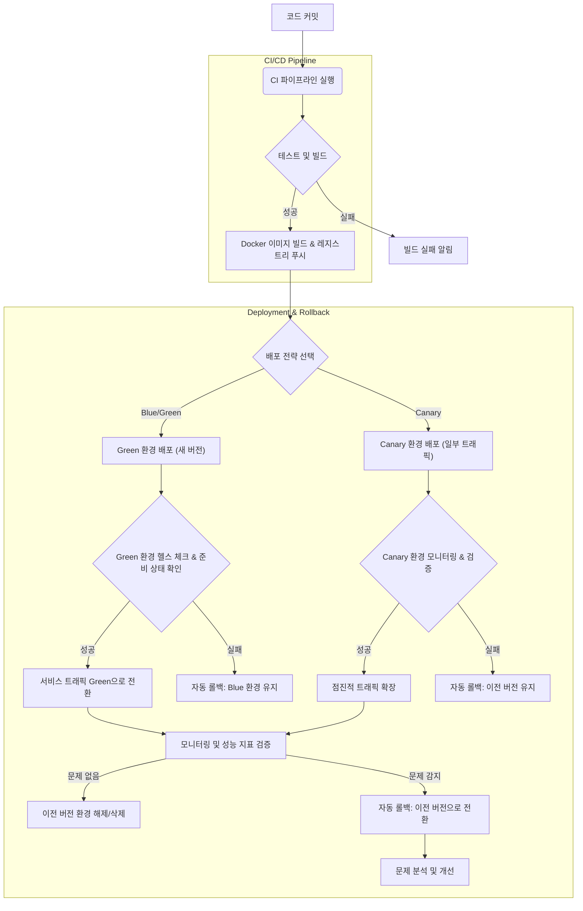

실시간 AI 서비스는 빠른 응답 시간과 높은 가용성을 요구하며, 사용자 경험과 비즈니스 성과에 직접적인 영향을 미친다. 이러한 서비스의 안정적인 운영을 위해 배포(Deployment) 및 롤백(Rollback) 프로세스의 자동화는 선택이 아닌 필수이다. 특히 모델 업데이트나 코드 변경 시 발생할 수 있는 잠재적 문제를 최소화하고, 서비스 연속성을 보장하는 핵심 전략이 된다. 예측 불가능한 엣지 케이스나 성능 저하를 신속하게 감지하고 이전 상태로 복구하는 능력은 실시간 AI 시스템의 신뢰도를 결정한다.

## 핵심 개념 및 자동화 전략

실시간 AI 서비스의 안정적인 배포 및 롤백을 위한 주요 전략은 다음과 같다.

### 1. 진보된 배포 전략 (Advanced Deployment Strategies)
*   **Blue/Green Deployment**: 현재 운영 중인 서비스(Blue)와 동일한 환경의 새 버전(Green)을 준비한 후, 트래픽을 한 번에 전환하는 방식이다. 문제가 발생하면 즉시 Blue 환경으로 롤백하여 중단 시간을 최소화할 수 있다. 직관적이고 빠른 롤백이 가능하지만, 두 개의 완벽한 환경을 유지해야 하므로 리소스 비용이 더 발생할 수 있다.
*   **Canary Deployment**: 새 버전을 소수의 사용자에게만 먼저 배포하고, 모니터링을 통해 안정성이 검증되면 점진적으로 전체 트래픽을 확장하는 방식이다. 위험을 점진적으로 노출하여 사용자에게 미치는 영향을 최소화할 수 있지만, 복잡한 모니터링 시스템과 단계별 트래픽 전환 로직이 필요하다.
*   **Rolling Update**: 기존 인스턴스를 새 버전으로 하나씩 교체하는 방식이다. 서비스 중단 없이 배포가 가능하며 리소스 효율적이지만, 문제가 발생하면 롤백이 복잡해질 수 있다.

### 2. 자동화된 헬스 체크 및 모니터링 (Automated Health Checks & Monitoring)
배포된 AI 서비스의 상태를 지속적으로 확인하는 헬스 체크(Health Check)는 필수적이다.
*   **Liveness Probe**: 서비스 인스턴스가 정상적으로 작동하는지 확인한다. 실패 시 컨테이너를 재시작한다.
*   **Readiness Probe**: 서비스가 트래픽을 받을 준비가 되었는지 확인한다. 실패 시 해당 인스턴스로 트래픽 라우팅을 중단한다.
이러한 프로브와 함께, AI 모델의 추론 지연 시간(Latency), 처리량(Throughput), 오류율(Error Rate), 그리고 모델의 예측 정확도(Prediction Accuracy) 등 핵심 지표를 실시간으로 모니터링하고 임계치(Threshold)를 벗어날 경우 자동 알림 및 롤백을 트리거해야 한다.

### 3. 즉각적인 롤백 메커니즘 (Instant Rollback Mechanism)
자동화된 배포 시스템은 문제가 감지되었을 때 즉시 이전 버전으로 돌아갈 수 있는 기능을 제공해야 한다. 이를 위해서는 배포된 모든 아티팩트(예: Docker Image, 모델 파일)의 버전 관리가 철저해야 하며, 롤백 명령 한 번으로 전체 시스템이 안정적인 이전 상태로 복구될 수 있도록 설계되어야 한다. Immutable Infrastructure(불변 인프라) 원칙을 적용하여 배포된 환경을 변경하는 대신, 항상 새로운 환경을 배포하고 전환하는 방식이 롤백의 예측 가능성과 속도를 높인다.

## 실시간 AI 서비스 배포 파이프라인 예시

다음은 Kubernetes 환경에서 Blue/Green 배포를 수행하는 간략한 CI/CD 파이프라인과 헬스 체크 코드 예시이다.

```python
# app.py: 실시간 AI 서비스의 헬스 체크 엔드포인트 예시
from flask import Flask, jsonify
import os
import time

app = Flask(__name__)

# Mock AI model loading (in a real scenario, this would load a ML model)
MODEL_LOADED = False
try:
    # Simulate a model loading process that might fail
    # For demonstration, we'll assume it succeeds after a short delay 
    time.sleep(1) 
    MODEL_LOADED = True
except Exception as e:
    print(f"Model loading failed: {e}")
    MODEL_LOADED = False

@app.route("/healthz", methods=["GET"])
def liveness_probe():
    # Check if the application is alive
    if not MODEL_LOADED:
        return jsonify({"status": "DOWN", "reason": "Model not loaded"}), 503
    return jsonify({"status": "UP"}), 200

@app.route("/readyz", methods=["GET"])
def readiness_probe():
    # Check if the application is ready to serve traffic
    # This might involve checking external dependencies or model readiness
    if not MODEL_LOADED:
        return jsonify({"status": "NOT_READY", "reason": "Model not ready"}), 503
    
    # Simulate a more complex readiness check, e.g., database connection, model inference test
    # try:
    #     # perform a lightweight inference or dependency check
    #     pass 
    # except Exception:
    #     return jsonify({"status": "NOT_READY", "reason": "Dependency failed"}), 503

    return jsonify({"status": "READY"}), 200

@app.route("/predict", methods=["POST"])
def predict():
    if not MODEL_LOADED:
        return jsonify({"error": "Service not ready"}), 503
    # Actual AI inference logic would go here
    return jsonify({"prediction": "example_output"}), 200

if __name__ == "__main__":
    app.run(host="0.0.0.0", port=int(os.environ.get("PORT", 8080)))
```

```bash
# deploy.sh: Kubernetes Blue/Green 배포 스크립트 (개념 예시)
#!/bin/bash

SERVICE_NAME="ai-service"
IMAGE_NAME="my-ai-app:v2.0" # New image version
OLD_IMAGE_NAME="my-ai-app:v1.0" # Old image version
NAMESPACE="production"
CONTEXT="my-k8s-cluster"

echo "### Starting Blue/Green Deployment for ${SERVICE_NAME} ###"

# 1. Deploy the new (Green) version
echo "Deploying Green version (${IMAGE_NAME})..."
kubectl --context "${CONTEXT}" -n "${NAMESPACE}" apply -f - <<EOF
apiVersion: apps/v1
kind: Deployment
metadata:
  name: ${SERVICE_NAME}-green
  labels:
    app: ${SERVICE_NAME}
    version: green
spec:
  replicas: 3
  selector:
    matchLabels:
      app: ${SERVICE_NAME}
      version: green
  template:
    metadata:
      labels:
        app: ${SERVICE_NAME}
        version: green
    spec:
      containers:
      - name: ${SERVICE_NAME}
        image: ${IMAGE_NAME}
        ports:
        - containerPort: 8080
        livenessProbe:
          httpGet:
            path: /healthz
            port: 8080
          initialDelaySeconds: 10
          periodSeconds: 5
        readinessProbe:
          httpGet:
            path: /readyz
            port: 8080
          initialDelaySeconds: 15
          periodSeconds: 10
EOF

# 2. Wait for Green deployment to be ready
echo "Waiting for Green deployment to be ready..."
kubectl --context "${CONTEXT}" -n "${NAMESPACE}" rollout status deployment/${SERVICE_NAME}-green --timeout=300s

if [ $? -ne 0 ]; then
  echo "Green deployment failed to become ready. Rolling back."
  kubectl --context "${CONTEXT}" -n "${NAMESPACE}" delete deployment ${SERVICE_NAME}-green
  exit 1
fi

echo "Green deployment is ready. Switching service selector."

# 3. Switch Service selector to Green
kubectl --context "${CONTEXT}" -n "${NAMESPACE}" apply -f - <<EOF
apiVersion: v1
kind: Service
metadata:
  name: ${SERVICE_NAME}
  labels:
    app: ${SERVICE_NAME}
spec:
  selector:
    app: ${SERVICE_NAME}
    version: green # Switch to green
  ports:
  - protocol: TCP
    port: 80
    targetPort: 8080
  type: LoadBalancer
EOF

echo "Traffic switched to Green. Monitoring for a period..."
# In a real scenario, this would be a manual or automated monitoring phase.
# If issues, trigger rollback. Else, proceed to decommission Blue.
sleep 60 # Simulate monitoring period

# 4. Decommission old (Blue) version
echo "Decommissioning old Blue version..."
kubectl --context "${CONTEXT}" -n "${NAMESPACE}" delete deployment ${SERVICE_NAME}-blue # Assuming blue exists
echo "Deployment successful. Old version decommissioned."

# Rollback example: If monitoring detects issues, execute this
# echo "Issues detected. Initiating rollback to Blue..."
# kubectl --context "${CONTEXT}" -n "${NAMESPACE}" patch service ${SERVICE_NAME} -p '{"spec":{"selector":{"version":"blue"}}}'
# kubectl --context "${CONTEXT}" -n "${NAMESPACE}" rollout undo deployment/${SERVICE_NAME}-green # Optional, if you want to also kill green

```

### 배포 및 롤백 자동화 워크플로우



## 트레이드오프

이러한 자동화된 배포 및 롤백 전략을 도입할 때는 다음과 같은 트레이드오프를 고려해야 한다.

*   **초기 설정 복잡성 vs. 운영 안정성**:
    *   **언제 좋나**: 서비스의 규모가 커지고, 배포 빈도가 잦아질수록 초기 설정의 복잡성(예: Kubernetes, CI/CD 파이프라인 구축)은 운영 단계의 안정성과 개발 생산성 향상으로 상쇄된다. 대규모 실시간 AI 서비스에 적합하다.
    *   **언제 나쁘나**: 소규모 프로젝트나 PoC 단계에서는 초기 설정에 드는 시간과 비용이 과도할 수 있다. 빠른 프로토타이핑이 중요한 초기 단계에서는 복잡성이 개발 속도를 저해한다.

*   **리소스 사용 효율성 vs. 빠른 롤백/안정성**:
    *   **언제 좋나**: Blue/Green 배포는 두 개의 전체 환경을 운영하므로 리소스 사용 효율성은 낮지만, 문제 발생 시 즉각적인 롤백으로 서비스 중단을 최소화할 수 있어 고가용성(High Availability)이 필수적인 서비스에 적합하다.
    *   **언제 나쁘나**: 리소스 비용이 민감한 환경이거나, 서비스의 중요도가 낮아 약간의 중단을 허용할 수 있는 경우 Blue/Green 배포는 비효율적일 수 있다. Canary 배포는 점진적인 배포로 리소스 효율성과 안정성 사이의 균형을 제공한다.

*   **자동화 수준 vs. 제어 및 유연성**:
    *   **언제 좋나**: 반복적이고 예측 가능한 배포 프로세스에는 완전 자동화가 휴먼 에러를 줄이고 속도를 높여준다. 테스트 커버리지가 높고 서비스 안정성이 검증된 AI 모델 업데이트에 유용하다.
    *   **언제 나쁘나**: 복잡하거나 민감한 변경 사항, 혹은 예측 불가능한 AI 모델 동작의 경우, 수동 검토 및 승인 단계를 포함하는 반자동화(Semi-automated) 방식이 더 큰 제어와 유연성을 제공할 수 있다. 초기 단계의 실험적인 AI 서비스에 적용된다.

*   **모니터링 심도 vs. 오버헤드**:
    *   **언제 좋나**: 서비스 안정성 및 AI 모델 성능에 중요한 모든 지표(시스템 리소스, 네트워크 트래픽, AI 추론 지연 시간, 모델 드리프트, QPS, 에러율 등)에 대한 심층 모니터링은 잠재적 문제를 조기에 감지하여 큰 장애로 확대되는 것을 방지한다. 미션 크리티컬한 AI 서비스에 필수적이다.
    *   **언제 나쁘나**: 너무 많은 지표를 수집하고 분석하는 것은 모니터링 시스템 자체의 오버헤드와 비용을 증가시킬 수 있다. 중요도가 낮은 서비스나 제한된 예산으로는 핵심 지표에 집중하는 것이 효율적이다.

## 실전 체크리스트

프로젝트에 실시간 AI 서비스의 안정적인 배포 및 롤백 자동화를 적용할 때 다음 항목들을 검토해야 한다.

*   [x] 모든 AI 서비스 엔드포인트에 Liveness/Readiness 헬스 체크(Health Checks)가 구성되어 있고, 배포 파이프라인 내에서 자동화된 검증 메커니즘이 작동하는가?
*   [x] 배포 전/후 핵심 비즈니스 및 AI 모델 지표(예: QPS, Latency, Error Rate, Model Drift, Prediction Accuracy)를 실시간으로 모니터링하고, 임계치 위반 시 자동 알림 시스템과 연동되어 있는가?
*   [x] Canary 또는 Blue/Green 배포 전략이 명확하게 정의되어 있고, 해당 전략에 따른 트래픽 라우팅 로직 및 자동 롤백 정책이 구현되어 있는가?
*   [x] AI 모델 서빙 인프라가 Immutable Infrastructure 원칙을 따르는지 확인했으며, 모든 배포 아티팩트(예: Docker Image, 모델 가중치)의 버전 관리가 철저한가?
*   [x] Critical Rollback 시나리오에 대한 정기적인 DR(Disaster Recovery) 훈련을 수행하고 있으며, 훈련 결과가 문서화 및 개선 계획에 반영되는가?
*   [x] 배포 파이프라인에 정적/동적 코드 분석, 보안 취약점 스캔, 의존성 검사(Dependency Check) 단계가 포함되어 CI/CD 보안이 강화되어 있는가?
*   [x] A/B 테스트 또는 Multi-Armed Bandit(멀티 암드 밴딧) 전략과 연동하여 새로운 모델의 점진적 적용 및 성능 평가가 자동화되어, 최적의 모델을 자동으로 선택하도록 설계되어 있는가?