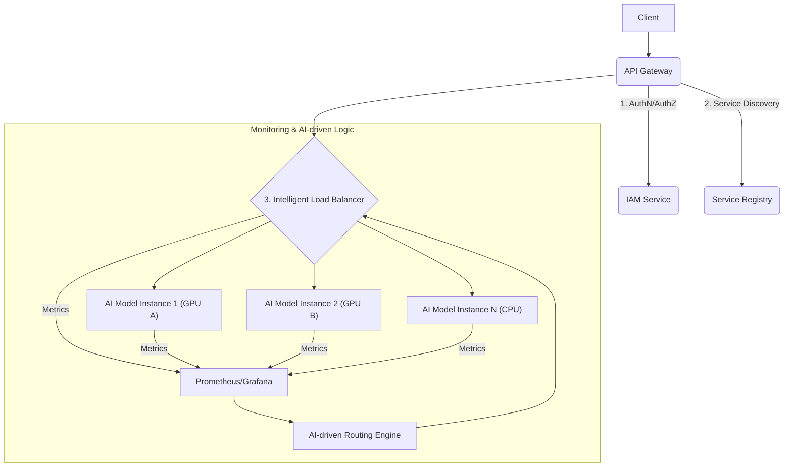

대규모 AI 서비스의 안정성과 성능을 보장하려면, 저지연(low-latency) 및 고처리량(high-throughput) 요구사항을 충족하는 정교한 트래픽 관리 전략이 필수적입니다. 특히 AI 추론 워크로드는 모델 복잡도, 리소스 요구사항, 그리고 예측 불가능한 피크 트래픽으로 인해 일반적인 부하 분산 기법만으로는 한계가 있습니다. API 게이트웨이는 이러한 복잡성을 효과적으로 관리하고, AI 서비스의 확장성과 고가용성을 보장하는 핵심 인프라 컴포넌트입니다.

### API Gateway의 역할 및 핵심 기능

API 게이트웨이는 클라이언트 요청에 대한 단일 진입점(Single Entry Point)을 제공하며, 백엔드 AI 모델 인스턴스로의 효율적인 라우팅을 담당합니다. 단순한 트래픽 분배를 넘어 AI 워크로드의 동적인 특성을 고려한 지능형 라우팅, 인증/인가, 캐싱, 로깅, 모니터링 등의 기능을 통합합니다.

1.  **지능형 부하 분산 알고리즘 (Intelligent Load Balancing Algorithms)**:
    *   **리소스 기반 라우팅 (Resource-aware Routing)**: 각 AI 모델 인스턴스의 CPU/GPU 사용률, 메모리, 큐 길이 등 실시간 리소스 상태를 모니터링하여 여유 있는 인스턴스로 요청을 분배합니다. 이는 AI 워크로드의 병목 현상을 최소화하는 데 핵심적입니다.
    *   **지연 시간 기반 라우팅 (Latency-based Routing)**: 백엔드 인스턴스의 응답 지연 시간(latency)을 측정하여 가장 빠른 인스턴스로 요청을 라우팅합니다.
    *   **AI 기반 부하 분산 (AI-driven Load Balancing)**: 과거 트래픽 패턴, 모델별 성능 특성, 예상되는 미래 부하를 AI 모델이 예측하여 최적의 라우팅 결정을 내리는 고급 방식입니다.
2.  **서비스 디스커버리 연동 (Service Discovery Integration)**: 오토 스케일링 그룹(Auto-Scaling Group)에 의해 동적으로 생성/소멸되는 AI 모델 인스턴스 목록을 Consul, Kubernetes Service Discovery 등과 연동하여 실시간으로 업데이트하고, 비정상 인스턴스를 자동 제외합니다.
3.  **서킷 브레이킹 및 Rate Limiting (Circuit Breaking & Rate Limiting)**: 특정 백엔드 인스턴스에 문제가 발생하거나 과부하 상태일 때, 서킷 브레이커 패턴을 적용하여 트래픽을 우회시키고, Rate Limiting으로 API 남용을 방지하여 시스템 안정성을 확보합니다.
4.  **인증 및 인가 (Authentication & Authorization)**: 모든 AI 서비스 요청에 대해 JWT 검증, OAuth 2.0 기반의 사용자 인증 및 RBAC(Role-Based Access Control)를 통한 인가를 중앙 집중식으로 처리합니다.

### 아키텍처 및 구현 예시


이 아키텍처는 클라이언트 요청이 API Gateway를 통해 진입하며, 게이트웨이는 IAM 및 서비스 레지스트리와 연동하여 보안 및 백엔드 인스턴스 정보를 확인합니다. 핵심은 지능형 부하 분산기(Intelligent Load Balancer)로, 실시간 모니터링 데이터를 AI 기반 라우팅 엔진(AI-driven Routing Engine)으로 보내 최적의 라우팅 정책을 동적으로 적용받습니다.

다음은 `FastAPI`를 사용한 AI 추론 게이트웨이의 간소화된 Python 코드 예시입니다. 리소스 기반 부하 분산 로직의 핵심 아이디어를 보여줍니다.

```python
# main.py (Simplified AI Inference Gateway)
from fastapi import FastAPI, Request, HTTPException
from httpx import AsyncClient
import random
import asyncio

app = FastAPI(title="AI Inference Gateway")

# Simplified representation of backend AI services with dynamic metrics
# In production, this would be updated via Service Discovery + Monitoring
ai_backends = {
    "model-x": [
        {"url": "http://ai-x-01:8001", "cpu_load": 0.2, "gpu_util": 0.1, "queue_len": 5},
        {"url": "http://ai-x-02:8002", "cpu_load": 0.6, "gpu_util": 0.8, "queue_len": 20},
        {"url": "http://ai-x-03:8003", "cpu_load": 0.1, "gpu_util": 0.05, "queue_len": 2},
    ]
}

async def select_backend_by_resource(model_name: str):
    """Selects backend based on a weighted resource score (lower is better)."""
    if model_name not in ai_backends:
        raise HTTPException(status_code=503, detail=f"Model {model_name} not available")

    # Filter out unhealthy/overloaded backends (simplified: queue_len > 15 is overloaded)
    healthy_backends = [b for b in ai_backends[model_name] if b["queue_len"] < 15]
    if not healthy_backends:
        raise HTTPException(status_code=503, detail=f"No healthy backends for {model_name}")

    def score_backend(backend):
        # Example scoring: prioritize lower GPU utilization and queue length
        return (backend["gpu_util"] * 0.7) + (backend["queue_len"] * 0.3)
    
    best_backend = min(healthy_backends, key=score_backend)
    return best_backend["url"]

@app.post("/inference/{model_name}")
async def proxy_inference(model_name: str, request: Request):
    target_url = await select_backend_by_resource(model_name)
    
    async with AsyncClient(timeout=60.0) as client:
        try:
            req_body = await request.body()
            headers = {k: v for k, v in request.headers.items() if k.lower() not in ["host", "content-length", "transfer-encoding"]}
            
            response = await client.post(
                url=f"{target_url}{request.url.path.replace(f'/inference/{model_name}', '')}",
                headers=headers,
                content=req_body
            )
            response.raise_for_status()
            return response.json()
        except Exception as e:
            print(f"Error proxying request to {target_url}: {e}")
            raise HTTPException(status_code=500, detail="AI inference service error or timeout")

# To run: pip install fastapi uvicorn httpx && uvicorn main:app --port 8000
```
이 코드는 `/inference/{model_name}` 요청을 받아 `select_backend_by_resource` 함수를 통해 최적의 백엔드를 선택합니다. 백엔드 선택 로직은 GPU 활용률(`gpu_util`)과 추론 큐 길이(`queue_len`)를 기반으로 가장 효율적인 인스턴스를 찾아냅니다. 실제 환경에서는 이 메트릭들이 모니터링 시스템에서 실시간으로 제공되며, 더 복잡한 모델링을 통해 라우팅 결정을 최적화할 수 있습니다.

## 트레이드오프

*   **복잡도 증가 vs. 중앙 집중식 관리**:
    *   **언제 좋은가**: 대규모 분산 AI 시스템에서 트래픽, 보안, 관측성을 중앙에서 효과적으로 관리할 때 필수적입니다. 다양한 AI 모델 및 버전을 효율적으로 통합/관리할 수 있습니다.
    *   **언제 나쁜가**: 소규모, 단일 AI 모델 서비스에는 불필요한 오버헤드를 추가하여 개발 및 운영의 복잡도를 높일 수 있습니다.
*   **단일 실패 지점 위험 vs. 고가용성 보장**:
    *   **언제 좋은가**: 게이트웨이 자체에 대한 고가용성(High Availability) 설계를 적용(예: 클러스터링, 액티브-액티브 구성)하여, 전체 AI 서비스의 장애 복구 시간(RTO)을 최소화할 수 있습니다.
    *   **언제 나쁜가**: 게이트웨이 인프라 설계가 미흡하거나, 단일 게이트웨이 인스턴스에 의존할 경우, 게이트웨이 장애가 전체 AI 서비스 중단으로 이어질 수 있는 심각한 위험을 내포합니다.
*   **성능 오버헤드 vs. 기능 통합**:
    *   **언제 좋은가**: 인증, 인가, 로깅, 모니터링 등 횡단 관심사(cross-cutting concerns)를 중앙에서 처리하여 각 AI 서비스 개발 부담을 줄이고 정책 일관성을 확보합니다.
    *   **언제 나쁜가**: 모든 요청이 게이트웨이를 거치면서 추가적인 네트워크 홉(network hop)과 처리 지연(processing delay)이 발생합니다. 이는 극도로 낮은 지연 시간(ultra-low latency)이 요구되는 특정 AI 추론 워크로드에는 부적합할 수 있습니다.
*   **비용 증가 vs. 리소스 효율성**:
    *   **언제 좋은가**: 지능형 부하 분산을 통해 인프라 리소스를 효율적으로 활용하고, 개발 및 운영 효율성을 높여 장기적으로 총 소유 비용(TCO)을 절감할 수 있습니다.
    *   **언제 나쁜가**: 게이트웨이 인스턴스 및 관련 서비스(서비스 디스커버리, 모니터링 시스템)의 구축 및 유지보수에 초기 투자 비용과 지속적인 운영 비용이 발생합니다.

## 실전 체크리스트

프로젝트에 실시간 AI 서비스 부하 분산을 위한 API 게이트웨이를 적용할 때 다음 항목들을 검증해야 합니다.

*   - [ ] 각 AI 모델 인스턴스의 CPU/GPU 사용률, 메모리, 추론 큐 길이 등 핵심 리소스 메트릭이 실시간으로 API Gateway에 전달되고 있는가?
*   - [ ] AI 모델 인스턴스의 동적 스케일링(Auto-Scaling)에 맞춰 API Gateway의 라우팅 대상 목록이 서비스 디스커버리 시스템을 통해 자동으로 업데이트되는가?
*   - [ ] AI 모델 특성(예: 대형 언어 모델, 경량 비전 모델) 및 클라이언트 요구사항에 따라 가중치 또는 사용자 정의 부하 분산 알고리즘을 유연하게 적용할 수 있는가?
*   - [ ] 특정 AI 서비스의 지연 시간 임계값 초과 또는 오류율 증가 시, 서킷 브레이커가 작동하여 해당 인스턴스로의 트래픽을 자동으로 차단하고 우회시키는가?
*   - [ ] 클라이언트별, 엔드포인트별로 정의된 API Rate Limiting 정책이 정확히 적용되어 DoS 공격 및 과도한 리소스 소모를 방지하는가?
*   - [ ] API Gateway 자체의 고가용성(High Availability)을 위해 다중 인스턴스 배포 및 자동 장애 복구(failover) 메커니즘이 안정적으로 동작하는가?
*   - [ ] 게이트웨이의 트래픽 흐름, 백엔드 오류율, 평균 지연 시간을 시각화하고, 주요 이상 징후 발생 시 자동으로 알림을 전송하는 모니터링 및 알림 시스템이 완비되었는가?