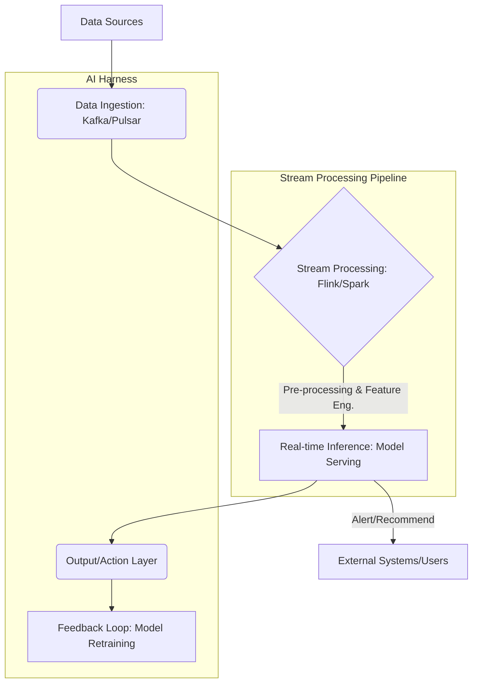

## 실시간 AI Harness — 스트림 처리 디자인 패턴

고성능 AI 시스템 구축에 필수적인 실시간 데이터 스트림 처리는 현대 AI 애플리케이션의 핵심 요구사항입니다. 특히 2026년 실무에서는 Low-Latency(낮은 지연), High-Throughput(높은 처리량), 그리고 Fault-Tolerant(오류 허용) 특성을 가진 AI Harness 디자인 패턴이 중요하게 부각될 것입니다. 실시간 AI Harness는 연속적으로 유입되는 데이터를 즉시 처리하고, AI 모델을 통해 인사이트를 도출하며, 이에 따른 즉각적인 액션을 취할 수 있도록 지원하는 프레임워크를 의미합니다.

### 핵심 개념 및 중요성

실시간 데이터 스트림 처리는 센서 데이터, 사용자 클릭 스트림, 금융 거래, IoT 이벤트 등 끊임없이 생성되는 데이터를 효율적으로 분석하여 즉각적인 의사결정을 가능하게 합니다. AI Harness는 이러한 스트림 데이터를 AI 모델의 입력으로 정제하고, 모델의 추론 결과를 다시 시스템으로 통합하는 전체 파이프라인을 의미합니다.

1.  **Event-Driven Architecture**: 데이터가 발생할 때마다 즉시 처리하는 방식입니다. 이는 Batch Processing(배치 처리)의 지연 시간을 극복하고, AI 모델이 항상 최신 데이터를 기반으로 추론하도록 합니다.
2.  **Low-Latency Inference**: 수 밀리초(ms) 이내에 데이터를 처리하고 AI 모델 추론을 완료하여 실시간 피드백 루프를 구현합니다. 이는 이상 감지, 추천 시스템, 자율 주행 등 다양한 분야에서 Critical(임계)합니다.
3.  **Scalability & Resilience**: 급증하는 데이터 볼륨과 다양한 워크로드에 유연하게 대응할 수 있도록 시스템은 수평적 확장성(Horizontal Scalability)을 갖춰야 하며, 부분적인 장애에도 전체 시스템이 안정적으로 운영될 수 있는 복원력(Resilience)이 필수적입니다.
4.  **State Management**: 스트림 데이터 처리 과정에서 발생하는 중간 상태를 효율적으로 관리하고, 상태가 유실되지 않도록 보장하는 것이 중요합니다.

### 실시간 AI Harness 아키텍처 패턴

일반적인 실시간 AI Harness는 다음과 같은 컴포넌트들로 구성됩니다.

*   **Data Ingestion Layer**: Kafka, Apache Pulsar, AWS Kinesis와 같은 분산 메시징 시스템을 사용하여 대량의 스트림 데이터를 안정적으로 수집합니다.
*   **Stream Processing Layer**: Apache Flink, Apache Spark Streaming, Kafka Streams와 같은 스트림 처리 프레임워크를 활용하여 데이터를 필터링, 변환, 집계하고 Feature Engineering(특징 추출)을 수행합니다.
*   **Real-time Inference Layer**: TensorFlow Serving, Triton Inference Server, TorchServe 등 고성능 모델 서빙 프레임워크를 사용하여 전처리된 데이터를 AI 모델에 입력하고 추론 결과를 실시간으로 생성합니다. Edge Device(엣지 디바이스)에서의 On-Device Inference(온디바이스 추론)도 중요한 패턴입니다.
*   **Action & Feedback Layer**: 추론 결과를 기반으로 실시간 알림, 자동화된 액션(예: 금융 거래 차단, 추천 상품 노출), 또는 모델 재학습을 위한 피드백 루프를 구성합니다.



### 코드 예제: 간단한 Python 기반 실시간 스트림 처리 및 추론

다음은 `kafka-python` 라이브러리와 간단한 로컬 모델을 사용하여 실시간으로 Kafka 스트림을 읽고 추론을 수행하는 개념적인 Python 예제입니다. 실제 프로덕션 환경에서는 Flink, Spark 등의 분산 스트림 처리 프레임워크와 최적화된 모델 서빙 솔루션을 사용합니다.

```python
import json
from kafka import KafkaConsumer
import numpy as np
# from sklearn.linear_model import LogisticRegression # 실제 모델
import pickle

# 더미 모델 로드 (실제로는 학습된 모델 로드)
# with open('model.pkl', 'rb') as f:
#     model = pickle.load(f)

# 간단한 더미 모델 (0 또는 1 반환)
class DummyModel:
    def predict(self, data):
        # 입력 데이터의 평균이 0.5보다 크면 1, 아니면 0 반환
        return [1 if np.mean(d) > 0.5 else 0 for d in data]

model = DummyModel()

# Kafka Consumer 설정
consumer = KafkaConsumer(
    'realtime-events',
    bootstrap_servers=['localhost:9092'],
    auto_offset_reset='latest', # 최신 메시지부터 읽기
    enable_auto_commit=True,
    group_id='my-inference-group',
    value_deserializer=lambda x: json.loads(x.decode('utf-8'))
)

print("Kafka consumer started, waiting for messages...")

try:
    for message in consumer:
        event_data = message.value
        print(f"Received event: {event_data}")

        # 데이터 전처리 (실제로는 더 복잡한 Feature Engineering)
        # 예시: 특정 키 값만 추출하여 모델 입력으로 사용
        if 'features' in event_data and isinstance(event_data['features'], list):
            input_features = np.array([event_data['features']])
        else:
            print("Invalid event format, skipping...")
            continue

        # AI 모델 추론
        prediction = model.predict(input_features)
        
        # 추론 결과 처리 (실시간 액션 또는 로깅)
        print(f"Inference result: {prediction[0]}")
        if prediction[0] == 1:
            print("  >>> ALERT: Anomalous behavior detected!")
            # 실제로는 외부 시스템으로 알림 전송 (e.g., 메시징 큐, API 호출)
        
except KeyboardInterrupt:
    print("Stopping consumer.")
finally:
    consumer.close()
```

### ## 트레이드오프

실시간 AI Harness 디자인 패턴은 여러 복잡한 트레이드오프를 수반합니다. 시스템 설계 시 이러한 요소들을 신중하게 고려해야 합니다.

*   **복잡성(Complexity) vs. 성능(Performance)**
    *   **언제 좋음**: 초저지연 및 고처리량이 필수적인 경우. 정교한 분산 스트림 처리 시스템과 모델 서빙 인프라는 최적의 성능을 제공합니다.
    *   **언제 나쁨**: 요구되는 지연 시간이 상대적으로 덜 엄격하거나 데이터 볼륨이 크지 않은 경우. 과도한 복잡성은 개발, 배포, 유지보수 비용을 증가시키고, 불필요한 엔지니어링 오버헤드를 유발합니다.
*   **비용(Cost) vs. 지연 시간(Latency)**
    *   **언제 좋음**: 비즈니스 가치가 높은 실시간 의사결정(예: 사기 탐지, 주식 거래)에 있어 지연 시간 감소가 직접적인 수익 증대나 손실 방지로 이어지는 경우. 전용 하드웨어, 분산 클러스터, 고성능 네트워크는 지연 시간을 최소화합니다.
    *   **언제 나쁨**: 지연 시간이 몇 초 또는 몇 분까지 허용되는 경우. 불필요하게 낮은 지연 시간을 목표로 하면 값비싼 인프라(GPU 인스턴스, 고속 SSD, 인메모리 DB) 비용을 감당해야 합니다.
*   **데이터 일관성(Data Consistency) vs. 처리량(Throughput)**
    *   **언제 좋음**: 금융 거래나 보안 시스템처럼 데이터의 정확성과 일관성이 최우선인 경우. 강력한 일관성(Strong Consistency) 보장은 데이터 무결성을 유지하는 데 필수적입니다.
    *   **언제 나쁨**: 추천 시스템이나 광고 타겟팅처럼 최신성이 중요하지만 약간의 데이터 불일치가 허용되는 경우. 강력한 일관성 모델은 분산 환경에서 처리량을 저하시킬 수 있으므로, 최종 일관성(Eventual Consistency) 모델이 더 적합할 수 있습니다.
*   **유연성(Flexibility) vs. 최적화(Optimization)**
    *   **언제 좋음**: 다양한 데이터 소스, 여러 AI 모델, 빠르게 변화하는 비즈니스 로직에 대응해야 하는 경우. 플러그인 아키텍처와 범용 스트림 처리 프레임워크가 유연성을 제공합니다.
    *   **언제 나쁨**: 특정 워크로드에 대한 극단적인 성능 최적화가 필요한 경우. 범용 솔루션은 특정 병목 현상에 대한 맞춤형 최적화가 어렵고, 이는 성능 상의 한계로 이어질 수 있습니다.

### ## 실전 체크리스트

실시간 AI Harness를 프로젝트에 성공적으로 적용하기 위한 검증 항목입니다.

*   - [ ] **엔드-투-엔드(End-to-End) 지연 시간 요구사항 정의 및 측정 완료**: 데이터 수집부터 최종 액션까지의 총 지연 시간 목표(예: < 100ms)가 명확히 정의되었으며, 실제 운영 환경에서 측정 및 모니터링되고 있는가?
*   - [ ] **초당 처리량(Throughput) 목표 설정 및 부하 테스트 통과**: 시스템이 예상되는 최대 트래픽 피크(예: 초당 10,000 이벤트)를 안정적으로 처리할 수 있는지 부하 테스트를 통해 검증했는가?
*   - [ ] **데이터 손실 없는(Zero-Loss) 메시징 및 처리 보장 메커니즘 설계**: 메시지 큐, 스트림 처리 엔진, 데이터베이스 간의 Exactly-Once Processing(정확히 한 번 처리) 또는 At-Least-Once Processing(최소 한 번 처리) 보장 전략이 수립되었는가?
*   - [ ] **자동 스케일링(Auto-Scaling) 및 고가용성(High Availability) 구성 확인**: 데이터 볼륨 변화에 따라 자동으로 리소스가 확장/축소되고, 단일 장애 지점(Single Point of Failure) 없이 시스템이 고가용성을 유지하는가?
*   - [ ] **실시간 모니터링, 알림, 로깅 시스템 구축**: 지연 시간, 처리량, 에러율, 모델 성능 등 핵심 지표를 실시간으로 모니터링하고, 이상 징후 발생 시 즉시 알림을 받을 수 있는 시스템이 구축되었는가?
*   - [ ] **모델 버전 관리 및 A/B 테스트(A/B Testing) 파이프라인 준비**: 새로운 AI 모델 버전이 실시간 환경에 배포될 때, 안전하게 A/B 테스트를 수행하고 롤백할 수 있는 절차가 마련되었는가?
*   - [ ] **데이터 드리프트(Data Drift) 및 모델 성능 저하 감지 메커니즘 구현**: 실시간으로 유입되는 데이터의 분포 변화(Data Drift)나 모델의 추론 성능 저하를 자동으로 감지하고, 재학습 또는 경고를 트리거하는 시스템이 갖춰져 있는가?
