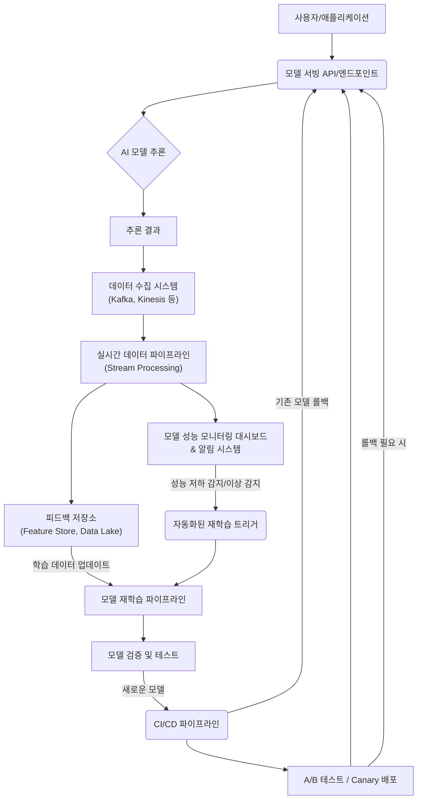

AI 모델의 지속적인 개선과 안정적인 운영은 현대 서비스에서 필수적인 요소이며, 2026년에도 이 중요성은 더욱 증대될 것입니다. 특히, AI 모델의 예측 또는 생성 결과가 실제 환경에서 어떻게 작동하는지에 대한 실시간 피드백은 모델 성능 저하(drift)를 조기에 감지하고, 사용자 경험을 최적화하며, 비즈니스 목표 달성에 기여하는 핵심적인 역할을 합니다. 실시간 피드백 루프를 통합한 AI 모델 배포 Harness는 이러한 요구사항을 충족시키기 위한 전략적인 접근 방식입니다.

## 실시간 피드백 루프의 핵심 구성 요소

실시간 피드백 루프는 크게 네 가지 핵심 단계로 구성됩니다.

1.  **데이터 수집 (Data Collection)**: 배포된 AI 모델의 추론 결과, 사용자 상호작용, 환경 변화 등 실제 운영 데이터를 실시간으로 수집합니다. 이는 모델의 입력 데이터와 예측 결과뿐만 아니라, 예측에 대한 사용자 반응(클릭, 구매, 평점 등) 또는 외부 시스템의 응답을 포함합니다.
2.  **모니터링 및 분석 (Monitoring & Analysis)**: 수집된 데이터를 바탕으로 모델의 성능 지표(Accuracy, Precision, Recall, F1-Score, RMSE 등), 서비스 지표(Latency, Throughput), 데이터 분포 변화(Data Drift, Concept Drift) 등을 실시간으로 모니터링하고 분석합니다.
3.  **의사 결정 및 트리거 (Decision & Trigger)**: 분석된 결과가 사전에 정의된 임계치(threshold)를 벗어나거나 특정 패턴을 보일 경우, 자동화된 재학습, 롤백, 경고 발송 등의 후속 조치를 트리거합니다.
4.  **조치 및 재배포 (Action & Redeployment)**: 트리거된 조치에 따라 모델을 재학습하거나, 기존 모델을 대체하거나, 과거 안정 버전으로 롤백하는 등의 과정을 거쳐 모델을 최적화하고 재배포합니다.

## AI 모델 배포 Harness 아키텍처

실시간 피드백 루프를 통합한 Harness 아키텍처는 데이터 파이프라인, 모델 서빙 계층, 모니터링 시스템, 그리고 CI/CD 파이프라인의 유기적인 결합을 필요로 합니다.



### 1. 실시간 피드백 데이터 수집

모델 서빙 계층은 추론 요청과 응답을 로깅하고, 사용자 행동 데이터와 같은 외부 피드백을 수집 시스템으로 전송합니다. Apache Kafka, Amazon Kinesis와 같은 메시지 큐 시스템은 대규모 실시간 데이터 스트림을 처리하는 데 효과적입니다. 수집된 데이터는 Feature Store나 Data Lake에 저장되어 추후 모델 재학습에 활용됩니다.

### 2. 모델 성능 모니터링 및 드리프트 감지

모니터링 시스템은 수집된 실시간 데이터를 분석하여 모델의 예측 정확도, 지연 시간, 리소스 사용률 등 운영 지표를 시각화합니다. 특히, 입력 데이터 분포의 변화(Data Drift)나 모델-실제 결과 간의 관계 변화(Concept Drift)를 감지하는 것이 중요합니다. Prometheus, Grafana, Evidently AI, WhyLabs와 같은 도구들이 활용될 수 있습니다. 특정 임계치를 넘어서는 성능 저하가 감지되면, Slack, PagerDuty 등으로 자동 알림을 발송하여 운영팀에 경고합니다.

### 3. 자동화된 재학습 및 재배포 워크플로우

성능 저하 알림은 모델 재학습 파이프라인을 자동으로 트리거할 수 있습니다. 이 파이프라인은 최신 피드백 데이터셋을 사용하여 모델을 재학습하고, 엄격한 검증 및 테스트 과정을 거칩니다. 새로 학습된 모델은 CI/CD 파이프라인을 통해 A/B 테스트, Canary 배포와 같은 점진적 배포 전략을 활용하여 프로덕션 환경에 배포됩니다. 문제가 발생할 경우, 자동 롤백 기능을 통해 신속하게 이전 버전으로 되돌릴 수 있습니다.

## 코드 예제: 간단한 피드백 수집 및 재학습 트리거 (Python)

```python
import json
import time
from datetime import datetime
from kafka import KafkaProducer
from threading import Thread

# Assume these are environment variables or configuration
KAFKA_BROKER = 'localhost:9092'
FEEDBACK_TOPIC = 'model_feedback'
MONITORING_THRESHOLD = 0.95 # Example accuracy threshold

producer = KafkaProducer(
    bootstrap_servers=[KAFKA_BROKER],
    value_serializer=lambda v: json.dumps(v).encode('utf-8')
)

def send_feedback(prediction_id: str, model_version: str, input_data: dict, prediction: dict, actual_outcome: bool = None, feedback_score: float = None):
    """
    Simulates sending real-time feedback to Kafka.
    """
    feedback_event = {
        "timestamp": datetime.now().isoformat(),
        "prediction_id": prediction_id,
        "model_version": model_version,
        "input_data": input_data,
        "prediction": prediction,
        "actual_outcome": actual_outcome,
        "feedback_score": feedback_score # e.g., user rating
    }
    producer.send(FEEDBACK_TOPIC, feedback_event)
    print(f"Sent feedback for prediction_id: {prediction_id}")

def monitor_and_trigger_retrain(current_accuracy: float):
    """
    Simulates a monitoring system triggering retraining.
    In a real system, this would involve processing streaming data.
    """
    if current_accuracy < MONITORING_THRESHOLD:
        print(f"[{datetime.now().isoformat()}] Model accuracy {current_accuracy:.2f} is below threshold {MONITORING_THRESHOLD}. Triggering retraining...")
        # In a real system, this would call an API for the retraining pipeline
        # e.g., requests.post("http://retraining-pipeline-service/trigger", json={"reason": "performance_drop"})
    else:
        print(f"[{datetime.now().isoformat()}] Model accuracy {current_accuracy:.2f} is healthy.")

# Example usage (simplified for demonstration)
if __name__ == "__main__":
    # Simulate feedback collection
    Thread(target=send_feedback, args=("pred_001", "v1.0", {"feature_a": 10}, {"class": "A"}, True, 0.9)).start()
    Thread(target=send_feedback, args=("pred_002", "v1.0", {"feature_a": 5}, {"class": "B"}, False, 0.2)).start()
    time.sleep(1) # Give some time for Kafka to process

    # Simulate periodic monitoring check
    # This 'current_accuracy' would come from a real-time analytics system
    monitor_and_trigger_retrain(0.98) # Healthy
    time.sleep(2)
    monitor_and_trigger_retrain(0.90) # Triggers retraining
```

## 트레이드오프

*   **실시간 데이터 처리 복잡성**:
    *   **언제 좋고**: 모델이 매우 동적인 환경에서 운영되고 성능 저하를 빠르게 감지하고 대응해야 할 때 (예: 금융 사기 탐지, 추천 시스템).
    *   **언제 나쁘고**: 데이터 변화 주기가 길고 모델 성능이 안정적인 경우 (예: 배치 처리 기반의 예측), 과도한 인프라 비용과 유지보수 복잡성을 초래합니다.
*   **인프라 비용**:
    *   **언제 좋고**: 모델 성능 저하로 인한 비즈니스 손실이 인프라 비용보다 훨씬 클 때. 지속적인 모델 최적화를 통해 경쟁 우위를 확보할 수 있습니다.
    *   **언제 나쁘고**: 초기 구축 및 운영에 상당한 비용이 들 수 있으며, 특히 예측 정확도가 비즈니스에 미치는 영향이 미미하거나 예측 오류의 허용 범위가 넓을 때 불필요한 투자가 될 수 있습니다.
*   **모델 드리프트 감지 민감도**:
    *   **언제 좋고**: 미세한 데이터/개념 드리프트도 즉시 감지하여 모델 성능을 일정하게 유지해야 할 때, 민감도를 높게 설정하여 선제적 대응이 가능합니다.
    *   **언제 나쁘고**: 너무 높은 민감도는 잦은 오탐(false positive)으로 불필요한 재학습 및 배포를 유발하여 운영 오버헤드를 증가시킬 수 있습니다.
*   **데이터 개인 정보 보호 및 거버넌스**:
    *   **언제 좋고**: 피드백 데이터를 비식별화하고 보안 프로토콜을 철저히 준수하여 규제 준수 및 사용자 신뢰를 확보할 때.
    *   **언제 나쁘고**: 민감한 사용자 데이터를 실시간으로 수집하고 처리하는 과정에서 개인 정보 보호(privacy) 및 데이터 거버넌스(governance) 이슈가 발생할 수 있으며, 규제 위반의 위험이 있습니다.

## 실전 체크리스트

프로젝트에 실시간 피드백 루프 기반의 AI 모델 배포 Harness를 구축할 때 다음 항목들을 검증해야 합니다.

*   - [ ] **데이터 수집 파이프라인**: 모델 입력 데이터, 추론 결과, 사용자 피드백(명시적/암묵적)이 최소 99.9%의 가용성으로 실시간 수집되는가?
*   - [ ] **성능 모니터링 대시보드**: 핵심 모델 성능 지표(Accuracy, Latency, Data Drift)가 5분 이내 지연으로 시각화되고, 드리프트 발생 시 10분 이내에 알림이 발송되는가?
*   - [ ] **자동 재학습 트리거**: 정의된 성능 임계치 이탈 시, 재학습 파이프라인이 자동으로 트리거되며, 재학습 완료까지의 평균 시간이 1시간 이내로 유지되는가?
*   - [ ] **모델 검증 자동화**: 재학습된 모델이 기존 모델 대비 성능 향상을 수치적으로 입증하고, 회귀 테스트(regression test)를 100% 통과하는가?
*   - [ ] **점진적 배포 전략**: Canary 또는 A/B 테스트를 통해 새로운 모델이 점진적으로 배포되며, 배포 실패 시 5분 이내에 자동 롤백이 가능한가?
*   - [ ] **비용 모니터링**: 실시간 데이터 처리 및 모델 재학습에 소요되는 클라우드 리소스 비용이 월별 예산을 10% 이내로 초과하지 않는지 지속적으로 모니터링하는가?
*   - [ ] **데이터 거버넌스 및 보안**: 수집되는 피드백 데이터의 민감도에 따라 접근 제어, 암호화, 비식별화 절차가 명확히 정의되고 준수되는가?