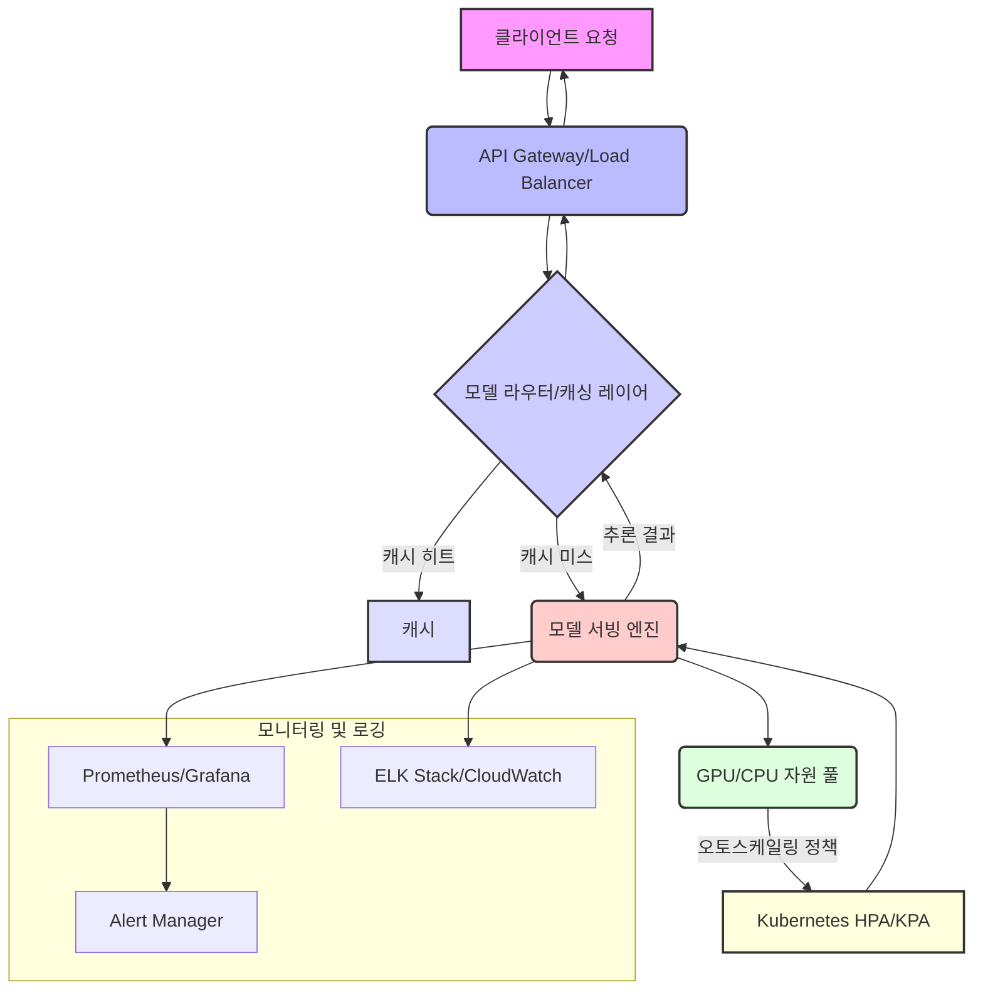

대규모 AI 모델의 실시간 서빙은 단순히 모델을 배포하는 것을 넘어, 예측 가능하고 안정적인 성능, 낮은 지연 시간, 높은 처리량을 보장하는 복잡한 엔지니어링 과제입니다. 특히 2026년 현재, LLM(Large Language Model)과 멀티모달(Multimodal) 모델의 확산은 이러한 요구사항을 더욱 증대시키고 있으며, 이를 효과적으로 관리하기 위한 견고한 서빙 하네스(Harness) 구축이 필수적입니다.

## 실시간 대규모 AI 모델 서빙의 핵심 과제

대규모 AI 모델을 실시간으로 서빙할 때 직면하는 주요 과제는 다음과 같습니다:

*   **고성능 및 저지연 시간(Low Latency)**: 사용자 요청에 즉각적으로 응답해야 합니다. 모델 크기가 커질수록 추론 지연 시간이 길어지기 쉽습니다.
*   **높은 처리량(High Throughput)**: 초당 수천, 수만 건의 요청을 안정적으로 처리해야 합니다.
*   **자원 효율성(Resource Efficiency)**: GPU와 같은 고가 자원을 효율적으로 사용해야 비용을 최적화할 수 있습니다.
*   **확장성(Scalability)**: 트래픽 변화에 따라 유연하게 자원을 확장하거나 축소할 수 있어야 합니다.
*   **안정성 및 견고성(Reliability & Robustness)**: 시스템 장애 없이 24/7 가동되어야 하며, 오류 발생 시 신속하게 복구되어야 합니다.
*   **운영 용이성(Operability)**: 모델 배포, 모니터링, 버전 관리 등의 운영 작업을 간소화해야 합니다.

이러한 과제들을 해결하기 위해 AI 모델 서빙 하네스는 모델 오케스트레이션(orchestration), 동적 라우팅(dynamic routing), 자원 관리, 확장성, 모니터링 및 장애 복구 메커니즘을 통합해야 합니다.

## 하네스 아키텍처 구성 요소

효율적인 실시간 대규모 AI 모델 서빙 하네스는 다음과 같은 핵심 구성 요소로 이루어집니다.

### 1. API Gateway 및 부하 분산(Load Balancing)

모든 외부 요청의 진입점(Entry Point)입니다. API Gateway는 인증/인가, Rate Limiting, 요청 로깅 등의 기능을 수행하며, 수신된 요청을 여러 모델 서빙 인스턴스에 분산시키는 부하 분산 기능을 제공합니다. 이를 통해 트래픽 급증 시 시스템 안정성을 확보하고 개별 인스턴스의 과부하를 방지합니다.

### 2. 모델 서빙 엔진(Model Serving Engine)

실제 AI 모델을 로드하고 추론을 수행하는 핵심 컴포넌트입니다. NVIDIA Triton Inference Server, Seldon Core, KServe와 같은 솔루션이 널리 사용됩니다. 이들은 다음과 같은 기능을 제공합니다:

*   **멀티 모델 서빙(Multi-Model Serving)**: 단일 인스턴스에서 여러 모델을 동시에 서빙하여 자원 활용도를 높입니다.
*   **배치 처리(Batching)**: 들어오는 요청들을 묶어 한 번에 추론함으로써 GPU 활용 효율을 극대화하고 처리량을 늘립니다.
*   **동적 로딩/언로딩(Dynamic Loading/Unloading)**: 필요에 따라 모델을 동적으로 로드하거나 언로드하여 메모리 자원을 효율적으로 관리합니다.
*   **모델 버전 관리(Model Versioning)**: A/B 테스트, 카나리 배포(Canary Deployment) 등을 지원하여 모델 업데이트의 위험을 줄입니다.

### 3. 자원 관리 및 오토스케일링(Resource Management & Autoscaling)

Kubernetes와 같은 컨테이너 오케스트레이션 플랫폼은 GPU와 CPU 자원을 효율적으로 관리하고, 메트릭 기반(Metric-based) 오토스케일링을 통해 트래픽 변화에 유연하게 대응합니다. HPA(Horizontal Pod Autoscaler) 및 KPA(Knative Pod Autoscaler) 등을 활용하여 요청 수, CPU/GPU 사용률 등에 따라 서빙 인스턴스를 자동으로 증설하거나 축소합니다.

### 4. 모델 라우터 및 캐싱 레이어(Model Router & Caching Layer)

단순한 부하 분산을 넘어, 특정 조건(사용자 그룹, 요청 내용 등)에 따라 적합한 모델 버전이나 더 작은 경량 모델(distilled model)로 요청을 라우팅하여 지연 시간을 줄이고 비용을 최적화할 수 있습니다. 또한, 자주 발생하는 동일한 요청에 대한 추론 결과를 캐싱하여 불필요한 연산을 줄이고 응답 속도를 향상시킵니다.

### 5. 모니터링, 로깅, 알림(Monitoring, Logging, Alerting)

Prometheus, Grafana, ELK Stack 등을 활용하여 시스템의 상태, 모델 성능 지표(지연 시간, 처리량, 오류율), 자원 사용량 등을 실시간으로 모니터링합니다. 이상 징후 발생 시 즉각적인 알림을 통해 운영팀이 빠르게 대응할 수 있도록 합니다. 2026년에는 AI 기반 이상 감지(Anomaly Detection) 시스템이 모니터링에 적극적으로 통합되어, 사람이 인지하기 어려운 미묘한 성능 저하까지 감지하는 추세입니다.

## 코드 예제: 간단한 모델 서빙 라우터 (Python)

다음은 요청 특성에 따라 다른 모델로 라우팅하는 간단한 Python 기반의 모델 라우터 예제입니다. 실제 프로덕션 환경에서는 이보다 훨씬 복잡한 로직과 프레임워크가 필요하지만, 개념을 이해하는 데 도움이 됩니다.

```python
import os
from fastapi import FastAPI, Request
from pydantic import BaseModel
import httpx

app = FastAPI()

# 환경 변수 또는 설정 파일에서 모델 엔드포인트 로드
MODEL_A_ENDPOINT = os.getenv("MODEL_A_ENDPOINT", "http://localhost:8001/predict")
MODEL_B_ENDPOINT = os.getenv("MODEL_B_ENDPOINT", "http://localhost:8002/predict")
MODEL_FALLBACK_ENDPOINT = os.getenv("MODEL_FALLBACK_ENDPOINT", "http://localhost:8003/predict")

class InferenceRequest(BaseModel):
    text: str
    user_id: str = None
    priority: int = 0 # 0: normal, 1: high

@app.post("/infer")
async def infer_model(request: InferenceRequest):
    target_endpoint = MODEL_FALLBACK_ENDPOINT

    # 라우팅 로직 예시
    if request.priority > 0:
        # 고 우선순위 요청은 특정 고성능 모델 A로 라우팅
        target_endpoint = MODEL_A_ENDPOINT
    elif len(request.text) < 50:
        # 짧은 텍스트는 경량 모델 B로 라우팅
        target_endpoint = MODEL_B_ENDPOINT
    else:
        # 그 외는 일반 모델(Fallback)로 라우팅
        target_endpoint = MODEL_FALLBACK_ENDPOINT

    print(f"Routing request from user {request.user_id} to {target_endpoint}")

    try:
        async with httpx.AsyncClient() as client:
            response = await client.post(target_endpoint, json=request.dict())
            response.raise_for_status()
            return response.json()
    except httpx.HTTPStatusError as e:
        print(f"Error during inference: {e}")
        return {"error": str(e)}, e.response.status_code
    except httpx.RequestError as e:
        print(f"Network error during inference: {e}")
        return {"error": "Network error"}, 503

# Example usage:
# Start with: uvicorn main:app --reload --port 8000
# Test with: curl -X POST "http://localhost:8000/infer" -H "Content-Type: application/json" -d '{"text": "Hello world", "user_id": "test_user", "priority": 1}'
# Test with: curl -X POST "http://localhost:8000/infer" -H "Content-Type: application/json" -d '{"text": "This is a longer text for normal processing, requiring the fallback model.", "user_id": "another_user"}'
```

## 하네스 아키텍처 다이어그램



## 2026년 최신 트렌드 반영

*   **서버리스 추론(Serverless Inference)**: AWS Lambda, Google Cloud Functions 등 서버리스 플랫폼에서 AI 추론을 실행하여 운영 오버헤드를 줄이고, 실제 사용량에 따른 과금으로 비용 효율성을 높입니다. 콜드 스타트(cold start) 문제를 완화하기 위한 기술 발전이 지속되고 있습니다.
*   **에지 AI 통합(Edge AI Integration)**: 일부 모델 추론을 에지 디바이스(Edge Device)에서 수행하여 네트워크 지연 시간을 최소화하고 데이터 프라이버시를 강화합니다. 클라우드와 에지 간의 모델 동기화 및 워크로드 분산 전략이 중요해지고 있습니다.
*   **멀티 클라우드/하이브리드 아키텍처**: 특정 클라우드 벤더에 종속되지 않고 여러 클라우드 환경을 활용하거나 온프레미스(On-premise) 환경과 결합하여 유연성, 비용 효율성, 재해 복구(Disaster Recovery) 능력을 향상시킵니다.
*   **옵티마이저 및 퀀티제이션(Optimizer & Quantization)**: ONNX Runtime, TensorRT, OpenVINO 등의 추론 최적화 엔진과 양자화(Quantization) 기술을 적극적으로 활용하여 모델 크기를 줄이고 추론 속도를 높여 자원 사용 효율성을 극대화합니다.
*   **AI 모델 보안 강화**: 모델 탈취(Model Stealing), 추론 공격(Inference Attack) 등 AI 모델 관련 보안 위협에 대응하기 위한 강력한 인증/인가, 데이터 암호화, 모델 난독화(Obfuscation) 등의 보안 기술이 하네스 설계에 필수적으로 포함됩니다.

## 트레이드오프

### 1. 지연 시간(Latency) vs. 비용(Cost)
*   **언제 좋은가**: 극도로 낮은 지연 시간이 필요한 금융 거래, 자율 주행 등 실시간성이 중요한 서비스. 전용 GPU 인스턴스, 인메모리 캐싱, 에지 컴퓨팅을 적극 활용합니다.
*   **언제 나쁜가**: 배치 처리나 비동기 처리가 허용되는 서비스(예: 보고서 생성, 이미지 일괄 처리). 높은 지연 시간 요구사항은 고가의 자원(예: 최신 GPU, 고속 네트워크)을 필요로 하여 운영 비용을 크게 증가시킬 수 있습니다.

### 2. 유연성(Flexibility) vs. 복잡성(Complexity)
*   **언제 좋은가**: 다양한 모델 유형(LLM, CV, Multimodal), 빈번한 모델 업데이트, A/B 테스트/카나리 배포가 필요한 서비스. 플러그인 가능한(Pluggable) 아키텍처와 동적 설정 변경 기능을 제공합니다.
*   **언제 나쁜가**: 단일 모델, 안정적인 서비스 스펙을 가지는 경우. 지나치게 유연한 설계는 시스템 복잡도를 증가시켜 개발 및 유지보수 비용을 높이고, 잠재적인 오류 발생 지점을 늘릴 수 있습니다.

### 3. 범용성(Generality) vs. 특정 모델 최적화(Specific Model Optimization)
*   **언제 좋은가**: 여러 종류의 AI 모델을 서빙해야 하는 플랫폼이나 서비스. Triton Inference Server와 같이 다양한 프레임워크와 모델 형식을 지원하는 범용 서빙 엔진이 효율적입니다.
*   **언제 나쁜가**: 특정 모델(예: 단일 LLM)에 대해 극한의 성능을 뽑아내야 하는 경우. 특정 모델에 특화된 커스텀 서빙 스택(예: vLLM for LLM)은 범용 솔루션보다 높은 성능을 제공할 수 있지만, 다른 모델로 확장하기 어렵거나 별도의 관리 노력이 필요합니다.

### 4. 클라우드(Cloud) vs. 온프레미스/에지(On-premise/Edge)
*   **언제 좋은가**: 클라우드는 뛰어난 확장성, 관리 용이성, 다양한 서비스 통합을 제공하여 스타트업이나 빠르게 성장하는 서비스에 적합합니다.
*   **언제 나쁜가**: 데이터 주권, 규제 준수, 매우 높은 트래픽 밀도, 초저지연 시간 요구사항이 있는 경우 온프레미스나 에지 배포가 유리할 수 있습니다. 초기 구축 비용과 운영 복잡성이 증가하는 단점이 있습니다.

## 실전 체크리스트

대규모 AI 모델 서빙 하네스를 구축하고 운영할 때 다음 체크리스트를 활용하여 안정성과 효율성을 확보할 수 있습니다.

*   [ ] **지연 시간 예산(Latency Budget) 정의 및 측정**: 각 API 엔드포인트에 대한 P90/P99 지연 시간 목표를 명확히 정의하고, 실제 시스템에서 이를 지속적으로 측정하며 SLO/SLA를 준수하는지 확인합니다.
*   [ ] **오토스케일링 정책 최적화**: 트래픽 패턴(피크 타임, 최소 트래픽)을 분석하여 HPA/KPA 스케일링 임계값(Threshold)을 조정하고, 콜드 스타트 시간을 최소화하기 위한 사전 워밍업(Pre-warming) 전략을 수립합니다.
*   [ ] **GPU 자원 활용률 모니터링**: `nvidia-smi` 또는 클라우드 제공 모니터링 도구를 사용하여 GPU 사용률, 메모리 사용량을 지속적으로 모니터링하고, 병목 현상을 식별하여 배치 크기(Batch Size) 또는 모델 로딩 전략을 최적화합니다.
*   [ ] **모델 버전 관리 및 롤백 전략**: GitOps 워크플로우를 활용하여 모델 버전 배포를 자동화하고, 문제 발생 시 이전 버전으로 신속하게 롤백(Rollback)할 수 있는 프로세스와 도구를 마련합니다.
*   [ ] **캐싱 전략 구현 및 검증**: 캐싱 계층(예: Redis)을 도입하여 자주 발생하는 요청에 대한 캐시 히트율(Cache Hit Ratio)을 측정하고, 캐시 무효화(Invalidation) 정책이 적절하게 동작하는지 주기적으로 검증합니다.
*   [ ] **부하 테스트 및 스트레스 테스트**: 실제 예상되는 최대 트래픽보다 높은 부하를 시뮬레이션하여 시스템의 한계점을 파악하고, 스케일링 임계값 및 자원 할당이 적절한지 검증합니다.
*   [ ] **재해 복구(Disaster Recovery) 계획 수립**: 다중 리전(Multi-region) 또는 다중 AZ(Availability Zone) 배포 전략을 수립하고, 전체 시스템 장애 시 모델 서빙을 복구하는 RTO(Recovery Time Objective) 및 RPO(Recovery Point Objective) 목표를 설정하고 주기적으로 훈련합니다.
*   [ ] **모델 추론 보안 감사**: 모델 서빙 엔드포인트에 대한 인증, 권한 부여, 입력 유효성 검사(Input Validation)를 강화하고, 잠재적인 모델 조작이나 데이터 유출 공격에 대비한 보안 감사 프로세스를 정기적으로 수행합니다.