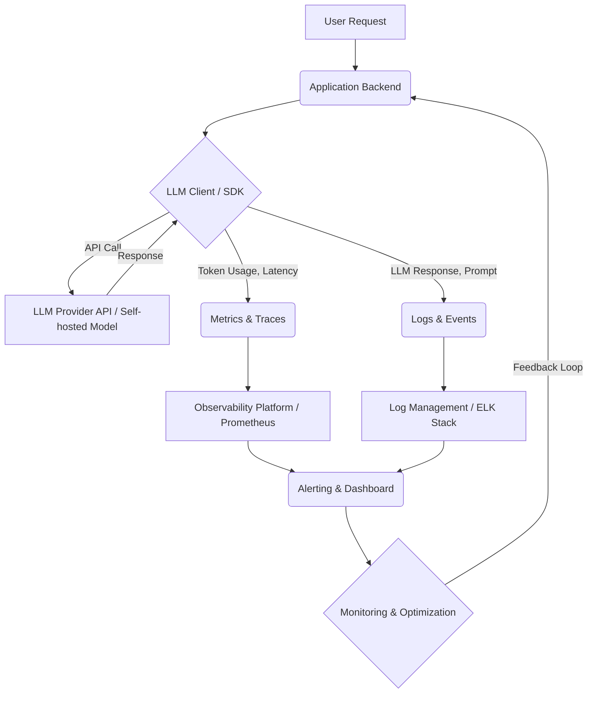

LLM (Large Language Model) 기반 애플리케이션의 배포는 단순한 모델 배포를 넘어, 지속적인 성능 모니터링과 최적화가 필수적인 운영 과제를 수반합니다. 사용자 경험, 운영 비용, 시스템 안정성 측면에서 LLM의 특성을 고려한 전용 모니터링 및 최적화 전략이 요구됩니다. 특히 2026년 현재, LLM 애플리케이션은 복잡한 Agentic workflow, 멀티모달 처리, 실시간 사용자 인터랙션 등으로 인해 성능 저하가 비즈니스에 미치는 영향이 커지고 있습니다. 

## LLM 애플리케이션 성능 지표

LLM 애플리케이션의 성능을 정확하게 측정하기 위해서는 다양한 지표를 종합적으로 고려해야 합니다. 이는 전통적인 소프트웨어 지표와 LLM 특유의 지표를 모두 포함합니다.

### 핵심 모니터링 지표

*   **레이턴시 (Latency)**: 사용자 요청부터 응답까지 걸리는 시간. 특히 실시간 대화형 애플리케이션에서 critical합니다. (Time to First Token, Total Latency)
*   **쓰루풋 (Throughput)**: 단위 시간당 처리할 수 있는 요청 수. 서비스 규모 확장과 직결됩니다. (Requests per Second, Tokens per Second)
*   **비용 (Cost)**: LLM API 호출 및 인프라 사용 비용. 토큰 사용량에 직접적으로 연관됩니다. (Cost per Request, Cost per Token)
*   **정확도 (Accuracy) 및 품질 (Quality)**: LLM 응답의 유용성, 관련성, 사실성. Hallucination (환각) 발생 여부, Prompt adherence 등을 포함합니다.
*   **토큰 사용량 (Token Usage)**: Input 및 Output 토큰 수. 비용 최적화의 핵심 지표입니다.
*   **에러율 (Error Rate)**: API 호출 실패, 모델 응답 파싱 실패 등 오류 발생 비율.
*   **자원 활용률 (Resource Utilization)**: GPU, CPU, 메모리 사용량. 특히 자체 호스팅 모델의 경우 중요합니다.

## 실시간 모니터링 아키텍처

효과적인 실시간 모니터링은 데이터 수집, 전송, 저장, 분석, 시각화 및 알림의 파이프라인으로 구성됩니다. OpenTelemetry와 같은 표준화된 트레이싱 시스템과 LLM 전용 Observability 플랫폼을 활용하는 것이 일반적입니다.



### 모니터링 구현 예시 (Python)

아래는 간단한 LLM 클라이언트에서 주요 지표를 수집하는 예시입니다. 실제 프로덕션 환경에서는 OpenTelemetry SDK와 같은 전용 라이브러리를 통해 Span과 Trace를 생성하고 전송합니다.

```python
import time
import logging
from collections import defaultdict

logging.basicConfig(level=logging.INFO, format='%(asctime)s - %(levelname)s - %(message)s')

class LLMPerformanceMonitor:
    def __init__(self):
        self.metrics = defaultdict(lambda: defaultdict(list))

    def record_metric(self, metric_name, value, tags=None):
        tags = tags or {}
        for tag_key, tag_value in tags.items():
            self.metrics[metric_name][f"{tag_key}:{tag_value}"].append(value)
        self.metrics[metric_name]["_all"].append(value)
        logging.info(f"Metric recorded: {metric_name}={value}, Tags: {tags}")

    def get_summary(self, metric_name):
        summary = {}
        for tag, values in self.metrics[metric_name].items():
            if values:
                summary[tag] = {
                    "count": len(values),
                    "avg": sum(values) / len(values),
                    "min": min(values),
                    "max": max(values)
                }
        return summary

monitor = LLMPerformanceMonitor()

class LLMClient:
    def query(self, prompt: str, model_name: str = "gpt-4o-mini") -> str:
        start_time = time.perf_counter()
        input_tokens = len(prompt.split())
        
        # Simulate LLM API call
        time.sleep(0.5 + len(prompt) * 0.001) # Simulate latency based on prompt length
        response = f"Processed: {prompt[:20]}... (model: {model_name})"
        output_tokens = len(response.split())
        
        end_time = time.perf_counter()
        latency = (end_time - start_time) * 1000 # milliseconds
        cost_estimate = (input_tokens * 0.0001) + (output_tokens * 0.0003) # Hypothetical cost

        monitor.record_metric("llm_latency_ms", latency, {"model": model_name, "status": "success"})
        monitor.record_metric("llm_input_tokens", input_tokens, {"model": model_name})
        monitor.record_metric("llm_output_tokens", output_tokens, {"model": model_name})
        monitor.record_metric("llm_cost_estimate", cost_estimate, {"model": model_name})

        return response

# Usage example
llm_client = LLMClient()
llm_client.query("What is the capital of France?", "gpt-4o-mini")
llm_client.query("Explain quantum physics in simple terms.", "llama3-8b")
llm_client.query("Summarize this article: [long article text here]", "gpt-4o-mini")

print("\n--- LLM Performance Summary ---")
print(monitor.get_summary("llm_latency_ms"))
print(monitor.get_summary("llm_cost_estimate"))
```

## LLM 애플리케이션 최적화 방법

모니터링을 통해 병목 지점을 식별한 후에는 다양한 최적화 기법을 적용하여 성능을 개선할 수 있습니다.

### 주요 최적화 전략

1.  **캐싱 (Caching)**: 동일하거나 유사한 Prompt에 대해 이전에 생성된 응답을 재활용하여 레이턴시와 비용을 절감합니다. Exact match 캐싱과 Semantic 캐싱(`context-engineering/jit-embedding-retrieval-context-cost-scale-invariant`) 기법이 있습니다.
2.  **배칭 (Batching)**: 여러 개의 요청을 묶어 한 번의 LLM API 호출로 처리함으로써 쓰루풋을 증가시키고 GPU 활용률을 높입니다. 스트리밍 환경에서는 `prompt-chaining-caching-for-realtime-llm-workflows` 와의 트레이드오프가 존재합니다.
3.  **동적 모델 라우팅 (Dynamic Model Routing)**: 요청의 복잡도, 중요도, 비용 제약 등에 따라 최적의 LLM (예: `gpt-4o-mini`, `llama3-8b`)으로 라우팅합니다. (`harness-engineering/llm-dynamic-routing-harness-model-switching`)
4.  **프롬프트 최적화 (Prompt Optimization)**: 불필요한 토큰을 제거하고, Chain of Thought (CoT)와 같은 효율적인 프롬프트 엔지니어링 기법을 사용하여 응답 품질을 유지하면서 토큰 사용량과 레이턴시를 줄입니다. (`prompt-engineering/llm-prompt-optimization-role-definition-constraint-design`)
5.  **모델 경량화 및 퀀타이제이션 (Quantization)**: Fine-tuning 또는 모델 자체의 경량화를 통해 모델 크기를 줄이고, 퀀타이제이션 (예: INT8, FP8)을 적용하여 메모리 사용량과 추론 속도를 개선합니다. 온디바이스 LLM(`android-ai/on-device-llm-optimization-android-strategies`)에서 특히 중요합니다.
6.  **RAG (Retrieval Augmented Generation) 최적화**: Retrieval 단계의 속도와 정확도를 높여 LLM이 처리해야 할 context window를 최소화합니다. (`data-engineering/rag-data-preprocessing-for-performance-gain`)
7.  **인프라 스케일링 (Infrastructure Scaling)**: Auto-scaling 그룹, GPU 최적화 인스턴스, 분산 추론 시스템 등을 활용하여 트래픽 증가에 유연하게 대응합니다. (`harness-engineering/large-scale-ai-model-serving-harness-optimization`)

## 트레이드오프

LLM 애플리케이션의 성능 모니터링 및 최적화 전략을 선택할 때는 명확한 트레이드오프를 고려해야 합니다.

*   **모니터링 상세도 vs. 오버헤드**: 상세한 Trace, Log, Metric 수집은 문제 진단에 필수적이지만, 시스템에 상당한 오버헤드를 유발하여 자체적으로 성능 저하를 초래할 수 있습니다. 경량화된 OpenTelemetry exporter를 사용하거나 샘플링 전략을 적용하여 균형을 맞춰야 합니다. (언제 좋고: 복잡한 Agentic workflow의 근본 원인 분석 시 좋음, 언제 나쁨: 고성능, 저레이턴시가 critical한 실시간 서비스).
*   **캐싱 전략 vs. 응답 신선도**: 공격적인 캐싱은 레이턴시와 비용을 크게 줄이지만, 원본 LLM 응답이 업데이트되었을 때 stale한 데이터를 제공할 위험이 있습니다. TTL (Time-To-Live) 설정, 무효화 전략, Semantic Cache의 임계값 조정이 중요합니다. (언제 좋고: 자주 반복되는 질문이나 Static Content 생성 시 좋음, 언제 나쁨: 최신 정보 반영이 필수적인 동적 데이터 처리 시).
*   **모델 라우팅 복잡도 vs. 운영 비용/레이턴시**: 여러 모델을 사용하는 동적 라우팅은 비용 효율성과 응답 품질 최적화에 유리하지만, 라우팅 로직의 복잡성이 증가하고, 라우팅 자체에 추가 레이턴시가 발생할 수 있습니다. (언제 좋고: 다양한 요구사항과 예산 제약이 있는 대규모 서비스에서 좋음, 언제 나쁨: 단일 고성능 모델로 충분하거나 최소한의 지연이 요구되는 경우).
*   **프롬프트 최적화 vs. 개발/테스트 공수**: Prompt Engineering을 통한 최적화는 모델 변경 없이 성능과 품질을 개선할 수 있는 강력한 방법이지만, 효과적인 프롬프트를 설계하고 테스트하는 데 상당한 시간과 노력이 필요합니다. (언제 좋고: 특정 도메인에 특화된 응답 품질 개선 및 비용 절감 시 좋음, 언제 나쁨: 빠른 개발 속도와 범용적인 기능이 우선시되는 초기 단계).

## 실전 체크리스트

LLM 애플리케이션의 실시간 성능 모니터링 및 최적화를 프로젝트에 적용할 때 다음 항목들을 검증합니다.

*   [ ] **핵심 성능 지표 (KPIs) 정의**: 애플리케이션의 비즈니스 목표와 연계된 Latency, Throughput, Cost, Accuracy 등의 핵심 성능 지표를 명확히 정의했는가?
*   [ ] **모니터링 스택 구축**: OpenTelemetry 기반의 Tracing, Metrics, Logging 시스템을 애플리케이션 코드에 통합하고, LLM 전용 Observability 플랫폼 (예: Arize, Weights & Biases) 또는 일반 MLOps 플랫폼에 데이터를 전송하고 있는가?
*   [ ] **알림 및 대시보드 설정**: 정의된 KPI에 대한 임계값을 설정하고, 이상 징후 발생 시 실시간으로 알림을 받을 수 있는 시스템 (예: PagerDuty, Slack 연동)과 대시보드(Grafana, Kibana)를 구축했는가?
*   [ ] **비용 모니터링 및 예측**: LLM API 사용량 (토큰 수) 및 인프라 비용을 실시간으로 모니터링하고, 월별 비용 예측 시스템을 구축하여 예산 초과를 방지하고 있는가?
*   [ ] **자동화된 품질 평가 파이프라인**: LLM 응답의 품질(정확도, 관련성, 환각 여부)을 지속적으로 평가할 수 있는 자동화된 평가 지표 및 파이프라인을 운영하고 있는가?
*   [ ] **캐싱 및 라우팅 전략 구현**: 캐싱(Exact, Semantic) 및 동적 모델 라우팅(`harness-engineering/llm-dynamic-routing-harness-model-switching`) 등의 최적화 기법을 적용하고, 그 효과를 A/B 테스트를 통해 검증했는가?
*   [ ] **자원 관리 및 스케일링 전략**: 자체 호스팅 모델의 경우 GPU, CPU, 메모리 등의 자원 활용률을 모니터링하고, 트래픽 변화에 따라 자동으로 스케일링되는 인프라를 구성했는가?
*   [ ] **트레이드오프 문서화**: 적용된 모니터링 및 최적화 전략의 트레이드오프(예: 성능 vs. 비용, 상세도 vs. 오버헤드)를 문서화하고, 팀 내에서 합의된 운영 방침을 가지고 있는가?