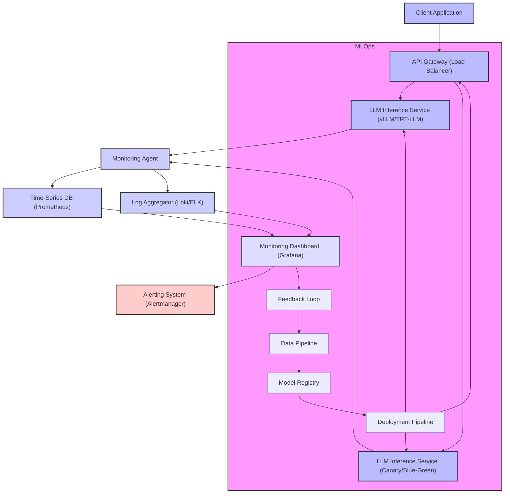

LLM(Large Language Model) 기반 서비스가 증가함에 따라, 실시간 추론(Real-time Inference) 환경에서의 안정적인 배포(Deployment) 및 모니터링(Monitoring)은 핵심적인 과제가 되었습니다. 기존 마이크로 서비스 아키텍처나 일반적인 ML 모델 배포 방식으로는 LLM의 특성(높은 리소스 요구량, 가변적인 응답 시간, 모델 드리프트 민감성)을 효과적으로 다루기 어렵기 때문에, 특화된 디자인 패턴이 요구됩니다.

## 실시간 LLM 추론 배포의 복잡성
LLM은 그 크기 때문에 단일 서버에 배포하기 어렵고, 추론 과정에서 상당한 GPU 메모리와 연산 자원을 소모합니다. 또한, 사용자 요청이 폭증할 경우 지연 시간(Latency)이 급격히 증가할 수 있어, 낮은 지연 시간과 높은 처리량(Throughput)을 동시에 만족시키기 위한 정교한 전략이 필요합니다. 2026년 현재, vLLM, TensorRT-LLM과 같은 고성능 추론 엔진과 Kubernetes, Ray Serve 같은 분산 시스템이 이러한 요구사항을 충족하기 위한 주요 기술 스택으로 자리매김하고 있습니다.

### 핵심 배포 디자인 패턴

1.  **동적 배치(Dynamic Batching):** 여러 사용자 요청을 묶어 GPU에 한 번에 처리함으로써 GPU 활용률을 극대화합니다. 이는 처리량을 높이고 평균 지연 시간을 줄이는 데 효과적입니다.
2.  **모델 병렬화(Model Parallelism) 및 파이프라이닝(Pipelining):** 매우 큰 모델은 단일 GPU에 적재할 수 없으므로, 모델을 여러 GPU나 서버에 분할하여 배치하는 기법입니다. 이는 모델 크기 제약을 완화하고 추론 속도를 향상시킵니다.
3.  **오토스케일링(Auto-scaling):** CPU/GPU 사용량, 요청 큐 길이, 지연 시간 등 실시간 메트릭에 기반하여 추론 서비스 인스턴스를 자동으로 확장하거나 축소합니다. 이는 비용 효율성을 높이고 트래픽 변화에 유연하게 대응할 수 있도록 합니다.
4.  **카나리 배포(Canary Deployment) 및 A/B 테스트:** 새로운 LLM 버전이나 모델 가중치를 배포할 때, 전체 트래픽의 일부에만 적용하여 안정성과 성능을 검증합니다. 문제가 발생할 경우 즉시 롤백할 수 있어 서비스 중단을 최소화합니다.

## LLM 서비스 모니터링 및 관측성(Observability)
LLM 서비스는 단순한 응답 시간 모니터링을 넘어, 모델 자체의 동작 특성과 비즈니스 가치에 대한 깊이 있는 통찰을 요구합니다. 이는 '블랙박스' 모델의 행동을 이해하고 잠재적인 문제를 사전에 감지하는 데 필수적입니다.

### 핵심 모니터링 디자인 패턴

1.  **성능 메트릭 모니터링:**
    *   **지연 시간(Latency):** 요청-응답까지의 시간 (P50, P90, P99 percentile).
    *   **처리량(Throughput):** 초당 처리되는 요청 수.
    *   **GPU/CPU/메모리 사용률:** 하드웨어 리소스의 효율성 및 병목 현상 감지.
    *   **토큰 생성 속도(Tokens/sec):** LLM 특유의 성능 지표.
2.  **모델 품질 메트릭 모니터링:**
    *   **입출력 드리프트(Input/Output Drift):** 시간 경과에 따른 입력 데이터 분포 또는 모델 출력 특성 변화 감지. 이는 모델 재학습의 필요성을 시사합니다.
    *   **환각(Hallucination) 비율:** LLM이 사실과 다른 정보를 생성하는 비율.
    *   **안전성(Safety) 및 편향(Bias) 지표:** 유해하거나 편향된 응답 생성 여부.
    *   **비즈니스 KPI 연동:** LLM 응답이 실제 비즈니스 목표(예: 사용자 만족도, 전환율)에 미치는 영향 추적.
3.  **분산 트레이싱(Distributed Tracing):** 여러 서비스(API Gateway, LLM Inference Service, RAG DB 등)를 거치는 단일 요청의 흐름을 추적하여 병목 지점이나 오류 원인을 파악합니다.
4.  **로그 수집 및 분석:** 모든 추론 요청 및 응답, 시스템 이벤트 로그를 중앙 집중식으로 수집하고, 오류 패턴 및 비정상적인 접근을 분석합니다.

아래 Mermaid 다이어그램은 실시간 LLM 추론을 위한 일반적인 배포 및 모니터링 아키텍처를 보여줍니다.



### 코드 예제: 간단한 LLM 추론 서비스 (FastAPI + vLLM)

아래는 `vLLM`을 사용하여 LLM 추론 서비스를 구축하고 `FastAPI`로 API를 노출하는 간소화된 예시입니다. 실제 배포 환경에서는 `kubectl` 또는 `terraform` 등을 통해 Kubernetes 클러스터에 배포하고 오토스케일링을 구성합니다.

```python
from fastapi import FastAPI, HTTPException
from pydantic import BaseModel
from typing import List, Optional
import uvicorn
import os

# vLLM 라이브러리가 설치되어 있어야 합니다.
# pip install vllm fastapi uvicorn
try:
    from vllm import LLM, SamplingParams
except ImportError:
    print("vLLM is not installed. Please install it using `pip install vllm`")
    exit(1)

app = FastAPI()

# 모델 로드 (환경 변수 또는 설정 파일에서 로드 경로 지정)
MODEL_PATH = os.getenv("LLM_MODEL_PATH", "mistralai/Mistral-7B-Instruct-v0.2")
llm = LLM(model=MODEL_PATH, gpu_memory_utilization=0.9)

class InferenceRequest(BaseModel):
    prompt: str
    max_tokens: int = 512
    temperature: float = 0.7
    top_p: float = 0.95
    stop: Optional[List[str]] = None

@app.post("/generate")
async def generate_text(request: InferenceRequest):
    try:
        sampling_params = SamplingParams(
            n=1,
            temperature=request.temperature,
            top_p=request.top_p,
            max_tokens=request.max_tokens,
            stop=request.stop
        )
        outputs = llm.generate([request.prompt], sampling_params)
        
        # 각 출력에서 텍스트만 추출
        generated_texts = [output.outputs[0].text for output in outputs]
        
        return {"generated_text": generated_texts[0]}
    except Exception as e:
        raise HTTPException(status_code=500, detail=str(e))

if __name__ == "__main__":
    # uvicorn llm_service:app --host 0.0.0.0 --port 8000
    # 실제 배포에서는 Gunicorn, Nginx 등과 함께 사용됩니다.
    uvicorn.run(app, host="0.0.0.0", port=8000)
```

이 서비스는 `vLLM`을 활용하여 효율적인 배치 추론을 수행하며, `FastAPI`를 통해 REST API를 제공합니다. 모니터링 에이전트는 이 서비스의 HTTP 요청 및 응답 메트릭, GPU 사용량 등을 Prometheus와 같은 시계열 데이터베이스로 전송하게 됩니다.

## 트레이드오프

*   **비용 효율성 vs. 지연 시간:** 동적 배치와 오토스케일링은 GPU 자원 활용도를 높여 비용을 절감하지만, 배치를 위한 대기 시간으로 인해 개별 요청의 지연 시간이 증가할 수 있습니다. 짧은 지연 시간이 절대적으로 필요한 서비스(예: 실시간 대화)에는 배치 크기를 작게 유지하거나, Cold Start를 줄이기 위한 Always-On 인스턴스 유지가 필요하며, 이는 비용 증가로 이어집니다.
*   **모델 정확도 vs. 추론 성능:** 최신 대규모 LLM은 높은 정확도를 제공하지만, 그만큼 추론 자원 소모가 크고 지연 시간이 길어집니다. 더 작거나 경량화된 모델(예: 양자화 모델)은 추론 성능을 향상시키지만, 특정 태스크에서 정확도 저하를 감수해야 할 수 있습니다. 사용 사례의 요구사항에 따라 적절한 모델 크기 및 압축 기법을 선택해야 합니다.
*   **모니터링 깊이 vs. 시스템 복잡성:** 상세한 성능, 품질, 드리프트 모니터링은 서비스의 안정성과 신뢰성을 크게 향상시킵니다. 하지만 이러한 복잡한 모니터링 스택(Prometheus, Grafana, Loki, Tracing 시스템 등)을 구축하고 유지보수하는 데는 상당한 엔지니어링 리소스가 소모됩니다. 초기 단계에서는 핵심 메트릭 위주로 시작하여 점진적으로 확장하는 것이 효율적입니다.
*   **빠른 배포 vs. 안정성:** 카나리 배포나 A/B 테스트는 새로운 모델의 위험을 줄이고 점진적인 출시를 가능하게 하지만, 배포 과정이 더 복잡해지고 시간이 오래 걸릴 수 있습니다. 긴급 패치나 빠른 기능 개선이 필요한 상황에서는 더 직접적인 배포 전략(예: 롤링 업데이트)을 고려할 수 있으나, 그만큼 위험 부담이 커집니다.

## 실전 체크리스트

LLM 실시간 추론 시스템을 설계하고 운영할 때 다음 체크리스트를 활용하여 안정성을 확보하고 효율성을 극대화합니다.

- [ ] **성능 최적화:** vLLM, TensorRT-LLM과 같은 고성능 추론 프레임워크를 활용하고 동적 배치(Dynamic Batching)를 활성화하여 GPU 활용률을 최대화했는가?
- [ ] **오토스케일링 구현:** HPA (Horizontal Pod Autoscaler) 또는 사용자 정의 메트릭 기반의 오토스케일링을 설정하여 트래픽 변화에 따라 LLM 인스턴스가 자동으로 확장/축소되는가?
- [ ] **지연 시간 모니터링:** P90, P99 지연 시간 메트릭을 실시간으로 수집하고 대시보드에서 시각화하여, SLA(Service Level Agreement) 위반 시 즉시 알림이 발생하는가?
- [ ] **모델 드리프트 감지:** 입력 프롬프트 임베딩 또는 출력 응답의 특정 통계적 특성(예: 길이, 특정 키워드 빈도) 변화를 모니터링하여 모델 드리프트를 조기에 감지하는 시스템이 구축되었는가?
- [ ] **비용 효율성 추적:** GPU 사용률, 토큰당 비용, 총 추론 비용 등을 주기적으로 추적하고, 비용 최적화를 위한 배치 크기 또는 모델 경량화 가능성을 평가하는가?
- [ ] **카나리 배포 전략:** 새로운 LLM 모델 버전을 배포할 때, 카나리 배포를 통해 소량의 트래픽으로 안정성과 성능을 검증한 후 점진적으로 트래픽을 확대하는 프로세스를 따르는가?
- [ ] **종합적인 Observability:** 성능 메트릭, 구조화된 로그, 분산 트레이싱을 통합하여 LLM 추론 스택 전반에 걸친 가시성(Observability)을 확보하고 문제 발생 시 신속하게 원인을 파악할 수 있는가?