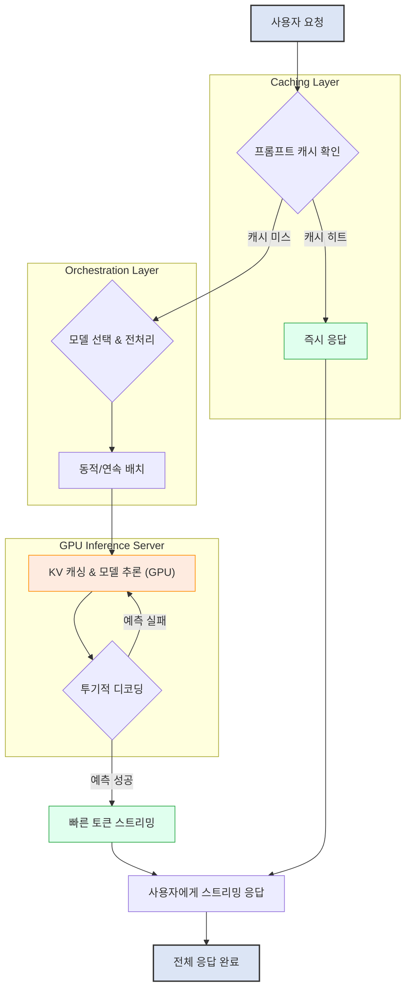

LLM(Large Language Model) 기반 서비스의 성공은 응답 속도, 즉 지연 시간(latency)에 크게 좌우됩니다. 사용자는 대화형 AI 서비스에서 거의 즉각적인 응답을 기대하며, 이는 사용자 경험(User Experience, UX)에 직접적인 영향을 미칩니다. 2026년 현재, LLM 기술은 더욱 발전하여 경량화된 모델과 효율적인 추론(inference) 기법들이 등장하고 있으며, 실시간 서비스 지연 시간 최적화는 이러한 기술 혁신을 사용자에게 전달하는 핵심적인 과제입니다.

## LLM 서비스 지연 시간의 중요성
사용자가 LLM과 상호작용할 때, 응답 지연은 대화의 흐름을 방해하고 만족도를 저하시킬 수 있습니다. 특히 스트리밍(streaming)이 아닌 단일 응답(single response) 방식에서는 첫 토큰(First Token Latency, FTL)이 사용자에게 체감되는 지연 시간의 대부분을 차지합니다. 또한, 에이전트(agent) 기반의 복합적인 LLM 워크플로우에서는 각 단계의 미세한 지연이 누적되어 전체 작업 시간을 크게 늘릴 수 있습니다. 따라서 LLM 서비스의 지연 시간을 최소화하는 것은 사용자 만족도와 시스템 효율성 모두를 위해 필수적입니다.

## 실시간 LLM 지연 시간 최적화 패턴

### 1. 모델 경량화 및 최적화
모델 자체의 크기와 복잡도를 줄이는 것은 가장 근본적인 지연 시간 감소 전략입니다. 2026년에는 'Flash', 'Gemma', 'Mistral'과 같은 효율적인 모델 아키텍처와 함께 다음과 같은 기법들이 활발히 활용됩니다.

*   **양자화(Quantization)**: 모델의 가중치(weights)와 활성화(activations)를 더 낮은 정밀도(예: FP32에서 INT8)로 변환하여 메모리 사용량과 연산량을 줄입니다. 이는 GPU 메모리 대역폭(memory bandwidth) 및 연산 속도에 직접적인 영향을 미칩니다.
*   **지식 증류(Knowledge Distillation)**: 대규모의 복잡한 '교사 모델(teacher model)'의 지식을 작고 빠른 '학생 모델(student model)'에 전이시켜 성능 저하를 최소화하면서 모델 크기를 줄입니다.
*   **가지치기(Pruning)**: 모델 내에서 중요도가 낮은 연결이나 뉴런을 제거하여 모델의 희소성(sparsity)을 높이고 연산 효율을 개선합니다.

### 2. 효율적인 추론 엔진 및 런타임 활용
TensorRT-LLM, vLLM, DeepSpeed-MII와 같은 전용 추론 엔진은 LLM 추론에 최적화된 커널(kernel)과 스케줄링 기법을 제공하여 지연 시간을 획기적으로 줄입니다.

*   **KV 캐싱(Key-Value Caching)**: Attention 메커니즘에서 이전에 계산된 Key와 Value 벡터를 캐시하여, 각 토큰 생성 시 전체 시퀀스를 다시 계산하는 오버헤드를 줄입니다. 이는 특히 긴 시퀀스 생성 시 매우 효과적입니다.
*   **동적 배치(Dynamic Batching)**: 들어오는 요청들을 실시간으로 배치(batch)하여 GPU 활용률을 극대화합니다. 이는 처리량(throughput)을 높이면서도 FTL에 미치는 영향을 최소화합니다.
*   **연속 배치(Continuous Batching)**: vLLM에서 제공하는 기능으로, 배치 내의 요청들이 동시에 시작되지 않더라도 GPU를 최대한 활용하도록 동적으로 요청을 할당하고 관리합니다. 이로 인해 유휴 시간을 줄여 처리량을 높입니다.

```python
import torch
from transformers import AutoModelForCausalLM, AutoTokenizer

# 예시: 모델 로딩 및 KV 캐싱 활용 (실제 구현은 추론 엔진을 통해 더 최적화됨)
model_name = "mistralai/Mistral-7B-Instruct-v0.2"
tokenizer = AutoTokenizer.from_pretrained(model_name)
model = AutoModelForCausalLM.from_pretrained(model_name, torch_dtype=torch.float16)

# 프롬프트 입력
prompt = "안녕하세요! LLM의 지연 시간 최적화에 대해 설명해주세요."
input_ids = tokenizer(prompt, return_tensors="pt").input_ids

# KV 캐시를 활용한 추론 (use_cache=True가 기본값)
output = model.generate(input_ids, max_new_tokens=100, do_sample=True, top_k=50, top_p=0.95, temperature=0.7)

print(tokenizer.decode(output[0], skip_special_tokens=True))

# 스트리밍 구현 예시 (실제 서비스에서는 FastAPI, gRPC 등의 프레임워크와 통합)
def stream_tokens(model, tokenizer, prompt, max_new_tokens=50):
    input_ids = tokenizer(prompt, return_tensors="pt").input_ids
    past_key_values = None

    for i in range(max_new_tokens):
        with torch.no_grad():
            outputs = model(input_ids, past_key_values=past_key_values, use_cache=True)
            logits = outputs.logits[:, -1, :]
            past_key_values = outputs.past_key_values

            next_token_id = torch.argmax(logits, dim=-1).unsqueeze(0)

            yield tokenizer.decode(next_token_id[0], skip_special_tokens=True)

            input_ids = next_token_id

# 스트리밍 사용 예시 (주석 처리: 실제 실행 시 지연 발생)
# print("\n--- Streaming Output ---")
# streamed_output = []
# for token in stream_tokens(model, tokenizer, prompt):
#    streamed_output.append(token)
#    print(token, end='', flush=True)
# print("")
```

### 3. 스트리밍 및 투기적 디코딩 (Speculative Decoding)

*   **응답 스트리밍(Response Streaming)**: LLM이 토큰을 생성하는 즉시 사용자에게 전달하여 체감 지연 시간을 크게 줄입니다. 이는 웹 소켓(WebSocket) 또는 서버 센트 이벤트(Server-Sent Events, SSE)를 통해 구현됩니다. `frontend-ai/realtime-llm-output-frontend-ux-design` 문서와 연관됩니다.
*   **투기적 디코딩**: 작고 빠른 '초안 모델(draft model)'로 다음 토큰들을 예측하고, 예측된 토큰들을 대규모 '검증 모델(verify model)'이 병렬적으로 검증합니다. 예측이 맞으면 빠르게 건너뛰고, 틀리면 검증 모델이 정확한 토큰을 생성하는 방식으로 전체 생성 속도를 높입니다. 이는 `llm-gpu-resource-optimization-inference-acceleration`에도 기여합니다.

### 4. 캐싱 전략
지능적인 캐싱은 반복되는 요청에 대한 LLM 호출을 회피하여 지연 시간을 크게 줄입니다.

*   **프롬프트 캐싱(Prompt Caching)**: 동일하거나 유사한 프롬프트가 반복될 때, 이전에 생성된 응답 또는 중간 계산 결과를 저장하여 재사용합니다. 특히 RAG(Retrieval Augmented Generation) 시나리오에서 검색된 문서가 자주 재사용될 경우 효과적입니다.
*   **KV 캐시 재활용**: KV 캐시를 세션 간에 유지하거나, 여러 요청에서 공유하여 중복 계산을 줄입니다. 이는 `harness-engineering/prompt-chaining-caching-for-realtime-llm-workflows` 문서에서 더 심층적으로 다루어집니다.

### 5. 분산 추론 및 로드 밸런싱

*   **모델 샤딩(Model Sharding)**: 너무 큰 모델은 여러 GPU 또는 여러 서버에 걸쳐 가중치를 분할하여 로드합니다. 각 부분이 병렬로 추론을 수행하여 지연 시간을 줄입니다.
*   **다중 모델 라우팅(Multi-Model Routing)**: 요청의 복잡도나 특성에 따라 적절한 크기/성능의 모델로 트래픽을 분산합니다. 간단한 요청은 작은 모델로 빠르게 처리하고, 복잡한 요청은 더 큰 모델로 라우팅하여 전체 시스템의 평균 지연 시간을 최적화합니다. `harness-engineering/dynamic-ai-model-routing-cost-performance`와 연관이 깊습니다.
*   **지능형 로드 밸런싱(Intelligent Load Balancing)**: GPU 활용률, 대기열 길이, 모델 부하 등을 고려하여 요청을 가장 효율적인 서버로 라우팅합니다. `infrastructure/realtime-ai-service-load-balancing-api-gateway-design`에서 상세 패턴을 확인할 수 있습니다.

### LLM 지연 시간 최적화 흐름도


## 트레이드오프

*   **모델 양자화/증류**: 
    *   **언제 좋고**: 낮은 추론 지연 시간, 적은 메모리 사용량, 배포 용이성(특히 엣지 디바이스).
    *   **언제 나쁜지**: 모델 정확도(accuracy) 감소 위험, 특정 태스크에 대한 성능 저하 가능성, 양자화 후 미세 조정(fine-tuning) 필요성 증가.
*   **동적/연속 배치**: 
    *   **언제 좋고**: GPU 활용률 극대화, 높은 처리량(throughput) 달성, 자원 효율성 향상.
    *   **언제 나쁜지**: FTL(First Token Latency) 증가 가능성 (배치를 기다려야 하므로), 복잡한 스케줄링 로직 필요, 배치 크기에 따른 메모리 사용량 증가.
*   **응답 스트리밍**: 
    *   **언제 좋고**: 사용자 체감 지연 시간 대폭 감소, 사용자 경험 향상, 긴 응답 시 유용.
    *   **언제 나쁜지**: 클라이언트 측 구현 복잡성 증가, 서버 측 스트리밍 관리 오버헤드, 네트워크 지연에 더 민감할 수 있음.
*   **투기적 디코딩**: 
    *   **언제 좋고**: 생성 속도 극대화, FTL 감소, 특히 긴 시퀀스 생성에 유리.
    *   **언제 나쁜지**: 초안 모델 선정 및 튜닝의 복잡성, 두 모델(초안/검증) 관리 오버헤드, 예측 실패 시 추가 지연 발생.
*   **캐싱 전략**: 
    *   **언제 좋고**: 반복 요청에 대한 지연 시간 제로에 가까운 응답, API 비용 절감.
    *   **언제 나쁜지**: 캐시 무효화(invalidation) 전략의 복잡성, 캐시 데이터의 최신성 유지 문제, 캐시 서버 관리 오버헤드, 메모리 사용량 증가.

## 실전 체크리스트
LLM 서비스의 지연 시간 최적화를 위한 실전 체크리스트는 다음과 같습니다.

*   [ ] 현재 서비스의 FTL 및 TTFL(Time To First Token) 측정 지표를 수립하고, 목표 수치를 설정했는가?
*   [ ] 모델 양자화(예: INT8 또는 INT4) 적용 가능성을 평가하고, 성능 저하 없는 최적의 양자화 레벨을 찾았는가?
*   [ ] vLLM 또는 TensorRT-LLM과 같은 고성능 추론 엔진을 도입하여 KV 캐싱 및 동적 배치를 활성화했는가?
*   [ ] 사용자 인터페이스에 응답 스트리밍 기능을 구현하고, 첫 토큰 응답 시간을 지속적으로 모니터링하고 있는가?
*   [ ] 자주 반복되는 프롬프트나 RAG 컨텍스트에 대한 캐싱 전략을 설계하고, 캐시 히트율(Cache Hit Rate)을 추적하고 있는가?
*   [ ] 요청 유형(복잡도, 길이)에 따라 적절한 LLM 모델로 트래픽을 분산하는 동적 라우팅 시스템을 구축했는가?
*   [ ] GPU 활용률, 큐 길이, 모델별 부하를 실시간으로 모니터링하고, 이에 기반한 지능형 로드 밸런싱이 작동하고 있는가?
*   [ ] 투기적 디코딩 적용을 위한 경량 초안 모델(draft model)을 선정하고, 메인 모델과의 통합 및 검증 프로세스를 구축했는가?
