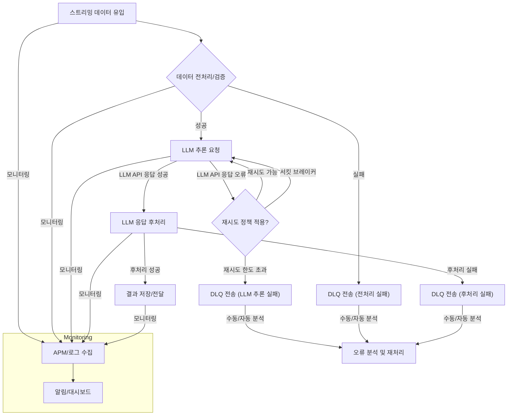

실시간 스트리밍 데이터 처리 LLM 파이프라인에서 오류 복구는 시스템의 신뢰성과 사용자 경험에 직결됩니다. 데이터 손실이나 서비스 중단은 비즈니스에 치명적인 영향을 미칠 수 있으므로, 견고한 오류 복구 전략은 필수적입니다. 특히 2026년에는 LLM 서비스의 광범위한 확산으로 인해 실시간 데이터 처리 요구사항이 더욱 증대될 것이며, 이에 따라 복잡한 파이프라인 내에서의 탄력성 확보가 중요해지고 있습니다. 이 문서에서는 이러한 요구사항을 충족하기 위한 핵심 오류 복구 패턴들을 다룹니다.

## 실시간 LLM 파이프라인의 주요 장애 유형

실시간 LLM 파이프라인은 데이터 수집, 전처리, LLM 추론, 후처리, 결과 저장 등 여러 단계로 구성됩니다. 각 단계에서 다음과 같은 다양한 유형의 오류가 발생할 수 있습니다.

### 1. 데이터 소스 및 수집 오류
스트리밍 데이터 소스의 불안정성, 네트워크 지연, 데이터 포맷 불일치 등으로 인해 데이터가 손실되거나 파이프라인에 정확히 전달되지 못할 수 있습니다.

### 2. LLM 추론 오류
LLM API 호출 실패 (Rate Limit, 인증 오류), 모델 응답 지연, 출력 포맷 불일치, LLM 자체의 비정상적인 응답 (Hallucination) 등이 발생할 수 있습니다. 특히 외부 LLM API 의존성이 높은 아키텍처에서 빈번하게 관찰됩니다.

### 3. 상태 관리 및 저장소 오류
중간 결과나 최종 결과 저장소 (Vector DB, NoSQL)의 가용성 문제, 쓰기 실패, 데이터 일관성 저하 등의 문제가 발생할 수 있습니다.

### 4. 분산 시스템 복잡성
마이크로서비스 아키텍처나 분산 처리 환경에서는 서비스 간의 통신 실패, 부분 장애, 순서 보장 문제 등 복잡한 장애 시나리오가 발생하기 쉽습니다.

## 핵심 오류 복구 패턴

실시간 LLM 파이프라인의 안정성을 높이기 위한 주요 오류 복구 패턴은 다음과 같습니다.

### 1. 재시도 (Retry) 패턴
일시적인 네트워크 문제나 서비스 불안정성으로 인한 실패는 짧은 시간 후에 다시 시도하면 성공할 수 있습니다. 지수 백오프 (Exponential Backoff) 전략을 적용하여 재시도 간격을 점진적으로 늘리는 것이 일반적입니다. 이는 LLM API의 Rate Limit 회피에도 유용합니다.

```go
package main

import (
	"fmt"
	"time"
)

func callLLMService(data string) (string, error) {
	// Simulate a transient error 2 times out of 3
	// In a real scenario, this would be an actual API call
	r := time.Now().UnixNano() % 3
	if r < 2 {
		return "", fmt.Errorf("transient LLM error for %s", data)
	}
	return fmt.Sprintf("LLM processed: %s", data), nil
}

func retryWithExponentialBackoff(data string, maxRetries int, initialDelay time.Duration) (string, error) {
	for i := 0; i < maxRetries; i++ {
		resp, err := callLLMService(data)
		if err == nil {
			fmt.Printf("Success on attempt %d\n", i+1)
			return resp, nil
		} else {
			fmt.Printf("Attempt %d failed: %v. Retrying in %v...\n", i+1, err, initialDelay)
			time.Sleep(initialDelay)
			initialDelay *= 2 // Exponential backoff
		}
	}
	return "", fmt.Errorf("failed after %d retries", maxRetries)
}

func main() {
	dataToProcess := "user query for LLM"
	result, err := retryWithExponentialBackoff(dataToProcess, 5, 100*time.Millisecond)
	
	if err != nil {
		fmt.Printf("Final error: %v\n", err)
	} else {
		fmt.Printf("Final result: %s\n", result)
	}
}
```

### 2. 데드 레터 큐 (Dead Letter Queue, DLQ)
재시도 정책으로도 복구할 수 없는 영구적인 오류가 발생한 메시지는 DLQ로 전송하여 격리합니다. DLQ에 쌓인 메시지는 수동으로 조사하거나, 별도의 프로세스를 통해 재처리, 분석 또는 아카이빙될 수 있습니다. 이는 데이터 손실을 방지하고, 주 파이프라인의 흐름을 방해하지 않도록 합니다.

### 3. 서킷 브레이커 (Circuit Breaker) 패턴
서비스가 지속적으로 실패할 때, 요청을 보내는 것을 일시적으로 중단하여 대상 서비스의 과부하를 막고 스스로 복구할 시간을 제공합니다. 서킷 브레이커는 '닫힘 (Closed)', '열림 (Open)', '반열림 (Half-Open)'의 세 가지 상태를 가집니다. '열림' 상태에서는 모든 요청을 즉시 실패 처리하고, 주기적으로 '반열림' 상태로 전환하여 서비스의 정상 복구 여부를 확인합니다.

### 4. 멱등성 (Idempotency)
동일한 작업을 여러 번 수행해도 시스템의 상태가 동일하게 유지되도록 설계하는 것입니다. 이는 재시도 패턴과 함께 사용될 때 특히 중요합니다. 예를 들어, LLM 추론 결과를 데이터베이스에 저장할 때, 중복 저장을 방지하기 위해 고유한 트랜잭션 ID를 활용하여 UPSERT (`UPDATE` or `INSERT`) 작업을 수행할 수 있습니다.

### 5. 체크포인팅 (Checkpointing) 및 상태 관리
실시간 스트리밍 파이프라인은 처리 중인 데이터를 주기적으로 체크포인트에 저장하여 장애 발생 시 마지막 성공한 체크포인트부터 다시 시작할 수 있도록 합니다. 이는 대규모 데이터 처리에서 데이터 손실을 최소화하고 복구 시간을 단축하는 데 필수적입니다. LLM 파이프라인의 경우, 긴 컨텍스트 윈도우를 갖는 대화형 LLM에서 중간 대화 상태를 저장하는 데 유용합니다.

### 6. 옵저버빌리티 (Observability) 강화
모니터링, 로깅, 트레이싱을 통해 파이프라인의 각 단계에서 발생하는 오류를 실시간으로 감지하고 진단하는 것이 중요합니다. 특히 LLM 응답 시간, 오류율, 토큰 사용량 등을 상세하게 추적하여 잠재적인 문제를 조기에 파악하고 대응할 수 있도록 합니다.

## 실시간 LLM 파이프라인 오류 복구 흐름



## 트레이드오프

### 1. 재시도 (Retry) 패턴
*   **언제 좋고**: 일시적인 네트워크 문제, 리소스 부족, Rate Limit 등 단기적인 장애에 효과적입니다. 구현이 비교적 간단하여 즉각적인 안정성 향상에 기여합니다.
*   **언제 나쁜지**: 영구적인 오류 (예: 잘못된 데이터 포맷, 인증 정보 오류)에 대해 계속 재시도하면 불필요한 리소스 낭비와 지연을 초래합니다. 시스템에 더 큰 부하를 주어 연쇄 장애를 유발할 수도 있습니다.

### 2. 데드 레터 큐 (DLQ) 활용
*   **언제 좋고**: 주 파이프라인의 흐름을 방해하지 않고 실패한 메시지를 격리하여 데이터 손실을 방지합니다. 오류 분석 및 디버깅을 위한 귀중한 데이터를 제공합니다.
*   **언제 나쁜지**: DLQ에 쌓인 메시지를 처리하기 위한 별도의 관리 및 모니터링 시스템이 필요합니다. 실시간 복구가 아닌 사후 처리에 가까우므로, 즉각적인 사용자 피드백이 필요한 서비스에는 제한적입니다.

### 3. 멱등성 (Idempotency) 구현
*   **언제 좋고**: 재시도 로직이나 분산 환경에서 발생하는 중복 메시지 처리로 인한 부작용 (예: 중복 저장, 잘못된 상태 변경)을 효과적으로 방지합니다. 시스템의 예측 가능성과 신뢰성을 크게 향상시킵니다.
*   **언제 나쁜지**: 구현이 복잡해질 수 있으며, 고유 식별자 관리, 데이터베이스 트랜잭션 설계 등 추가적인 설계 노력이 필요합니다. 모든 작업이 멱등하게 설계될 수 있는 것은 아닙니다.

### 4. 서킷 브레이커 (Circuit Breaker) 도입
*   **언제 좋고**: 장애가 발생한 서비스로의 요청을 자동으로 중단시켜 연쇄적인 장애 확산을 방지하고, 대상 서비스가 복구될 시간을 벌어줍니다. 시스템 전체의 탄력성을 향상시킵니다.
*   **언제 나쁜지**: 서비스 장애 발생 시 사용자에게 즉시 실패를 반환하므로, 사용자 경험에 직접적인 영향을 미칠 수 있습니다. 서킷 브레이커의 임계값 설정 및 상태 전환 로직이 복잡하고, 잘못 설정될 경우 불필요한 서비스 중단을 유발할 수 있습니다.

### 5. 체크포인팅 (Checkpointing) 전략
*   **언제 좋고**: 대용량 스트리밍 데이터를 처리하는 경우, 장애 발생 시 데이터 손실을 최소화하고 빠른 복구를 가능하게 합니다. 긴 실행 시간을 갖는 Stateful 파이프라인에 필수적입니다.
*   **언제 나쁜지**: 체크포인트 저장 및 로드에 따른 I/O 오버헤드가 발생하여 전체 처리량에 영향을 줄 수 있습니다. 체크포인트의 일관성 유지 및 관리 비용이 추가됩니다.

## 실전 체크리스트

- [ ] **엔드-투-엔드 재시도 정책 정의**: 파이프라인의 각 구성 요소 (데이터 수집, LLM API 호출, 데이터 저장)에 대해 적절한 재시도 횟수, 지연 시간, 백오프 전략을 명확히 정의하고 적용했는지 확인합니다.
- [ ] **DLQ (Dead Letter Queue) 시스템 구축**: 재시도 후에도 실패한 메시지를 격리하고, 해당 메시지를 분석 및 재처리할 수 있는 프로세스 (수동 또는 자동화)가 마련되어 있는지 검증합니다.
- [ ] **주요 작업 멱등성 확보**: LLM 추론 결과 저장, 상태 업데이트 등 핵심 작업들이 중복 실행되어도 시스템 상태에 부작용이 없도록 멱등성을 구현했는지 확인합니다.
- [ ] **서킷 브레이커 적용 범위 및 임계값 설정**: 외부 LLM API, 의존성 있는 마이크로서비스 호출 등 장애 전파 위험이 있는 지점에 서킷 브레이커를 적용하고, 서비스의 SLO (Service Level Objective)에 맞춰 임계값을 튜닝했는지 확인합니다.
- [ ] **실시간 모니터링 및 알림 시스템 구성**: LLM 응답 지연, 오류율, DLQ 메시지 증가, 시스템 리소스 사용량 등 핵심 지표에 대한 실시간 모니터링 대시보드와 자동 알림 체계가 구축되어 있는지 점검합니다.
- [ ] **체크포인팅 전략 및 복구 테스트**: Stateful 컴포넌트에 대해 주기적인 체크포인팅이 이루어지고 있으며, 실제 장애 상황을 가정한 복구 시뮬레이션 및 테스트를 통해 데이터 일관성과 복구 시간을 검증했는지 확인합니다.
- [ ] **오류 유형별 복구 플레이북 마련**: 각기 다른 오류 유형 (예: 네트워크 오류, LLM 응답 포맷 오류, 데이터베이스 쓰기 실패)에 대한 표준 운영 절차 (SOP)와 복구 플레이북을 문서화하고 팀원들과 공유했는지 확인합니다.