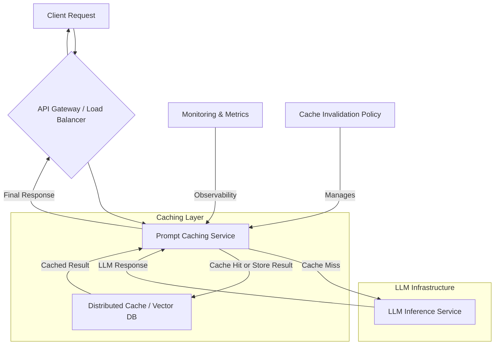

대규모 AI 서비스, 특히 LLM(Large Language Model) 기반 애플리케이션의 운영에서 응답 속도와 비용 효율성은 핵심적인 고려 사항입니다. 동일하거나 유사한 프롬프트에 대한 반복적인 LLM 호출은 불필요한 컴퓨팅 자원 소모와 대기 시간을 발생시킵니다. 실시간 프롬프트 캐싱 시스템은 이러한 문제를 해결하고 서비스의 확장성과 사용자 경험을 향상시키는 데 필수적인 요소입니다. 이는 이전에 처리된 프롬프트와 그 응답을 저장하여, 이후 동일하거나 유사한 요청이 들어왔을 때 LLM API를 호출하는 대신 캐시된 결과를 즉시 반환하는 방식으로 동작합니다.

## 캐싱 시스템의 핵심 구성 요소
실시간 프롬프트 캐싱 시스템은 다음과 같은 주요 구성 요소와 설계 고려 사항을 포함합니다.

### 1. 캐시 키(Cache Key) 생성 전략
가장 중요한 부분은 프롬프트의 '동일성'을 정의하고 이를 고유한 캐시 키로 변환하는 것입니다. 단순 문자열 매칭은 비효율적이며, 미묘한 차이에도 캐시 미스가 발생합니다.

*   **정규화(Normalization)**: 프롬프트에서 불필요한 공백, 대소문자, 구두점 등을 제거하여 표준화합니다.
*   **해싱(Hashing)**: 정규화된 프롬프트 문자열에 SHA256과 같은 암호화 해싱 함수를 적용하여 고정 길이의 키를 생성합니다.
*   **의미 기반 캐싱(Semantic Caching)**: 2026년 트렌드를 반영하여, 프롬프트의 **임베딩(Embeddings)**을 캐시 키로 활용하는 방법이 중요합니다. 프롬프트를 임베딩 벡터로 변환한 후, 이 벡터들을 벡터 데이터베이스(Vector Database)에 저장하고 유사도 검색을 통해 캐시 히트를 판단합니다. 예를 들어, 코사인 유사도가 특정 임계값 이상인 경우 캐시 히트로 간주할 수 있습니다. 이는 “What is the capital of France?”와 “Capital city of France?”와 같이 문법은 다르지만 의미는 동일한 프롬프트에 대해서도 캐시 히트를 가능하게 합니다. 이 방식은 특히 동적 프롬프트 템플릿(Dynamic Prompt Templating)과 RAG(Retrieval Augmented Generation) 시스템에서 유용합니다.

### 2. 캐시 저장소(Cache Store)
고성능 분산 캐시 시스템은 대규모 트래픽을 처리하기 위한 필수 요소입니다.

*   **인메모리 캐시(In-memory Cache)**: Redis, Memcached와 같은 인메모리 데이터스토어는 낮은 지연 시간으로 빠른 데이터 접근을 제공합니다. 클러스터 모드를 통해 확장성을 확보할 수 있습니다.
*   **벡터 데이터베이스(Vector Database)**: Semantic Caching을 위해 Pinecone, Weaviate, Milvus, Qdrant와 같은 벡터 데이터베이스를 활용하여 임베딩 기반 유사도 검색을 효율적으로 수행합니다. 이는 프롬프트 임베딩과 응답을 함께 저장합니다.

### 3. 캐시 무효화(Cache Invalidation) 정책
캐시의 신선도(freshness)를 유지하는 것은 매우 중요합니다.

*   **TTL (Time-To-Live)**: 특정 시간(예: 5분, 1시간)이 지나면 자동으로 캐시가 만료되도록 설정합니다. 간단하고 효과적이지만, 데이터 변경 주기에 따라 최적의 TTL을 찾는 것이 중요합니다.
*   **LRU (Least Recently Used), LFU (Least Frequently Used)**: 캐시 저장 공간이 부족할 때 가장 적게 사용되었거나, 가장 오래전에 사용된 항목을 제거합니다. 이는 캐시 적중률(Cache Hit Ratio)을 높이는 데 기여합니다.
*   **명시적 무효화(Explicit Invalidation)**: 백엔드 데이터나 모델이 업데이트되었을 때, 관련 캐시 항목을 수동 또는 자동으로 무효화하는 메커니즘을 구현합니다. 예를 들어, LLM의 특정 버전이 업데이트되면 해당 버전과 관련된 모든 캐시를 무효화할 수 있습니다.

## 시스템 아키텍처



위 다이어그램은 일반적인 실시간 프롬프트 캐싱 시스템의 흐름을 보여줍니다. 클라이언트 요청은 API 게이트웨이를 통해 캐싱 서비스로 라우팅됩니다. 캐싱 서비스는 요청 프롬프트를 정규화하고 캐시 키를 생성하여 분산 캐시(또는 벡터 DB)에서 캐시된 응답을 찾습니다. 캐시 히트 시 즉시 응답을 반환하고, 캐시 미스 시 LLM Inference Service로 요청을 전달하여 응답을 받은 후 이를 캐시에 저장하고 클라이언트에게 반환합니다.

## 실전 코드 예제 (Python)

아래 Python 코드는 의미 기반 캐싱을 위한 간단한 `PromptCache` 클래스를 보여줍니다. 실제 프로덕션에서는 Redis 클라이언트와 벡터 임베딩 모델, 그리고 벡터 데이터베이스와 연동되어야 합니다.

```python
import hashlib
import json
from datetime import datetime, timedelta
from typing import Dict, Any, Optional

# Mock Embedding Model (Replace with actual LLM embedding API call)
class MockEmbeddingModel:
    def get_embedding(self, text: str) -> list[float]:
        # In a real scenario, this would call an embedding API (e.g., OpenAI, Cohere)
        # For demonstration, a simple hash-based vector is used.
        h = int(hashlib.sha256(text.encode()).hexdigest(), 16) % (10**9)
        return [float(h) / (10**9)] * 128 # Example 128-dim vector

# Mock Vector Database (Replace with actual Vector DB client like Pinecone, Weaviate)
class MockVectorDB:
    def __init__(self):
        self.store: Dict[str, Dict[str, Any]] = {}
        self.id_counter = 0

    def upsert(self, vector: list[float], metadata: Dict[str, Any]) -> str:
        # In a real vector DB, 'vector' would be searchable
        doc_id = f"doc_{self.id_counter}"
        self.id_counter += 1
        self.store[doc_id] = {"vector": vector, "metadata": metadata}
        return doc_id

    def search(self, query_vector: list[float], top_k: int = 1,
               min_similarity: float = 0.8) -> list[Dict[str, Any]]:
        # Simple cosine similarity for demonstration
        results = []
        for doc_id, data in self.store.items():
            doc_vector = data["vector"]
            # Simplified similarity calc (real cosine sim would be more complex)
            similarity = sum(qv * dv for qv, dv in zip(query_vector, doc_vector)) / (
                (sum(qv**2 for qv in query_vector)**0.5) * (sum(dv**2 for dv in doc_vector)**0.5)
            ) if sum(qv**2 for qv in query_vector) > 0 and sum(dv**2 for dv in doc_vector) > 0 else 0
            if similarity >= min_similarity:
                results.append({"id": doc_id, "score": similarity, "metadata": data["metadata"]})
        return sorted(results, key=lambda x: x["score"], reverse=True)[:top_k]

class PromptCache:
    def __init__(self, ttl_seconds: int = 300, min_similarity: float = 0.8):
        self.cache: Dict[str, Dict[str, Any]] = {}
        self.ttl_seconds = ttl_seconds
        self.embedding_model = MockEmbeddingModel()
        self.vector_db = MockVectorDB()
        self.min_similarity = min_similarity

    def _normalize_prompt(self, prompt: str) -> str:
        return prompt.strip().lower()

    def get(self, prompt: str) -> Optional[Any]:
        normalized_prompt = self._normalize_prompt(prompt)
        query_embedding = self.embedding_model.get_embedding(normalized_prompt)

        # Try semantic search first
        search_results = self.vector_db.search(query_embedding, min_similarity=self.min_similarity)
        if search_results:
            for result in search_results:
                cached_item = result["metadata"]["cached_data"]
                if datetime.fromisoformat(cached_item["expires_at"]) > datetime.now():
                    print(f"Cache Hit (Semantic): {prompt}")
                    return cached_item["response"]
        
        # Fallback to exact match (if needed, though semantic should cover it)
        # For this example, semantic is primary.
        
        return None

    def put(self, prompt: str, response: Any):
        normalized_prompt = self._normalize_prompt(prompt)
        embedding = self.embedding_model.get_embedding(normalized_prompt)
        
        expires_at = (datetime.now() + timedelta(seconds=self.ttl_seconds)).isoformat()
        cached_data = {
            "original_prompt": prompt,
            "normalized_prompt": normalized_prompt,
            "response": response,
            "expires_at": expires_at
        }
        
        # Store in vector DB (and potentially also a traditional cache for exact matches)
        self.vector_db.upsert(embedding, {"cached_data": cached_data})
        print(f"Cache Stored: {prompt}")

# Usage example
prompt_cache = PromptCache(ttl_seconds=10)

# First request - cache miss
response1 = prompt_cache.get("What is the capital of France?")
if response1 is None:
    llm_response = "Paris"
    prompt_cache.put("What is the capital of France?", llm_response)
    response1 = llm_response
print(f"Response 1: {response1}")

# Second request (exact match) - cache hit
response2 = prompt_cache.get("What is the capital of France?")
if response2 is None:
    print("LLM call would happen here for second request")
else:
    print(f"Response 2: {response2}")

# Third request (semantic match) - cache hit
response3 = prompt_cache.get("Capital city of France?")
if response3 is None:
    print("LLM call would happen here for third request")
else:
    print(f"Response 3: {response3}")

# Wait for TTL to expire (in a real system, background tasks handle this)
import time
time.sleep(11)

# After TTL - cache miss
response4 = prompt_cache.get("What is the capital of France?")
if response4 is None:
    llm_response = "Paris (refreshed)"
    prompt_cache.put("What is the capital of France?", llm_response)
    response4 = llm_response
    print(f"Response 4 (after TTL): {response4}")
```

## 2026년 최신 트렌드 반영

*   **멀티모달 프롬프트 캐싱**: 텍스트뿐만 아니라 이미지, 오디오 등 멀티모달 입력에 대한 캐싱도 중요해지고 있습니다. 이는 각 모달리티별 임베딩을 결합하여 캐시 키를 생성하고, 멀티모달 벡터 데이터베이스에 저장하는 방식으로 발전합니다.
*   **동적 컨텍스트 인식 캐싱**: RAG나 Agent 시스템처럼 프롬프트가 외부 검색 결과나 이전 대화 내역에 따라 동적으로 변하는 경우, 단순 프롬프트 캐싱으로는 한계가 있습니다. 이때는 프롬프트와 함께 검색된 문서의 ID, Agent의 현재 상태 등을 캐시 키에 포함하여 보다 정교한 캐싱 전략이 필요합니다.
*   **계층적 캐싱(Hierarchical Caching)**: 사용자 근접성(Edge Caching), 서비스 계층(In-service Caching), 백엔드 DB(Persistent Caching) 등 여러 계층에서 캐싱을 적용하여 효율을 극대화합니다. 각 계층은 다른 TTL이나 무효화 정책을 가질 수 있습니다.

## 트레이드오프

### 1. 캐시 적중률 vs. 데이터 신선도 (Cache Hit Rate vs. Data Freshness)
*   **언제 좋은가**: 높은 캐시 적중률은 비용 절감과 응답 시간 단축에 크게 기여합니다. 정적 정보를 반복적으로 질의하는 서비스(예: FAQ 챗봇)에 유리합니다.
*   **언제 나쁜가**: 신선도가 중요한 정보(예: 실시간 주식 시세, 최신 뉴스 요약)를 캐싱할 경우, 오래된 데이터가 반환될 위험이 있습니다. 이 경우 TTL을 매우 짧게 가져가거나, 변경 발생 시 즉시 무효화하는 복잡한 메커니즘이 필요합니다.

### 2. 캐시 일관성 vs. 시스템 복잡성 (Cache Consistency vs. System Complexity)
*   **언제 좋은가**: 강력한 캐시 일관성(Consistent Caching)은 항상 최신 데이터를 보장하여 사용자 신뢰도를 높입니다. 금융, 의료 등 데이터 무결성이 중요한 시스템에 적합합니다.
*   **언제 나쁜가**: 강력한 일관성을 유지하기 위해서는 분산 트랜잭션, 낙관적/비관적 잠금 등 복잡한 동기화 메커니즘이 필요하며, 이는 시스템의 지연 시간과 구현 복잡성을 증가시키고 확장성을 저해할 수 있습니다. 대부분의 LLM 서비스는 '결과적 일관성(Eventual Consistency)'으로도 충분할 때가 많습니다.

### 3. 캐시 키 복잡성 vs. 오버헤드 (Cache Key Complexity vs. Overhead)
*   **언제 좋은가**: 의미 기반 캐싱처럼 복잡한 키 생성 전략은 캐시 적중률을 크게 높여줍니다. 특히 프롬프트가 다양한 형태로 표현될 수 있는 자연어 처리 환경에서 매우 효과적입니다.
*   **언제 나쁜가**: 임베딩 생성 및 벡터 유사도 검색은 CPU/GPU 자원과 시간을 소모합니다. 캐시 미스 시 LLM 호출 비용보다 임베딩 생성 비용이 더 높다면, 캐싱의 이점이 상쇄될 수 있습니다. 고차원 임베딩 벡터의 저장 및 검색 또한 저장 공간과 컴퓨팅 비용을 증가시킵니다.

### 4. 캐시 용량 vs. 비용 (Cache Capacity vs. Cost)
*   **언제 좋은가**: 충분한 캐시 용량은 더 많은 데이터를 저장하여 캐시 적중률을 높이고 LLM API 호출 비용을 절감합니다.
*   **언제 나쁜가**: 캐시 저장소(특히 인메모리나 고성능 벡터 DB)의 확장은 높은 인프라 비용으로 이어집니다. 적절한 용량과 만료 정책을 통해 비용 효율적인 운영이 필수적입니다.

## 실전 체크리스트

프로젝트에 실시간 프롬프트 캐싱 시스템을 적용할 때 다음 항목들을 검증합니다.

- [ ] **캐시 적중률 목표 설정 및 측정**: 현재 LLM 호출 비용 대비 캐싱 시스템 도입 후 예상되는 비용 절감률을 예측하고, 최소 20% 이상의 캐시 적중률 목표를 설정하고 대시보드를 통해 실시간으로 모니터링합니다.
- [ ] **프롬프트 정규화 전략 정의**: 프롬프트의 대소문자, 공백, 구두점 처리 등 표준화 규칙을 명확히 정의하고, 실제 서비스 프롬프트 패턴에 대한 테스트 커버리지를 확보합니다.
- [ ] **의미 기반 캐싱 도입 여부 결정**: 서비스의 프롬프트 다양성(semantic variance)을 분석하여 단순 해싱 대비 임베딩 기반 캐싱의 실질적인 이점(예: 추가 10% 캐시 적중률)을 검토하고 도입 여부를 결정합니다.
- [ ] **캐시 만료 정책 최적화**: LLM 응답의 데이터 신선도 요구 사항에 따라 TTL(Time-To-Live)을 설정하고, 실제 캐시 히트/미스 패턴을 분석하여 LRU/LFU 등의 정책을 조합하여 최적의 만료 전략을 적용합니다.
- [ ] **분산 캐시 시스템 선정 및 확장성 검토**: Redis Cluster, Memcached, 혹은 Vector DB (Pinecone, Weaviate 등) 중에서 서비스의 트래픽 규모와 데이터 유형에 적합한 시스템을 선정하고, 향후 트래픽 증가에 대비한 확장 계획을 수립합니다.
- [ ] **캐시 무효화 메커니즘 구현**: 백엔드 데이터 업데이트, LLM 모델 버전 변경 등 캐시 무효화가 필요한 이벤트에 대한 트리거를 정의하고, 관련 캐시 항목을 효율적으로 무효화하는 API 또는 메시지 큐 기반 시스템을 구현합니다.
- [ ] **레이턴시 및 비용 오버헤드 측정**: 캐시 키 생성(특히 임베딩), 캐시 저장소 접근에 따른 추가적인 지연 시간(latency)과 비용(비용 오버헤드)을 측정하고, 캐싱을 통해 절감되는 LLM API 호출 비용과 비교하여 전체적인 ROI(Return on Investment)를 평가합니다.
- [ ] **에러 핸들링 및 폴백 전략 구현**: 캐시 시스템 장애 시 LLM API로의 자동 폴백(fallback) 메커니즘을 구현하고, 캐시 데이터 손상 시의 복구 전략을 명확히 정의합니다.