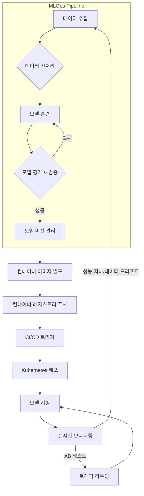

AI 모델을 연구실에서 개발하는 것과 실제 프로덕션 환경에 성공적으로 배포하여 운영하는 것은 별개의 도전 과제입니다. 특히 AI 모델이 비즈니스 핵심 요소가 되면서, 예측 불가능한 트래픽 증가, 데이터 드리프트, 모델 성능 저하 등 다양한 운영 문제를 효율적으로 관리할 수 있는 확장 가능한(scalable) 배포 파이프라인 구축이 필수적입니다. 이 엔트리는 이러한 요구사항을 충족하기 위한 모범 사례를 다룹니다.

## 확장 가능한 AI 모델 배포의 중요성

AI 모델의 생산 환경 적용을 위해서는 효율적이고 안정적인 배포 및 관리 인프라 구축 방법론이 시급합니다. 수동 배포 방식은 속도, 안정성, 재현성 측면에서 한계를 가지며, 모델이 많아지거나 예측 요청이 폭증할 경우 시스템 전체의 병목 현상을 초래할 수 있습니다. 자동화된 파이프라인은 이러한 문제들을 해결하고, 개발자와 운영팀이 모델 개발 및 개선에 집중할 수 있도록 지원합니다.

## 핵심 구성 요소

확장 가능한 AI 모델 배포 파이프라인은 다음 핵심 요소들로 구성됩니다.

### 1. MLOps 및 CI/CD 통합

Machine Learning Operations (MLOps)는 ML 시스템의 라이프사이클을 관리하기 위한 문화적, 기술적 프랙티스입니다. 모델 훈련, 검증, 배포, 모니터링 전 과정에 걸쳐 CI/CD (Continuous Integration/Continuous Deployment) 원칙을 적용하여 자동화를 달성합니다.

*   **CI (Continuous Integration)**: 모델 코드, 데이터 전처리 스크립트, 학습 코드 변경 시 자동으로 테스트하고 빌드합니다.
*   **CD (Continuous Deployment)**: 테스트를 통과한 모델 아티팩트를 자동으로 배포하거나 프로덕션 환경으로 승격시킵니다.

### 2. 컨테이너화 및 오케스트레이션

모델과 그 의존성을 Docker와 같은 컨테이너로 패키징하여 환경 일관성을 확보합니다. Kubernetes와 같은 컨테이너 오케스트레이션 도구는 수많은 모델 인스턴스를 효율적으로 배포, 관리, 스케일링하는 데 필수적입니다. 이를 통해 트래픽 부하에 따라 모델 서빙 인스턴스를 자동으로 확장하거나 축소할 수 있습니다.

### 3. 모델 서빙 프레임워크

효율적인 모델 추론을 위해 최적화된 서빙 프레임워크를 사용합니다. TensorFlow Serving, TorchServe, Triton Inference Server, BentoML 등은 고성능 추론, 배치 추론, 멀티 모델 서빙, A/B 테스팅, 캐싱 기능을 제공하여 모델 배포의 복잡성을 줄이고 성능을 극대화합니다.

### 4. 모니터링 및 관측 가능성(Observability)

배포된 모델의 성능(예측 정확도, 지연 시간), 시스템 자원 사용량, 데이터 드리프트 등을 지속적으로 모니터링합니다. Prometheus, Grafana, MLflow, Seldon Core 등의 도구를 활용하여 실시간 대시보드를 구축하고, 이상 징후 발생 시 즉시 알림을 받을 수 있도록 설정해야 합니다. 이는 모델 재훈련 및 업데이트 전략 수립에 중요한 피드백 루프를 제공합니다.

### 5. 데이터 및 모델 버전 관리

Data Version Control (DVC), MLflow 등의 도구를 사용하여 학습 데이터, 모델 아티팩트, 코드의 버전을 체계적으로 관리합니다. 이는 실험의 재현성을 보장하고, 문제가 발생했을 때 특정 시점으로 롤백할 수 있는 기반을 마련합니다.

## 배포 파이프라인 아키텍처 예시

아래 Mermaid 다이어그램은 일반적인 확장형 AI 모델 배포 파이프라인의 흐름을 보여줍니다.



## 코드 예시: 간단한 모델 서빙 API와 Dockerfile

Python Flask를 이용한 간단한 모델 서빙 API와 이를 컨테이너화하는 Dockerfile 예시입니다.

### `app.py`

```python
from flask import Flask, request, jsonify
import joblib

app = Flask(__name__)

# 모델 로드 (실제 환경에서는 더 견고한 모델 로딩 로직 필요)
model = joblib.load('model.pkl')

@app.route('/predict', methods=['POST'])
def predict():
    try:
        data = request.get_json(force=True)
        features = data['features']
        prediction = model.predict([features]).tolist()
        return jsonify({'prediction': prediction})
    except Exception as e:
        return jsonify({'error': str(e)}), 400

if __name__ == '__main__':
    app.run(host='0.0.0.0', port=5000)
```

### `Dockerfile`

```dockerfile
# Python 3.9 기반 이미지 사용
FROM python:3.9-slim-buster

# 작업 디렉토리 설정
WORKDIR /app

# 필요한 라이브러리 설치
COPY requirements.txt .
RUN pip install --no-cache-dir -r requirements.txt

# 모델 및 애플리케이션 코드 복사
COPY model.pkl .
COPY app.py .

# 5000번 포트 노출
EXPOSE 5000

# Flask 애플리케이션 실행
CMD ["python", "app.py"]
```

### `requirements.txt`

```
flask
scikit-learn
joblib
```

이 예시는 모델이 이미 훈련되어 `model.pkl` 파일로 저장되어 있다고 가정합니다. 실제 배포 파이프라인에서는 이 컨테이너 이미지를 빌드하고, Kubernetes와 같은 오케스트레이션 시스템에 배포하여 확장 및 관리가 이루어집니다.

## 트레이드오프

확장 가능한 AI 모델 배포 파이프라인 구축에는 여러 트레이드오프가 존재합니다.

*   **초기 구축 복잡성 vs. 장기적 운영 효율성**: 고도화된 MLOps 파이프라인은 초기 설정 및 통합에 상당한 시간과 리소스가 필요합니다. 이는 작은 프로젝트나 MVP 단계에서는 과도할 수 있습니다. 하지만 모델 수가 증가하고 운영 규모가 커질수록 자동화된 파이프라인은 모델 배포 속도, 안정성, 리소스 최적화 측면에서 월등한 효율성을 제공합니다. 대규모, 장기 프로젝트에 유리합니다.
*   **비용 vs. 성능/가용성**: 고성능 GPU 인스턴스, 분산 시스템, 실시간 모니터링 솔루션 등은 운영 비용 증가로 이어집니다. 이는 모델의 추론 속도와 시스템의 가용성을 극대화하지만, 비용 효율성이 중요한 소규모 서비스나 배치 추론에서는 불필요한 지출이 될 수 있습니다. 저지연, 고가용성이 요구되는 서비스에 적합합니다.
*   **자동화 수준 vs. 유연성**: 파이프라인의 모든 단계를 자동화하면 휴먼 에러를 줄이고 배포 속도를 높일 수 있습니다. 그러나 특정 시나리오에서는 수동 개입이 필요한 경우가 발생할 수 있으며, 과도한 자동화는 예외 상황 발생 시 디버깅을 어렵게 하거나 유연한 대응을 저해할 수 있습니다. 실험 단계나 빠른 프로토타이핑에는 수동 개입의 유연성이, 안정적인 프로덕션에는 높은 자동화가 유리합니다.
*   **표준화 vs. 특수성**: 일반적인 MLOps 도구와 프랙티스를 표준화하면 팀 전체의 생산성을 높일 수 있습니다. 그러나 특정 모델이나 산업 도메인의 특수한 요구사항(예: 초저지연, 특정 하드웨어 가속기)을 충족하기 위해서는 맞춤형 솔루션이 필요할 수 있습니다. 범용적인 모델 배포에는 표준화가, 특정 최적화가 필요한 경우에는 특수성을 고려해야 합니다.

## 실전 체크리스트

확장 가능한 AI 모델 배포 파이프라인을 프로젝트에 적용할 때 다음 항목들을 검증합니다.

*   [ ] 모델 학습 및 배포를 위한 CI/CD 파이프라인이 완전히 자동화되어 있으며, 각 단계의 성공/실패 여부가 명확히 보고되는가?
*   [ ] 모든 모델과 의존성이 Docker 컨테이너로 패키징되며, Kubernetes와 같은 오케스트레이션 도구를 통해 배포 및 스케일링이 가능한가?
*   [ ] 배포된 모델의 예측 성능(정확도, 지연 시간), 자원 사용량, 데이터/모델 드리프트를 실시간으로 모니터링하는 대시보드와 알림 시스템이 구축되어 있는가?
*   [ ] 새로운 모델 버전 배포 시, A/B 테스트 또는 Canary 배포와 같은 점진적 롤아웃 전략이 구현되어 있으며, 롤백 절차가 명확한가?
*   [ ] 학습 데이터, 모델 아티팩트, 코드 변경 이력이 DVC, MLflow 등을 통해 체계적으로 버전 관리되고 있으며, 특정 시점으로의 재현 및 롤백이 가능한가?
*   [ ] 모델 업데이트 또는 재훈련이 필요한 조건(예: 데이터 드리프트 임계값 초과)이 정의되어 있으며, 이에 따른 자동 재훈련 파이프라인이 연동되어 있는가?
*   [ ] AI 서비스의 부하 테스트(Load Testing)를 정기적으로 수행하여 확장성 요구사항을 만족하는지 검증하고, 병목 지점을 식별하는 프로세스가 있는가?