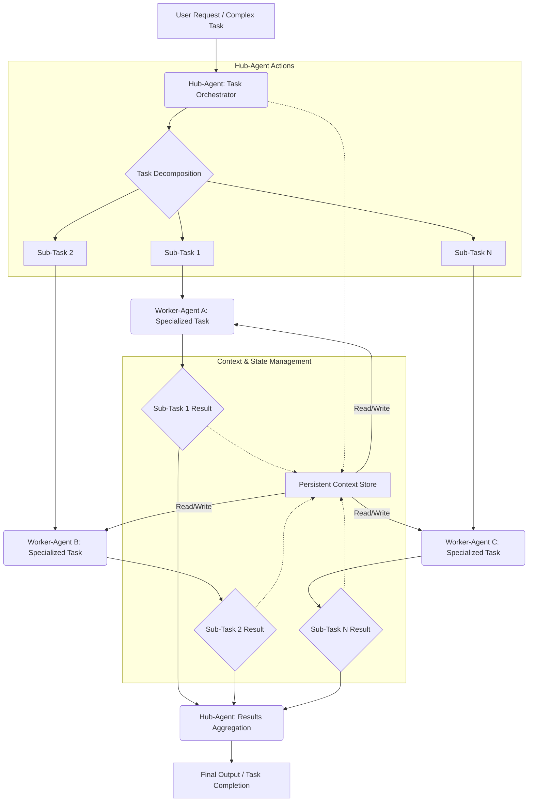

## SuperAgent 하네스 아키텍처 — 장기 실행 태스크 오케스트레이션

현대 AI 에이전트 시스템은 단순히 단일 프롬프트에 응답하는 것을 넘어, 연구, 코딩, 복합적인 데이터 분석과 같은 수 분에서 수 시간까지 소요되는 장기 실행(long-running) 복합 태스크를 처리해야 하는 요구사항에 직면하고 있습니다. 이러한 복합 태스크는 본질적으로 여러 단계로 분해될 수 있으며, 각 단계는 특정 전문성을 가진 에이전트(Sub-Agent)에 의해 병렬적으로 또는 순차적으로 처리될 수 있습니다. SuperAgent 하네스 아키텍처는 이러한 복합 작업을 효과적으로 관리하고 자동화하기 위한 핵심적인 설계 패턴을 제공합니다.

ByteDance의 DeerFlow 2.0 사례는 Sub-Agent 오케스트레이션과 장기 실행 복합 작업 처리의 중요성을 잘 보여줍니다. Deep Research 프레임워크에서 발전하여 LangGraph 및 LangChain 기반으로 재작성된 DeerFlow는, 복잡한 작업을 자율적으로 분해하고 Sub-Agent에게 위임하여 처리하는 능력을 통해 전체 시스템의 효율성과 유연성을 극대화합니다. 이는 playbook의 허브-워커(Hub-Worker) 복리 자동화 및 관제탑 설계와 밀접하게 연결됩니다.

### 허브-워커 오케스트레이션 패턴
SuperAgent 하네스의 핵심은 허브-워커 오케스트레이션 패턴입니다. 이 패턴은 다음과 같이 구성됩니다.

1.  **허브 에이전트 (Hub-Agent)**:
    *   사용자 또는 상위 시스템으로부터 복합 태스크를 수신합니다.
    *   수신된 태스크를 더 작고 관리 가능한 서브 태스크(Sub-Task)로 분해(Task Decomposition)합니다.
    *   각 서브 태스크에 적합한 워커 에이전트(Worker-Agent, 즉 Sub-Agent)를 식별하고 할당합니다.
    *   워커 에이전트들의 실행을 모니터링하고, 진행 상황을 추적하며, 필요한 경우 개입합니다.
    *   워커 에이전트들 간의 결과물을 취합하고, 최종적으로 전체 태스크의 결과를 통합하여 반환합니다.
    *   장기 실행 태스크의 경우, 진행 상태를 주기적으로 저장하고 로깅하여 시스템 재시작이나 오류 발생 시에도 작업을 이어서 진행할 수 있도록 합니다 (Session Longevity).

2.  **워커 에이전트 (Worker-Agent / Sub-Agent)**:
    *   허브 에이전트로부터 할당된 특정 서브 태스크를 수행합니다.
    *   각 워커는 특정 도구(tool-use)나 전문 지식에 특화되어 있을 수 있습니다.
    *   자신의 태스크를 완료한 후, 결과를 허브 에이전트에게 보고합니다.
    *   독립적으로 실행될 수 있으며, 필요에 따라 병렬 처리될 수 있습니다.

이러한 분리된 역할은 시스템의 모듈성과 확장성을 높이며, 복잡한 태스크를 더욱 효율적으로 관리할 수 있게 합니다. 특히 LLM 에이전트의 한정된 컨텍스트 윈도우(context window) 문제를 완화하고, 각 에이전트가 자신의 전문 분야에 집중할 수 있도록 돕습니다.

### 장기 실행 태스크 관리를 위한 상태 지속성
장기 실행 태스크의 성공적인 수행을 위해서는 진행 상태와 컨텍스트를 지속적으로 유지하는 것이 필수적입니다.
*   **세션 컨텍스트 지속성 (Session Context Persistence)**: 각 태스크의 실행 상태, 중간 결과, 에이전트 간의 대화 기록 등을 저장소 (예: Vector DB, Redis, RDBMS)에 저장합니다. 이를 통해 에이전트 또는 시스템이 재시작되더라도 작업을 이어서 처리할 수 있습니다.
*   **글로벌 컨텍스트 관리 (Global Context Management)**: 전체 시스템 또는 특정 복합 태스크에 걸쳐 공유되어야 하는 지식, 환경 설정 등을 관리합니다. 이는 태스크 분해 시 Sub-Agent들이 참조할 수 있는 일관된 정보원을 제공합니다.
*   **아티팩트 관리 (Artifact Management)**: 워커 에이전트가 생성하는 코드, 리서치 보고서, 데이터 파일 등 중간 산출물(artifacts)을 체계적으로 관리하여, 다른 에이전트가 활용하거나 최종 결과물로 통합될 수 있도록 합니다.

### Mermaid 다이어그램: SuperAgent 하네스 워크플로우


### 코드 예제: 파이썬 기반 Task 분배 (Conceptual)
```python
import uuid
import json
from typing import Dict, List, Any

# Assume WorkerAgent is an abstract class or interface
class WorkerAgent:
    def __init__(self, agent_id: str):
        self.agent_id = agent_id

    def execute_task(self, task_payload: Dict[str, Any]) -> Dict[str, Any]:
        raise NotImplementedError

class ResearchAgent(WorkerAgent):
    def execute_task(self, task_payload: Dict[str, Any]) -> Dict[str, Any]:
        query = task_payload.get("query")
        # print(f"ResearchAgent {self.agent_id} executing query: {query}")
        # Simulate research
        result = f"Research data for '{query}': ... (simulated result)"
        return {"status": "completed", "result": result, "agent_id": self.agent_id}

class CodeGenerationAgent(WorkerAgent):
    def execute_task(self, task_payload: Dict[str, Any]) -> Dict[str, Any]:
        spec = task_payload.get("spec")
        # print(f"CodeGenerationAgent {self.agent_id} generating code for spec: {spec}")
        # Simulate code generation
        code = f"```python\ndef solve_{spec.replace(' ', '_')}():\n    return 'Hello, World!'\n```"
        return {"status": "completed", "result": code, "agent_id": self.agent_id}

class HubAgent:
    def __init__(self, context_store: Any):
        self.context_store = context_store # e.g., a Redis or DB client
        self.workers: Dict[str, WorkerAgent] = {
            "research": ResearchAgent("researcher-1"),
            "code": CodeGenerationAgent("coder-1"),
        }
        self.active_tasks: Dict[str, Dict] = {}

    def _decompose_task(self, complex_task: str) -> List[Dict[str, Any]]:
        # This logic would typically involve an LLM for dynamic decomposition
        if "research" in complex_task.lower() and "code" in complex_task.lower():
            return [
                {"type": "research", "query": "AI agent orchestration patterns"},
                {"type": "code", "spec": "Python function for agent task dispatch"}
            ]
        elif "research" in complex_task.lower():
            return [{"type": "research", "query": complex_task}]
        elif "code" in complex_task.lower():
            return [{"type": "code", "spec": complex_task}]
        return [{"type": "unknown", "payload": complex_task}]

    def start_complex_task(self, task_description: str) -> str:
        task_id = str(uuid.uuid4())
        sub_tasks = self._decompose_task(task_description)
        
        self.active_tasks[task_id] = {
            "description": task_description,
            "sub_tasks": [],
            "status": "pending",
            "results": {}
        }
        self.context_store.save_task_state(task_id, self.active_tasks[task_id])

        for sub_task_def in sub_tasks:
            agent_type = sub_task_def["type"]
            worker = self.workers.get(agent_type)
            if worker:
                # In a real system, this would be asynchronous/distributed
                # print(f"HubAgent dispatching sub-task to {worker.agent_id}")
                sub_task_result = worker.execute_task(sub_task_def)
                self.active_tasks[task_id]["sub_tasks"].append(sub_task_def)
                self.active_tasks[task_id]["results"][worker.agent_id] = sub_task_result
            else:
                pass # print(f"No worker found for agent type: {agent_type}")
        
        self.active_tasks[task_id]["status"] = "completed"
        self.context_store.save_task_state(task_id, self.active_tasks[task_id])
        return task_id

    def get_task_status(self, task_id: str) -> Dict[str, Any]:
        return self.context_store.load_task_state(task_id)

# --- Mock Context Store --- (for conceptual example)
class MockContextStore:
    def __init__(self):
        self._store: Dict[str, Dict] = {}

    def save_task_state(self, task_id: str, state: Dict[str, Any]):
        self._store[task_id] = json.loads(json.dumps(state)) # Deep copy for immutability
        # print(f"Saved state for task {task_id}: {self._store[task_id]['status']}")

    def load_task_state(self, task_id: str) -> Dict[str, Any]:
        return json.loads(json.dumps(self._store.get(task_id, {}))) # Deep copy

if __name__ == "__main__":
    context_store = MockContextStore()
    hub = HubAgent(context_store)

    complex_request = "Research latest AI agent orchestration patterns and write a Python function for task dispatch."
    # print(f"Starting complex task: '{complex_request}'")
    task_id = hub.start_complex_task(complex_request)
    # print(f"Task {task_id} initiated.")

    status = hub.get_task_status(task_id)
    # print(f"Final status for task {task_id}: {status['status']}")
    # print("Results:")
    # for agent_id, result in status['results'].items():
    #     print(f"  {agent_id}: {result['result'][:100]}...") # Truncate for display
```

### 2026년 최신 트렌드 반영
*   **지능형 태스크 분해 및 재구성**: LLM의 발전에 따라, 휴리스틱 기반이 아닌 동적인(dynamic)이고 컨텍스트를 인지하는(context-aware) 태스크 분해 및 실패 시 재구성(re-planning) 능력이 중요해집니다. LangGraph와 같은 프레임워크가 이를 지원합니다.
*   **지속적 컨텍스트와 메모리 관리**: 장기 실행 태스크의 경우, 컨텍스트 윈도우 한계를 극복하고 에이전트 간의 일관된 정보 공유를 위해 Vector DB 기반의 외부 메모리(External Memory) 및 고급 리트리벌 증강 생성(RAG) 패턴이 필수적입니다.
*   **강화된 관측 가능성 (Observability) 및 디버깅**: 복합 에이전트 시스템의 블랙박스 문제를 해결하기 위해, 각 서브 태스크의 진행 상황, 에이전트 간 통신, 의사 결정 과정을 실시간으로 모니터링하고 시각화하는 도구가 중요해지고 있습니다.
*   **탄력성 및 오류 처리 (Resilience & Error Handling)**: 장기 실행 태스크는 다양한 실패 지점을 가질 수 있으므로, 자동 재시도(retry), 대체 경로(fallback), 진행 상황 롤백(rollback) 등의 견고한 오류 처리 메커니즘 설계가 핵심입니다.

## 트레이드오프 (Trade-offs)

SuperAgent 하네스 아키텍처를 통한 장기 실행 태스크 오케스트레이션은 강력한 이점을 제공하지만, 몇 가지 트레이드오프를 수반합니다.

*   **시스템 복잡성 vs. 기능 확장성**:
    *   **언제 좋은가**: 복잡한 비즈니스 로직을 자동화하고, 다양한 전문성을 가진 에이전트를 통합해야 할 때 유리합니다. 모듈화된 설계는 개별 에이전트의 기능 확장을 용이하게 합니다.
    *   **언제 나쁜가**: 단순하고 단발성인 태스크에는 과도한 아키텍처입니다. 초기 설정 및 유지보수 비용이 증가하며, 시스템 전체의 복잡도가 높아져 개발 및 디버깅에 시간이 더 소요될 수 있습니다.

*   **리소스 활용 효율성 vs. 처리량**:
    *   **언제 좋은가**: 여러 Sub-Agent를 병렬로 실행하여 전체 태스크의 완료 시간을 단축하고 처리량을 늘릴 수 있습니다. 유휴 에이전트 리소스를 효율적으로 활용할 수 있습니다.
    *   **언제 나쁜가**: 병렬 처리 및 다중 에이전트 관리는 더 많은 컴퓨팅 리소스(CPU, 메모리, GPU)를 요구할 수 있습니다. 각 Sub-Agent 인스턴스의 오버헤드가 누적되어 비용이 증가할 수 있습니다.

*   **상태 지속성 vs. 시스템 탄력성**:
    *   **언제 좋은가**: 장기 실행 태스크의 중간 상태를 지속적으로 저장함으로써, 시스템 장애 발생 시에도 작업을 이어서 처리할 수 있어 높은 신뢰성을 제공합니다.
    *   **언제 나쁜가**: 상태 관리를 위한 저장소(Persistent Context Store) 설계 및 구현이 복잡해집니다. 데이터 일관성(consistency), 동시성(concurrency) 문제에 대한 고려가 필요하며, 저장소 자체의 성능 병목이 발생할 수 있습니다. 상태가 복잡할수록 디버깅이 어려워질 수 있습니다.

*   **추상화 수준 vs. 세밀한 제어**:
    *   **언제 좋은가**: Hub-Agent가 Sub-Task 분해 및 워커 할당을 추상화하여, 개발자가 개별 Sub-Agent의 구현 세부 사항에 덜 신경 쓰고 고수준의 워크플로우를 정의할 수 있습니다.
    *   **언제 나쁜가**: 특정 Sub-Task의 실행 과정에 대한 세밀한 제어가 필요하거나, 예외 상황에 대한 고도로 맞춤화된 대응이 필요할 때, 추상화 계층이 방해가 될 수 있습니다. 에이전트 간 인터페이스가 명확하지 않으면 디버깅이 복잡해질 수 있습니다.

## 실전 체크리스트 (Practical Checklist)

SuperAgent 하네스 아키텍처를 실제 프로젝트에 적용할 때 다음 항목들을 점검하여 성공적인 구현을 보장해야 합니다.

- [ ] **태스크 분해 로직 견고성**: 복합 태스크가 다양한 시나리오에서 일관되고 효율적으로 Sub-Task로 분해되는지 검증합니다. (LLM 기반 동적 분해 시, 프롬프트 엔지니어링 및 평가 지표 포함)
- [ ] **Sub-Agent 인터페이스 명확성**: 각 Sub-Agent가 기대하는 입력과 반환하는 출력의 스키마(schema)가 명확하게 정의되고 문서화되어 있는지 확인합니다.
- [ ] **상태 지속성 메커니즘 설계**: 장기 실행 태스크의 중간 컨텍스트와 결과물을 저장하고 로드하는 메커니즘(예: RDB, Key-Value Store, Vector DB)이 안정적으로 작동하며, 데이터 일관성을 유지하는지 점검합니다.
- [ ] **오류 처리 및 재시도 전략**: Sub-Agent 또는 외부 시스템 연동 실패 시, 자동 재시도(retry), 대체 경로(fallback), 또는 작업 중단 및 알림 등 정의된 오류 처리 전략이 효과적으로 작동하는지 테스트합니다.
- [ ] **관측 가능성 (Observability) 구현**: Hub-Agent와 Sub-Agent 간의 상호작용, 각 태스크의 시작/종료 시간, 중간 결과, 에러 로그 등을 실시간으로 모니터링하고 시각화할 수 있는 대시보드가 구성되어 있는지 확인합니다.
- [ ] **성능 및 확장성 테스트**: 다수의 복합 태스크가 동시에 실행될 때 시스템의 응답 시간, 처리량, 리소스 사용량(CPU, 메모리) 등이 정의된 SLA(Service Level Agreement)를 충족하는지 부하 테스트를 수행합니다.
- [ ] **보안 및 접근 제어**: 각 Sub-Agent가 필요한 최소한의 권한(Least Privilege)만 가지도록 설계하고, 민감한 정보의 흐름이 안전하게 관리되는지 검토합니다.