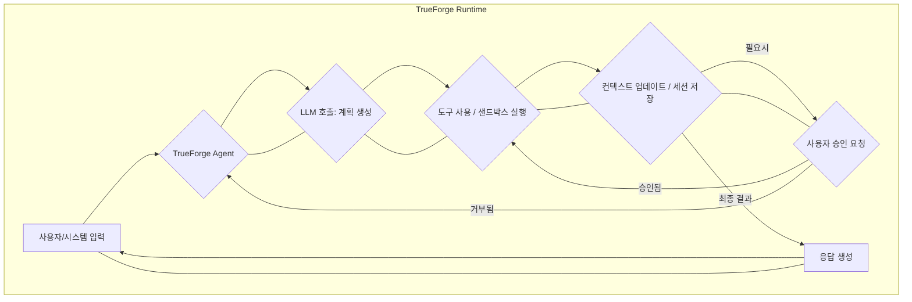

TrueForge는 LLM을 기반으로 하는 에이전트의 복잡한 실행 라이프사이클을 관리하기 위한 오픈소스 하네스입니다. 모델 호출부터 도구 사용, 샌드박스 환경, 사용자 승인, 컨텍스트 관리, 세션 유지에 이르기까지 에이전트의 전체 루프를 통합적으로 제어하고 표준화된 방식으로 제공합니다. 이는 에이전트 개발자가 반복적인 인프라 구축 대신 핵심 로직에 집중할 수 있도록 돕습니다.

### TrueForge 핵심 아키텍처 및 기능
TrueForge는 에이전트의 신뢰성과 생산성을 높이는 다양한 기능을 내장하고 있습니다.
*   **모델 호출 및 스트리밍**: LLM과의 통신을 추상화하고, 응답 스트리밍을 기본 지원하여 사용자 경험을 향상시킵니다.
*   **도구 사용(Tool Use) 및 샌드박스**: 에이전트가 외부 도구를 안전하게 호출하고 실행할 수 있는 메커니즘을 제공하며, 필요한 경우 샌드박스 환경을 통해 보안을 강화합니다.
*   **컨텍스트 및 세션 관리**: 장기 실행 에이전트의 대화 및 작업 컨텍스트를 효율적으로 저장하고 관리하여 일관성 있는 상호작용을 가능하게 합니다.
*   **승인 및 권한 확인**: 민감한 작업에 대한 사용자 또는 시스템의 명시적 승인 프로세스를 통합하고, 접근 권한을 체계적으로 관리합니다.
*   **내장 UI 및 API/SDK**: 에이전트와 상호작용할 수 있는 웹 기반 채팅 화면을 제공하며, HTTP API 및 TypeScript SDK를 통해 기존 애플리케이션에 쉽게 통합될 수 있습니다.

### 에이전트 실행 흐름 (TrueForge 활용)
에이전트의 기본적인 실행 흐름은 다음과 같은 단계를 거칩니다:
1.  **Perception**: 사용자 입력 또는 외부 이벤트 감지.
2.  **Planning**: LLM이 주어진 컨텍스트와 도구를 활용하여 다음 행동 계획.
3.  **Action**: 계획에 따라 도구 호출, 샌드박스 실행, 외부 시스템과 상호작용.
4.  **Reflection**: 행동 결과 분석 및 다음 계획 수정 (필요시 사용자 승인 요청).
5.  **Output**: 최종 결과 또는 사용자에게 응답.



### 코드 예제: TrueForge 에이전트 기본 구성 (TypeScript)
TrueForge는 TypeScript SDK를 제공하여 에이전트를 쉽게 정의하고 실행할 수 있습니다. 다음은 간단한 "Hello World" 및 도구 사용 에이전트의 개념적 코드입니다.

```typescript
// agent.ts
import { Agent, Tool, Message, AgentContext } from "@trueforge/sdk"; // 가정된 SDK
import { WeatherTool } from "./tools/weather"; // 가정된 외부 도구

class MySimpleAgent extends Agent {
  constructor() {
    super({
      name: "MySimpleAgent",
      description: "간단한 대화 및 날씨 조회 에이전트",
      tools: [new WeatherTool()], // 외부 도구 등록
    });
  }

  async handleMessage(message: Message, context: AgentContext): Promise<void> {
    const userInput = message.content;

    // LLM에 질문 및 도구 사용 지시
    const response = await context.llm.chat({
      messages: [
        { role: "system", content: "당신은 유용한 비서입니다. 필요하면 도구를 사용하세요." },
        { role: "user", content: userInput },
      ],
      tools: this.tools,
    });

    if (response.tool_calls) {
      // 도구 호출 실행 로직 (TrueForge 런타임이 처리)
      console.log("Tool calls suggested:", response.tool_calls);
      // 실제 TrueForge 런타임은 여기서 tool call을 실행하고 결과를 LLM에 다시 보냄.
      // 여기서는 시뮬레이션만.
    } else {
      await context.send({ content: response.content || "이해하지 못했습니다." });
    }
  }
}

// index.ts (TrueForge 런타임에 에이전트 등록 및 실행)
import { Runtime } from "@trueforge/sdk";

const runtime = new Runtime();
runtime.registerAgent(new MySimpleAgent());

runtim`e.start()`; // HTTP API 및 UI 서버 시작

console.log("TrueForge Agent Runtime started.");
```
위 코드는 TrueForge SDK의 개념을 활용한 예시로, 실제 구현은 TrueForge 공식 문서를 참고해야 합니다. 이처럼 TrueForge는 에이전트의 생명주기를 간소화하고, 도구 사용, 컨텍스트 관리와 같은 복잡한 요소를 프레임워크 수준에서 지원합니다.

### 기존 Claude Code Harness와의 통합 및 아키텍처 개선
현재의 Claude Code Harness는 특정 LLM에 최적화되어 있지만, TrueForge는 LLM agnostic한 에이전트 런타임을 지향합니다. 통합 가능한 아키텍처 개선 포인트는 다음과 같습니다.
1.  **모델 추상화 계층 도입**: TrueForge의 모델 호출 및 스트리밍 관리 기능을 활용하여, Claude 외 다른 LLM으로의 전환 또는 멀티-LLM 전략을 유연하게 가져갈 수 있습니다.
2.  **표준화된 도구 오케스트레이션**: TrueForge의 도구 등록 및 샌드박스 실행 메커니즘을 기존 Claude Harness의 도구 사용 패턴에 통합하여, 더 견고하고 안전한 도구 실행 환경을 구축합니다.
3.  **향상된 컨텍스트/세션 관리**: TrueForge의 대화 및 작업 컨텍스트 저장 기능을 활용하여, 장기 실행 에이전트의 상태 관리 및 일관성을 강화합니다. 이는 `claude-code-harness-session-cache-leakage-prevention` 같은 기존 문제 해결에 기여할 수 있습니다.
4.  **관측 가능성(Observability) 및 모니터링**: TrueForge가 제공하는 에이전트 실행 루프 전체에 대한 가시성(visibility)을 활용하여 디버깅 및 성능 최적화를 개선합니다. 이는 `llm-agent-observability-spanlens-trace-monitoring`과 연관됩니다.

2026년 에이전트 트렌드는 단순한 LLM 래핑을 넘어, 보안, 확장성, 그리고 복잡한 워크플로우를 안정적으로 처리하는 **프로덕션 레디(production-ready)** 에이전트 시스템을 요구합니다. TrueForge는 이러한 요구사항에 부합하는 기반을 제공합니다.

## 트레이드오프
*   **장점: 빠른 개발 및 표준화된 기능**:
    *   **언제 좋은가?**: 신규 LLM 에이전트 프로젝트를 빠르게 시작하고 싶을 때, 에이전트의 기본적인 실행 라이프사이클(모델 호출, 도구 사용, 컨텍스트, UI)을 자체 구축하는 대신 표준화된 솔루션을 활용하고 싶을 때. 에이전트 개발자가 핵심 비즈니스 로직에 집중할 수 있도록 합니다.
    *   **언제 나쁜가?**: 이미 고도로 커스터마이징된 에이전트 런타임이 있거나, TrueForge가 제공하지 않는 매우 특수한 제어 흐름 또는 최적화가 필요한 경우, 과도한 오버헤드가 될 수 있습니다.
*   **장점: 통합된 관측 가능성 및 관리 기능**:
    *   **언제 좋은가?**: 에이전트의 실행 과정, 도구 사용 내역, LLM 상호작용, 세션 상태 등을 한곳에서 모니터링하고 디버깅하고자 할 때 유리합니다. 에이전트의 안정성과 신뢰성을 높이는 데 기여합니다.
    *   **언제 나쁜가?**: 기존에 분산된 시스템에서 이미 견고한 로깅 및 모니터링 인프라를 갖추고 있고, TrueForge의 내장 모니터링 시스템과의 통합 비용이 큰 경우 불필요할 수 있습니다.
*   **단점: 유연성 제약 및 특정 기술 스택 의존성**:
    *   **언제 좋은가?**: TrueForge가 제공하는 프레임워크의 범주 내에서 에이전트를 개발할 때 생산성이 극대화됩니다.
    *   **언제 나쁜가?**: 특정 LLM과의 심층적인 통합, 독점적인 도구 샌드박스 구현, 또는 프레임워크의 핵심 로직을 광범위하게 수정해야 하는 경우, TrueForge의 구조가 오히려 제약이 될 수 있습니다. TypeScript/Node.js 생태계에 대한 의존성도 고려해야 합니다.

## 실전 체크리스트
- [ ] TrueForge 리포지토리를 클론하여 로컬 환경에서 기본 에이전트 예제를 성공적으로 실행했는가?
- [ ] 현재 `playbook`의 Claude Code Harness에서 TrueForge로 마이그레이션할 핵심 에이전트 기능(예: 특정 도구 사용, 컨텍스트 저장 방식)을 식별하고, TrueForge에서 동일한 기능을 구현하는 POC를 완료했는가?
- [ ] TrueForge의 내장 도구(Tool) 정의 및 호출 메커니즘이 기존 Claude Harness의 도구 인터페이스와 호환 가능한지 분석하고, 필요한 어댑터(adapter) 전략을 수립했는가?
- [ ] TrueForge의 컨텍스트 및 세션 관리 방식이 `agentic-long-running-carryover-human-checkpoint-boundary`와 같은 장기 실행 에이전트의 요구사항을 충족하는지 평가했는가?
- [ ] TrueForge의 권한 확인 및 승인 흐름이 기존 시스템의 보안 정책과 통합될 수 있는 확장 지점(extension points)을 파악했는가?
- [ ] TrueForge의 HTTP API 및 TypeScript SDK를 활용하여 기존 애플리케이션(예: `frontend-ai/ai-powered-personalized-ux-implementation`)에 에이전트를 통합하는 초기 설계를 완료했는가?
- [ ] TrueForge 도입 시 `harness-engineering/llm-gpu-inference-optimization-cost-management`와 같은 비용 효율성 측면에서 기존 대비 어떤 개선 또는 추가 비용이 발생하는지 초기 평가를 수행했는가?