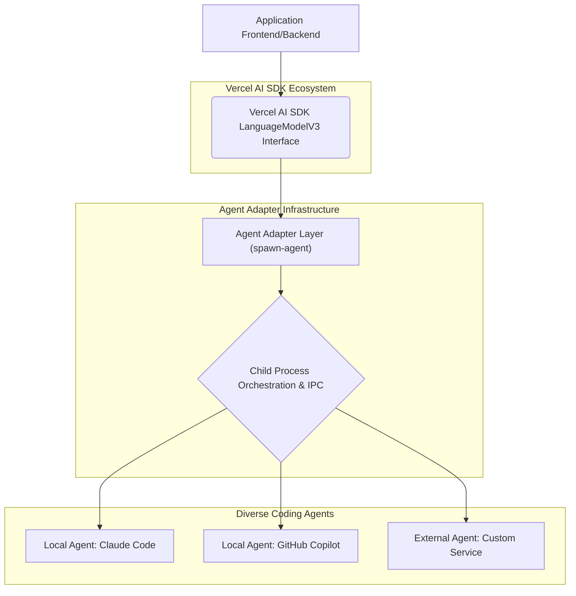

인공지능 코딩 에이전트의 급증은 개발 워크플로우 내에서 통합된 관리 계층의 필요성을 증대시키고 있습니다. 로컬 IDE에 내장된 GitHub Copilot, Cursor 같은 도구부터 Claude Code와 같은 외부 클라우드 기반 시스템에 이르기까지, 이질적인 에이전트들을 통합하는 것은 상당한 과제입니다. Vercel AI SDK는 주로 LLM 통합을 위해 설계되었지만, 강력한 `LanguageModelV3` 인터페이스를 제공합니다. 이 인터페이스를 활용하여 다양한 코딩 에이전트를 캡슐화하는 어댑터 패턴은 `spawn-agent` 프로젝트에서 잘 드러나듯이, 모듈성과 확장성을 위한 강력한 솔루션을 제공합니다.

## 핵심 개념: Vercel AI SDK와 에이전트 어댑터 패턴

`spawn-agent`와 같은 프로젝트는 사용자의 컴퓨터에 이미 설치된 여러 코딩 에이전트(예: Claude Code, Cursor, GitHub Copilot, Gemini CLI)를 Vercel AI SDK의 `LanguageModelV3` 인터페이스 뒤에 추상화하는 어댑터 라이브러리 역할을 합니다. `LanguageModelV3` 인터페이스는 `doGenerate`, `doStream`, `doStreamTools`와 같은 표준화된 메서드를 제공하여 다양한 AI 모델과의 일관된 상호작용을 가능하게 합니다. 이 어댑터 패턴은 이 인터페이스를 활용하여 로컬 또는 외부 에이전트와의 통신을 표준화하는 데 중점을 둡니다. 이를 통해 애플리케이션 개발자는 특정 에이전트의 구현 세부 사항에 얽매이지 않고, Vercel AI SDK를 사용하는 것처럼 코딩 에이전트와 상호작용할 수 있습니다.

### 아키텍처 및 동작 원리

어댑터는 각 코딩 에이전트를 별도의 자식 프로세스(child process)로 띄워 관리하는 방식을 채택합니다. 에이전트와의 통신은 공개된 `Agent...` 명세를 따르거나, 각 에이전트의 CLI/API를 래핑(wrapping)하여 이루어집니다. 이 자식 프로세스는 Vercel AI SDK의 `LanguageModelV3` 인터페이스를 구현하는 어댑터 클래스와 상호작용하며, 모든 통신을 추상화합니다.



## 실제 통합 예시

`spawn-agent`와 같은 어댑터를 Vercel AI SDK에 통합하는 과정은 매우 직관적입니다. 다음은 가상의 `spawnAgent` 함수를 사용하여 로컬에 설치된 Claude Code 에이전트를 `LanguageModelV3` 인스턴스처럼 사용하는 예시입니다. 특히, 현재 `playbook`이 Claude Code를 활용하고 있음을 고려할 때, 이러한 어댑터 패턴은 Claude Code 통합을 위한 유연하고 확장 가능한 방안을 제공합니다.

```typescript
import { createOpenAI } from '@ai-sdk/openai'; // Vercel AI SDK core
import { streamText } from 'ai'; // Vercel AI SDK stream utility
import { spawnAgent } from 'spawn-agent'; // Hypothetical spawn-agent library

// 1. Configure a specific local coding agent via the adapter
// The 'spawnAgent' function would abstract the complexities of
// launching a child process, managing its I/O, and conforming
// to the Vercel AI SDK's LanguageModelV3 interface.
const claudeCodeAgent = spawnAgent({
  agentName: 'claude-code',
  // Additional configuration might include:
  // cliPath: '/usr/local/bin/claude-code-cli',
  // environmentVariables: { CLAUDE_API_KEY: 'sk-...' },
  // enableLogging: true,
  // This object is highly simplified for illustration.
});

// 2. Treat the spawned agent as a standard LanguageModelV3 instance
const model = claudeCodeAgent;

async function generateCodeSuggestion(prompt: string) {
  console.log(`Generating suggestion using ${model.modelId || 'spawned agent'}...`);
  const result = await streamText({
    model: model,
    prompt: prompt,
    temperature: 0.7,
  });

  console.log('Streaming response from agent:');
  for await (const delta of result.fullStream) {
    if (delta.type === 'textDelta') {
      process.stdout.write(delta.text);
    }
  }
  console.log('\n--- Generation complete ---');
}

// Example usage:
// generateCodeSuggestion('Write a TypeScript function to debounce an event handler.');

// The 'model' variable now seamlessly represents the 'claude-code' agent,
// adhering to the Vercel AI SDK's LanguageModelV3 interface, allowing for
// consistent interaction regardless of the underlying agent's implementation.
```

이 예시에서 `spawnAgent` 함수는 실제 Claude Code CLI 실행, 입력 전달, 출력 파싱과 같은 복잡한 과정을 추상화합니다. 개발자는 단순히 `model` 객체를 Vercel AI SDK의 다른 LLM 모델처럼 사용하여 에이전트의 기능을 활용할 수 있습니다. 이는 에이전트 전환 및 확장의 유연성을 크게 향상시킵니다.

## 확장성 및 2026년 트렌드 반영

2026년에는 AI 에이전트 생태계가 더욱 파편화되고 전문화될 것으로 예상됩니다. 멀티모달 에이전트, 특정 도메인에 최적화된 에이전트, 온디바이스 에이전트 등이 폭넓게 등장할 것입니다. 이러한 어댑터 패턴은 새로운 에이전트가 등장하더라도 기존 시스템을 최소한으로 변경하면서 통합할 수 있는 탁월한 유연성을 제공합니다. 이는 클라우드 기반과 로컬 기반의 하이브리드 에이전트 워크로드 관리의 핵심적인 요소가 될 것입니다. 개발팀은 이 접근 방식을 통해 최신 에이전트 기술을 빠르게 도입하고 실험할 수 있으며, 특정 에이전트 벤더에 대한 종속성을 줄일 수 있습니다.

## 트레이드오프

### Unified API & Modularity
*   **언제 좋은가**: 다양한 LLM 및 에이전트 제공업체를 유연하게 전환해야 할 때, 또는 내부적으로 여러 커스텀 에이전트를 개발하고 표준화된 인터페이스로 노출해야 할 때 유리합니다. 코드 베이스의 복잡성을 줄이고 유지보수성을 향상시킵니다.
*   **언제 나쁜가**: 특정 에이전트의 고유한 고급 기능(예: 특정 툴 사용 방식, 디버깅 후크)을 최대한 활용해야 할 때, 어댑터가 해당 기능을 완전히 노출하지 못하면 오히려 제약이 될 수 있습니다.

### Leveraging Existing Local Tools
*   **언제 좋은가**: 개발자의 로컬 환경에 이미 설치된 강력한 코딩 도구(e.g., Cursor, GitHub Copilot CLI, Gemini CLI)를 AI 애플리케이션에 통합하여 개발자 경험을 향상시키고, 클라우드 비용을 절감하고자 할 때 매우 효과적입니다.
*   **언제 나쁜가**: 로컬 환경 설정의 이기종성(heterogeneity)이 크거나, 각 에이전트의 CLI/API 버전 관리가 어렵고 안정성이 보장되지 않는 환경에서는 배포 및 관리의 복잡성이 증가합니다.

### Performance Overhead
*   **언제 좋은가**: 에이전트 호출이 실시간 사용자 인터랙션의 극도로 낮은 지연 시간 요구사항을 가지지 않거나, 배치 처리와 같이 지연 시간 민감도가 낮은 작업에 사용할 때 허용 가능한 오버헤드입니다. 자식 프로세스 생성 및 IPC(Inter-Process Communication) 비용은 무시할 수 있습니다.
*   **언제 나쁜가**: 극도의 실시간 응답이 필요한 애플리케이션에서 자식 프로세스 생성 및 IPC로 인한 지연 시간은 사용자 경험을 저해할 수 있습니다. 이 경우, 직접 통합 또는 더 경량화된 통합 방식이 필요할 수 있습니다.

### Security Implications
*   **언제 좋은가**: 로컬 환경에서 개발자 통제 하에 제한된 신뢰할 수 있는 에이전트만 실행하는 경우, 클라우드 기반 에이전트 사용 시 발생할 수 있는 데이터 유출 위험을 줄일 수 있습니다. 민감한 코드나 데이터가 로컬 환경을 벗어나지 않도록 할 수 있습니다.
*   **언제 나쁜가**: 외부 사용자가 에이전트를 제어하거나, 신뢰할 수 없는 에이전트를 실행할 수 있는 시스템에서는 잠재적인 보안 취약점(코드 실행, 파일 시스템 접근 등)이 발생할 수 있으므로 강력한 샌드박싱 및 권한 관리가 필수적입니다.

### Complexity of Agent Management
*   **언제 좋은가**: 다양한 에이전트의 라이프사이클(설치, 업데이트, 설정)을 중앙에서 관리하고 일관된 로깅, 모니터링 체계를 구축하고자 할 때 유리합니다. 에이전트의 종류가 많아질수록 단일 인터페이스의 이점이 커집니다.
*   **언제 나쁜가**: 소수의 에이전트만 사용하거나, 각 에이전트의 기능이 매우 특수하여 공통 인터페이스로 묶는 것이 비효율적인 경우에는 초기 설정 및 유지보수 비용이 과도하게 느껴질 수 있습니다.

## 실전 체크리스트

- [ ] 통합하려는 각 로컬/외부 코딩 에이전트의 `spawn-agent` 호환성 및 안정성을 검증했는가? (특히 Claude Code와 같은 핵심 에이전트)
- [ ] 자식 프로세스로 실행되는 에이전트의 CPU, 메모리 사용량 등 리소스 오버헤드를 측정하고, 프로덕션 환경에서의 성능 SLA를 만족하는지 확인했는가?
- [ ] 에이전트별 오류 처리, 타임아웃, 재시도 로직이 `LanguageModelV3` 인터페이스를 통해 일관되게 처리되도록 구현했는가?
- [ ] 로컬 에이전트 실행 시 발생할 수 있는 보안 취약점(예: 임의 코드 실행, 파일 시스템 접근)에 대한 샌드박싱 또는 격리 전략을 수립하고 적용했는가?
- [ ] 여러 에이전트 간의 전환 및 라우팅 로직(예: 특정 컨텍스트에 따라 최적 에이전트 선택)을 명확하게 정의하고 구현했는가?
- [ ] `spawn-agent`와 Vercel AI SDK 버전 관리가 프로덕션 환경에서 안정적으로 유지될 수 있도록 의존성 전략을 수립했는가?
- [ ] 에이전트 실행 로그 및 응답을 중앙 집중식으로 수집하고 모니터링하는 시스템을 구축하여 에이전트의 동작을 추적할 수 있는가?