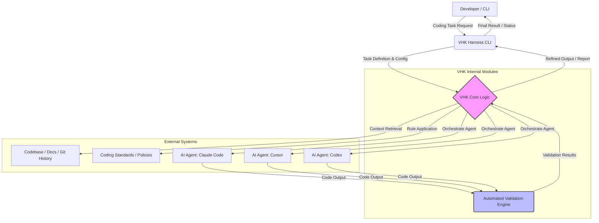

AI 코딩 에이전트와 LLM의 발전은 개발 워크플로우를 혁신하고 있지만, 모델 또는 에이전트를 교체할 때마다 발생하는 일관성 부족, 컨텍스트 유실, 그리고 생성된 코드의 낮은 신뢰성(예: 테스트 미통과)은 생산성을 저해하는 주요 요소입니다. VHK(Vibe Coding Harness)는 이러한 문제를 해결하고, AI 코딩 프로세스를 견고하게 만드는 풀사이클 하네스 솔루션의 설계 원리를 제공합니다. 이 엔트리는 VHK의 핵심 개념과 실제 적용 방안을 분석하여, 변화하는 AI 환경 속에서도 지속 가능한 개발 시스템 구축에 기여합니다. 2026년 현재, 이러한 '하네스' 접근 방식은 다양한 LLM과 에이전트가 공존하는 복잡한 개발 생태계에서 필수적인 인프라로 자리 잡고 있습니다. 특히, 멀티모달(multimodal) 에이전트의 등장과 자체 학습(self-learning) 에이전트의 발전은 더욱 견고한 컨텍스트 관리 및 결과 검증 시스템을 요구하고 있습니다.

## VHK의 핵심 설계 원리

VHK는 다음과 같은 핵심 원칙을 기반으로 AI 코딩 환경의 안정성과 확장성을 확보합니다.

### 1. 모델/에이전트 Agnostic 디자인
VHK의 가장 중요한 특징은 특정 LLM이나 코딩 에이전트에 종속되지 않는 아키텍처입니다. 이는 개발자가 최신 또는 특정 태스크에 최적화된 에이전트를 자유롭게 선택하고 전환할 수 있도록 합니다. 모델별 API 호출 방식, 입력/출력 형식, 도구 사용(tool use) 패턴의 차이를 추상화하여, 하네스 레벨에서 통합된 인터페이스를 제공합니다.

### 2. 중앙 집중식 컨텍스트 및 규칙 관리
AI 에이전트의 성능은 주어진 컨텍스트의 품질과 명확한 규칙 정의에 크게 의존합니다. VHK는 코드베이스, 문서, 기존 대화 이력 등을 포함하는 컨텍스트를 중앙에서 관리하고, 코딩 표준, 아키텍처 가이드라인, 보안 정책 등의 규칙을 통합적으로 적용합니다. 이는 에이전트가 태스크를 수행하는 동안 일관된 정보를 바탕으로 작업하도록 보장하며, 컨텍스트 드리프트(context drift)를 방지합니다.

### 3. 자동화된 검증 및 피드백 루프
에이전트가 생성한 코드가 '완료'되었다고 보고하더라도 실제 작동하지 않는 경우가 빈번합니다. VHK는 단위 테스트 실행, 린팅(linting), 정적 분석(static analysis) 등 다양한 자동화된 검증 단계를 통합합니다. 이 검증 결과를 바탕으로 에이전트에 직접적인 피드백을 제공하여, 자가 수정(self-correction) 메커니즘을 강화하고 코드 품질을 향상시킵니다.

## VHK 아키텍처 개요

다음 Mermaid 다이어그램은 VHK가 개발자, AI 에이전트, 그리고 코드베이스 사이에서 어떻게 작동하는지 보여줍니다. VHK는 개발자의 요청을 받아 컨텍스트를 구성하고, 최적의 에이전트를 오케스트레이션하며, 결과물을 검증하는 일련의 과정을 자동화합니다.



## VHK 활용 예시

VHK는 `vhk.yaml`과 같은 설정 파일을 통해 태스크, 에이전트, 규칙, 그리고 검증 단계를 정의합니다. 이를 통해 개발자는 복잡한 AI 코딩 워크플로우를 간결하게 명세하고 실행할 수 있습니다.

```yaml
# vhk-config.yaml

agents:
  claude-opus:
    model: anthropic/claude-3-opus-20240229
    temperature: 0.7
    max_tokens: 4000
  gpt-4o:
    model: openai/gpt-4o
    temperature: 0.5
    max_tokens: 3500

tasks:
  implement-user-auth-flow:
    description: "사용자 인증 흐름을 구현합니다. src/auth/ 디렉토리에 새로운 파일 추가."
    default_agent: claude-opus # 기본 에이전트
    rules:
      - "Flask Blueprints 아키텍처 패턴을 따릅니다."
      - "SQLAlchemy ORM을 사용하여 데이터베이스 작업을 수행합니다."
      - "모든 엔드포인트에 인증 미들웨어를 적용합니다."
    context_files:
      - src/app.py
      - src/models.py
      - requirements.txt
      - docs/architecture/auth_design.md

validation_steps:
  - name: "Run Unit Tests"
    command: "pytest tests/auth/"
    expected_output_regex: ".*== [0-9]+ passed in.*"
  - name: "Code Linting"
    command: "flake8 src/auth/"
    expected_exit_code: 0
  - name: "API Endpoint Test"
    command: "curl -X POST -H 'Content-Type: application/json' -d '{"username": "test", "password": "pass"}' http://localhost:5000/api/register"
    expected_output_regex: ".*"status": "success".*"
```

위 설정 파일을 사용하면 CLI를 통해 다음과 같이 태스크를 실행할 수 있습니다:

```bash
vhk run implement-user-auth-flow --agent gpt-4o
```

이 명령어는 `gpt-4o` 에이전트를 사용하여 `implement-user-auth-flow` 태스크를 수행하도록 VHK에 지시합니다. VHK는 정의된 컨텍스트 파일들을 에이전트에 전달하고, 생성된 코드를 `validation_steps`에 따라 자동으로 검증합니다. 실패 시에는 에이전트에 피드백을 주어 수정을 요청하거나, 개발자에게 상세한 보고서를 제공합니다.

## 트레이드오프

AI 코딩 하네스 VHK와 같은 시스템을 도입할 때는 다음과 같은 트레이드오프를 고려해야 합니다.

*   **초기 설정 복잡성 vs. 장기적 안정성:** VHK를 통한 컨텍스트 및 규칙 관리는 초기에 설정 오버헤드를 발생시킵니다. 언제 좋은가: 프로젝트 초기에 명확한 가이드라인과 모델 독립적인 워크플로우가 필요한 대규모 프로젝트 또는 여러 LLM을 전환하며 사용해야 하는 경우에 좋습니다. 언제 나쁜가: 간단한 스크립트 작성이나 단일 LLM만 사용하는 소규모 프로젝트에는 과도한 복잡성을 초래할 수 있습니다.
*   **유연성 vs. 통제력:** VHK는 에이전트 전환의 유연성을 제공하지만, 엄격한 규칙과 검증 절차는 에 에이전트의 창의적인 탐색을 제한할 수 있습니다. 언제 좋은가: 프로덕션 코드 생성, 보안에 민감한 영역, 또는 특정 코딩 표준 준수가 필수적인 경우 통제력이 중요합니다. 언제 나쁜가: 아이디어 탐색, 프로토타이핑, 또는 창의적인 문제 해결이 중요한 연구 개발 단계에서는 유연성 제약이 단점으로 작용할 수 있습니다.
*   **성능 오버헤드 vs. 신뢰성:** 자동화된 검증 단계는 추가적인 컴퓨팅 자원과 시간을 요구하여 전반적인 코딩 속도를 저하시킬 수 있습니다. 언제 좋은가: 버그 발생 시 큰 비용이 들거나, 수동 검증의 비효율성이 높은 중요한 시스템에서는 신뢰성 확보가 최우선입니다. 언제 나쁜가: 빠른 피드백과 빠른 개발 속도가 중요한 초기 단계에서는 검증 오버헤드가 병목이 될 수 있습니다.
*   **컨텍스트 관리 자동화 vs. 명시적 제어:** VHK의 자동 컨텍스트 관리는 개발자의 수고를 덜어주지만, 때로는 개발자가 원하는 특정 컨텍스트를 에이전트가 놓치거나 잘못 해석할 위험도 있습니다. 언제 좋은가: 반복적이고 정형화된 컨텍스트가 많은 태스크에서는 자동화가 효율적입니다. 언제 나쁜가: 매우 미묘하거나 암묵적인 지식이 필요한 복잡한 문제를 해결할 때는 개발자가 컨텍스트를 직접 명시적으로 제어하는 것이 더 효과적일 수 있습니다.

## 실전 체크리스트

VHK와 같은 AI 코딩 하네스 시스템을 프로젝트에 적용할 때 다음 체크리스트를 활용하여 견고성을 확보할 수 있습니다.

*   [ ] **컨텍스트 정의 명확성:** `vhk.yaml` 또는 유사한 설정 파일에서 `context_files`에 포함된 파일들이 에이전트가 태스크를 완료하는 데 필요한 모든 관련 정보를 충분히 제공하는지 확인합니다.
*   [ ] **규칙 집합의 완전성:** 코딩 표준, 아키텍처 가이드라인, 보안 정책 등 에이전트가 준수해야 할 모든 규칙이 명시적으로 정의되어 있고, 충돌 없이 일관되게 적용되는지 검토합니다.
*   [ ] **검증 단계의 포괄성:** 단위 테스트, 통합 테스트, 린팅, 정적 분석, 보안 스캔 등 에이전트가 생성한 코드의 신뢰성과 품질을 보장하기 위한 최소 3개 이상의 자동화된 검증 단계가 포함되어 있는지 확인합니다.
*   [ ] **에이전트 전환 테스트:** 동일한 태스크를 서로 다른 LLM 또는 에이전트로 수행했을 때, 결과물의 품질과 검증 통과율이 일관성을 유지하는지 주기적으로 테스트합니다.
*   [ ] **피드백 루프의 효율성:** 검증 실패 시 에이전트에게 제공되는 피드백 메시지가 구체적이고 실행 가능하여, 에이전트가 스스로 오류를 수정할 수 있도록 돕는지 평가합니다.
*   [ ] **버전 관리 통합:** 하네스 설정 파일(예: `vhk-config.yaml`)이 코드베이스와 함께 버전 관리 시스템(Git)에 통합되어 변경 이력을 추적하고 협업을 지원하는지 확인합니다.
*   [ ] **성능 및 비용 모니터링:** 각 에이전트의 태스크 수행 시간, 토큰 사용량, API 비용 등을 모니터링하여 최적의 에이전트 선택 및 비용 효율성을 지속적으로 관리하는 시스템을 구축합니다.