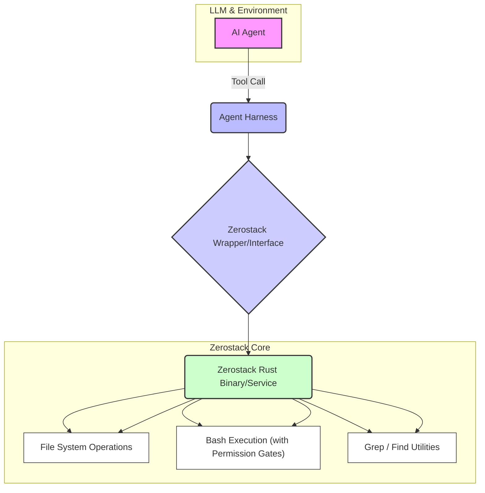

AI 에이전트의 코드 상호작용 능력은 그 유용성을 결정하는 핵심 요소입니다. 특히 복잡한 개발 작업을 수행하는 에이전트에게는 안전하고 효율적인 파일 시스템 접근 및 코드 실행 능력이 필수적입니다. Zerostack은 순수 Rust로 작성된 Unix-inspired 코딩 에이전트로, 이러한 요구사항을 충족하며 AI 에이전트 하네스의 기능을 확장할 수 있는 강력한 잠재력을 제공합니다.

## Zerostack 개요 및 핵심 기능
Zerostack은 약 7천 라인의 순수 Rust 코드로 구현된 경량 코딩 에이전트입니다. 파일 읽기·쓰기·편집, `grep`, 파일 검색, 디렉터리 목록 (`ls`와 유사), 그리고 권한 게이트가 적용된 Bash 실행 등 Unix 명령줄 도구에서 영감을 받은 기능을 제공합니다. 이는 LLM이 코드베이스와 상호작용하고, 환경을 탐색하며, 필요한 변경 사항을 적용하는 데 필요한 기본적인 빌딩 블록을 제공합니다. 여러 LLM 제공자와 사용자 지정 제공자를 함께 지원하는 유연한 구조를 가지고 있습니다.

## AI 에이전트 하네스 통합 전략
Zerostack의 기능을 기존 AI 에이전트 하네스, 특히 Claude Code 하네스 내부에 통합하는 방식은 크게 두 가지로 나눌 수 있습니다.

### 외부 도구 통합
Zerostack을 독립적인 실행 파일 또는 서비스로 배포하고, 하네스에서 이를 외부 도구로 호출하는 방식입니다. 에이전트의 프롬프트에서 Zerostack이 제공하는 특정 API 또는 CLI 명령을 호출하는 형태로 설계할 수 있습니다. 이는 하네스의 복잡성을 낮추고, Zerostack의 독립적인 업데이트 및 배포를 가능하게 합니다.

### 설계 패턴 내부 적용
Zerostack의 Unix-inspired 제어 메커니즘과 Rust 기반의 효율적인 구현 패턴을 Claude Code 하네스 내부에 직접 적용하는 방식입니다. 예를 들어, 파일 시스템 조작 로직을 Rust로 재작성하거나, 권한 게이트가 적용된 `bash` 실행기 컴포넌트를 하네스 내부에 내장하는 것입니다. 이 방식은 더 깊은 통합과 최적화를 가능하게 하지만, 초기 개발 비용이 더 높습니다.

통합의 핵심은 에이전트가 코드베이스에 대해 안전하고 정밀하게 작업을 수행할 수 있도록 하는 것입니다. Zerostack의 권한 게이트는 에이전트가 시스템에 미칠 수 있는 잠재적 위험을 완화하는 데 중요한 역할을 합니다.

## Mermaid 다이어그램: Zerostack 통합 아키텍처


## 코드 예시: Zerostack Wrapper (Python Pseudo-code)
Zerostack의 기능을 하네스에서 호출하는 간단한 Python 래퍼 예시는 다음과 같습니다. 실제 구현에서는 Zerostack의 CLI 인터페이스를 `subprocess` 모듈로 호출하거나, REST API 형태로 제공된다면 `requests` 라이브러리를 사용할 수 있습니다.

```python
import subprocess
import json

class ZerostackAgentTool:
    def __init__(self, zerostack_path="/usr/local/bin/zerostack"):
        self.zerostack_path = zerostack_path

    def _run_command(self, command_args):
        try:
            # Zerostack CLI 호출 예시: zerostack <command> [args...]
            # 여기서는 json 출력을 가정
            result = subprocess.run(
                [self.zerostack_path] + command_args,
                capture_output=True,
                text=True,
                check=True
            )
            return json.loads(result.stdout)
        except subprocess.CalledProcessError as e:
            print(f"Error executing Zerostack: {e.stderr}")
            raise
        except json.JSONDecodeError:
            print(f"Invalid JSON output: {result.stdout}")
            return {"error": "Invalid JSON output", "raw_output": result.stdout}

    def read_file(self, path):
        """파일 내용을 읽습니다."""
        return self._run_command(["read", path])

    def write_file(self, path, content):
        """파일에 내용을 씁니다."""
        return self._run_command(["write", path, "--content", content])

    def list_directory(self, path="."):
        """디렉터리 내용을 나열합니다."""
        return self._run_command(["ls", path])

    def grep_file(self, path, pattern):
        """파일에서 패턴을 검색합니다."""
        return self._run_command(["grep", path, "--pattern", pattern])

    def execute_bash(self, command, require_confirmation=True):
        """권한 게이트를 통해 Bash 명령을 실행합니다."""
        args = ["bash", "--command", command]
        if require_confirmation:
            args.append("--confirm") # Zerostack이 사용자 확인을 요청하는 플래그
        return self._run_command(args)

# 예시 사용
# tool = ZerostackAgentTool()
# try:
#     file_content = tool.read_file("src/main.rs")
#     print(f"File content: {file_content['data']}")
#
#     dir_list = tool.list_directory(".")
#     print(f"Directory contents: {dir_list['files']}")
#
#     grep_results = tool.grep_file("src/lib.rs", "fn main")
#     print(f"Grep results: {grep_results['matches']}")
#
#     # 위험한 명령 실행 시 사용자 확인 필요
#     # tool.execute_bash("rm -rf /tmp/test", require_confirmation=True)
#
# except Exception as e:
#     print(f"Operation failed: {e}")
```
이러한 래퍼를 통해 AI 에이전트는 복잡한 파일 시스템 및 셸 작업을 안전하고 효율적으로 수행할 수 있게 됩니다.

## 2026년 에이전트 트렌드와 Zerostack
2026년 AI 에이전트 개발은 효율성, 안정성, 그리고 다중 LLM/도구 통합에 초점을 맞추고 있습니다. Zerostack과 같은 Rust 기반 유틸리티는 다음 트렌드에 부합합니다.

*   **성능 최적화**: Rust의 런타임 성능은 에이전트가 대규모 코드베이스를 빠르게 처리하고 복잡한 작업을 수행할 때 병목 현상을 줄입니다.
*   **보안 강화**: Unix-inspired 권한 게이트와 같은 제어 메커니즘은 에이전트가 시스템에 가할 수 있는 잠재적 위험을 최소화하여, 프로덕션 환경에서의 안전한 배포를 가능하게 합니다.
*   **범용 도구 통합**: 다양한 LLM 제공자 및 사용자 지정 도구를 지원하는 Zerostack의 유연성은 이기종 환경에서 에이전트를 개발하고 배포하는 데 필수적입니다.
*   **자율성 및 제어의 균형**: 에이전트의 자율성을 높이면서도 개발자가 그 활동을 명확하게 이해하고 제어할 수 있는 메커니즘을 제공합니다.

## 트레이드오프
*   **성능 및 안전성 강화 vs. 초기 통합 복잡성**:
    *   **언제 좋은가**: Rust 기반 Zerostack은 뛰어난 성능과 내장된 보안 기능 (권한 게이트)을 통해 에이전트의 코드 상호작용 능력을 크게 향상시킵니다. 프로덕션 환경에서 고성능과 높은 신뢰성이 요구될 때 이상적입니다.
    *   **언제 나쁜가**: Zerostack을 기존 하네스에 통합하는 과정에서 Rust 바이너리 관리, 프로세스 간 통신 (IPC) 설정, 권한 관리 로직 구현 등 초기 설정 및 개발 복잡성이 발생할 수 있습니다. 소규모 프로젝트나 간단한 스크립트 기반 에이전트에는 과도한 오버헤드가 될 수 있습니다.
*   **Unix 철학 기반의 강력한 기능 vs. 학습 곡선 및 환경 의존성**:
    *   **언제 좋은가**: 파일 I/O, `grep`, `bash` 실행 등 강력하고 세분화된 Unix 명령줄 기능을 제공하여 에이전트가 광범위한 코드 조작 및 시스템 상호작용을 수행할 수 있도록 합니다. Unix 환경에 익숙한 개발자에게는 매우 직관적입니다.
    *   **언제 나쁜가**: Zerostack의 Unix-inspired 디자인은 Windows 환경과 같은 다른 운영체제에서는 추가적인 호환성 레이어가 필요할 수 있습니다. 또한, 이러한 특정 유틸리티 사용법에 대한 학습이 필요할 수 있어, 개발 팀의 숙련도에 따라 초기 생산성에 영향을 미칠 수 있습니다.
*   **경량화된 아키텍처 vs. 특정 기능에 집중**:
    *   **언제 좋은가**: 약 7천 LoC의 최소형 코딩 에이전트로서, 불필요한 기능 없이 핵심적인 파일 및 코드 상호작용에 집중하여 경량성을 유지합니다. 리소스 제약이 있는 환경이나 특정 기능에 최적화된 에이전트 개발에 유리합니다.
    *   **언제 나쁜가**: Zerostack은 범용적인 복잡한 작업 흐름 관리나 고급 AI 추론 기능 자체를 제공하지 않습니다. 따라서 엔드-투-엔드 에이전트 시스템을 구축하기 위해서는 별도의 오케스트레이션 레이어나 LLM 추론 엔진과의 통합 작업이 필수적입니다.

## 실전 체크리스트
*   - [ ] Zerostack 래퍼 모듈 (예: Python, TypeScript)의 설계 및 구현이 완료되었는가?
*   - [ ] 파일 읽기/쓰기/편집, `grep`, 디렉터리 목록, Bash 실행 등 핵심 Zerostack 기능별 권한 게이트 설정 및 보안 테스트가 완료되었는가?
*   - [ ] 에이전트의 Zerostack 기능 호출에 대한 로깅 및 모니터링 시스템이 구축되어, 비정상적인 활동을 감지할 수 있는가?
*   - [ ] Zerostack Rust 바이너리의 빌드, 테스트, 배포 자동화 파이프라인 (CI/CD)이 존재하며 안정적으로 동작하는가?
*   - [ ] Zerostack 통합으로 인한 에이전트의 코드 상호작용 성능 병목 지점이 식별되었으며, 최적화 방안이 마련되었는가?
*   - [ ] Zerostack 사용 시 발생할 수 있는 잠재적 시스템 보안 취약점 (예: Bash 명령 인젝션)에 대한 점검과 완화 계획이 수립되었는가?
*   - [ ] 에이전트가 Zerostack을 통해 생성하거나 수정한 파일의 무결성 검증 (예: 해시 체크, 형식 유효성 검사) 절차가 포함되어 있는가?