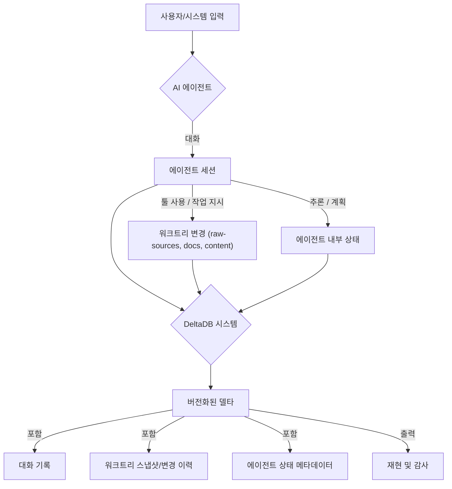

## 기존 버전 관리 시스템의 한계와 DeltaDB의 필요성
Git과 같은 기존 버전 관리 시스템은 코드의 개별 커밋 중심으로 설계되어, AI 에이전트의 연속적인 대화 흐름과 이에 따른 워크트리 변경을 함께 추적하고 관리하는 데 한계를 가진다. 에이전트가 생성하는 산출물은 단순 코드 변경을 넘어 대화의 맥락, 중간 사고 과정, 그리고 다수의 파일 변경이 복합적으로 얽혀 발생한다. 이러한 복합적인 변화를 효과적으로 버전 관리하기 위해 DeltaDB 개념을 도입하여 AI 에이전트 산출물 관리의 고도화를 탐색한다. DeltaDB는 에이전트와의 대화와 워크트리 변경을 하나의 논리적 단위로 묶어 버전 관리함으로써, 에이전트의 작업 흐름에 대한 투명성과 재현성을 획기적으로 향상시킨다.

### DeltaDB 개념의 AI 에이전트 워크플로우 적용
DeltaDB의 핵심은 '커밋'을 코드 변경뿐 아니라 에이전트의 '대화'와 '워크트리' 상태 변화를 포함하는 포괄적인 '델타(Delta)'로 확장하는 것이다. AI 에이전트 워크플로우에 DeltaDB 개념을 적용하면 다음과 같은 이점을 얻을 수 있다.

*   **대화 이력 통합 버전 관리**: 에이전트에게 전달된 프롬프트, 에이전트의 응답, 내부 추론 과정(thought process), 사용된 툴 호출 내역 등 모든 대화 요소를 워크트리 변경과 함께 버전 관리한다. 이는 특정 산출물이 도출된 전체 맥락을 온전히 재현하는 데 필수적이다.
*   **워크트리 변경 추적**: `raw-sources/`, `docs/solutions/`, `content/` 등 에이전트가 생성하거나 수정한 모든 파일의 변화를 세밀하게 기록한다. 단순한 파일 내용 변경뿐만 아니라 파일 생성, 삭제, 이동까지 델타에 포함하여 관리한다.
*   **Karpathy LLM Wiki 패턴 통합**: Karpathy의 LLM Wiki 패턴은 LLM이 지식을 생성하고 업데이트하는 프로세스를 정의한다. DeltaDB는 이 패턴에서 에이전트가 기존 문서를 분석하고, 수정 제안을 생성하며, 최종적으로 문서를 업데이트하는 전 과정을 대화와 함께 하나의 델타로 캡슐화한다. 이를 통해 '왜', '어떻게' 문서가 변경되었는지 명확한 이력을 확보한다.



### LLM 출력 검증 파이프라인 고도화
DeltaDB를 활용하면 LLM 출력 검증 파이프라인의 견고성을 크게 향상시킬 수 있다.
*   **재현 가능한 검증**: 특정 검증 실패가 발생했을 때, 해당 산출물을 생성한 에이전트의 전체 대화 이력, 사용된 툴, 워크트리 상태를 정확히 복원하여 문제의 원인을 심층 분석할 수 있다. 이는 단순한 코드 스냅샷으로는 불가능한 수준의 디버깅 능력을 제공한다.
*   **회귀 테스트 강화**: 에이전트 모델 업데이트 시, 과거 성공적으로 검증된 델타들을 기준으로 회귀 테스트를 수행하여 변경 사항이 의도치 않은 부작용을 일으키지 않았는지 확인할 수 있다.
*   **산출물 품질 추적**: 각 델타에 검증 결과를 메타데이터로 첨부하여 시간이 지남에 따른 에이전트 산출물의 품질 변화를 체계적으로 추적하고 분석할 수 있다.

### 코드 예시: 에이전트 델타 관리 (개념적 Python)
```python
import hashlib
import json
import time

class AgentDelta:
    def __init__(self, session_id: str, timestamp: float, agent_dialogue: list, worktree_changes: dict, metadata: dict = None):
        self.session_id = session_id
        self.timestamp = timestamp
        self.agent_dialogue = agent_dialogue  # List of {role, content, tool_calls, tool_outputs}
        self.worktree_changes = worktree_changes  # Dict of {file_path: {before: hash, after: hash, diff: str}}
        self.metadata = metadata if metadata is not None else {}
        self.delta_id = self._generate_delta_id()

    def _generate_delta_id(self) -> str:
        # A simple hash of key components to uniquely identify this delta
        hash_input = json.dumps({
            "session_id": self.session_id,
            "timestamp": self.timestamp,
            "dialogue_hash": hashlib.sha256(json.dumps(self.agent_dialogue).encode()).hexdigest(),
            "worktree_hash": hashlib.sha256(json.dumps(self.worktree_changes).encode()).hexdigest()
        }, sort_keys=True).encode()
        return hashlib.sha256(hash_input).hexdigest()

    def to_json(self) -> str:
        return json.dumps({
            "delta_id": self.delta_id,
            "session_id": self.session_id,
            "timestamp": self.timestamp,
            "agent_dialogue": self.agent_dialogue,
            "worktree_changes": self.worktree_changes,
            "metadata": self.metadata
        }, indent=2, ensure_ascii=False)

class DeltaDBManager:
    def __init__(self, storage_path="deltadb_repo/"):
        self.storage_path = storage_path
        import os
        os.makedirs(storage_path, exist_ok=True)

    def save_delta(self, delta: AgentDelta):
        file_path = os.path.join(self.storage_path, f"{delta.delta_id}.json")
        with open(file_path, "w", encoding="utf-8") as f:
            f.write(delta.to_json())
        print(f"Delta {delta.delta_id} saved.")

    def load_delta(self, delta_id: str) -> AgentDelta:
        file_path = os.path.join(self.storage_path, f"{delta_id}.json")
        with open(file_path, "r", encoding="utf-8") as f:
            data = json.load(f)
        return AgentDelta(
            session_id=data["session_id"],
            timestamp=data["timestamp"],
            agent_dialogue=data["agent_dialogue"],
            worktree_changes=data["worktree_changes"],
            metadata=data["metadata"]
        )

# --- Usage Example ---
if __name__ == "__main__":
    db_manager = DeltaDBManager()

    # Simulate an agent's work
    dialogue_1 = [{"role": "user", "content": "새로운 기능 명세 초안 작성"}, {"role": "agent", "content": "초안 작성 중입니다..."}]
    worktree_1 = {"docs/feature-a.md": {"before": "", "after": "hash1", "diff": "initial content for feature A"}}
    delta_1 = AgentDelta("session-001", time.time(), dialogue_1, worktree_1, {"status": "draft"})
    db_manager.save_delta(delta_1)

    dialogue_2 = dialogue_1 + [{"role": "user", "content": "코드 예시 추가해주세요"}, {"role": "agent", "content": "코드 예시 반영 완료"}]
    worktree_2 = {"docs/feature-a.md": {"before": "hash1", "after": "hash2", "diff": "added code block"}}
    worktree_2["raw-sources/feature-a.py"] = {"before": "", "after": "hash-code-1", "diff": "initial code for feature A"}
    delta_2 = AgentDelta("session-001", time.time(), dialogue_2, worktree_2, {"status": "review_ready"})
    db_manager.save_delta(delta_2)

    # Later, load and inspect a delta
    loaded_delta = db_manager.load_delta(delta_2.delta_id)
    print("\nLoaded Delta:")
    print(loaded_delta.to_json())
```

### 2026년 최신 트렌드 반영
2026년 AI 에이전트 개발은 단순히 최종 산출물을 넘어, 에이전트의 의사결정 과정과 상태 변화에 대한 투명성, 감사 가능성(Auditability), 그리고 안정적인 재현성(Reproducibility)을 핵심 요구사항으로 발전하고 있다. 특히 복잡한 멀티-에이전트 시스템이나 자율 에이전트의 경우, 단일 커밋으로는 설명할 수 없는 '의도-실행-결과'의 연결 고리를 파악하는 것이 중요해졌다. DeltaDB 개념은 이러한 트렌드에 발맞춰 에이전트의 '생각의 흔적'과 '행동의 결과'를 통합적으로 관리하는 새로운 표준을 제시하며, AI 에이전트 시스템의 신뢰성과 디버깅 효율을 극대화한다. 이는 LLM 옵스(LLM Ops) 파이프라인의 핵심 구성 요소로 자리매김할 것이다.

## 트레이드오프

*   **향상된 투명성 및 재현성 vs. 스토리지 및 관리 복잡성 증가**: 
    *   **언제 좋고**: 에이전트의 행동을 완벽하게 이해하고 디버깅하며, 특정 산출물이 도출된 과정을 재현해야 할 때 매우 유리하다. 감사(auditing) 및 규제 준수(compliance)가 중요한 도메인에서 특히 유용하다.
    *   **언제 나쁜지**: 대규모 에이전트 시스템에서 모든 대화, 내부 상태, 워크트리 변경을 상세하게 기록할 경우, 데이터 저장 공간 요구사항과 관리 오버헤드가 급증할 수 있다. 저장 비용과 성능이 중요하며, 모든 과정의 투명성이 필수적이지 않은 단순 에이전트 작업에는 과도할 수 있다.
*   **세분화된 컨텍스트 보존 vs. 초기 통합 및 개발 비용**: 
    *   **언제 좋고**: 에이전트의 미묘한 동작 변화나 버그의 원인을 파악하기 위해 광범위하고 깊이 있는 컨텍스트가 필요할 때 탁월하다. 에이전트의 학습 및 개선 프로세스에 귀중한 데이터를 제공한다.
    *   **언제 나쁜지**: 기존 Git 기반의 워크플로우를 DeltaDB 개념으로 전환하고 새로운 시스템을 통합하는 데 상당한 개발 리소스와 시간이 소요될 수 있다. 특히 기존 CI/CD 파이프라인과의 연동 시 복잡성이 발생한다.
*   **견고한 검증 파이프라인 지원 vs. 시스템 설계의 복잡성**: 
    *   **언제 좋고**: LLM 출력의 정확성과 안정성을 보장해야 하는 미션 크리티컬한 애플리케이션에서 검증 파이프라인의 신뢰도를 극대화할 수 있다. 회귀 테스트 및 성능 모니터링에 강력한 기반을 제공한다.
    *   **언제 나쁜지**: 델타를 효과적으로 저장, 인덱싱하고 검색하는 시스템을 구축하는 것은 Git보다 훨씬 복잡한 데이터 모델과 인프라 요구사항을 수반한다. 분산 환경에서의 일관성 유지 등 기술적 난이도가 높다.

## 실전 체크리스트

*   [ ] **에이전트 대화 및 워크트리 변경 로깅 전략 정의**: 에이전트의 어떤 대화(프롬프트, 응답, 툴 호출, 내부 사고)와 어떤 워크트리 경로(`raw-sources/`, `docs/solutions/`, `content/`)의 변화를 델타에 포함할지 구체적인 스키마를 확정했는가?
*   [ ] **델타 스토리지 시스템 설계 및 구현**: 델타 데이터를 저장하고 검색할 수 있는 확장 가능한 백엔드 시스템(예: 객체 스토리지, NoSQL DB 등)을 선택하고 구축했는가? (Delta Lake, DVC 등 기존 솔루션 탐색)
*   [ ] **델타 생성 및 커밋 자동화 파이프라인**: 에이전트 작업 완료 또는 특정 마일스톤 도달 시 자동으로 델타를 생성하고 저장소에 커밋하는 CI/CD 통합 파이프라인을 구축했는가?
*   [ ] **델타 기반의 재현성 검증 환경 구축**: 특정 델타 ID를 기반으로 에이전트의 대화 이력과 워크트리 상태를 정확히 복원하여 디버깅 및 검증을 수행할 수 있는 환경을 마련했는가?
*   [ ] **LLM 출력 검증 파이프라인 연동**: 기존 LLM 출력 검증 파이프라인이 델타 스토리지에 저장된 대화 이력 및 워크트리 변경 스냅샷을 활용하여 보다 심층적인 검증을 수행하도록 개선했는가?
*   [ ] **메타데이터를 통한 델타 검색 및 분석**: 각 델타에 에이전트 ID, 태스크 유형, 검증 결과 등 유용한 메타데이터를 첨부하여 델타들을 효율적으로 검색하고 분석할 수 있는 기능을 구현했는가?
*   [ ] **성능 및 스토리지 비용 모니터링**: 델타 생성 및 저장 시스템의 성능 병목 현상과 스토리지 비용 증가를 지속적으로 모니터링하고 최적화 계획을 수립했는가?