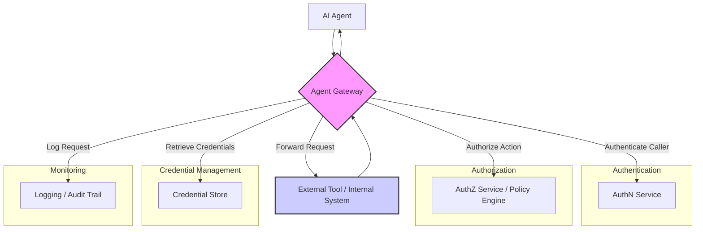

AI 에이전트가 외부 도구나 내부 시스템에 접근할 때 발생하는 보안 및 운영 복잡성을 관리하는 것은 필수적입니다. 다수의 에이전트가 각기 다른 인증, 권한, 자격 증명 요구사항을 가진 도구들과 상호작용할 때, 중앙 Agent Gateway는 이 과정을 표준화하고 집중화하여 보안 태세를 강화하고 운영 효율성을 증대시킵니다. 이는 LLM 기반 에이전트의 오작동 및 보안 위협으로부터 시스템을 보호하며, 컴플라이언스 및 감사 요구사항을 충족하는 핵심 인프라입니다.

## Agent Gateway 아키텍처

Agent Gateway는 모든 도구 호출의 단일 진입점(Single Point of Entry) 역할을 수행합니다. 에이전트의 요청은 게이트웨이를 거쳐 다음 핵심 단계를 수행합니다:

1.  **인증 (Authentication)**: 요청을 보낸 에이전트 또는 사용자 주체(principal)의 신원을 확인합니다. API 키, OAuth 토큰, 서비스 계정 자격 증명 등 다양한 인증 메커니즘을 지원해야 합니다.
2.  **권한 부여 (Authorization)**: 인증된 주체가 요청한 도구 및 작업에 대한 접근 권한이 있는지 확인합니다. RBAC (Role-Based Access Control) 또는 ABAC (Attribute-Based Access Control) 모델을 기반으로 세분화된 정책을 적용할 수 있습니다.
3.  **자격 증명 관리 (Credential Management)**: 도구 호출에 필요한 실제 자격 증명(예: 데이터베이스 비밀번호, 외부 API 키)을 게이트웨이가 안전하게 관리하고 주입합니다. 에이전트가 직접 민감한 정보를 알 필요가 없도록 설계합니다.
4.  **요청 로깅 및 감사 (Logging & Auditing)**: 모든 도구 호출 시도를 기록하고, 누가, 언제, 어떤 도구에, 어떤 작업을 수행했는지 상세한 감사 로그를 생성합니다. 이는 보안 사고 분석 및 컴플라이언스 준수에 필수적입니다.
5.  **접근 취소 (Access Revocation)**: 특정 에이전트 또는 도구에 대한 접근 권한을 신속하게 취소할 수 있는 중앙 집중식 메커니즘을 제공합니다.

아래 Mermaid 다이어그램은 Agent Gateway의 일반적인 요청 흐름을 보여줍니다.



## 구현 예시: Python Flask 기반 게이트웨이 스케치

이 Python Flask 예제는 Agent Gateway의 핵심 개념을 간략하게 보여줍니다. `authenticate_agent` 데코레이터는 `X-Agent-ID`와 `X-Agent-API-Key` 헤더를 통해 에이전트의 신원을 검증합니다. `authorize_tool_access` 데코레이터는 인증된 에이전트가 특정 도구를 호출할 권한이 있는지 확인하고, 해당 도구에 필요한 자격 증명을 요청 객체에 주입합니다. `/gateway/<tool_name>` 엔드포인트는 이 모든 검증을 거쳐 도구 호출을 시뮬레이션합니다. 실제 환경에서는 `requests` 라이브러리 등을 사용하여 외부 도구 API로 요청을 프록시하고, 응답을 에이전트에게 전달하게 됩니다.

```python
import os
import json
from functools import wraps
from flask import Flask, request, jsonify, abort

app = Flask(__name__)

# Mock services for demonstration
USERS = {"agent_alpha": "api_key_alpha", "agent_beta": "api_key_beta"}
TOOL_ACCESS_POLICIES = {
    "agent_alpha": ["tool_a", "tool_b"],
    "agent_beta": ["tool_c"],
}
TOOL_ENDPOINTS = {
    "tool_a": "https://api.example.com/tool_a",
    "tool_b": "https://api.example.com/tool_b",
    "tool_c": "https://api.example.com/tool_c",
}
TOOL_CREDENTIALS = {
    "tool_a": {"api_key": "secret_key_for_tool_a"},
    "tool_b": {"username": "admin", "password": "tool_b_pass"},
    "tool_c": {"token": "jwt_token_for_tool_c"},
}

def authenticate_agent(f):
    @wraps(f)
    def decorated_function(*args, **kwargs):
        api_key = request.headers.get("X-Agent-API-Key")
        agent_id = request.headers.get("X-Agent-ID")

        if not api_key or not agent_id:
            abort(401, description="Missing X-Agent-API-Key or X-Agent-ID")
        
        if USERS.get(agent_id) != api_key:
            abort(401, description="Invalid Agent API Key")
        
        request.agent_id = agent_id
        return f(*args, **kwargs)
    return decorated_function

def authorize_tool_access(tool_name):
    def decorator(f):
        @wraps(f)
        def decorated_function(*args, **kwargs):
            agent_id = request.agent_id
            if tool_name not in TOOL_ACCESS_POLICIES.get(agent_id, []):
                abort(403, description=f"Agent {agent_id} not authorized for {tool_name}")
            
            request.tool_credentials = TOOL_CREDENTIALS.get(tool_name, {})
            return f(*args, **kwargs)
        return decorated_function
    return decorator

@app.route("/gateway/<string:tool_name>", methods=["POST"])
@authenticate_agent
def call_tool(tool_name):
    if tool_name not in TOOL_ENDPOINTS:
        abort(404, description=f"Tool {tool_name} not found")

    # Authorization happens here via decorator
    @authorize_tool_access(tool_name)
    def _call_and_return():
        # Simulate logging
        print(f"[{request.agent_id}] Calling tool: {tool_name} with payload: {request.json}")
        
        # In a real scenario, this would make an actual HTTP request
        # using requests library, injecting tool_credentials
        # For this example, we'll just return a success message
        simulated_response = {
            "status": "success",
            "message": f"Successfully processed request for {tool_name}",
            "data": request.json,
            "credentials_used_mock": request.tool_credentials # For demo, don't return real credentials in prod
        }
        return jsonify(simulated_response)
    
    return _call_and_return()

if __name__ == "__main__":
    app.run(debug=True, port=5000)

```

## 트레이드오프

*   **중앙 집중화된 제어 vs 성능 오버헤드**:
    *   **좋은 경우**: 복잡한 권한 관리, 보안 강화, 감사 로깅이 필수적인 대규모 에이전트 시스템에 적합합니다. 일관된 정책 적용과 규제 준수에 유리합니다.
    *   **나쁜 경우**: 호출당 지연 시간(latency)에 매우 민감한 고성능 실시간 작업이나, 도구 접근 패턴이 단순하고 에이전트 수가 적은 초기 단계 시스템에서는 불필요한 오버헤드가 될 수 있습니다.
*   **보안 강화 vs 단일 장애점 (Single Point of Failure)**:
    *   **좋은 경우**: 모든 도구 접근이 중앙 게이트웨이를 통과하므로, 보안 정책 강화 및 일관된 취약점 관리가 용이합니다. 에이전트가 직접 자격 증명을 관리할 필요가 없어 공격 노출 면적을 줄입니다.
    *   **나쁜 경우**: 게이트웨이 자체가 단일 장애점이 될 수 있으므로, 고가용성(High Availability) 및 재해 복구(Disaster Recovery) 아키텍처 구현에 상당한 노력이 필요합니다.
*   **개발 및 운영 표준화 vs 초기 구현 복잡성**:
    *   **좋은 경우**: 다양한 도구 접근 방식을 표준화하여 에이전트 개발자가 도구 통합 로직에 신경 쓸 필요 없이 비즈니스 로직에 집중하게 합니다. 운영팀은 보안 정책을 중앙에서 관리합니다.
    *   **나쁜 경우**: 초기 게이트웨이 설계 및 구현에 상당한 시간과 리소스가 소요됩니다. 기존 레거시 도구 통합 시 발생할 수 있는 호환성 문제가 복잡성을 가중시킬 수 있습니다.
*   **유연한 도구 통합 vs 게이트웨이 기능 확장 부담**:
    *   **좋은 경우**: 새로운 도구를 추가할 때 게이트웨이에 등록하고 정책을 설정하는 것으로 에이전트가 바로 사용할 수 있어 확장성이 좋습니다.
    *   **나쁜 경우**: 게이트웨이 자체의 기능이 특정 도구의 특수한 요구사항을 처리하지 못하거나, 고유한 프로토콜을 지원해야 할 경우 게이트웨이 로직을 수정하고 배포하는 추가 부담이 발생합니다.

## 실전 체크리스트

*   [ ] **인증 메커니즘 선택 및 구현**: AI 에이전트의 특성을 고려하여 API Key, JWT, OAuth 2.0 클라이언트 자격 증명 흐름 등 적절한 인증 방식을 결정하고 구현했는가?
*   [ ] **권한 부여 정책 설계 및 적용**: RBAC 또는 ABAC 모델을 기반으로 각 에이전트가 어떤 도구의 어떤 작업에 접근할 수 있는지 세분화된 권한 정책을 설계하고 게이트웨이에 적용했는가?
*   [ ] **중앙 집중식 자격 증명 관리**: Vault, AWS Secrets Manager 등 보안 솔루션을 활용하여 도구 접근에 필요한 모든 민감한 자격 증명을 게이트웨이가 안전하게 관리하고 에이전트에게 노출시키지 않도록 구성했는가?
*   [ ] **감사 로깅 및 모니터링 시스템 연동**: 모든 도구 호출 시도와 결과를 상세히 기록하고, 이를 중앙 집중식 로깅 시스템(Splunk, ELK Stack) 및 모니터링 시스템(Prometheus, Grafana)과 연동하여 가시성을 확보했는가?
*   [ ] **접근 취소 및 비상 계획 수립**: 특정 에이전트 또는 도구에 대한 접근 권한을 신속하게 취소할 수 있는 절차와 비상 상황 발생 시 게이트웨이 우회 또는 차단 계획을 수립했는가?
*   [ ] **고가용성 및 확장성 아키텍처 구현**: 게이트웨이가 단일 장애점이 되지 않도록 로드 밸런싱, 다중 인스턴스 배포, 자동 스케일링 등 고가용성 및 확장성 아키텍처를 설계하고 구현했는가?
*   [ ] **성능 벤치마킹 및 최적화**: 게이트웨이 도입 후 에이전트 도구 호출의 지연 시간(latency)을 벤치마킹하고, 필요한 경우 캐싱, 비동기 처리 등을 통해 성능 최적화를 수행했는가?