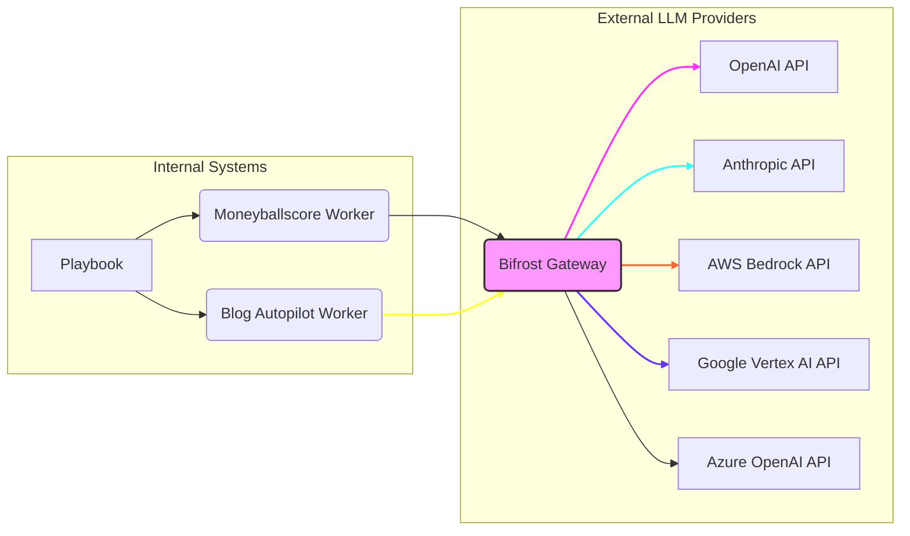

## Bifrost를 활용한 초고속 엔터프라이즈 AI 게이트웨이 도입: 아키텍처 및 통합 전략

최근 엔터프라이즈 환경에서 LLM(Large Language Model) 활용이 급증함에 따라, 다양한 AI 모델 제공업체의 API를 효율적으로 통합하고 관리하는 것이 핵심 과제로 부상하고 있습니다. 특히 `playbook` 및 `worker` 시스템과 같이 여러 LLM API를 빈번하게 호출하는 애플리케이션의 경우, 성능, 안정성, 비용 효율성 측면에서 최적화된 접근 방식이 요구됩니다. 이러한 요구사항을 충족하기 위한 강력한 솔루션 중 하나가 바로 Bifrost와 같은 초고속 AI 게이트웨이입니다.

### LLM API 통합의 복잡성 및 게이트웨이의 필요성

여러 LLM 제공업체(OpenAI, Anthropic, AWS Bedrock, Google Vertex AI 등)의 API를 직접 연동하는 방식은 다음과 같은 문제점을 야기합니다.
*   **다양한 API 인터페이스**: 각 제공업체마다 상이한 API 규격으로 인해 통합 및 유지보수 비용이 증가합니다.
*   **성능 병목 현상**: 특정 제공업체의 지연 시간이나 부하로 인해 전체 시스템 성능에 영향을 미칠 수 있습니다.
*   **관리 오버헤드**: 모델 선택, 버전 관리, 로드 밸런싱, 사용량 모니터링 등의 작업이 복잡해집니다.
*   **안정성 및 가용성**: 단일 제공업체의 장애 시 전체 서비스 중단 위험이 존재합니다.

Bifrost는 이러한 문제를 해결하기 위해 설계된 엔터프라이즈 AI 게이트웨이로, LiteLLM 대비 50배 빠른 성능을 제공하며 5k RPS(Requests Per Second) 환경에서 100µs 미만의 오버헤드를 자랑합니다. 이는 2026년 이후 더욱 심화될 다중 LLM 환경에서의 성능 및 안정성 요구를 선제적으로 대응할 수 있게 합니다.

### Bifrost의 주요 기능 및 아키텍처 이점

Bifrost는 다음과 같은 핵심 기능들을 통해 엔터프라이즈 LLM 활용 환경을 혁신합니다.

#### 1. 단일 OpenAI 호환 API 인터페이스
Bifrost는 15개 이상의 AI 프로바이더(OpenAI, Anthropic, AWS Bedrock, Google Vertex, Azure OpenAI 등)를 단일 OpenAI 호환 API로 통합합니다. 이는 개발자가 특정 LLM 제공업체에 종속되지 않고, 일관된 방식으로 다양한 모델을 호출할 수 있게 하여 개발 복잡성을 대폭 줄여줍니다. `playbook`이나 `worker` 애플리케이션에서는 백엔드 API 엔드포인트만 Bifrost로 변경하면 되므로, 기존 코드 변경을 최소화하면서 다양한 LLM을 활용할 수 있습니다.

#### 2. 적응형 로드 밸런싱 (Adaptive Load Balancer)
Bifrost는 실시간으로 각 LLM 제공업체의 응답 시간, 처리량, 가용성 등을 모니터링하여 최적의 경로로 요청을 라우팅합니다. 이를 통해 특정 제공업체의 부하나 장애 상황에서도 전체 시스템의 성능 저하를 방지하고, 항상 최적의 Latency 및 Throughput을 유지할 수 있습니다. 예를 들어, `moneyballscore` 워커가 대량의 데이터를 분석할 때, Bifrost는 가장 빠른 응답을 줄 수 있는 LLM으로 요청을 분산하여 전체 처리 시간을 단축시킵니다.

#### 3. 강력한 가드레일 (Guardrails) 및 클러스터 모드
보안 및 규정 준수는 엔터프라이즈 AI 시스템의 필수 요소입니다. Bifrost는 사용자 정의 가능한 가드레일을 통해 부적절하거나 유해한 콘텐츠를 필터링하고, 데이터 유출을 방지할 수 있습니다. 또한 클러스터 모드를 지원하여 고가용성(High Availability) 및 확장성(Scalability)을 보장합니다. 여러 Bifrost 인스턴스를 통해 트래픽을 분산하고, 단일 장애 지점(Single Point of Failure)을 제거하여 서비스 연속성을 확보합니다.

#### 4. 초고속 성능 및 확장성
요약에서 언급된 바와 같이, Bifrost는 극도로 낮은 오버헤드로 초고속 처리를 가능하게 합니다. 이는 `blog-autopilot`과 같이 실시간에 가까운 응답이 필요한 AI 에이전트나 대규모 배치 처리 작업에 특히 유리합니다. 빠른 추론 속도는 사용자 경험을 향상시키고, 더 많은 AI 작업을 동시에 처리할 수 있는 역량을 제공합니다.

### Bifrost 통합 아키텍처 예시

다음 Mermaid 다이어그램은 `playbook` 시스템이 Bifrost 게이트웨이를 통해 다양한 LLM 제공업체와 통신하는 아키텍처를 보여줍니다.



### Bifrost를 통한 LLM API 호출 예시 (Python)

Bifrost는 OpenAI 호환 API를 제공하므로, 기존 OpenAI 라이브러리를 거의 그대로 활용할 수 있습니다. 다음은 `playbook` 워커에서 Bifrost를 통해 LLM을 호출하는 간단한 Python 코드 예제입니다.

```python
import os
from openai import OpenAI

# Bifrost Gateway URL 설정
# 환경 변수에서 가져오거나 직접 지정합니다.
BIFROST_BASE_URL = os.getenv("BIFROST_BASE_URL", "http://localhost:8000/v1")
# Bifrost가 필요로 하는 경우 API 키를 설정합니다 (예: Upstream LLM providers에 전달).
BIFROST_API_KEY = os.getenv("BIFROST_API_KEY", "your-bifrost-key")

# OpenAI 클라이언트 초기화 시 base_url을 Bifrost 게이트웨이로 지정
client = OpenAI(
    base_url=BIFROST_BASE_URL,
    api_key=BIFROST_API_KEY, # Bifrost가 백엔드 LLM으로 전달할 키
)

def generate_response_via_bifrost(prompt: str, model_name: str = "gpt-4o"):
    """
    Bifrost 게이트웨이를 통해 LLM 응답을 생성합니다.
    """
    try:
        response = client.chat.completions.create(
            model=model_name, # Bifrost가 라우팅할 모델 이름 (예: gpt-4o, claude-3-opus, gemini-1.5-pro)
            messages=[
                {"role": "system", "content": "You are a helpful AI assistant."},
                {"role": "user", "content": prompt}
            ],
            temperature=0.7,
            max_tokens=500
        )
        return response.choices[0].message.content
    except Exception as e:
        print(f"Error calling LLM via Bifrost: {e}")
        return None

if __name__ == "__main__":
    user_prompt = "Tell me about the benefits of using an AI Gateway for enterprise applications."
    # Bifrost는 model_name을 기반으로 적절한 백엔드 LLM으로 라우팅합니다.
    # 이 model_name은 Bifrost 설정에 따라 실제 LLM 모델 이름이 될 수도 있고,
    # Bifrost 내부에서 정의된 로직을 트리거하는 이름일 수도 있습니다.
    response_content = generate_response_via_bifrost(user_prompt, model_name="gpt-4o")
    if response_content:
        print("--- LLM Response ---")
        print(response_content)
```

이 코드에서 `base_url`을 Bifrost 게이트웨이 주소로 설정하고, `model` 파라미터에 Bifrost가 인식할 수 있는 모델 이름을 전달하면 Bifrost가 내부 라우팅 로직과 로드 밸런싱을 거쳐 최적의 백엔드 LLM으로 요청을 전달합니다.

## 트레이드오프

### 1. 초기 설정 및 관리 복잡성
*   **언제 좋은가**: 여러 LLM 제공업체를 장기적으로 통합하고 관리해야 하는 대규모 엔터프라이즈 환경에서, Bifrost는 단일 인터페이스를 제공하고 관리 오버헤드를 줄여줍니다. 특히 복잡한 로드 밸런싱, 가드레일, 모니터링이 필요한 경우 필수적입니다.
*   **언제 나쁜가**: 소수의 LLM(예: 단일 OpenAI 모델)만 사용하거나, POC(Proof of Concept) 단계에서 빠르게 개발해야 하는 경우, Bifrost 도입은 초기 설정 및 인프라 관리 부담을 가중시킬 수 있습니다. 오버헤드가 작더라도 불필요한 레이어가 될 수 있습니다.

### 2. 성능 오버헤드 vs. 기능 이점
*   **언제 좋은가**: 5k RPS와 같이 매우 높은 처리량과 낮은 Latency가 요구되는 환경에서, Bifrost의 초고속 처리와 적응형 로드 밸런싱은 전체 시스템의 성능과 안정성을 크게 향상시킵니다. 특히 다양한 LLM을 유동적으로 사용하며, 특정 LLM의 지연이 전체 서비스에 영향을 줄 수 있는 경우 빛을 발합니다.
*   **언제 나쁜가**: 요청량이 적거나, Latency에 덜 민감한 배치 처리 작업 등에서는 Bifrost 도입으로 인한 미세한 오버헤드가 성능 향상 효과보다 클 수 있습니다. LiteLLM 대비 50배 빠르다고 해도, 게이트웨이를 거치면서 발생하는 기본적인 네트워크 오버헤드는 존재합니다.

### 3. 공급업체 종속성 완화 vs. 게이트웨이 종속성
*   **언제 좋은가**: 특정 LLM 제공업체에 대한 종속성을 줄이고, 여러 LLM을 쉽게 전환하거나 동시에 활용하고자 할 때 Bifrost는 매우 효과적입니다. 표준화된 API 인터페이스 덕분에 시장의 새로운 모델이나 더 나은 성능/비용 효율을 가진 LLM으로의 마이그레이션이 용이해집니다.
*   **언제 나쁜가**: Bifrost 자체에 대한 새로운 종속성이 발생합니다. Bifrost 인프라의 관리, 업데이트, 유지보수는 또 다른 운영 부담이 됩니다. Bifrost 자체의 버그나 보안 취약점은 전체 LLM 통신에 영향을 미칠 수 있습니다.

### 4. 비용 절감 vs. 인프라 비용
*   **언제 좋은가**: Bifrost의 지능형 로드 밸런싱은 비용 효율적인 LLM 라우팅을 가능하게 하여 장기적으로 LLM API 사용 비용을 절감할 수 있습니다. 예를 들어, 저렴하면서도 충분한 성능을 제공하는 모델로 트래픽을 유도하여 전체 비용을 최적화할 수 있습니다.
*   **언제 나쁜가**: Bifrost를 배포하고 운영하기 위한 추가적인 컴퓨팅 리소스(서버, 네트워크 등) 및 관리 비용이 발생합니다. LLM 사용량이 적은 초기 단계에서는 이러한 인프라 비용이 API 호출 비용 절감 효과를 상회할 수 있습니다.

## 실전 체크리스트

Bifrost와 같은 엔터프라이즈 AI 게이트웨이 도입을 검토할 때, 다음 체크리스트를 활용하여 준비 상태를 확인하세요.

- [ ] **성능 벤치마킹 계획 수립**: 현재 LLM API 호출 Latency 및 Throughput을 측정하고, Bifrost 도입 후 목표 지표를 정의했는가? (예: 평균 Latency 20% 감소, RPS 50% 증가)
- [ ] **지원 모델 및 제공업체 호환성 확인**: 현재 사용 중이거나 미래에 사용될 LLM 모델 및 제공업체(OpenAI, Anthropic, AWS Bedrock 등)가 Bifrost에서 완벽하게 지원되는지 검토했는가?
- [ ] **가드레일 정책 정의 및 구현 검토**: 서비스에 필요한 보안, 규정 준수, 콘텐츠 필터링 등의 가드레일 정책을 명확히 정의하고, Bifrost의 가드레일 기능으로 구현 가능성을 평가했는가?
- [ ] **운영 및 모니터링 전략 구축**: Bifrost 게이트웨이의 배포, 확장, 업데이트 전략을 수립하고, 게이트웨이의 성능 및 오류를 실시간으로 모니터링할 수 있는 대시보드 및 알림 시스템을 구축할 계획인가?
- [ ] **기존 코드 베이스 변경 영향도 분석**: `playbook`, `worker` (moneyballscore, blog-autopilot) 등 기존 LLM API 호출 코드를 Bifrost 통합 시 얼마나 변경해야 하는지, 그리고 변경 범위가 합리적인지 분석했는가?
- [ ] **비용 분석 및 ROI 예측**: Bifrost 도입에 따른 인프라 및 운영 비용 증가분과, LLM API 비용 절감 및 생산성 향상으로 인한 ROI(투자 대비 효과)를 구체적으로 예측했는가?
- [ ] **장애 복구 및 고가용성 계획**: Bifrost 게이트웨이 자체의 장애 발생 시 서비스 연속성을 보장하기 위한 다중화, 페일오버(Failover) 등 장애 복구 전략을 수립했는가?
