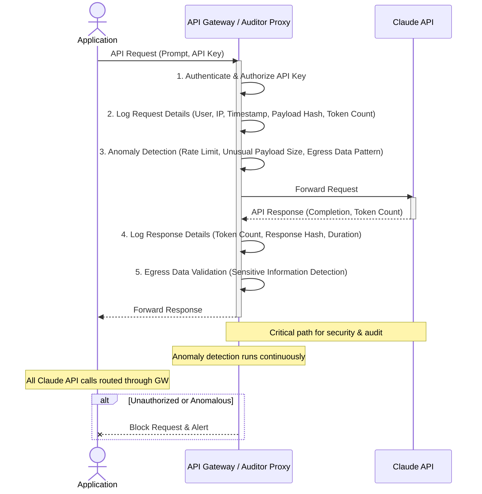

최근 "클로드 90% 할인"과 같은 불법 API 키 유통 사례는 AI 모델 API 키 보안의 중요성을 여실히 보여줍니다. 이러한 사례는 단순한 비용 손실을 넘어, 사용자 데이터 유출 및 '개인 비공개 지식 허브'와 같은 핵심 자산의 무결성을 심각하게 훼손할 수 있는 직접적인 위협입니다. 따라서 Claude API 키의 관리 방식과 사용 패턴을 전반적으로 재검토하고, 모든 API 호출 엔드포인트의 정당성을 확인하며, 비정상적인 데이터 송수신 여부를 감사하는 것은 필수적인 보안 조치입니다.

## Claude API 키 보안 감사의 필요성

AI API 키는 시스템의 민감한 데이터에 접근하고 강력한 컴퓨팅 자원을 소비할 수 있는 권한을 부여합니다. 유출된 키는 다음과 같은 방식으로 악용될 수 있습니다:

*   **데이터 유출 (Data Exfiltration)**: 공격자가 유출된 키를 사용하여 민감한 프롬프트나 응답 데이터를 외부로 전송하거나, 모델 학습 데이터로 활용하여 새로운 공격 벡터를 생성할 수 있습니다.
*   **무단 리소스 사용 및 비용 발생**: 승인되지 않은 API 호출로 인해 예측 불가능한 비용이 발생하고, 서비스 가용성에 영향을 미칠 수 있습니다.
*   **모델 오용 (Model Misuse)**: 공격자가 의도치 않은 방식으로 모델을 조작하거나, 서비스 정책을 우회하는 데 키를 사용할 수 있습니다.
*   **평판 손상 (Reputation Damage)**: 보안 사고는 기업의 신뢰도와 평판에 치명적인 영향을 미칩니다.

2026년에는 AI 시스템이 더욱 복잡해지고 여러 에이전트와 통합되면서 API 키의 보안 위협은 더욱 고도화될 것입니다. 단순한 키 유출 방지를 넘어, 사용 패턴 분석을 통한 비정상 행위 탐지 및 제로 트러스트(Zero-Trust) 원칙 적용이 중요해집니다.

## 보안 감사 및 사용 패턴 검증 아키텍처

Claude API 키에 대한 모든 요청을 중앙에서 로깅하고 감사하기 위한 프록시/게이트웨이 패턴을 도입하는 것이 효과적입니다. 이 아키텍처는 애플리케이션과 Claude API 사이에 위치하여 모든 통신을 가로채고 분석합니다.



## API 호출 Wrapper를 통한 로깅 및 감시 예제

Python 환경에서 Claude API 호출을 래핑(wrapping)하여 기본적인 로깅과 사용 패턴 검증을 수행하는 예시입니다. 이 `ClaudeAPIProxy` 클래스는 모든 요청과 응답을 기록하고, 특정 임계값을 초과하는 요청에 대해 경고를 발생시킬 수 있습니다. 실제 프로덕션 환경에서는 이를 전용 API 게이트웨이나 미들웨어 서비스로 구현해야 합니다.

```python
import os
import time
import logging
import hashlib
from datetime import datetime
from typing import Dict, Any, Optional

# Claude Python SDK (예시로 httpx 사용)
import httpx

logging.basicConfig(level=logging.INFO, format='%(asctime)s - %(levelname)s - %(message)s')

class ClaudeAPIProxy:
    def __init__(
        self,
        api_key: str,
        base_url: str = "https://api.anthropic.com/v1/messages",
        max_input_tokens_threshold: int = 10000,
        max_output_tokens_threshold: int = 2000,
        rate_limit_per_minute: int = 60,
    ):
        self.api_key = api_key
        self.base_url = base_url
        self.client = httpx.Client(headers={
            "x-api-key": self.api_key,
            "anthropic-version": "2023-06-01",
            "content-type": "application/json",
        }, timeout=60.0)
        self.max_input_tokens_threshold = max_input_tokens_threshold
        self.max_output_tokens_threshold = max_output_tokens_threshold
        self.request_timestamps = []
        self.rate_limit_per_minute = rate_limit_per_minute

    def _log_event(self, event_type: str, details: Dict[str, Any]):
        logging.info(f"[AUDIT] Type: {event_type}, Details: {details}")
        # 실제 환경에서는 SIEM, 로깅 시스템(Elasticsearch, Splunk 등)으로 전송

    def _calculate_payload_hash(self, payload: Dict[str, Any]) -> str:
        # JSON payload를 정렬하여 일관된 해시 생성
        import json
        sorted_payload_str = json.dumps(payload, sort_keys=True)
        return hashlib.sha256(sorted_payload_str.encode('utf-8')).hexdigest()

    def _check_rate_limit(self):
        current_time = time.time()
        # 1분 이내의 요청만 유지
        self.request_timestamps = [t for t in self.request_timestamps if t > current_time - 60]
        if len(self.request_timestamps) >= self.rate_limit_per_minute:
            logging.warning("[SECURITY_ALERT] Rate limit exceeded.")
            raise Exception("Rate limit exceeded. Please try again later.")
        self.request_timestamps.append(current_time)

    def create_message(self, payload: Dict[str, Any]) -> Dict[str, Any]:
        self._check_rate_limit()
        
        input_payload_hash = self._calculate_payload_hash(payload)
        
        # 입력 토큰 및 페이로드 크기 검증 (근사치)
        input_content = str(payload.get("messages", []))
        if len(input_content) > self.max_input_tokens_threshold * 4: # 대략 1토큰 = 4바이트
            self._log_event("HIGH_INPUT_ALERT", {
                "payload_hash": input_payload_hash,
                "input_length": len(input_content),
                "threshold": self.max_input_tokens_threshold
            })
            # 실제 환경에서는 여기서 요청 차단 또는 추가 검증

        request_start_time = time.monotonic()
        try:
            response = self.client.post(self.base_url, json=payload)
            response.raise_for_status()
            response_data = response.json()
            request_duration = time.monotonic() - request_start_time

            usage = response_data.get("usage", {})
            output_tokens = usage.get("output_tokens", 0)
            
            if output_tokens > self.max_output_tokens_threshold:
                self._log_event("HIGH_OUTPUT_ALERT", {
                    "payload_hash": input_payload_hash,
                    "output_tokens": output_tokens,
                    "threshold": self.max_output_tokens_threshold
                })

            # 응답 데이터에 민감 정보 포함 여부 검증 (예시)
            if "confidential" in str(response_data).lower():
                self._log_event("SENSITIVE_DATA_EGRESS_ALERT", {
                    "payload_hash": input_payload_hash,
                    "response_snippet": str(response_data)[:200]
                })

            self._log_event("API_CALL_SUCCESS", {
                "payload_hash": input_payload_hash,
                "input_tokens": usage.get("input_tokens"),
                "output_tokens": output_tokens,
                "model": response_data.get("model"),
                "duration_ms": int(request_duration * 1000)
            })

            return response_data
        except httpx.HTTPStatusError as e:
            self._log_event("API_CALL_ERROR", {
                "payload_hash": input_payload_hash,
                "status_code": e.response.status_code,
                "error_detail": str(e)
            })
            raise
        except Exception as e:
            self._log_event("PROXY_ERROR", {
                "payload_hash": input_payload_hash,
                "error_detail": str(e)
            })
            raise

# --- 사용 예시 --- #
if __name__ == "__main__":
    # 실제 API 키는 환경 변수 등으로 관리해야 합니다.
    claude_api_key = os.environ.get("CLAUDE_API_KEY", "YOUR_ANTHROPIC_API_KEY")
    if claude_api_key == "YOUR_ANTHROPIC_API_KEY":
        logging.error("CLAUDE_API_KEY environment variable not set. Using placeholder.")

    proxy = ClaudeAPIProxy(api_key=claude_api_key)

    try:
        # 정상적인 요청
        response_1 = proxy.create_message({
            "model": "claude-3-opus-20240229",
            "max_tokens": 1024,
            "messages": [
                {"role": "user", "content": "What is the capital of France?"}
            ]
        })
        print(f"Response 1: {response_1['content'][0]['text'][:50]}...")

        # 비정상적인 (large input) 요청 시뮬레이션
        large_prompt = "A" * (proxy.max_input_tokens_threshold * 4 + 100)
        response_2 = proxy.create_message({
            "model": "claude-3-haiku-20240307",
            "max_tokens": 50,
            "messages": [
                {"role": "user", "content": large_prompt}
            ]
        })
        print(f"Response 2 (large input): {response_2['content'][0]['text'][:50]}...")

    except Exception as e:
        logging.error(f"An error occurred: {e}")
```

이 예시 코드는 다음과 같은 기능을 포함합니다:

*   **요청/응답 로깅**: 모든 API 호출의 상세 정보를 기록합니다.
*   **페이로드 해시**: 입력 페이로드의 고유성을 식별하고 중복 또는 변조를 감지합니다.
*   **토큰 임계값 경고**: `max_input_tokens_threshold` 또는 `max_output_tokens_threshold`를 초과하는 경우 경고를 발생시킵니다. 이는 비정상적인 데이터 전송 시도를 탐지하는 데 유용합니다.
*   **레이트 리미팅 (Rate Limiting)**: 단일 클라이언트 또는 키에 대한 과도한 요청을 제한하여 무단 사용을 방지합니다.
*   **민감 정보 유출 검증**: 응답 내용에 특정 키워드(예: "confidential")가 포함되어 있는지 확인하여 민감 데이터 유출 가능성을 탐지합니다. (실제 환경에서는 정교한 PII 탐지 모델이나 정규 표현식 사용)

## 트레이드오프

### 1. 보안 강화 vs. 성능 오버헤드
*   **언제 좋은가**: 민감한 데이터 처리, 규제 준수 요구사항이 높은 시스템에서 데이터 유출 방지 및 무단 접근 제어가 최우선일 때 탁월합니다. 추가적인 로깅, 검증, 프록싱 과정은 보안 취약점을 줄이는 데 기여합니다.
*   **언제 나쁜가**: 초저지연(ultra-low latency)이 필수적이거나, 매우 높은 처리량(high throughput)이 요구되는 시스템에서는 프록시 계층 추가로 인한 지연 시간 증가 및 자원 소모가 병목 현상을 유발할 수 있습니다.

### 2. 구현 복잡성 증가 vs. 가시성 및 제어 향상
*   **언제 좋은가**: API 사용 패턴에 대한 상세한 가시성(visibility)과 Fine-grained access control이 필요한 경우, 비정상적인 사용을 조기에 탐지하고 차단하여 잠재적 피해를 최소화할 수 있습니다.
*   **언제 나쁜가**: 소규모 프로젝트나 개발 초기 단계에서는 추가적인 인프라 및 코드 구현(예: API Gateway, 로깅 시스템 통합, 비정상 탐지 로직)이 개발 속도를 늦추고 관리 부담을 가중시킬 수 있습니다.

### 3. 잠재적 오탐(False Positive) vs. 보안 위협 선제적 대응
*   **언제 좋은가**: 알려지지 않은 공격 패턴이나 `silent drift`와 같은 미묘한 이상 징후를 선제적으로 감지하여 큰 사고를 예방하는 데 유리합니다. 오탐 가능성을 감수하더라도 보안 침해 방지가 중요한 경우에 적합합니다.
*   **언제 나쁜가**: 과도하게 엄격한 임계값 설정이나 미성숙한 탐지 로직은 정당한 요청을 오탐하여 사용자 불편을 야기하거나, 운영팀에 불필요한 알림 피로도를 줄 수 있습니다. 이는 시스템의 신뢰성과 사용성을 저해할 수 있습니다.

### 4. 비용 발생 vs. 잠재적 손실 방지
*   **언제 좋은가**: API 호출 비용 최적화 및 비정상적인 비용 급증을 방지하여 예측 불가능한 재정적 손실을 막을 수 있습니다. 초기 보안 투자 비용보다 잠재적인 데이터 유출, 서비스 중단, 평판 손실 비용이 훨씬 큰 경우에 효율적입니다.
*   **언제 나쁜가**: 제한된 예산으로 운영되는 프로젝트에서는 전용 보안 솔루션 도입이나 정교한 감사 시스템 구축에 필요한 초기 투자 비용이 부담될 수 있습니다. 비용 대비 효과를 면밀히 검토해야 합니다.

## 실전 체크리스트

프로젝트에 Claude API 키 보안 감사 및 사용 패턴 검증을 적용할 때 다음 항목들을 확인해야 합니다.

- [ ] **모든 Claude API 호출에 대한 중앙 집중식 로깅 구현**: 요청/응답 페이로드, 타임스탬프, 발신지 IP, API 키 사용자 ID, 토큰 사용량, 응답 시간 등을 포함하는 상세 로그를 수집하고 저장합니다.
- [ ] **이상 징후 탐지 시스템 구축**: 높은 토큰 사용량, 비정상적인 데이터 전송량, 특정 패턴의 프롬프트/응답, 짧은 시간 내 대량 호출 등 비정상적인 사용 패턴을 탐지하고 즉시 경고를 발생시키는 로직을 구현합니다.
- [ ] **Least Privilege 원칙 적용**: 각 서비스 또는 사용자가 필요한 최소한의 권한만을 갖도록 API 키를 세분화하고, 특정 키가 접근할 수 있는 모델 및 기능을 제한합니다.
- [ ] **IP Whitelisting 및 Network Segmentation 적용**: Claude API 호출이 발생하는 서버의 IP 주소를 제한하고, 외부 접근을 차단하기 위해 네트워크 분리를 활용합니다.
- [ ] **API 키 주기적 교체 (Key Rotation)**: 보안 리스크를 줄이기 위해 API 키를 정기적으로 교체하고, 유출 시 영향을 최소화할 수 있도록 키 폐기(revocation) 프로세스를 마련합니다.
- [ ] **데이터 유출(Egress) 모니터링 및 방지**: 응답 데이터에 민감 정보(PII, 기밀 문서 등)가 포함되어 외부로 전송되는 것을 탐지하고 차단하는 시스템을 구축합니다.
- [ ] **비용 모니터링 및 예산 경고 설정**: Claude API 사용량 및 비용을 실시간으로 모니터링하고, 설정된 예산을 초과하거나 급증할 경우 자동으로 경고를 발생시켜 무단 사용을 조기에 감지합니다.