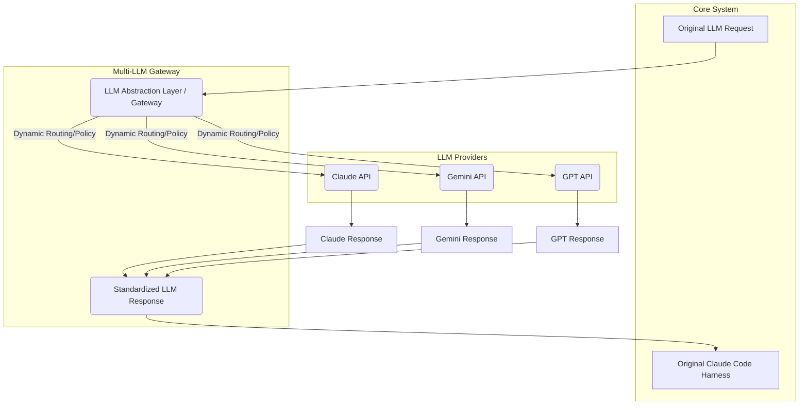

LLM(Large Language Model) 기반 시스템 개발에서 특정 LLM 공급자에 대한 깊은 종속성은 2026년 현재 가장 중요한 아키텍처 리스크 중 하나로 부상했습니다. 최근 Microsoft의 Claude Code 라이선스 정책 변경과 같은 사례는 단일 LLM 의존성이 서비스 연속성, 비용 효율성, 그리고 장기적인 전략적 유연성에 미칠 수 있는 치명적인 영향을 명확히 보여줍니다. 기존에 구축된 Claude Code 하네스(harness)는 Anthropic의 Claude API에 최적화되어 있었으나, 이러한 외부 정책 변화에 취약하다는 인식이 확산되면서 다중 LLM 전략 도입이 필수적인 과제로 떠올랐습니다.

## 단일 LLM 의존성의 리스크

특정 LLM, 예를 들어 Claude Code와 같이 개발 워크플로우 전반에 깊이 통합된 경우, 그 의존성은 단순한 API 호출 수준을 넘어섭니다. 프롬프트 엔지니어링, 응답 파싱 로직, 그리고 에이전트의 내부 플래닝 메커니즘까지 해당 LLM의 특성에 맞춰 최적화되는 경향이 있습니다. 이러한 단일 의존성은 다음과 같은 잠재적 위험을 내포합니다:

*   **벤더 록인(Vendor Lock-in)**: 공급자의 API 변경, 가격 정책 인상, 또는 서비스 중단 시 대안 찾기가 어렵습니다.
*   **정책 변화 리스크**: Microsoft 사례처럼 라이선스 취소나 사용 제한 정책이 갑자기 도입될 수 있습니다.
*   **성능 및 비용 최적화 제약**: 특정 도메인이나 태스크에 더 적합하거나 비용 효율적인 다른 LLM이 존재하더라도 쉽게 전환할 수 없습니다.
*   **기술 스택 경직성**: 새로운 LLM 기술 발전이나 특정 모델의 장점을 활용하기 어렵습니다.

## 다중 LLM 추상화 계층 도입 전략

이러한 리스크를 완화하기 위해 LLM 추상화 계층(Abstraction Layer)을 도입하는 전략이 필요합니다. 이 계층은 하부의 특정 LLM API를 캡슐화하고, 상위 서비스(기존 Claude Code 하네스 포함)에는 일관된 인터페이스를 제공하여 LLM 교체 및 확장을 용이하게 합니다. 이는 다음과 같은 이점을 제공합니다:

1.  **벤더 독립성 확보**: 특정 LLM 공급자에 대한 의존성을 낮춰 정책 변화에 유연하게 대응합니다.
2.  **동적 라우팅 및 폴백(Fallback)**: 사용 시나리오, 비용, 성능, 또는 가용성에 따라 최적의 LLM을 동적으로 선택하거나 실패 시 다른 LLM으로 전환할 수 있습니다.
3.  **A/B 테스트 및 실험 용이성**: 다양한 LLM 모델의 성능을 비교하고 최적의 모델을 찾는 실험을 쉽게 수행할 수 있습니다.
4.  **비용 최적화**: 특정 태스크에 더 저렴한 LLM을 사용하거나, 사용량에 따라 동적으로 LLM을 스위칭하여 비용을 절감할 수 있습니다.

### 아키텍처 개요: LLM Gateway

다중 LLM 전략의 핵심은 `LLM Gateway` 또는 `LLM Router`라고 불리는 미들웨어 계층입니다. 이 계층은 들어오는 요청을 분석하여 적절한 LLM 공급자로 라우팅하고, 응답을 표준화된 형식으로 변환하여 반환합니다.



## 구현 패턴: 어댑터(Adapter) 및 전략(Strategy) 패턴

LLM 추상화 계층을 구현하는 일반적인 방법은 `어댑터(Adapter) 패턴`과 `전략(Strategy) 패턴`을 결합하는 것입니다. 각 LLM 공급자(Claude, Gemini, GPT 등)에 대한 어댑터를 구현하고, 게이트웨이는 런타임에 어떤 어댑터를 사용할지 결정합니다.

```python
# llm_interface.py
from abc import ABC, abstractmethod

class LLMClient(ABC):
    @abstractmethod
    def generate_text(self, prompt: str, **kwargs) -> str:
        pass

    @abstractmethod
    def get_model_name(self) -> str:
        pass

# claude_adapter.py
# import anthropic

class ClaudeAdapter(LLMClient):
    def __init__(self, api_key: str):
        # self.client = anthropic.Anthropic(api_key=api_key)
        self.api_key = api_key # Mocking for example

    def generate_text(self, prompt: str, **kwargs) -> str:
        # response = self.client.messages.create(...)
        print(f"[Claude] Generating for: {prompt[:30]}...")
        return f"Claude's response to '{prompt[:20]}...'"

    def get_model_name(self) -> str:
        return "Claude 3 Opus"

# gemini_adapter.py
# import google.generativeai as genai

class GeminiAdapter(LLMClient):
    def __init__(self, api_key: str):
        # genai.configure(api_key=api_key)
        # self.model = genai.GenerativeModel('gemini-pro')
        self.api_key = api_key # Mocking for example

    def generate_text(self, prompt: str, **kwargs) -> str:
        # response = self.model.generate_content(prompt)
        print(f"[Gemini] Generating for: {prompt[:30]}...")
        return f"Gemini's response to '{prompt[:20]}...'"

    def get_model_name(self) -> str:
        return "Gemini Pro"

# llm_gateway.py
import os

class LLMGateway:
    def __init__(self):
        self.clients = {}
        # Dynamically load adapters
        self.register_llm("claude", ClaudeAdapter(os.getenv("CLAUDE_API_KEY", "mock-claude-key")))
        self.register_llm("gemini", GeminiAdapter(os.getenv("GEMINI_API_KEY", "mock-gemini-key")))

    def register_llm(self, name: str, client: LLMClient):
        self.clients[name] = client

    def get_client(self, preferred_llm: str = "claude") -> LLMClient:
        return self.clients.get(preferred_llm, self.clients["claude"]) # Default or fallback

    def generate_unified_response(self, prompt: str, preferred_llm: str = "claude", **kwargs) -> str:
        client = self.get_client(preferred_llm)
        print(f"Using {client.get_model_name()} for request.")
        return client.generate_text(prompt, **kwargs)

# Usage in the existing harness
if __name__ == "__main__":
    gateway = LLMGateway()

    # Existing Claude Code harness could now use the gateway
    # request = "Refactor this Python code for better error handling."
    # response = gateway.generate_unified_response(request, preferred_llm="claude")
    # print(f"Harness processed with Claude: {response}")

    # New request using Gemini
    new_request = "Generate a concise summary of quantum computing principles."
    response_gemini = gateway.generate_unified_response(new_request, preferred_llm="gemini")
    print(f"Harness processed with Gemini: {response_gemini}")

    # Fallback example (if gemini fails or not preferred)
    # The gateway could have logic for this.
    # For simplicity, let's assume 'default' is 'claude'
    default_response = gateway.generate_unified_response(
        "Provide a short story about an AI exploring a new planet."
    )
    print(f"Harness processed with default (Claude): {default_response}")
```

## 트레이드오프

다중 LLM 추상화 계층 도입에는 명확한 이점과 함께 몇 가지 트레이드오프가 존재합니다. 프로젝트의 요구사항과 자원 제약을 고려하여 신중하게 접근해야 합니다.

*   **복잡성 증가 vs. 유연성 확보**: 초기 아키텍처 설계 및 구현에 추가적인 복잡성(다중 API 관리, 표준화, 라우팅 로직)이 발생합니다. 이는 단일 LLM 시스템보다 개발 및 유지보수 비용을 증가시킬 수 있습니다. 그러나 장기적으로 LLM 시장의 변화에 유연하게 대응하고 특정 벤더에 종속되지 않는 아키텍처를 구축하는 데 필수적입니다. 단기 프로젝트나 리소스가 매우 제한적인 경우에는 초기 복잡성이 큰 부담이 될 수 있지만, 장기적인 서비스 운영 및 스케일업이 필요한 경우에는 강력한 유연성을 제공합니다.
*   **성능 오버헤드 vs. 안정성 및 최적화**: 추상화 계층은 API 호출 경로에 추가적인 레이어를 도입하여 미미한 수준의 레이턴시(latency) 증가를 유발할 수 있습니다. 이는 실시간 응답이 필수적인 일부 애플리케이션에서는 고려해야 할 사항입니다. 반면, 여러 LLM을 통한 폴백 메커니즘은 특정 LLM의 서비스 장애 시 전체 시스템의 안정성을 크게 향상시킵니다. 또한, 태스크별 최적 LLM 라우팅을 통해 전반적인 비용 효율성 및 응답 품질을 최적화할 수 있습니다.
*   **프롬프트 및 응답 표준화 노력 vs. 모델 간 이식성**: 각 LLM 모델은 고유한 프롬프트 형식, 토큰 제한, 응답 구조를 가집니다. 이를 추상화 계층에서 표준화하는 작업은 상당한 프롬프트 엔지니어링 및 데이터 파싱 노력을 요구합니다. 그러나 이 작업이 완료되면, 특정 LLM에 종속되지 않고 새로운 LLM으로의 전환 또는 확장이 훨씬 용이해집니다. 모델 간의 이식성 확보는 장기적인 기술 부채를 줄이고 미래 기술 변화에 빠르게 대응할 수 있는 기반이 됩니다.
*   **모니터링 및 로깅 복잡도 vs. 운영 가시성**: 여러 LLM 공급자의 API를 통합하면서 각 LLM의 사용량, 비용, 성능, 에러율을 개별적으로 모니터링하고 통합 로깅 시스템을 구축하는 것이 더 복잡해집니다. 하지만 이러한 통합 모니터링 시스템은 각 LLM의 실제 운영 효율성을 비교 분석하고, 최적의 라우팅 정책을 수립하는 데 필수적인 심층적인 운영 가시성을 제공합니다. 이는 시스템 전체의 상태를 이해하고 문제 발생 시 신속하게 대응하는 데 큰 도움이 됩니다.

## 실전 체크리스트

Claude Code 하네스의 LLM 의존성을 재평가하고 다중 LLM 전략을 도입하기 위한 실전 체크리스트입니다.

*   [ ] **기존 Claude Code 프롬프트 및 응답 분석**: 현재 Claude Code 하네스에서 사용되는 프롬프트의 특징과 LLM 응답 파싱 로직을 상세히 분석하여, 다른 LLM으로의 전환 시 발생할 호환성 문제를 식별하고 표준화 전략을 수립했는가?
*   [ ] **LLM 추상화 계층 설계 및 인터페이스 정의**: LLM 게이트웨이의 핵심 인터페이스(예: `generate_text`, `chat_completion` 등)를 정의하고, 다양한 LLM 공급자(Gemini, GPT 등)를 통합할 수 있는 어댑터 패턴 기반의 확장 가능한 아키텍처를 설계했는가?
*   [ ] **POC(Proof of Concept) 구현 및 검증**: Claude 외 최소 1개 이상의 LLM(예: Gemini)을 추상화 계층에 통합하고, 기존 Claude Code 하네스의 주요 워크플로우를 POC 환경에서 성공적으로 실행하여 기능적 호환성과 기본적인 성능 지표를 검증했는가?
*   [ ] **성능 및 비용 지표 기준 수립**: 각 LLM 공급자의 API 호출에 대한 평균 레이턴시, 성공률, 토큰당 비용 등의 핵심 성능 및 비용 지표를 정의하고, 이를 지속적으로 모니터링할 수 있는 시스템을 구축했는가?
*   [ ] **동적 라우팅 및 폴백 전략 수립**: 사용 시나리오, 태스크 유형, 비용, 레이턴시, 그리고 LLM 공급자의 가용성을 기반으로 최적의 LLM을 동적으로 선택하거나 실패 시 자동으로 다른 LLM으로 전환하는 라우팅 및 폴백 정책을 정의했는가?
*   [ ] **API 키 및 인증 관리 방안 마련**: 다중 LLM 공급자의 API 키를 안전하게 관리하고, 각 LLM 클라이언트가 적절한 인증 메커니즘을 통해 API에 접근하는 보안 전략을 수립했는가?
*   [ ] **데이터 거버넌스 및 규정 준수 검토**: 각 LLM 공급자의 데이터 처리 정책, 개인정보 보호 규정 준수 여부를 검토하고, 민감 데이터 처리 시 보안 및 규정 준수 요구사항을 충족하는지 확인했는가?