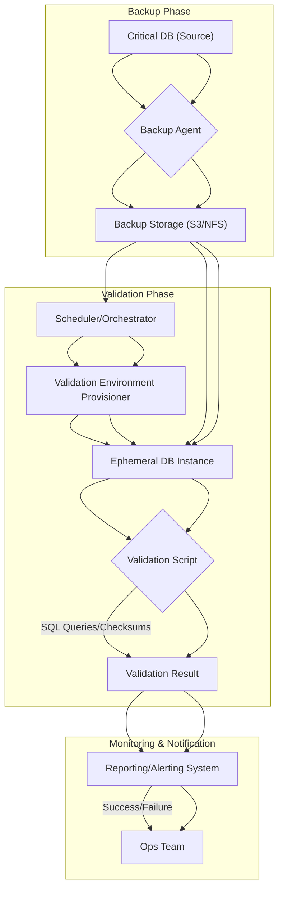

데이터베이스는 모든 애플리케이션의 핵심 자산이며, 그 백업은 재해 복구(Disaster Recovery, DR) 전략의 가장 중요한 부분입니다. 단순히 백업 파일을 생성하는 것을 넘어, 백업된 데이터가 실제로 유효하며 지정된 시간 내에 복구 가능한지 주기적으로 검증하는 시스템은 Critical 시스템의 운영 연속성을 보장하는 필수 요소입니다. 백업 데이터의 무결성(integrity)과 복구 가능성(recoverability)을 자동화된 방식으로 확인하지 않으면, 실제 재해 발생 시 복구 실패라는 치명적인 결과를 초래할 수 있습니다.

## 핵심 개념: 복구 검증형 백업 시스템 (Recovery-Validated Backup System)

전통적인 백업 방식은 백업 파일이 생성되었는지 여부만을 확인하는 데 그칩니다. 그러나 `Databasus`와 같은 복구 검증형 백업 솔루션은 백업된 데이터를 별도의 환경에 실제로 복원하고, 그 데이터의 무결성을 검사하는 단계까지 포함합니다. 이는 단순한 백업 스케줄링을 넘어선 '실제 복구 가능성'을 보장하는 접근 방식입니다.

이 시스템은 다음과 같은 핵심 기능을 제공합니다:

*   **자동화된 백업 스케줄링**: PostgreSQL, MySQL, MariaDB, MongoDB 등 다양한 데이터베이스에 대한 논리 백업(Logical Backup) 및 물리 백업(Physical Backup) 지원.
*   **백업 데이터 보관 및 관리**: 백업 저장 위치, 보관 기간 정책 적용.
*   **자동 복원 테스트**: 백업된 데이터를 격리된 환경(예: 컨테이너화된 DB 인스턴스)에 복원.
*   **데이터 무결성 검증**: 복원된 데이터에 대해 쿼리 실행, 스키마 유효성 검사, 샘플 데이터 비교 등을 수행하여 무결성 확인.
*   **보고 및 알림**: 검증 결과에 대한 보고서 생성 및 실패 시 즉각적인 알림.

## 구현 아키텍처 및 워크플로우

이 시스템은 주로 백업 에이전트, 백업 저장소, 검증 엔진, 보고 및 알림 모듈로 구성됩니다.

### 백업 및 복구 검증 워크플로우



1.  **백업 생성**: 백업 에이전트가 원본 DB에서 데이터를 추출하여 백업 스토리지에 저장합니다.
2.  **스케줄링**: 스케줄러가 정해진 주기에 따라 백업 검증 프로세스를 시작합니다.
3.  **환경 프로비저닝**: 격리된 검증 환경(예: Docker 컨테이너나 가상 머신)에 임시 데이터베이스 인스턴스를 프로비저닝합니다.
4.  **복원**: 백업 스토리지에서 최신 백업 파일을 가져와 임시 DB 인스턴스에 복원합니다.
5.  **검증 실행**: 복원된 DB에 대해 미리 정의된 검증 스크립트(SQL 쿼리, 데이터 일관성 체크, WAL 유효성 검사 등)를 실행합니다.
6.  **결과 보고**: 검증 결과를 중앙 모니터링 시스템에 보고하고, 실패 시 운영팀에 알림을 보냅니다.

## 코드 예제: PostgreSQL 복구 검증 스크립트 (Bash)

이 예제는 PostgreSQL 논리 백업(`pg_dump`)을 수행하고, Docker를 사용하여 임시 환경에서 복원을 시도한 후 기본적인 데이터 무결성을 확인하는 스크립트입니다.

```bash
#!/bin/bash

DB_HOST="localhost"
DB_PORT="5432"
DB_USER="your_user"
DB_NAME="your_database"
BACKUP_DIR="/backups"
TIMESTAMP=$(date +"%Y%m%d%H%M%S")
BACKUP_FILE="${BACKUP_DIR}/${DB_NAME}_${TIMESTAMP}.sql"
DOCKER_IMAGE="postgres:16"
TEMP_CONTAINER_NAME="pg-restore-test-${TIMESTAMP}"
TEMP_DB_PORT="5433" # Use a different port for the temporary container

echo "--- Starting Database Backup and Recovery Validation ---"

# 1. Perform Logical Backup
echo "Creating backup for ${DB_NAME} to ${BACKUP_FILE}..."
PGPASSWORD="your_password" pg_dump -h ${DB_HOST} -p ${DB_PORT} -U ${DB_USER} -d ${DB_NAME} > ${BACKUP_FILE}
if [ $? -ne 0 ]; then
    echo "Backup failed!"
    exit 1
fi
echo "Backup successful."

# 2. Start Temporary PostgreSQL Container for Validation
echo "Starting temporary PostgreSQL container '${TEMP_CONTAINER_NAME}'..."
docker run --rm --name ${TEMP_CONTAINER_NAME} -e POSTGRES_PASSWORD=test_password -p ${TEMP_DB_PORT}:5432 -d ${DOCKER_IMAGE}
sleep 10 # Give PostgreSQL time to start

# Create database in the temporary container
echo "Creating database '${DB_NAME}' in temporary container..."
PGPASSWORD=test_password psql -h localhost -p ${TEMP_DB_PORT} -U postgres -c "CREATE DATABASE ${DB_NAME};"
if [ $? -ne 0 ]; then
    echo "Failed to create database in temporary container!"
    docker stop ${TEMP_CONTAINER_NAME}
    exit 1
fi

# 3. Restore Backup to Temporary Container
echo "Restoring ${BACKUP_FILE} to temporary container..."
PGPASSWORD=test_password psql -h localhost -p ${TEMP_DB_PORT} -U postgres -d ${DB_NAME} < ${BACKUP_FILE}
if [ $? -ne 0 ]; then
    echo "Restore failed!"
    docker stop ${TEMP_CONTAINER_NAME}
    exit 1
fi
echo "Restore successful."

# 4. Perform Data Integrity Check
echo "Performing data integrity check on restored database..."
ROW_COUNT=$(PGPASSWORD=test_password psql -h localhost -p ${TEMP_DB_PORT} -U postgres -d ${DB_NAME} -t -c "SELECT COUNT(*) FROM your_table;" | tr -d '[:space:]')
if [ "${ROW_COUNT}" -gt 0 ]; then
    echo "Data integrity check passed: Found ${ROW_COUNT} rows in 'your_table'."
else
    echo "Data integrity check failed: No rows found in 'your_table' or query failed."
    docker stop ${TEMP_CONTAINER_NAME}
    exit 1
fi

# 5. Clean Up
echo "Stopping and removing temporary container '${TEMP_CONTAINER_NAME}'..."
docker stop ${TEMP_CONTAINER_NAME}
echo "Validation completed successfully."
```
*Note*: Replace `your_user`, `your_password`, `your_database`, and `your_table` with actual values. For production, consider using secure credential management.

## 2026년 트렌드 반영 (2026 Trends)

*   **클라우드 네이티브 통합**: 백업 및 복구 시스템이 Kubernetes, Fargate와 같은 클라우드 네이티브 환경에 더욱 깊이 통합되어, 자동화된 스냅샷, PITR (Point-In-Time Recovery) 및 복구 검증이 컨테이너 오케스트레이션 시스템의 일부로 동작합니다.
*   **불변 백업 (Immutable Backups)**: 랜섬웨어 공격 방어를 위해 백업 데이터를 일정 기간 동안 변경하거나 삭제할 수 없는 불변 스토리지에 저장하는 방식이 표준화됩니다.
*   **AI 기반 이상 탐지**: 복구 검증 단계에서 AI/ML을 활용하여 복원된 데이터의 비정상적인 패턴이나 내용 변화를 자동으로 탐지, 잠재적인 데이터 손상 또는 손실을 조기에 발견합니다.
*   **GitOps 기반 백업/복구 정책 관리**: 백업 정책, 스케줄, 복구 절차 정의가 코드(YAML)로 관리되고 Git 저장소를 통해 버전 관리 및 배포되며, 이는 시스템의 일관성과 감사 용이성을 극대화합니다.

## 트레이드오프 (Trade-offs)

1.  **비용 증가 vs. 재해 복구 비용 절감**:
    *   **언제 좋은가**: Critical 데이터(예: 결제 정보, 사용자 계정, 핵심 비즈니스 로직에 필요한 데이터)를 다루는 시스템에서 데이터 손실이 비즈니스에 치명적인 영향을 미칠 경우. 자동화된 검증은 수동 복구 실패 또는 데이터 손실로 인한 막대한 금전적, 브랜드 이미지 손실을 방지합니다.
    *   **언제 나쁜가**: 비핵심 데이터(예: 로그 데이터, 캐시 데이터 등)나 복구 중요도가 낮은 시스템의 경우, 추가적인 인프라 및 운영 비용이 과도할 수 있습니다.

2.  **복잡성 증가 vs. 신뢰성 확보**:
    *   **언제 좋은가**: 복구 시나리오가 복잡하거나, 복구 시간 목표(RTO) 및 복구 시점 목표(RPO)가 엄격한 경우. 자동화된 검증 시스템은 복구 절차의 신뢰성을 극대화하고, 수동 개입으로 인한 실수를 줄여줍니다.
    *   **언제 나쁜가**: 소규모 프로젝트나 개발 환경처럼 데이터 손실에 대한 허용치가 높고, 전담 인프라/SRE 팀이 없는 경우. 시스템 구축 및 유지보수의 복잡성이 과도한 부담이 될 수 있습니다.

3.  **성능 영향 vs. 데이터 무결성 보장**:
    *   **언제 좋은가**: 규제 준수(Compliance) 요구사항이 있거나, 데이터의 정확성과 무결성이 비즈니스 핵심 가치인 경우. 주기적인 복원 및 검증 테스트는 데이터 손상 감지 및 신속한 대응을 가능하게 하여 법적, 재정적 위험을 줄여줍니다.
    *   **언제 나쁜가**: 실시간 처리량이 매우 중요하고, 백업 및 검증 프로세스가 원본 DB에 높은 부하를 줄 수 있는 환경. 백업 방식(논리/물리, 증분/차등) 및 검증 주기를 신중하게 조절해야 합니다.

## 실전 체크리스트 (Practical Checklist)

*   [ ] **RTO/RPO 정의**: Critical 데이터베이스의 복구 시간 목표(RTO)와 복구 시점 목표(RPO)를 명확히 정의하고, 이 목표를 충족하는 백업 및 복구 검증 전략을 수립했는가?
*   [ ] **격리된 검증 환경 확보**: 백업 복원 및 검증을 위한 격리된(isolated) 환경(예: Docker, VM, 별도 Cloud 계정)이 준비되었으며, 원본 DB에 영향을 주지 않도록 네트워크 분리가 이루어졌는가?
*   [ ] **데이터 무결성 검증 스크립트 개발**: 복원된 데이터베이스의 스키마 유효성, 주요 테이블의 row 수 비교, 특정 핵심 데이터 검증 쿼리 등 실질적인 무결성을 확인할 수 있는 스크립트를 작성했는가?
*   [ ] **자동화된 스케줄링 및 알림**: 백업 및 복구 검증 프로세스가 주기적으로 자동 실행되도록 스케줄링되었으며, 실패 시 즉각적인 알림(Slack, PagerDuty 등)이 운영팀에 전달되도록 설정했는가?
*   [ ] **백업 데이터 불변성 보장**: 랜섬웨어 방어를 위해 백업 데이터가 일정 기간 동안 변경 불가능한(immutable) 스토리지에 저장되는 정책이 적용되었는가? (예: AWS S3 Object Lock, GCP Cloud Storage Bucket Lock)
*   [ ] **백업 데이터 암호화**: 전송 중 및 저장된 백업 데이터가 모두 암호화되어 민감한 정보가 노출되지 않도록 조치되었는가? (Encryption in transit, Encryption at rest)
*   [ ] **복구 시뮬레이션 및 문서화**: 실제 재해 상황을 가정한 전체 복구 시뮬레이션을 주기적으로 수행하고, 복구 절차를 문서화하여 운영팀이 숙지하고 있는가?