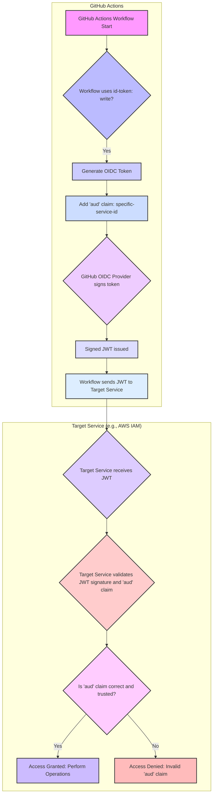

GitHub Actions는 CI/CD 워크플로 자동화에 필수적인 도구입니다. 특히 `id-token: write` 권한을 통해 OIDC(OpenID Connect) 토큰을 발급받아 클라우드 서비스(AWS, GCP, Azure 등)에 인증하는 방식은 비밀 정보를 직접 관리하지 않아도 되는 편리함과 보안성을 제공합니다. 그러나 이 `id-token: write` 권한은 워크플로가 임의의 `audience` 값으로 OIDC 토큰을 발급할 수 있게 하여 심각한 보안 취약점으로 이어질 수 있습니다.

## OIDC 토큰과 Audience 클레임의 중요성
OIDC 토큰은 특정 주체(subject)가 인증되었음을 증명하는 JSON Web Token(JWT)입니다. 이 토큰에는 여러 클레임(claim)이 포함되며, 그 중 `aud`(audience) 클레임은 토큰이 누구를 위해 발급되었는지, 즉 이 토큰을 받아들일 서비스 또는 애플리케이션을 명시합니다. 일반적으로 `aud` 클레임의 값은 토큰을 검증하는 서비스의 식별자여야 합니다.

`id-token: write` 권한만 설정된 GitHub Actions 워크플로는 `aud` 클레임을 지정하지 않거나, 서드파티 액션 등에 의해 임의의 `audience` 값이 주입될 위험이 있습니다. 만약 워크플로에 포함된 취약하거나 악의적인 서드파티 코드가 이 권한을 악용하여 의도치 않은 서비스(예: 공격자의 서버)를 `audience`로 지정한 토큰을 발급받는다면, 해당 토큰은 공격자의 시스템에서 유효하게 검증될 수 있고, 이는 심각한 권한 확대 및 탈취 공격으로 이어질 수 있습니다.

## GitHub Actions에서의 Audience 제약 구현
이러한 위험을 방지하기 위해 GitHub Actions 워크플로에서 `id-token: write` 권한을 사용할 때, OIDC 토큰의 `audience` 클레임을 특정 서비스로 명확하게 제한해야 합니다. 이는 워크플로 YAML 파일에 `id-token.aud` 속성을 추가하여 구현할 수 있습니다. `actions/configure-aws-credentials`와 같은 공식 액션들은 `audience` 파라미터를 통해 이 기능을 직접 지원합니다.

### 코드 예제: AWS OIDC Provider와 함께 Audience 제약 적용
아래 예제는 GitHub Actions가 AWS에 OIDC를 통해 인증할 때, `audience` 클레임을 명시적으로 지정하여 보안을 강화하는 방법을 보여줍니다.

```yaml
name: Deploy to AWS with OIDC Audience

on:
  push:
    branches:
      - main

permissions:
  id-token: write # OIDC 토큰 발급 권한
  contents: read  # 리포지토리 콘텐츠 읽기 권한

jobs:
  deploy:
    runs-on: ubuntu-latest
    steps:
      - name: Checkout code
        uses: actions/checkout@v4

      - name: Configure AWS Credentials with OIDC
        uses: aws-actions/configure-aws-credentials@v4
        with:
          role-to-assume: arn:aws:iam::123456789012:role/MyGitHubActionsRole
          aws-region: ap-northeast-2
          role-session-name: github-actions-session
          audience: sts.amazonaws.com # 이 OIDC 토큰이 AWS STS에 의해 사용될 것임을 명시

      - name: Deploy application
        run: |
          aws s3 sync . s3://my-deployment-bucket/
          echo "Deployment complete!"
```

위 예제에서 `audience: sts.amazonaws.com`은 발급된 OIDC 토큰의 `aud` 클레임이 `sts.amazonaws.com`으로 설정되도록 지시합니다. AWS IAM Role의 Trust Policy에는 다음과 같이 `aud` 클레임을 검증하는 조건이 포함되어야 합니다:

```json
{
  "Version": "2012-10-17",
  "Statement": [
    {
      "Effect": "Allow",
      "Principal": {
        "Federated": "arn:aws:iam::123456789012:oidc-provider/token.actions.githubusercontent.com"
      },
      "Action": "sts:AssumeRoleWithWebIdentity",
      "Condition": {
        "StringEquals": {
          "token.actions.githubusercontent.com:aud": "sts.amazonaws.com"
        },
        "StringLike": {
          "token.actions.githubusercontent.com:sub": "repo:your-org/your-repo:*"
        }
      }
    }
  ]
}
```

이 설정은 GitHub OIDC Provider로부터 발급된 토큰 중 `aud` 클레임이 `sts.amazonaws.com`인 경우에만 IAM Role Assume이 허용되도록 강제합니다. 이는 토큰이 AWS 서비스 이외의 다른 곳에서 사용되는 것을 근본적으로 차단하여 보안을 크게 강화합니다.

## 보안 강화 효과 및 2026년 트렌드
OIDC audience 제약을 추가하는 것은 다음과 같은 보안 강화 효과를 가져옵니다:

*   **토큰 오용 방지**: 발급된 토큰이 명시된 `audience` 이외의 서비스에서는 검증될 수 없어 탈취되더라도 공격자가 다른 서비스로 권한을 확장하는 것을 막습니다.
*   **최소 권한 원칙(Least Privilege) 준수**: 토큰의 사용 목적을 명확히 제한함으로써, CI/CD 파이프라인에서의 최소 권한 원칙을 효과적으로 구현할 수 있습니다.
*   **공급망 공격 방어**: 악의적인 서드파티 액션이나 취약점이 있는 코드가 임의의 `audience`를 설정하여 토큰을 탈취하려는 시도를 차단합니다.

2026년에는 CI/CD 파이프라인의 보안이 개발 프로세스 전반에서 최우선 순위로 강조됩니다. 자동화된 보안 정책 엔진, 코드 정적 분석, 그리고 이러한 OIDC audience 제약과 같은 세분화된 권한 관리 메커니즘은 필수적인 트렌드가 될 것입니다. CI/CD 환경에서의 제로 트러스트(Zero Trust) 아키텍처 구현을 위한 핵심 요소로 자리매김하고 있습니다.

## OIDC 토큰 Audience 제약 워크플로


## 트레이드오프

*   **보안 강화 vs. 설정 복잡성**: OIDC audience 제약을 통해 CI/CD 파이프라인의 보안 수준을 대폭 높일 수 있지만, 각 워크플로와 대상 서비스의 OIDC Provider 설정을 정확히 매칭해야 하는 추가적인 설정 및 관리 오버헤드가 발생합니다.
    *   **언제 좋고**: 높은 보안 요구 사항이 있는 프로덕션 환경이나 민감한 리소스에 접근하는 경우. 토큰 오용으로 인한 잠재적 피해가 클 때 필수적입니다.
    *   **언제 나쁘지**: 개발/테스트 환경에서 빠른 실험과 배포가 중요하고, 보안 위험이 상대적으로 낮다고 판단될 때. 작은 규모의 프로젝트에서는 초기 설정 부담이 과할 수 있습니다.

*   **유연성 vs. 엄격성**: `audience`를 명시적으로 제한하면 토큰의 사용처가 엄격하게 통제되어 공격 표면을 최소화할 수 있습니다. 반면, 여러 서비스에서 동일한 토큰을 범용적으로 사용하려는 시나리오에서는 유연성이 저해됩니다.
    *   **언제 좋고**: 각 CI/CD 파이프라인이 명확히 정의된 하나의 대상 서비스에만 접근해야 할 때. 보안 경계가 명확하게 구분되어야 하는 환경에 적합합니다.
    *   **언제 나쁘지**: 하나의 CI/CD 워크플로가 동적으로 여러 다른 `audience`를 가진 서비스에 접근해야 하거나, `audience` 값이 자주 변경될 수 있는 매우 유연한 아키텍처에서는 관리 복잡성이 커집니다.

*   **관리 오버헤드 vs. 잠재적 취약점 감소**: 각 `audience` 값의 일관된 정의와 대상 서비스의 OIDC Provider Trust Policy 관리가 요구됩니다. 이 과정에서 설정 오류가 발생할 수 있지만, 장기적으로는 토큰 관련 보안 취약점 발생 가능성을 현저히 줄입니다.
    *   **언제 좋고**: IaC(Infrastructure as Code)를 통해 OIDC Provider 설정을 중앙에서 관리하고, 워크플로 템플릿 등을 사용하여 `audience` 정의를 표준화할 수 있는 경우 효과적입니다.
    *   **언제 나쁘지**: 수동 설정에 의존하거나, 팀 간의 협업 없이 개별적으로 워크플로가 관리되는 경우. 설정 불일치로 인한 인증 실패나 새로운 취약점 발생 위험이 있습니다.

## 실전 체크리스트

- [ ] 모든 GitHub Actions 워크플로 중 `id-token: write` 권한을 사용하는 작업을 식별했는가?
- [ ] 식별된 각 작업에 대해 OIDC 토큰이 사용될 대상 서비스(예: AWS IAM, GCP Workload Identity, Azure AD)를 명확히 정의하고, 해당 서비스가 기대하는 `audience` 값을 확인했는가?
- [ ] 각 대상 서비스의 OIDC Provider 설정에서 예상되는 `audience` 값을 정확히 구성하여 토큰의 유효성을 검증하도록 설정했는가? (예: AWS IAM Role Trust Policy에 `token.actions.githubusercontent.com:aud` 조건 추가)
- [ ] GitHub Actions 워크플로 YAML 파일에 `jobs.<job_id>.steps.<step_id>.id-token.aud` 또는 해당 액션의 `audience` 파라미터를 사용하여 OIDC 토큰의 `audience`를 명시적으로 제약했는가?
- [ ] `audience` 제약이 적용된 OIDC 토큰을 사용하여 실제 서비스 접근이 정상적으로 이루어지는지 통합 테스트를 통해 검증했는가?
- [ ] 의도적으로 잘못된 `audience` 값으로 토큰을 발급하여 서비스 접근을 시도했을 때, 접근이 예상대로 거부되는지 보안 테스트를 수행했는가?
- [ ] 향후 새로운 워크플로 생성 시 `audience` 제약을 포함하도록 자동화된 정책(예: OPA(Open Policy Agent), GitHub Enterprise의 조직 정책) 또는 표준 템플릿을 마련하여 지속적인 보안 가이드라인을 유지할 수 있는가?