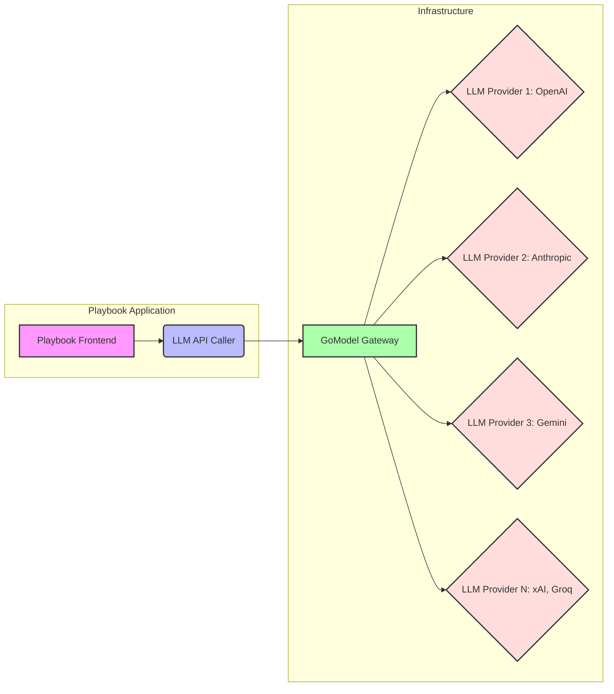

## LLM 게이트웨이의 필요성

최근 AI 기술의 발전과 함께 다양한 대규모 언어 모델(LLM)이 등장하면서, 단일 LLM에 대한 종속성 회피 및 최적의 모델 활용 전략이 중요해졌다. 여러 LLM 제공자(OpenAI, Anthropic, Gemini, Groq, xAI 등)를 효율적으로 통합하고 관리하기 위한 중앙 집중식 솔루션의 필요성이 대두된다. LLM 게이트웨이는 이러한 요구사항을 충족시키며, 애플리케이션 개발자가 복잡한 LLM 연동 로직 대신 비즈니스 로직에 집중할 수 있도록 돕는다. 이는 모델 전환의 유연성, 비용 최적화, 보안 강화 및 성능 향상에 기여한다.

## GoModel 소개 및 주요 특징

GoModel은 Go 언어로 작성된 경량의 고성능 AI 게이트웨이로, `LiteLLM`과 유사한 기능을 제공한다. 핵심 특징은 다음과 같다:

1.  **단일 바이너리 및 경량화**: Go 언어의 특성을 활용하여 단일 바이너리로 배포되며, 컨테이너 이미지가 가볍고 콜드스타트(Cold Start) 시간이 매우 빠르다. 이는 서버리스 환경이나 엣지 컴퓨팅 환경에 특히 유리하다.
2.  **멀티 LLM 제공자 통합**: OpenAI, Anthropic, Gemini, Groq, xAI 등 11개 이상의 주요 LLM 제공자를 단일 OpenAI 호환 API 엔드포인트로 통합한다. 개발자는 백엔드의 LLM 제공자를 변경하더라도 클라이언트 코드 수정 없이 유연하게 대응할 수 있다.
3.  **OpenAI 호환 API**: 모든 LLM 제공자를 OpenAI의 Chat Completions API 스펙에 맞춰 추상화하여, 기존 OpenAI API를 사용하던 애플리케이션이나 라이브러리가 쉽게 GoModel로 마이그레이션하거나 연동할 수 있다.
4.  **쉬운 배포**: Docker 컨테이너 하나로 쉽게 배포 가능하다. 필요한 API 키는 환경 변수로 넘겨주면 된다. 이는 개발 및 운영의 복잡성을 크게 줄여준다.

## GoModel 아키텍처 및 Playbook 통합

`Playbook`과 같은 시스템에서 LLM API 호출을 위한 프록시로 GoModel을 배포하는 것은 여러 이점을 제공한다.
`Playbook`의 기존 LLM 호출 로직은 GoModel 게이트웨이를 바라보도록 변경하고, GoModel은 다시 실제 LLM 제공자(Gemini, Claude, GPT 등)로 요청을 라우팅한다.

### Playbook과 GoModel 연동 구조



이 구조를 통해 `Playbook`은 다음과 같은 이점을 얻는다:
*   **추상화 계층**: `Playbook`은 GoModel이라는 단일 엔드포인트만 알면 되므로, LLM 제공자 변경에 따른 코드 수정이 최소화된다.
*   **중앙 집중식 관리**: API 키, 레이트 리미트(Rate Limit), 로깅, 캐싱, 보안 정책 등을 GoModel 게이트웨이에서 일괄적으로 관리할 수 있다.
*   **부하 분산 및 폴백(Fallback)**: 여러 LLM 제공자 간의 부하 분산이나 특정 LLM 제공자 장애 시 다른 제공자로 자동 전환하는 폴백 전략을 GoModel 수준에서 구현할 수 있다.
*   **비용 최적화**: 각 LLM의 토큰 가격, 성능 등을 고려하여 최적의 모델을 동적으로 선택함으로써 비용을 절감할 수 있다.

### GoModel 배포 예제

Docker를 활용한 GoModel 배포는 간단하다. 다음은 `docker-compose.yml` 예시이다.

```yaml
version: '3.8'
services:
  gomodel:
    image: ghcr.io/gomodel/gomodel:latest
    container_name: gomodel-gateway
    ports:
      - "8000:8000"
    environment:
      # OpenAI API Key 설정
      - OPENAI_API_KEY=sk-your-openai-key

      # Anthropic API Key 설정
      - ANTHROPIC_API_KEY=sk-your-anthropic-key

      # Google Gemini API Key 설정
      - GEMINI_API_KEY=your-gemini-key

      # 기타 LLM provider keys...
      # - GROQ_API_KEY=your-groq-key
      # - XAI_API_KEY=your-xai-key
    restart: always
```

`Playbook`에서 GoModel 게이트웨이를 호출하는 예시는 다음과 같다. (Python `openai` 라이브러리 사용)

```python
from openai import OpenAI

# GoModel 게이트웨이 엔드포인트 설정
client = OpenAI(
    base_url="http://localhost:8000/v1",
    api_key="ignored-api-key" # GoModel은 내부적으로 환경 변수의 실제 키를 사용
)

try:
    chat_completion = client.chat.completions.create(
        model="gpt-4o", # GoModel에 설정된 모델 중 하나
        messages=[{"role": "user", "content": "Tell me a story about a brave knight."}]
    )
    print(chat_completion.choices[0].message.content)

    # 또는 Gemini Pro 호출 (GoModel이 라우팅)
    gemini_completion = client.chat.completions.create(
        model="gemini-pro",
        messages=[{"role": "user", "content": "Generate a short poem about stars."}]
    )
    print(gemini_completion.choices[0].message.content)

except Exception as e:
    print(f"An error occurred: {e}")
```

## 2026년 최신 트렌드 반영

2026년에는 LLM 게이트웨이의 역할이 더욱 중요해질 것으로 예측된다. 멀티모달(Multimodal) LLM의 확산, 온프레미스(On-premise) 및 엣지(Edge) 환경에서의 LLM 배포 증가, 그리고 강화된 AI 보안 및 거버넌스 요구사항이 주요 트렌드이다. GoModel과 같은 경량 게이트웨이는 이러한 변화에 유연하게 대응할 수 있는 기반을 제공한다.

*   **멀티모달 통합**: 텍스트 외 이미지, 오디오 등 다양한 형태의 입력/출력을 처리하는 멀티모달 LLM에 대한 통합 지원이 강화될 것이다. 게이트웨이는 이러한 복잡한 데이터 플로우를 추상화하는 역할을 수행한다.
*   **보안 및 규제 준수**: LLM 사용의 증가와 함께 데이터 프라이버시, PII(개인 식별 정보) 처리, 사용량 모니터링 및 로깅에 대한 규제 및 보안 요구사항이 강화된다. 게이트웨이 단에서 프록시 로깅, PII 마스킹, 접근 제어 등의 기능을 내장하거나 확장하는 방식이 보편화될 것이다.
*   **비용 및 성능 최적화**: 실시간으로 각 LLM 제공자의 가격, 지연 시간, 처리량을 분석하여 최적의 모델로 요청을 라우팅하는 지능형 라우팅 기능이 더욱 발전할 것이다. 또한, 캐싱 메커니즘을 통해 반복적인 요청에 대한 비용을 절감하고 응답 속도를 향상시킬 수 있다.
*   **AI 거버넌스 및 책임감 있는 AI**: LLM의 답변에 대한 책임 소재, 편향성(Bias) 검출, 안전성 필터링 등의 AI 거버넌스 기능이 게이트웨이 레벨에서 구현될 것이다.

## 트레이드오프

### 1. 도입 및 운영 복잡도 증가
*   **언제 좋음**: 여러 LLM 제공자를 사용하거나 앞으로 추가할 계획이 있는 경우, 중앙에서 API 키, 사용량, 모델 라우팅을 관리해야 할 때 유용하다. 특히 마이크로서비스 아키텍처에서 LLM 의존성을 추상화할 때 효과적이다.
*   **언제 나쁨**: 단일 LLM 제공자만 사용하며, 모델 변경 가능성이 낮고, 복잡한 기능(로깅, 캐싱, 부하 분산)이 필요 없는 소규모 프로젝트에서는 불필요한 인프라 오버헤드가 발생할 수 있다.

### 2. 단일 장애점(Single Point of Failure) 가능성
*   **언제 좋음**: 게이트웨이 자체의 고가용성(High Availability) 구성(예: Active-Standby, Kubernetes 배포)을 통해 오히려 개별 LLM 제공자의 장애를 격리하고 전체 시스템의 안정성을 높일 수 있다.
*   **언제 나쁨**: 게이트웨이 자체의 배포 및 모니터링이 제대로 이루어지지 않으면, 게이트웨이가 다운될 경우 모든 LLM 연동이 불가능해진다. 이는 직접 LLM API를 호출하는 경우보다 더 치명적인 장애로 이어질 수 있다.

### 3. 성능 오버헤드
*   **언제 좋음**: GoModel과 같이 Go로 작성된 경량 게이트웨이는 매우 낮은 지연 시간(Latency)을 가지므로, 성능 저하가 미미하며 오히려 캐싱 등을 통해 전체 성능을 향상시킬 수 있다.
*   **언제 나쁨**: 게이트웨이에 복잡한 로직(인증, PII 마스킹, 커스텀 로깅, 실시간 분석)이 추가될수록 추가적인 처리 시간이 발생하여 엔드-투-엔드(End-to-End) 응답 시간이 미세하게 증가할 수 있다.

### 4. 보안 및 접근 제어
*   **언제 좋음**: 모든 LLM 요청이 게이트웨이를 통과하므로, 중앙에서 일관된 보안 정책(API 키 관리, IP 화이트리스트, 속도 제한, 입력 필터링)을 적용하기 용이하다. 민감 정보(PII)의 로깅 방지나 마스킹 처리에 유리하다.
*   **언제 나쁨**: 게이트웨이 자체가 보안 취약점을 가질 경우, 모든 LLM API 키나 요청/응답 데이터가 노출될 위험이 있다. 게이트웨이의 보안 설정 및 운영이 매우 중요해진다.

### 5. 기능의 유연성 vs. 제한적 추상화
*   **언제 좋음**: OpenAI 호환 API로 추상화함으로써 다양한 LLM 제공자 간의 빠른 전환 및 비교 평가가 가능하다. 특정 LLM 제공자의 독점적인 기능에 얽매이지 않고 유연하게 아키텍처를 구성할 수 있다.
*   **언제 나쁨**: 각 LLM 제공자가 제공하는 고유한 기능(예: 특정 모델의 파라미터, 고급 튜닝 옵션)은 OpenAI 호환 API로 완벽하게 추상화되지 않을 수 있다. 이 경우 해당 기능을 활용하기 위해서는 게이트웨이를 우회하거나 게이트웨이에 커스텀 로직을 추가해야 할 수 있다.

## 실전 체크리스트

GoModel 기반 LLM 게이트웨이를 프로젝트에 적용하기 위한 실전 체크리스트는 다음과 같다.

-   [ ] **배포 환경 준비**: GoModel 컨테이너를 배포할 인프라(Kubernetes, Docker Swarm, VM 등)를 선정하고, 고가용성(HA)을 위한 다중 인스턴스 배포 전략을 수립했는가?
-   [ ] **API 키 및 환경 변수 관리**: 각 LLM 제공자의 API 키를 안전하게 보관하고 GoModel 컨테이너에 환경 변수로 주입하는 방법을 확립했는가? (예: Kubernetes Secrets, AWS Secrets Manager, HashiCorp Vault)
-   [ ] **보안 정책 수립**: GoModel 게이트웨이에 대한 네트워크 접근 제어(Firewall, Security Group), API 키 로테이션, 민감 데이터(PII) 마스킹 또는 로깅 제외 정책을 정의했는가?
-   [ ] **모니터링 및 로깅 설정**: GoModel의 상태, 요청/응답 지표(latency, throughput, error rates), 각 LLM 제공자로의 라우팅 정보 등을 수집하고 시각화할 모니터링 시스템(Prometheus, Grafana)과 로깅 시스템(ELK Stack, Loki)을 구축했는가?
-   [ ] **LLM 라우팅 전략 정의**: 초기에는 단일 LLM을 사용하더라도, 향후 멀티 LLM 사용 시 어떤 기준으로 모델을 선택하고 폴백할지 전략(예: 비용, 성능, 정확도)을 미리 정의했는가?
-   [ ] **성능 테스트 및 벤치마킹**: GoModel 게이트웨이 도입 전후의 LLM API 호출 성능(지연 시간, 처리량)을 벤치마킹하여 성능 오버헤드 또는 개선 효과를 측정했는가?
-   [ ] **클라이언트 코드 변경 계획**: 기존 `Playbook` 애플리케이션의 LLM API 호출 코드를 GoModel 엔드포인트를 사용하도록 마이그레이션하는 구체적인 계획과 테스트 케이스를 마련했는가?