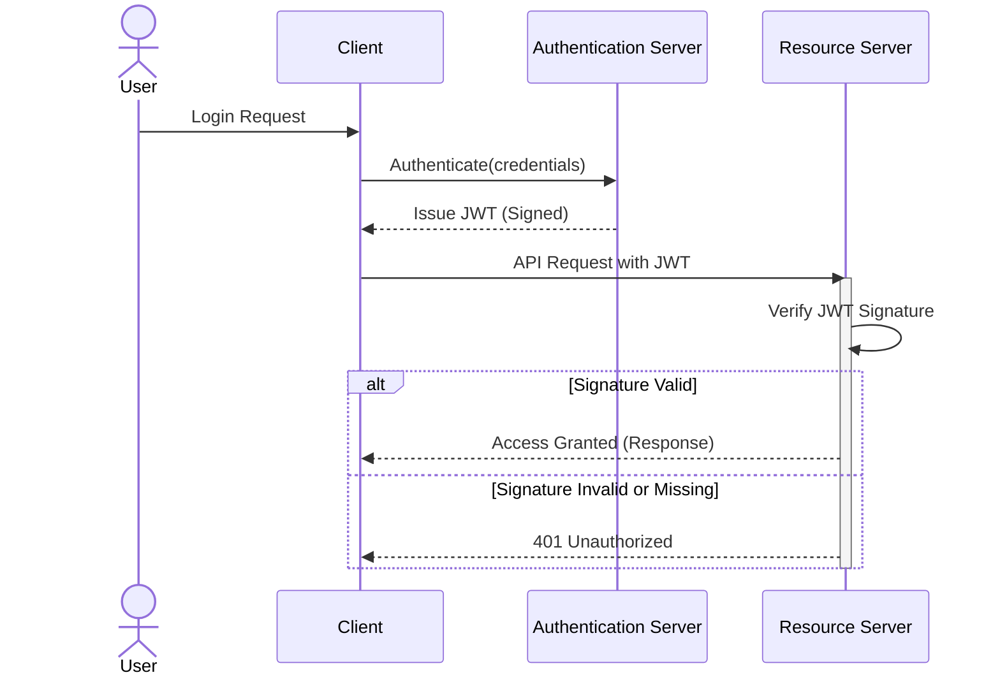

JSON Web Token (JWT)은 현대 웹 애플리케이션에서 인증 및 정보 교환을 위한 표준으로 널리 사용됩니다. 그러나 JWT의 핵심 보안 요소인 서명 검증(Signature Verification) 로직이 누락되거나 부실하게 구현될 경우, 심각한 인증 우회(Authentication Bypass) 취약점으로 이어질 수 있습니다. 최근 Microsoft 내부 서비스에서 발생한 JWT 서명 미검증 사고는 이러한 위협이 현실에서 얼마나 치명적인 결과를 초래할 수 있는지 여실히 보여줍니다. 본 문서는 JWT 서명 검증 로직의 중요성을 강조하고, 기존 및 신규 프로젝트에서 이를 감사하고 강화하는 실전 방안을 제시합니다.

## JWT 서명 검증의 중요성

JWT는 헤더(Header), 페이로드(Payload), 서명(Signature)의 세 부분으로 구성됩니다. 이 중 서명은 토큰의 무결성(Integrity)과 신뢰성(Authenticity)을 보장하는 핵심 요소입니다. 서버는 공유된 비밀 키(Secret Key) 또는 비대칭 키 쌍(Asymmetric Key Pair)의 공개 키(Public Key)를 사용하여 서명을 검증하며, 이를 통해 페이로드 내용이 변조되지 않았음과 토큰이 신뢰할 수 있는 발급자(Issuer)에 의해 생성되었음을 확인합니다.

서명 검증이 누락될 경우, 공격자는 JWT 페이로드의 클레임(Claim)을 임의로 수정하여 관리자 권한을 획득하거나 다른 사용자로 가장할 수 있습니다. 예를 들어, `upn` (User Principal Name) 클레임을 `admin`으로 변경하거나 `roles` 클레임에 `administrator`를 추가하는 등의 방식으로 시스템에 접근할 수 있게 됩니다. 이는 마치 신분증의 위조 여부를 확인하지 않고 내용만 보고 신분을 믿는 것과 같습니다.

## 일반적인 서명 검증 오류 패턴

*   **서명 검증 누락 (No Signature Verification)**: 가장 치명적인 오류로, 토큰의 서명 유무와 관계없이 페이로드를 신뢰합니다.
*   **'none' 알고리즘 허용 (Allowing 'none' Algorithm)**: `alg` 헤더에 `none` 값이 명시된 경우, 서명 없이도 토큰을 유효하게 처리하는 취약점입니다. 공격자는 이를 악용하여 서명을 제거한 토큰을 전송할 수 있습니다.
*   **키 교체 취약점 (Key Confusion Vulnerability)**: 비대칭 키(RSA 등)를 사용하는 JWT를 공격자가 대칭 키(HMAC)로 위조하고, 서버가 공개 키를 대칭 키로 해석하여 서명을 검증하게 만드는 취약점입니다.
*   **잘못된 키 사용 (Incorrect Key Usage)**: 개발 환경에서 사용하던 약한 키가 프로덕션 환경에 배포되거나, 모든 서비스에서 동일한 키를 재사용하여 공격 범위가 넓어지는 경우.



## 강력한 서명 검증 로직 구현

모든 JWT 사용 지점에서는 반드시 강력한 서명 검증 로직을 포함해야 합니다. 다음은 Python `PyJWT` 라이브러리를 사용한 예제입니다.

### 안전하지 않은(Insecure) JWT 처리 (서명 검증 없음)

```python
import jwt

# 공격자가 변조한 토큰 (예시)
insecure_token = "eyJhbGciOiJub25lIn0.eyJ1c2VybmFtZSI6ImFkbWluIiwicm9sZXMiOlsidXNlciIsImFkbWluaXN0cmF0b3IiXX0."

try:
    # 서명 검증 없이 디코딩 시도 (매우 위험!)
    # options={"`verify_signature`": False} 또는 `verify=False`는 절대 프로덕션에서 사용 금지
    decoded_payload = jwt.decode(insecure_token, options={"verify_signature": False}, algorithms=["none"])
    print("불안정한 디코딩 성공:", decoded_payload)
    # 공격자는 이 시점에서 관리자 권한 획득 가능
except jwt.InvalidTokenError as e:
    print(f"토큰 디코딩 실패: {e}")
```

위 코드는 `verify_signature`: False 옵션으로 서명 검증 없이 토큰을 디코딩하는 매우 위험한 예시입니다. 특히 `alg`가 `none`인 토큰도 받아들여지므로 절대 프로덕션 환경에서 사용해서는 안 됩니다.

### 안전한(Secure) JWT 서명 검증

```python
import jwt
from datetime import datetime, timedelta

# 실제 애플리케이션에서는 안전하게 관리되어야 할 비밀 키
SECRET_KEY = "your-super-secret-key-that-is-at-least-32-bytes-long"

# JWT 발급 (예시)
expires_at = datetime.utcnow() + timedelta(hours=1)
payload = {
    "username": "testuser",
    "roles": ["user"],
    "exp": expires_at
}
signed_jwt = jwt.encode(payload, SECRET_KEY, algorithm="HS256")
print("발급된 안전한 JWT:", signed_jwt)

# --- 서버 측에서 JWT 수신 및 검증 --- 

received_jwt = signed_jwt # 클라이언트로부터 받은 토큰이라고 가정

try:
    # 서명, 만료 시간, 알고리즘 등을 모두 검증
    # algorithms 매개변수는 허용할 알고리즘을 명시해야 함 (['none'] 포함 금지)
    decoded_payload = jwt.decode(received_jwt, SECRET_KEY, algorithms=["HS256"])
    print("안전한 디코딩 성공:", decoded_payload)
    print("사용자 역할:", decoded_payload["roles"])
except jwt.ExpiredSignatureError:
    print("오류: 토큰이 만료되었습니다.")
except jwt.InvalidTokenError as e:
    print(f"오류: 유효하지 않은 토큰입니다. ({e})")
except Exception as e:
    print(f"예상치 못한 오류 발생: {e}")
```

안전한 검증을 위해서는 반드시 비밀 키(또는 공개 키)를 제공하고, 허용할 `alg` 알고리즘을 명시해야 합니다. `algorithms=['none']`을 포함하는 것은 매우 위험합니다. 또한 `options`를 통해 추가적인 클레임 검증(예: `iss`, `aud`)을 강화할 수 있습니다.

## 2026년 최신 보안 트렌드 반영

2026년에는 제로 트러스트(Zero Trust) 아키텍처와 시프트 레프트(Shift Left) 보안 원칙이 더욱 중요해질 것입니다. JWT 서명 검증은 이러한 원칙의 핵심 구성 요소입니다. 자동화된 보안 감사 도구(SAST, DAST)와 CI/CD 파이프라인에 통합된 정적/동적 분석을 통해 JWT 관련 취약점을 개발 초기 단계부터 탐지하고 수정하는 것이 중요합니다. 또한, 분산 시스템에서의 키 관리(Key Management)는 중앙 집중식 키 관리 시스템(KMS)이나 하드웨어 보안 모듈(HSM)을 활용하여 더욱 안전하게 이루어져야 합니다.

## 트레이드오프

### 1. 보안 강화 vs. 성능 오버헤드
*   **언제 좋은가**: 민감한 데이터나 중요 기능에 접근하는 JWT는 엄격한 서명 검증과 추가 클레임 유효성 검사를 통해 보안을 최우선으로 해야 합니다. `RS256`과 같은 비대칭 암호화는 서명 생성은 느리지만, 검증은 비교적 빠르며 키 분배가 용이합니다.
*   **언제 나쁜가**: 초당 수천 건 이상의 트랜잭션을 처리하는 고성능 API에서 과도한 검증 로직이나 복잡한 비대칭 키 연산을 모든 요청에 적용하면 성능 저하를 초래할 수 있습니다. 이 경우, 캐싱 전략이나 HMAC과 같은 대칭 키 방식으로 속도를 확보하고, 대신 키 관리를 더 철저히 해야 합니다.

### 2. 구현 복잡성 vs. 취약점 노출 감소
*   **언제 좋은가**: `alg` 헤더 검증, 만료 시간 (`exp`), 발급자 (`iss`), 수신자 (`aud`) 등 다양한 클레임 검증을 포함하여 검증 로직을 견고하게 구현하면, `none` 알고리즘 취약점, 키 교체 취약점 등 알려진 공격 벡터에 대한 방어력이 크게 증가합니다.
*   **언제 나쁜가**: 너무 복잡한 검증 로직은 개발자의 실수로 인한 새로운 취약점을 유발하거나, 디버깅 및 유지보수를 어렵게 할 수 있습니다. 표준 라이브러리의 검증 기능을 최대한 활용하고 커스텀 로직은 최소화하는 것이 좋습니다.

### 3. 키 관리의 용이성 vs. 보안 레벨
*   **언제 좋은가**: 개별 서비스별로 고유한 비밀 키를 사용하고, 키 순환 정책을 주기적으로 적용하며, KMS와 같은 전문 솔루션을 통해 키를 안전하게 관리하면 시스템 전체의 보안 레벨이 크게 향상됩니다.
*   **언제 나쁜가**: 작은 규모의 서비스에서 키 관리 솔루션 도입은 불필요한 비용과 복잡성을 증가시킬 수 있습니다. 이 경우, 환경 변수나 시크릿 관리 도구를 활용하되, 접근 제어를 엄격히 하고 수동 키 순환 절차를 마련해야 합니다.

## 실전 체크리스트

`playbook` 프로젝트의 인증/인가 관련 모든 JWT 사용 지점(예: GitHub Actions, Vercel 배포, 내부 API 연동 등)에서 서명 검증 로직이 누락 없이 강력하게 구현되어 있는지 즉시 감사하고 강화합니다.

- [ ] **모든 JWT 소비 지점 식별**: 애플리케이션 내에서 JWT를 수신하고 사용하는 모든 엔드포인트(API 게이트웨이, 마이크로서비스, 클라이언트 앱, CI/CD 스크립트 등)를 목록화합니다.
- [ ] **서명 검증 로직 감사**: 식별된 모든 지점에서 JWT 라이브러리의 `verify_signature` 또는 유사한 기능이 활성화되어 있고, `alg` 헤더에 `none` 또는 예상치 못한 알고리즘이 허용되지 않는지 코드 리뷰를 통해 확인합니다.
- [ ] **키 관리 및 순환 정책 검토**: JWT 서명에 사용되는 비밀 키/공개 키가 안전하게 저장되고(예: 환경 변수, KMS), 주기적으로 순환되며, 각 서비스 또는 환경별로 고유한 키가 사용되는지 확인합니다.
- [ ] **클레임 유효성 검증 강화**: `exp` (만료), `nbf` (사용 전), `iss` (발급자), `aud` (수신자) 클레임 등이 적절히 검증되는지 확인하고, 애플리케이션의 비즈니스 로직에 필요한 추가 클레임(예: `roles`, `permissions`)도 철저히 검증합니다.
- [ ] **'none' 알고리즘 방어**: 사용 중인 JWT 라이브러리가 `alg: "none"` 토큰을 명시적으로 거부하도록 설정되어 있는지 확인하고, 가능한 경우 허용된 알고리즘 목록(예: `['HS256', 'RS256']`)을 화이트리스트 방식으로 적용합니다.
- [ ] **취약점 스캔 및 모의 침투 테스트**: 정적/동적 애플리케이션 보안 테스트(SAST/DAST) 도구를 활용하여 JWT 관련 취약점을 탐지하고, 전문 보안 팀의 모의 침투 테스트(Penetration Testing)를 통해 실제 공격 시나리오에 대한 방어력을 검증합니다.
- [ ] **로깅 및 모니터링 구현**: JWT 검증 실패 시 상세한 보안 이벤트 로그를 기록하고, 이상 탐지 시스템(SIEM)과 연동하여 비정상적인 JWT 요청 시 즉각적인 알림이 발생하도록 모니터링 시스템을 구축합니다.