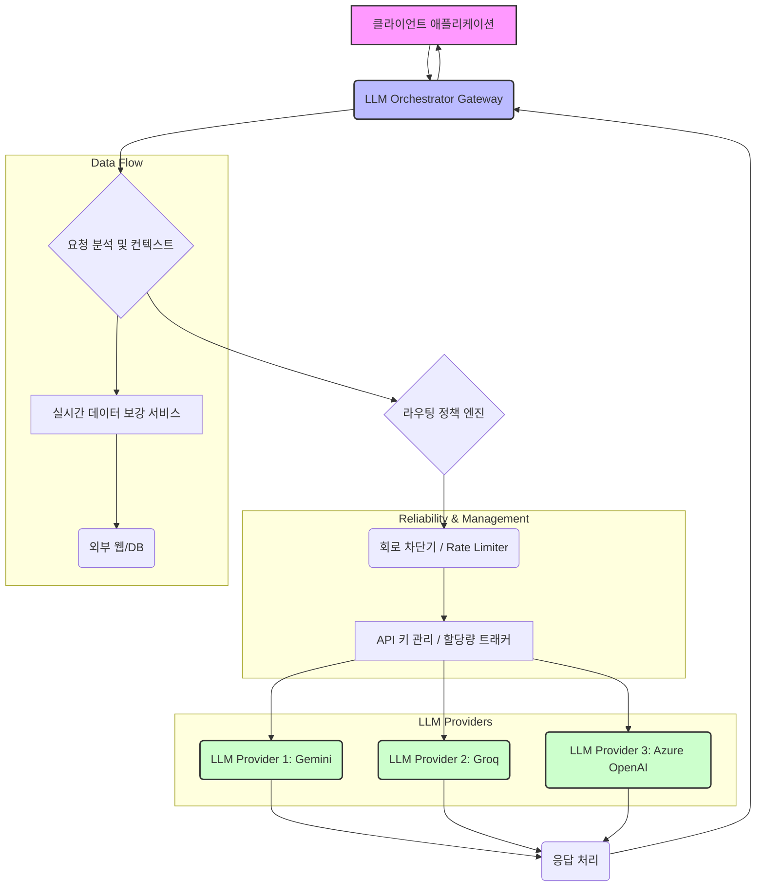

LLM (Large Language Model) 기반 시스템의 프로덕션 운영에 있어 안정성, 효율성, 그리고 비용 최적화는 핵심 과제입니다. 다양한 LLM 공급자들의 API를 활용하고 관리하는 과정에서 발생하는 지연, 실패, 할당량 제한 등의 문제를 해결하기 위해 지능형 호출 오케스트레이션(Orchestration) 패턴이 필수적으로 요구됩니다. 특히, HydraLLM과 같은 컨텍스트 인지 게이트웨이(Context-Aware Gateway)는 이러한 복잡성을 효과적으로 관리하며, 시스템의 전반적인 견고성을 향상시키는 데 기여합니다.

## LLM 호출 오케스트레이션의 필요성

대규모 LLM 애플리케이션은 종종 여러 공급자(예: OpenAI, Anthropic, Google Gemini, Groq)의 모델을 동시에 또는 교차적으로 사용합니다. 각 공급자는 고유한 API, 요금 모델, 성능 특성, 그리고 할당량 정책을 가집니다. 이러한 이질적인 환경에서 직접적인 API 호출은 다음과 같은 문제를 야기합니다.

*   **안정성 문제**: 특정 공급자의 서비스 중단, 지연, 또는 오류 발생 시 전체 시스템 장애로 이어질 수 있습니다.
*   **효율성 저하**: 고정된 라우팅 정책은 특정 LLM의 부하를 가중시키거나, 더 저렴하거나 빠른 모델을 활용하지 못하게 합니다.
*   **비용 비효율**: 모델별 성능-비용 트레이드오프를 고려하지 않은 호출은 불필요한 비용을 발생시킬 수 있습니다.
*   **관리 복잡성**: 다수의 API 키, 할당량, 버전 관리가 복잡해지고 보안 위험이 증가합니다.

지능형 LLM 오케스트레이터는 이러한 문제를 해결하기 위한 중앙 집중식 제어 지점(Centralized Control Point)을 제공합니다.

### 핵심 개념

1.  **컨텍스트 인지 라우팅 (Context-Aware Routing)**: 요청의 내용, 사용자 컨텍스트, 과거 성능 데이터, 비용 제약 조건 등을 분석하여 가장 적절한 LLM 공급자로 호출을 동적으로 라우팅합니다. 예를 들어, 간단한 질문은 저렴하고 빠른 모델로, 복잡한 코드 생성 요청은 특정 고성능 모델로 보낼 수 있습니다.
2.  **공급자 추상화 및 로드 밸런싱 (Provider Abstraction & Load Balancing)**: 다양한 LLM API를 단일 인터페이스로 추상화하고, 여러 공급자 간에 요청을 균형 있게 분산하여 단일 지점 실패(Single Point of Failure)를 방지하고 처리량을 최적화합니다.
3.  **안정성 패턴 (Reliability Patterns)**:
    *   **회로 차단기 (Circuit Breaker)**: 특정 공급자의 오류율이 임계값을 초과하면 해당 공급자로의 요청을 일시적으로 중단하여 cascading failures를 방지하고 서비스 복구를 위한 시간을 제공합니다.
    *   **재시도 메커니즘 (Retry Mechanisms)**: 일시적인 네트워크 오류나 API 제한과 같은 transient errors에 대해 Exponential Backoff 전략 등을 활용하여 자동으로 재시도합니다.
    *   **비율 제한 및 스로틀링 (Rate Limiting & Throttling)**: 각 공급자의 API 할당량(Quota) 및 속도 제한(Rate Limit)을 준수하여 429 Too Many Requests 오류를 방지합니다.
    *   **키 로테이션 및 할당량 관리 (Key Rotation & Quota Management)**: 다수의 API 키를 관리하고, 각 키의 사용량을 추적하여 할당량 소진 시 자동으로 다른 키로 전환하거나, 쿨다운(Cooldown) 정책을 적용합니다.
4.  **실시간 웹 보강 (Real-time Web Augmentation)**: LLM 요청 전, 외부 웹 서비스나 데이터베이스에서 실시간 정보를 가져와 프롬프트를 보강함으로써 LLM의 응답 품질과 최신성을 높입니다.

## 아키텍처 다이어그램

LLM 호출 오케스트레이터의 일반적인 아키텍처는 다음과 같습니다.



## 구현 예제: 파이썬 기반 미니 오케스트레이터

다음은 컨텍스트 기반 라우팅과 간단한 회로 차단기 개념을 포함하는 파이썬 기반의 미니 오케스트레이터 예시입니다.

```python
import time
import random
from collections import defaultdict

class CircuitBreaker:
    def __init__(self, failure_threshold=3, reset_timeout=30):
        self.failure_threshold = failure_threshold
        self.reset_timeout = reset_timeout
        self.failures = 0
        self.last_failure_time = 0
        self.is_open = False

    def record_success(self):
        self.failures = 0
        self.is_open = False

    def record_failure(self):
        self.failures += 1
        self.last_failure_time = time.time()
        if self.failures >= self.failure_threshold:
            self.is_open = True

    def allow_request(self):
        if not self.is_open:
            return True
        if time.time() - self.last_failure_time > self.reset_timeout:
            # Half-open state: allow a single trial request
            return True
        return False

class LLMOrchestrator:
    def __init__(self, providers):
        self.providers = providers  # {name: {'client': ..., 'cost_per_token': ..., 'latency': ...}}
        self.circuit_breakers = {name: CircuitBreaker() for name in providers}
        self.api_keys = defaultdict(lambda: iter([])) # For key rotation
        self.quotas = defaultdict(lambda: {'limit': float('inf'), 'used': 0, 'reset_time': 0})

    def register_api_keys(self, provider_name, keys):
        self.api_keys[provider_name] = iter(keys)

    def _get_next_api_key(self, provider_name):
        try:
            return next(self.api_keys[provider_name])
        except StopIteration:
            print(f"All keys for {provider_name} exhausted. Rotating...")
            # Implement logic to refresh keys or trigger cooldown
            return None # Or raise an exception

    def _simulate_llm_call(self, provider_name, prompt, api_key):
        # Simulate network latency and potential failures
        time.sleep(random.uniform(0.1, self.providers[provider_name]['latency']))
        if random.random() < 0.2: # 20% chance of failure
            raise Exception(f"Simulated failure from {provider_name}")
        return f"Response from {provider_name} for '{prompt}' using key {api_key}"

    def route_and_call(self, prompt, context):
        # 1. Context-Aware Routing Logic
        eligible_providers = []
        if "코드 생성" in prompt or "complex calculation" in context.get('type', ''):
            # Prioritize high-capability providers for complex tasks
            eligible_providers = [p for p in self.providers if p in ['Gemini', 'AzureOpenAI']]
        else:
            # For simple tasks, prioritize cost-effective/fast providers
            eligible_providers = [p for p in self.providers if p in ['Groq', 'Gemini']]

        random.shuffle(eligible_providers) # Basic load balancing

        for provider_name in eligible_providers:
            cb = self.circuit_breakers[provider_name]
            if not cb.allow_request():
                print(f"Circuit breaker open for {provider_name}. Skipping.")
                continue

            api_key = self._get_next_api_key(provider_name)
            if not api_key:
                print(f"No valid API key for {provider_name}. Skipping.")
                continue

            try:
                print(f"Attempting call to {provider_name} with key {api_key}...")
                response = self._simulate_llm_call(provider_name, prompt, api_key)
                cb.record_success()
                return response
            except Exception as e:
                print(f"Error calling {provider_name}: {e}")
                cb.record_failure()

        raise Exception("All eligible LLM providers failed or were unavailable.")

# --- Usage Example ---
providers_config = {
    'Gemini': {'client': 'gemini_client', 'cost_per_token': 0.0001, 'latency': 0.5},
    'Groq': {'client': 'groq_client', 'cost_per_token': 0.00005, 'latency': 0.1},
    'AzureOpenAI': {'client': 'azure_client', 'cost_per_token': 0.00015, 'latency': 0.7}
}

orchestrator = LLMOrchestrator(providers_config)
orchestrator.register_api_keys('Gemini', ['GEM_KEY_1', 'GEM_KEY_2'])
orchestrator.register_api_keys('Groq', ['GRQ_KEY_A'])
orchestrator.register_api_keys('AzureOpenAI', ['AZ_KEY_X', 'AZ_KEY_Y'])

queries = [
    ("간단한 인사말 생성", {}),
    ("파이썬 함수 작성: 퀵 정렬", {'type': 'code generation'}),
    ("오늘의 날씨 정보", {}),
    ("고성능 컴퓨팅 최적화 전략", {'type': 'complex calculation'})
]

for i in range(10):
    prompt, context = random.choice(queries)
    print(f"\n--- Query {i+1}: '{prompt}' (Context: {context}) ---")
    try:
        result = orchestrator.route_and_call(prompt, context)
        print(f"Result: {result}")
    except Exception as e:
        print(f"Failed to get response: {e}")
```

## 2026년 최신 트렌드 반영

LLM 호출 오케스트레이션은 지속적으로 발전하고 있습니다. 2026년에는 다음과 같은 트렌드가 더욱 가속화될 것으로 예상됩니다.

*   **초개인화된 라우팅 정책 (Hyper-Personalized Routing Policies)**: 사용자 개별의 과거 인터랙션, 선호도, 심지어 감정 상태까지 고려하여 실시간으로 최적의 LLM 모델을 선택하는 정책이 도입될 것입니다. 이는 단순한 컨텍스트 인지를 넘어선 초개인화된 AI 경험을 제공합니다.
*   **예측형 장애 감지 및 자가 복구 (Predictive Failure Detection & Self-Healing)**: 과거 데이터와 ML 모델을 활용하여 특정 LLM 공급자의 잠재적 장애를 미리 예측하고, 장애 발생 전에 선제적으로 트래픽을 다른 공급자로 전환하거나 대체 모델을 사용하는 자가 복구 시스템이 보편화될 것입니다.
*   **비용-성능 자동 최적화 (Autonomous Cost-Performance Optimization)**: 실시간으로 변화하는 LLM 시장의 요금, 성능, 그리고 특정 태스크에 대한 모델의 효율성 데이터를 기반으로, 비용과 성능 목표를 동시에 최적화하는 완전 자동화된 라우팅 알고리즘이 확산될 것입니다.
*   **에이전트 기반 오케스트레이션 (Agent-Based Orchestration)**: 오케스트레이터 자체가 독립적인 에이전트 역할을 수행하여, 특정 목표(예: '가장 저렴한 비용으로 고품질 답변 생성') 달성을 위해 스스로 학습하고, 동적으로 LLM 리소스를 관리하며, 복잡한 다단계 호출 체인을 조율할 것입니다.

## 트레이드오프

LLM 호출 오케스트레이션 패턴은 여러 장점을 제공하지만, 도입 시 고려해야 할 트레이드오프도 존재합니다.

*   **복잡성 증가 vs. 안정성/효율성 증대**:
    *   **언제 좋은가**: 여러 LLM 공급자를 사용하고 서비스 안정성 및 비용 효율성이 중요한 프로덕션 환경에 적합합니다. 장애 탄력성 및 자원 활용을 극대화할 수 있습니다.
    *   **언제 나쁜가**: 단일 LLM만 사용하거나, 개발 초기 단계로 복잡한 인프라 관리가 부담스러운 소규모 프로젝트에는 과도한 오버헤드가 될 수 있습니다.
*   **성능 오버헤드 vs. 동적 적응성**:
    *   **언제 좋은가**: 실시간으로 변화하는 LLM 공급자의 상태, 성능, 비용에 민감하게 반응하여 최적의 선택을 해야 하는 시스템에 유용합니다. 장기적인 관점에서 성능 및 비용 효율을 높입니다.
    *   **언제 나쁜가**: 극단적인 저지연(ultra-low latency)이 최우선인 애플리케이션에서는 오케스트레이터의 추가적인 처리 단계가 성능 병목을 일으킬 수 있습니다.
*   **인프라 구축 비용 vs. 운영 비용 절감**: 
    *   **언제 좋은가**: 대규모 LLM 호출이 발생하고, 다양한 공급자의 API를 활용하여 운영 비용을 절감하거나 특정 공급자에 대한 의존도를 낮추려는 경우, 초기 인프라 투자 이상의 장기적인 이점을 제공합니다.
    *   **언제 나쁜가**: 호출량이 적고 비용 절감 효과가 미미하며, 전담 운영 인력이 부족한 상황에서는 초기 구축 및 유지보수 비용이 더 클 수 있습니다.
*   **표준화 및 추상화 vs. 공급자 고유 기능 활용 제한**: 
    *   **언제 좋은가**: 여러 LLM 공급자 간의 전환을 용이하게 하고, 특정 공급자에 대한 락인(lock-in)을 방지하며, 일관된 API 인터페이스를 통해 개발 복잡성을 줄일 수 있습니다.
    *   **언제 나쁜가**: 특정 LLM 공급자만이 제공하는 독점적인 고급 기능(예: 특정 모드, 최적화된 프롬프트 형식)을 활용해야 할 경우, 오케스트레이터의 추상화 계층이 해당 기능의 직접적인 접근을 방해하거나 추가적인 래핑(wrapping)이 필요할 수 있습니다.

## 실전 체크리스트

LLM 호출 오케스트레이션 및 안정성 강화를 위해 프로젝트에 적용할 때 다음 항목들을 검증해야 합니다.

*   [ ] **라우팅 정책 정의**: 현재 애플리케이션의 태스크 유형(예: 요약, 코드 생성, 질의응답)과 각 LLM 공급자의 성능, 비용, 특성을 매핑하는 명확한 라우팅 정책이 문서화되어 있는지 확인합니다.
*   [ ] **회로 차단기 구현 및 테스트**: 각 LLM 공급자에 대한 회로 차단기(Circuit Breaker)가 올바르게 구현되었는지, 그리고 장애 발생 시 트래픽 전환 및 복구(Self-Healing) 시나리오가 정상적으로 작동하는지 부하 테스트를 통해 검증합니다.
*   [ ] **API 키 로테이션 및 할당량 관리**: API 키 로테이션 메커니즘이 안전하게 작동하는지, 각 LLM 공급자의 할당량(Quota) 및 속도 제한(Rate Limit)을 실시간으로 추적하고 적절히 제어하는지 확인합니다.
*   [ ] **LLM 공급자 헬스 체크 및 모니터링**: 각 LLM 공급자의 API 응답 시간, 오류율, 가용성 등을 지속적으로 모니터링하고, 이상 징후 발생 시 관리자에게 알림을 보내는 시스템이 구축되어 있는지 검토합니다.
*   [ ] **재시도 전략 구현**: transient errors (예: 네트워크 오류, 5xx 에러) 발생 시 Exponential Backoff를 포함한 합리적인 재시도(Retry) 전략이 적용되어 있는지, 그리고 무한 재시도를 방지하는 안전장치가 있는지 확인합니다.
*   [ ] **컨텍스트 인지 데이터 활용**: 요청 컨텍스트(예: 사용자 데이터, 이전 대화 기록, 실시간 웹 보강 데이터)를 활용하여 LLM 선택 및 프롬프트 최적화에 기여하는 로직이 구현되었는지 평가합니다.
*   [ ] **비용 및 지연 시간 메트릭 추적**: 각 LLM 공급자별 실제 호출 비용, 지연 시간(Latency) 및 처리량(Throughput) 메트릭을 수집하고 시각화하여, 오케스트레이션 정책의 효율성을 주기적으로 분석하고 개선할 수 있는 대시보드가 마련되어 있는지 점검합니다.
