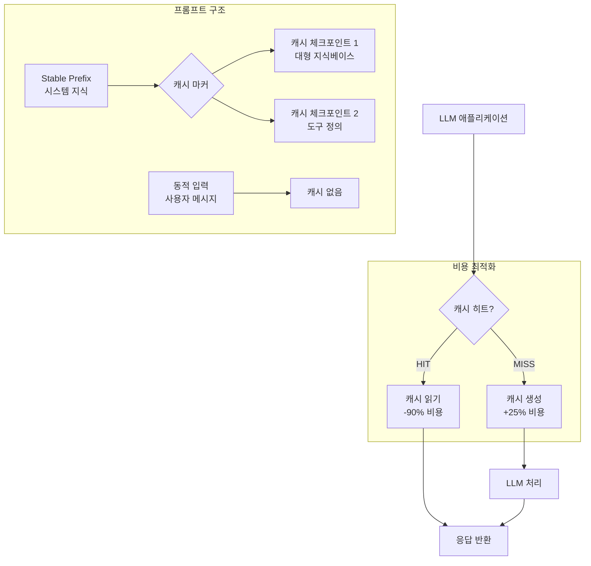

LLM API 비용의 60–80%는 시스템 프롬프트와 긴 컨텍스트의 반복 처리에서 발생합니다. 프롬프트 캐싱(Prompt Caching)은 이 반복 토큰 처리를 캐시 히트로 대체하여 입력 비용을 최대 90% 절감하는 핵심 인프라 패턴입니다. 2024–2026년에 Claude, OpenAI, Gemini 모두 프롬프트 캐싱을 GA로 출시하며 이 패턴이 프로덕션 필수 사항이 되었습니다.

## 캐싱 메커니즘 비교

| 공급자 | 캐싱 방식 | 캐시 수명 | 비용 절감 | 최소 캐시 길이 |
|---|---|---|---|---|
| **Claude (Anthropic)** | `cache_control: ephemeral` 마커 | 5분 (TTL 연장 가능) | 입력 토큰 90% 절감 | 1,024 tokens |
| **OpenAI** | 자동 캐싱 (구조 기반) | 1시간 | 입력 토큰 50% 절감 | 1,024 tokens |
| **Gemini** | 명시적 Context Caching API | 60분 (최대 수일) | 입력 토큰 75% 절감 | 32,768 tokens |

### Claude 프롬프트 캐싱 작동 원리

Claude API는 `cache_control: {"type": "ephemeral"}` 마커를 특정 메시지 블록에 부착하여 해당 지점까지의 prefix를 캐시합니다.

```python
import anthropic

client = anthropic.Anthropic()

# 시스템 프롬프트 (대용량 컨텍스트) — 캐시 대상
system_content = """
[긴 시스템 프롬프트: 10,000 토큰짜리 도메인 지식 문서]
...
"""

# 첫 번째 호출 — 캐시 생성 (MISS)
response = client.messages.create(
    model="claude-sonnet-4-6",
    max_tokens=1024,
    system=[
        {
            "type": "text",
            "text": system_content,
            "cache_control": {"type": "ephemeral"}  # 캐시 지점 마킹
        }
    ],
    messages=[{"role": "user", "content": "질문 1"}]
)

# cache_creation_input_tokens: 10000, cache_read_input_tokens: 0
print(response.usage)

# 두 번째 호출 — 캐시 HIT (5분 이내)
response2 = client.messages.create(
    model="claude-sonnet-4-6",
    max_tokens=1024,
    system=[
        {
            "type": "text",
            "text": system_content,
            "cache_control": {"type": "ephemeral"}
        }
    ],
    messages=[{"role": "user", "content": "질문 2"}]
)

# cache_creation_input_tokens: 0, cache_read_input_tokens: 10000 (90% 절감)
print(response2.usage)
```

## 캐시 히트율 극대화 설계 원칙

### 1. Stable Prefix 원칙

캐시는 **prefix** 기반입니다. 프롬프트 앞부분이 변경되면 캐시 미스가 발생합니다.

```
# BAD — 타임스탬프가 앞에 있어 매번 캐시 미스
"현재 시각: 2026-05-19 14:32 \n [긴 시스템 프롬프트] \n 사용자: ..."

# GOOD — 불변 컨텍스트를 앞에, 동적 데이터를 뒤에
"[긴 시스템 프롬프트] \n 현재 시각: 2026-05-19 14:32 \n 사용자: ..."
```

**순서 원칙**: `시스템 지식 (불변)` → `도구/함수 정의 (반불변)` → `대화 히스토리 (반가변)` → `현재 사용자 입력 (가변)`

### 2. 캐시 마커 계층화

여러 캐시 체크포인트를 두어 부분 캐시 히트를 활용합니다.

```python
# Claude: 최대 4개 캐시 마커 동시 활성화 가능
messages_with_cache = [
    # 체크포인트 1: 대형 시스템 문서 (거의 불변)
    {
        "type": "text",
        "text": large_knowledge_base,
        "cache_control": {"type": "ephemeral"}
    },
    # 체크포인트 2: 도구 정의 (가끔 변경)
    {
        "type": "text",
        "text": tool_definitions,
        "cache_control": {"type": "ephemeral"}
    },
    # 이후 대화 히스토리와 사용자 입력 추가 (캐시 X)
]
```

### 3. TTL 갱신 패턴

Claude 캐시 TTL은 기본 5분입니다. 동일한 캐시 prefix를 포함한 요청이 들어올 때마다 TTL이 리셋됩니다.

```python
# 대화가 긴 경우: 매 요청마다 cache_control 마커 유지 → TTL 자동 갱신
def chat_with_cache_refresh(history, new_message, system_doc):
    return client.messages.create(
        model="claude-sonnet-4-6",
        max_tokens=2048,
        system=[{
            "type": "text",
            "text": system_doc,
            "cache_control": {"type": "ephemeral"}  # 매 요청마다 TTL 갱신
        }],
        messages=history + [{"role": "user", "content": new_message}]
    )
```

## 비용 계산 및 ROI 측정

### Claude 캐싱 비용 구조 (claude-sonnet-4-6 기준)

| 토큰 유형 | 가격 |
|---|---|
| 일반 입력 (cache miss) | $3.00 / 1M tokens |
| 캐시 생성 (cache write) | $3.75 / 1M tokens (+25%) |
| 캐시 읽기 (cache hit) | $0.30 / 1M tokens (-90%) |

**실전 ROI 계산:**

```python
def calculate_cache_roi(
    system_prompt_tokens: int,
    requests_per_session: int,
    sessions_per_day: int,
    cache_hit_rate: float = 0.85
):
    """캐싱 도입 전후 비용 비교"""
    price_normal = 3.00 / 1_000_000       # $3.00/1M
    price_cache_write = 3.75 / 1_000_000  # $3.75/1M
    price_cache_read = 0.30 / 1_000_000   # $0.30/1M

    total_requests = requests_per_session * sessions_per_day

    # 캐싱 없이
    cost_without_cache = (
        system_prompt_tokens * total_requests * price_normal
    )

    # 캐싱 적용 시
    cache_misses = total_requests * (1 - cache_hit_rate)
    cache_hits = total_requests * cache_hit_rate

    cost_with_cache = (
        system_prompt_tokens * cache_misses * price_cache_write +
        system_prompt_tokens * cache_hits * price_cache_read
    )

    savings = cost_without_cache - cost_with_cache
    savings_pct = (savings / cost_without_cache) * 100

    return {
        "without_cache_daily": cost_without_cache,
        "with_cache_daily": cost_with_cache,
        "savings_daily": savings,
        "savings_percent": round(savings_pct, 1)
    }

# 예시: 10K 토큰 시스템 프롬프트, 50 요청/세션, 100 세션/일
result = calculate_cache_roi(10_000, 50, 100)
# → 85% 히트율 시 일 비용 $15 → $1.5 (90% 절감)
```

### 히트율 측정 및 모니터링

```python
import statistics
from dataclasses import dataclass, field

@dataclass
class CacheMetrics:
    hits: list[int] = field(default_factory=list)
    misses: list[int] = field(default_factory=list)
    creation: list[int] = field(default_factory=list)

    def record(self, usage):
        read = getattr(usage, 'cache_read_input_tokens', 0) or 0
        created = getattr(usage, 'cache_creation_input_tokens', 0) or 0
        self.hits.append(read)
        self.creation.append(created)
        if read == 0 and created > 0:
            self.misses.append(1)

    @property
    def hit_rate(self) -> float:
        total = len(self.hits) + len(self.misses)
        if total == 0:
            return 0.0
        return len([h for h in self.hits if h > 0]) / total

    @property
    def avg_tokens_saved(self) -> float:
        return statistics.mean(self.hits) if self.hits else 0

metrics = CacheMetrics()

# API 호출 후
metrics.record(response.usage)
print(f"Cache hit rate: {metrics.hit_rate:.1%}")
print(f"Avg tokens saved per request: {metrics.avg_tokens_saved:.0f}")
```

## 멀티에이전트 시스템에서의 캐싱 전략

에이전트 시스템에서 프롬프트 캐싱은 특히 효과적입니다. 도구 정의와 공유 지식베이스가 모든 에이전트 호출에서 반복되기 때문입니다.

```python
class CachedAgentRunner:
    """캐시를 활용하는 에이전트 러너"""

    def __init__(self, tools: list, knowledge_base: str):
        self.client = anthropic.Anthropic()
        self.tools = tools
        self.knowledge_base = knowledge_base
        self.conversation_history = []

    def _build_system_with_cache(self) -> list:
        return [
            {
                "type": "text",
                "text": self.knowledge_base,
                "cache_control": {"type": "ephemeral"}
            }
        ]

    def run(self, user_input: str) -> str:
        self.conversation_history.append({
            "role": "user",
            "content": user_input
        })

        response = self.client.messages.create(
            model="claude-sonnet-4-6",
            max_tokens=4096,
            system=self._build_system_with_cache(),
            tools=self.tools,
            messages=self.conversation_history
        )

        # 캐시 효율 로깅
        usage = response.usage
        print(f"Cache: read={usage.cache_read_input_tokens}, "
              f"written={usage.cache_creation_input_tokens}")

        assistant_message = response.content[0].text
        self.conversation_history.append({
            "role": "assistant",
            "content": assistant_message
        })
        return assistant_message
```

## Gemini Context Caching

Gemini는 별도 API로 대용량 컨텍스트를 명시적으로 캐시합니다. 32K+ 토큰의 매우 긴 문서에 적합합니다.

```python
import google.generativeai as genai
from google.generativeai import caching
import datetime

# 대용량 문서 캐싱 (예: 전체 코드베이스, 긴 매뉴얼)
cache = caching.CachedContent.create(
    model="gemini-1.5-pro-002",
    display_name="product_documentation",
    contents=[{
        "role": "user",
        "parts": [{"text": very_long_document}]  # 32K+ tokens
    }],
    ttl=datetime.timedelta(hours=1)
)

# 캐시 재사용
model = genai.GenerativeModel.from_cached_content(cached_content=cache)
response = model.generate_content("이 문서에서 X 정보를 찾아줘")
```

## 아키텍처 다이어그램



## 트레이드오프

- **언제 좋은가**: 시스템 프롬프트 ≥ 1K 토큰 + 동일 prefix 반복 ≥ 3회 이상인 모든 프로덕션 시스템. 멀티에이전트, RAG, 챗봇에서 특히 ROI가 높음
- **언제 나쁜가**: 매 요청마다 시스템 프롬프트가 완전히 달라지는 one-shot API 사용 패턴. Gemini의 경우 32K 미만 단기 컨텍스트는 최소 캐시 길이 미달로 캐싱 불가
- **숨겨진 비용**: 캐시 생성은 일반 입력 대비 +25% 비쌈. 히트율이 낮으면 오히려 손해 — 히트율 ≥ 30%부터 ROI 양수 (Claude 기준)

## 실전 체크리스트

- [ ] 시스템 프롬프트를 stable prefix (불변) → tool defs → dynamic input 순서로 재구성
- [ ] `cache_control: ephemeral` 마커 추가 (Claude)
- [ ] 응답 `usage.cache_read_input_tokens` / `cache_creation_input_tokens` 메트릭 로깅
- [ ] 히트율 = cache_hits / (cache_hits + cache_misses) 계산 → 목표 ≥ 70%
- [ ] TTL 갱신: 대화형 시스템에서 매 요청마다 캐시 마커 유지
- [ ] 세션 간 공유 지식베이스는 별도 캐시 체크포인트 분리
- [ ] 히트율 < 30% 시 프롬프트 구조 재검토 (prefix 변동 원인 추적)
