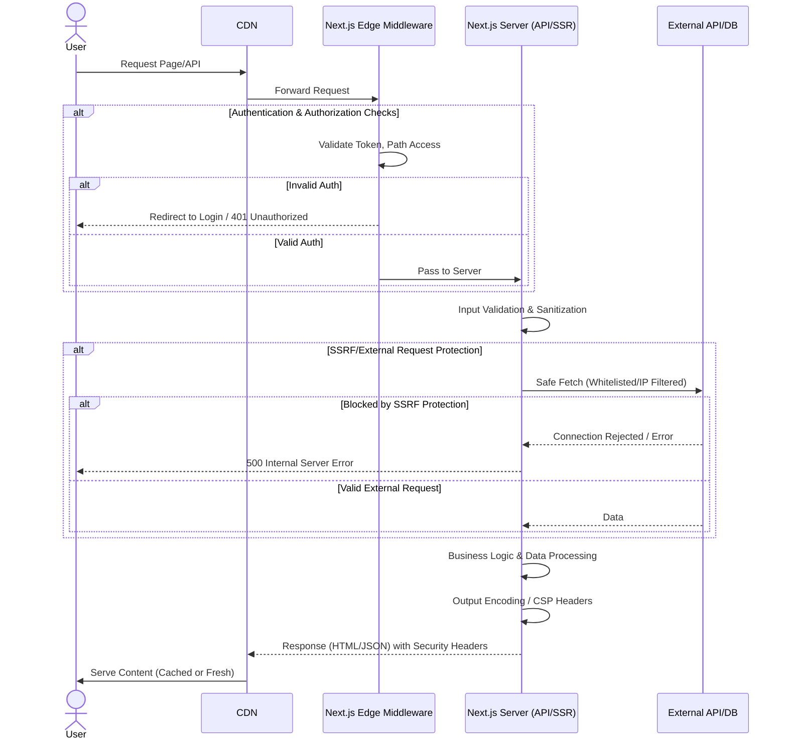

최근 React 및 Next.js에서 다수의 보안 취약점이 공개됨에 따라, 프로덕션 환경의 Next.js 애플리케이션은 즉각적인 패치 및 방어 로직 강화가 필수적이다. 서비스 거부(DoS), 미들웨어 우회, SSRF (Server-Side Request Forgery), XSS (Cross-Site Scripting), 캐시 포이즈닝 등 다양한 공격 벡터가 High 심각도로 보고되었으며, 이는 애플리케이션의 안정성과 사용자 데이터의 기밀성에 심각한 위협을 초래할 수 있다. 이 문서는 Next.js 애플리케이션의 보안 상태를 강화하기 위한 핵심 전략과 실전 체크리스트를 제시한다.

## Next.js 핵심 보안 패치 전략

가장 기본적인 방어선은 Next.js 및 관련 라이브러리의 최신 보안 패치 버전을 유지하는 것이다. Vercel 팀은 이러한 취약점에 대한 패치를 신속하게 제공하므로, 즉각적인 업데이트가 요구된다.

### 1. Next.js 버전 업데이트

애플리케이션의 `package.json` 파일에서 `next` 의 버전을 최신 권장 보안 패치 버전으로 업데이트해야 한다. 일반적으로 `npm outdated next` 또는 `yarn outdated next` 명령으로 현재 버전과 최신 버전을 확인할 수 있다. 이후 다음 명령어를 통해 업데이트를 수행한다.

```bash
npm install next@latest react@latest react-dom@latest
# 또는
yarn upgrade next react react-dom
```

업데이트 후에는 `next upgrade` 명령어를 실행하여 마이그레이션 도구를 활용하고, 프로젝트의 모든 의존성을 재설치하는 것이 좋다.

```bash
npm run next upgrade
npm install # 또는 yarn install
```

### 2. 의존성 취약점 감사 및 수정

`npm audit` 또는 `yarn audit` 명령어를 주기적으로 실행하여 프로젝트 내의 모든 의존성에 대한 보안 취약점을 점검하고, 발견된 취약점은 가능한 한 빠르게 수정해야 한다. 특히 'High' 또는 'Critical' 등급의 취약점은 우선적으로 처리한다.

```bash
npm audit
npm audit fix --force # 필요한 경우
```

## 방어 로직 강화: 심층 방어 (Defense-in-Depth)

버전 패치만으로는 모든 공격을 막을 수 없으므로, 애플리케이션 레벨에서 추가적인 방어 로직을 강화하여 심층 방어 전략을 구축해야 한다.

### 1. 강력한 입력 유효성 검사 및 Sanitization

XSS, SSRF, SQL Injection (데이터베이스와 연동 시) 등 많은 웹 취약점은 사용자로부터 받은 입력이 제대로 검증되거나 정제되지 않았을 때 발생한다. Next.js 환경에서는 API Routes, `getServerSideProps`, `getStaticProps` 등 서버 측에서 데이터를 처리하는 모든 지점에서 입력 유효성 검사를 수행해야 한다.

```typescript
// pages/api/submit-data.ts
import type { NextApiRequest, NextApiResponse } from 'next';
import { z } from 'zod'; // 예시: Zod를 이용한 스키마 유효성 검사
import DOMPurify from 'dompurify'; // 예시: HTML Sanitization

const FormDataSchema = z.object({
  name: z.string().min(1, 'Name is required').max(100),
  email: z.string().email('Invalid email address'),
  message: z.string().max(1000).transform(val => DOMPurify.sanitize(val))
});

export default function handler(req: NextApiRequest, res: NextApiResponse) {
  if (req.method === 'POST') {
    try {
      const validatedData = FormDataSchema.parse(req.body);
      // 유효성 검사 및 Sanitization 완료된 데이터로 로직 수행
      res.status(200).json({ success: true, data: validatedData });
    } catch (error) {
      if (error instanceof z.ZodError) {
        return res.status(400).json({ success: false, errors: error.errors });
      }
      res.status(500).json({ success: false, message: 'Internal Server Error' });
    }
  }
}
```

클라이언트 측 유효성 검사는 사용자 경험을 위한 것이며, 보안 수단으로 간주해서는 안 된다.

### 2. Content Security Policy (CSP) 구현

CSP는 XSS 공격을 포함한 다양한 콘텐츠 주입 공격을 완화하는 효과적인 수단이다. Next.js에서는 `next.config.js` 파일의 `headers` 설정을 통해 CSP를 적용할 수 있다.

```javascript
// next.config.js
const ContentSecurityPolicy = `
  default-src 'self';
  script-src 'self' 'unsafe-eval' 'unsafe-inline'; // Next.js 개발 모드에 필요, 프로덕션에서는 제거하거나 최소화
  style-src 'self' 'unsafe-inline';
  img-src 'self' data: https:;
  font-src 'self';
  object-src 'none';
  media-src 'self';
  frame-src 'self';
  connect-src 'self' https://*.vercel-insights.com; # 분석 도구 등 외부 연결 허용
`;

const securityHeaders = [
  {
    key: 'X-DNS-Prefetch-Control',
    value: 'on'
  },
  {
    key: 'Strict-Transport-Security',
    value: 'max-age=63072000; includeSubDomains; preload'
  },
  {
    key: 'X-XSS-Protection',
    value: '1; mode=block'
  },
  {
    key: 'X-Frame-Options',
    value: 'SAMEORIGIN'
  },
  {
    key: 'Permissions-Policy',
    value: 'camera=(), microphone=(), geolocation=()'
  },
  {
    key: 'X-Content-Type-Options',
    value: 'nosniff'
  },
  {
    key: 'Referrer-Policy',
    value: 'origin-when-cross-origin'
  },
  {
    key: 'Content-Security-Policy',
    value: ContentSecurityPolicy.replace(/\s{2,}/g, ' ').trim()
  }
];

module.exports = {
  async headers() {
    return [
      {
        source: '/:path*',
        headers: securityHeaders
      }
    ];
  }
};
```

CSP는 매우 엄격하게 설정해야 하며, `unsafe-inline`이나 `unsafe-eval`과 같은 지시어는 프로덕션 환경에서는 최소화하거나 완전히 제거하는 것을 목표로 해야 한다.

### 3. SSRF (Server-Side Request Forgery) 방어

Next.js 애플리케이션이 외부 URL로 요청을 보내는 경우 (예: 이미지 프록시, 웹훅, 외부 API 호출), SSRF 공격에 취약할 수 있다. 공격자가 서버가 내부 네트워크 리소스나 다른 민감한 서버로 요청을 보내도록 조작할 수 있기 때문이다. 이를 방어하기 위해 다음과 같은 조치를 취할 수 있다.

*   **Whitelisting:** 허용된 도메인 리스트를 명시적으로 관리하고, 해당 리스트에 없는 도메인으로의 요청은 차단한다.
*   **Private IP 필터링:** 요청하려는 URL이 `127.0.0.1`, `10.0.0.0/8`, `172.16.0.0/12`, `192.168.0.0/16` 등과 같은 사설 IP 주소로 해석될 경우 요청을 차단한다.

```typescript
import { URL } from 'url';
import { isIP } from 'net';

const allowedDomains = ['api.example.com', 'trusted-cdn.com'];
const privateIpRanges = [
  /^10\./,
  /^172\.(1[6-9]|2[0-9]|3[0-1])\./,
  /^192\.168\./,
  /^127\./,
];

function isPrivateIP(ip: string): boolean {
  if (!isIP(ip)) return false; // Not an IP, or invalid IP
  return privateIpRanges.some(range => range.test(ip));
}

async function safeFetch(url: string, options?: RequestInit) {
  const parsedUrl = new URL(url);
  if (!allowedDomains.includes(parsedUrl.hostname)) {
    // Hostname이 whitelisting에 없는 경우 DNS 조회를 통해 IP 확인
    const dns = require('dns/promises');
    try {
      const addresses = await dns.lookup(parsedUrl.hostname);
      if (isPrivateIP(addresses.address)) {
        throw new Error('SSRF attempt: Private IP detected');
      }
    } catch (e) {
      throw new Error(`Invalid hostname or DNS resolution failed: ${e.message}`);
    }
    // Whitelist에 없으면 차단 (선택적)
    // throw new Error(`Untrusted domain: ${parsedUrl.hostname}`);
  }
  return fetch(url, options);
}

// 사용 예시
// await safeFetch('http://api.example.com/data');
```

### 4. 캐시 포이즈닝 (Cache Poisoning) 방지

CDN이나 프록시 서버를 사용하는 Next.js 애플리케이션은 캐시 포이즈닝 공격에 취약할 수 있다. 공격자가 조작된 HTTP 헤더나 쿼리 파라미터를 사용하여 캐시를 오염시키면, 다른 사용자에게도 잘못된/악의적인 응답이 제공될 수 있다. 이를 방지하기 위해서는:

*   **`Vary` 헤더 사용:** 캐싱될 응답이 특정 요청 헤더에 따라 달라지는 경우 `Vary` 헤더를 적절히 설정하여, 해당 헤더 값에 따라 캐시를 분리하도록 지시한다 (예: `Vary: Accept-Encoding, User-Agent`).
*   **사용자 입력에 기반한 캐시 키 정제:** 사용자 입력이 캐시 키의 일부로 사용되는 경우, 해당 입력을 엄격하게 정제하고 예측 가능한 형태로 만들어야 한다. 예를 들어, `Referer` 헤더를 캐시 키로 사용하지 않거나, 사용할 경우 신뢰할 수 있는 Referer만 허용한다.
*   **보안 헤더 설정:** `Cache-Control` 헤더를 적절히 설정하여 민감한 정보가 캐시되지 않도록 `no-store`, `no-cache` 등을 사용한다.

### 5. Secure Middleware 및 Authentication/Authorization

최근 Next.js 보안 취약점 중 미들웨어 우회가 언급되었다. Next.js의 미들웨어는 요청이 페이지 핸들러에 도달하기 전에 로직을 실행할 수 있는 강력한 기능이지만, 제대로 구성되지 않으면 보안 취약점이 될 수 있다. 모든 미들웨어는 인증/인가 로직이 견고하게 설계되어야 하며, 특정 경로에 대한 접근 제어가 우회되지 않도록 신중하게 테스트해야 한다. 특히 `_middleware.ts` 또는 `middleware.ts` 파일의 로직은 보안상 중요한 역할을 하므로 면밀한 검토가 필요하다.

## Next.js Secure Request Flow

다음은 Next.js 애플리케이션에서 보안 로직이 어떻게 요청 흐름에 통합될 수 있는지 보여주는 Mermaid 다이어그램이다.



## 2026년 Next.js 보안 트렌드

2026년에는 Next.js 애플리케이션 보안에서 다음과 같은 트렌드가 더욱 중요해질 것이다.

*   **Shift-Left Security:** 개발 초기 단계부터 보안을 고려하는 'Shift-Left' 접근 방식이 더욱 강조된다. SAST (Static Application Security Testing) 및 DAST (Dynamic Application Security Testing) 도구가 CI/CD 파이프라인에 통합되어 코드 작성 단계에서부터 취약점을 식별하고 수정하는 프로세스가 보편화될 것이다.
*   **AI 기반 위협 탐지 및 대응:** AI/ML 모델을 활용하여 비정상적인 사용자 행동, API 호출 패턴, 네트워크 트래픽 등을 분석하여 제로데이 공격이나 알려지지 않은 위협을 실시간으로 탐지하고 대응하는 시스템이 고도화될 것이다. Next.js 애플리케이션의 런타임 보안 (RASP) 또한 AI와 결합될 수 있다.
*   **Serverless/Edge Security Posture Management:** Next.js가 Vercel과 같은 플랫폼에서 Serverless Function 및 Edge Runtime을 활용함에 따라, 이러한 분산 환경에서의 보안 설정, 취약점 관리, 권한 제어가 더욱 복잡해지고 중요해질 것이다. 각 Edge Node의 보안 상태를 중앙에서 관리하고 모니터링하는 솔루션이 부상할 것이다.
*   **API-Centric Zero Trust Architecture:** Next.js 애플리케이션의 백엔드 API와의 통신에 'Zero Trust' 원칙이 더욱 엄격하게 적용될 것이다. 모든 API 요청은 신뢰할 수 없는 것으로 간주하고, 최소 권한 원칙에 따라 명확한 인증 및 인가 절차를 거치도록 설계된다.

## 트레이드오프

### 즉시 패치 vs. 안정성 확보
*   **언제 좋은가 (장점):** 공개된 Critical 취약점에 대한 신속한 대응으로 즉각적인 위협을 제거하고, 최신 보안 기능 및 성능 개선 사항을 활용할 수 있다.
*   **언제 나쁜가 (단점):** 패치 업데이트 과정에서 예기치 않은 하위 호환성 문제, 의존성 충돌, 또는 기존 로직의 리그레션이 발생할 수 있어 충분한 테스트 기간이 필요하다.

### 강화된 방어 로직 구현 vs. 개발 복잡성 및 성능 오버헤드
*   **언제 좋은가 (장점):** 심층 방어 (Defense-in-Depth) 전략을 통해 알려지지 않은 위협 (Zero-Day)에 대한 회복탄력성을 높이고, 애플리케이션의 전반적인 보안 수준을 향상시킬 수 있다.
*   **언제 나쁜가 (단점):** 보안 로직 (예: 정교한 CSP, 복잡한 입력 유효성 검사)을 구현하고 유지 관리하는 데 개발 시간과 노력이 추가되며, 과도한 보안 검사 로직은 애플리케이션의 런타임 성능에 미세한 영향을 줄 수 있다.

### 엄격한 CSP vs. 개발 유연성 및 서드파티 통합
*   **언제 좋은가 (장점):** XSS 공격 벡터를 크게 줄이고, 악성 스크립트 실행을 효과적으로 차단하여 클라이언트 측 보안을 강화한다.
*   **언제 나쁜가 (단점):** 초기 설정 및 디버깅이 까다롭고, `unsafe-inline`이나 `unsafe-eval` 없이 서드파티 라이브러리 (예: Google Analytics, Hotjar)를 통합할 때 호환성 문제가 발생하여 추가적인 설정 작업이 필요할 수 있다.

## 실전 체크리스트

프로젝트에 Next.js 보안 강화 로직을 적용할 때 다음 항목들을 검증한다.

- [ ] 모든 Next.js 프로젝트 `package.json`의 `next` 버전이 최신 보안 패치 버전 (예: Vercel 공식 권장 버전)으로 업데이트되었는지 확인한다.
- [ ] `npm audit` 또는 `yarn audit` 실행 결과, 심각도 'High' 이상의 취약점 목록이 제로화되었는지 확인한다.
- [ ] 모든 사용자 입력 필드 (쿼리 파라미터, 바디, 헤더)에 대해 서버 사이드 입력 유효성 검사 및 Sanitization 로직이 구현되었는지 확인한다.
- [ ] 애플리케이션에 적합한 Content Security Policy (CSP)가 `next.config.js` 또는 미들웨어에서 설정되었으며, 프로덕션 환경에서 정상 동작하는지 검증한다.
- [ ] 외부 리소스 요청 로직 (예: `fetch` API)에 SSRF 방지를 위한 Whitelisting 또는 Private IP 필터링이 적용되었는지 확인한다.
- [ ] 미들웨어 로직이 인증/인가 없이 우회될 수 있는 경로가 없는지, 모든 보안 경계가 견고하게 설정되었는지 보안 검토를 완료한다.
- [ ] 캐시 로직에서 사용자 입력에 기반한 캐시 키를 사용할 경우, 캐시 포이즈닝 방지 로직 (예: 엄격한 Sanitization, `Vary` 헤더)이 적용되었는지 확인한다.
- [ ] 민감한 환경 변수 (API Keys, Secrets)가 클라이언트 사이드 번들로 노출되지 않고, 서버 환경에서만 안전하게 사용되는지 확인한다.
