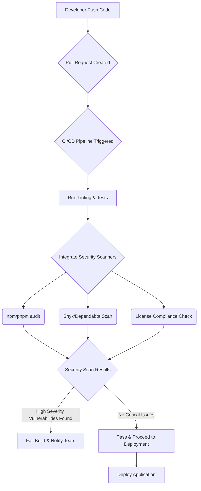

소프트웨어 공급망 공격은 현대 개발 환경에서 가장 심각한 보안 위협 중 하나입니다. 특히 npm, pnpm과 같은 패키지 매니저를 사용하는 Node.js 생태계는 수많은 오픈소스 의존성을 포함하므로 공격의 잠재적 진입점이 매우 넓습니다. 최근 Bitwarden CLI 패키지가 Checkmarx 공급망 공격 캠페인의 일환으로 손상된 사례는 이러한 위협이 현실임을 분명히 보여줍니다. `@bitwarden/cli` 2026.4.0 빌드에 포함된 악성코드 `bw1.js`는 패키지 무결성이 깨졌을 때 발생하는 심각한 문제를 시사합니다. 이러한 공격은 단순히 민감 정보 유출을 넘어, 시스템 제어권 탈취, 백도어 설치 등 광범위한 피해를 야기할 수 있습니다.

## npm/pnpm 공급망 보안 위협 이해

공급망 공격은 개발 프로세스의 어느 단계에서든 발생할 수 있습니다. 예를 들어, 공격자는 개발자가 자주 사용하는 인기 있는 라이브러리에 악성 코드를 삽입하거나, 오타를 이용한 타이포스쿼팅(typosquatting) 공격을 통해 유사한 이름의 악성 패키지를 배포할 수 있습니다. 또한, 개발자의 계정을 탈취하여 정상적인 패키지 업데이트에 악성 코드를 포함시키거나, CI/CD 파이프라인을 공격하여 빌드 프로세스를 오염시킬 수도 있습니다.

Node.js 생태계에서는 다음과 같은 벡터가 주요 공격 대상이 됩니다:

*   **악성 패키지 등록**: 공격자가 직접 악성 코드를 포함한 패키지를 npm 레지스트리에 배포합니다.
*   **기존 패키지 탈취**: 유명 패키지의 maintainer 계정을 탈취하여 악성 업데이트를 배포합니다.
*   **의존성 혼동(Dependency Confusion)**: 내부 패키지와 외부 패키지 이름이 겹칠 때, 공개 레지스트리의 악성 패키지가 우선적으로 설치되도록 유도합니다.
*   **typosquatting**: 유명 패키지 이름과 유사한 이름을 가진 악성 패키지를 만들어 개발자의 오타를 유도합니다.
*   **Lockfile 조작**: `package-lock.json`이나 `pnpm-lock.yaml` 파일이 조작되어 검증되지 않은 의존성이 설치됩니다.

## 선제적 감사 및 강화 전략

### 1. 의존성 취약점 스캔 자동화

가장 기본적인 단계는 모든 프로젝트의 의존성에 대해 정기적으로 취약점 스캔을 수행하는 것입니다. `npm audit`과 `pnpm audit`은 내장된 도구로, 잘 알려진 취약점을 감지하는 데 유용합니다. 그러나 이들은 Public Advisory Database에 보고된 취약점에만 의존하며, 제로데이 공격이나 알려지지 않은 위협에는 취약합니다.

```bash
# npm 프로젝트의 취약점 스캔
npm audit

# pnpm 프로젝트의 취약점 스캔
pnpm audit

# 높은 심각도 취약점만 보고하고, 수정 가능한 경우 자동 수정 시도
npm audit --audit-level=high --fix

# CI 환경에서 취약점 발견 시 빌드 실패
npm audit --audit-level=critical --json || exit 1
```

2026년 트렌드는 이러한 기본 스캔을 넘어, Snyk, Dependabot, Renovate와 같은 전문 SCA(Software Composition Analysis) 도구의 통합을 요구합니다. 이들 도구는 더 광범위한 취약점 데이터베이스를 활용하고, 코드 레벨 분석, 라이선스 준수 검사, 그리고 자동화된 보안 패치 PR 생성을 지원합니다.

### 2. Lockfile 무결성 검증

`package-lock.json` 또는 `pnpm-lock.yaml` 파일은 프로젝트의 의존성 트리를 고정하여 빌드의 재현성을 보장합니다. 이 파일에는 각 패키지의 버전뿐만 아니라 `integrity` 해시 값이 포함되어 있어, 다운로드된 패키지가 변조되지 않았음을 cryptographic하게 검증할 수 있습니다. CI/CD 파이프라인에서 이 `integrity` 값을 항상 확인해야 합니다.

```json
{
  "name": "my-app",
  "version": "1.0.0",
  "lockfileVersion": 3,
  "requires": true,
  "packages": {
    "node_modules/lodash": {
      "version": "4.17.21",
      "resolved": "https://registry.npmjs.org/lodash/-/lodash-4.17.21.tgz",
      "integrity": "sha512-v2kDEe57lecTulaDIuNTPy3Ry4gLGJ6Z1ngQrgQ+x2bXwX/b/i0lI+YlZ5l+M+Dq/BwK/c6L/S+Q==",
      "dev": true
    }
  }
}
```
`integrity` 필드는 `npm install` 또는 `pnpm install` 시 자동으로 검증되며, 해시 값이 일치하지 않으면 설치가 실패합니다. 이는 중간자 공격(man-in-the-middle attack)이나 레지스트리 변조로부터 보호하는 중요한 방어선입니다.

### 3. CI/CD 파이프라인 통합

공급망 보안 검사를 개발 워크플로우 초기에 통합하는 것은 매우 중요합니다. Pull Request가 생성될 때마다, 코드 베이스에 새로운 의존성이 추가되거나 기존 의존성이 업데이트될 때마다 자동화된 보안 스캔이 실행되어야 합니다.



위 다이어그램은 CI/CD 파이프라인 내에서 보안 스캔이 어떻게 통합되는지를 보여줍니다. 빌드 단계에서 취약점이 발견되면 즉시 빌드를 실패시키고 담당 팀에 알림을 보내는 정책을 수립해야 합니다.

### 4. 사설 npm 레지스트리 및 Proxy 활용

내부적으로 사설 npm 레지스트리(예: Verdaccio, Nexus Repository Manager)를 운영하여 외부 레지스트리 의존성을 프록시하고 캐싱하는 전략을 고려할 수 있습니다. 이를 통해 외부 공격으로부터의 직접적인 노출을 줄이고, 내부적으로 승인된 패키지만 사용하도록 강제할 수 있습니다. 또한, 패키지를 내부 레지스트리에 발행하기 전에 추가적인 보안 검사를 수행하는 워크플로우를 구축할 수 있습니다.

### 5. 런타임 보안 강화

설치 시점의 보안을 넘어, 런타임 환경에서도 잠재적 위협을 감지하고 차단하는 전략이 필요합니다. Node.js `worker_threads`나 `vm` 모듈을 사용하여 의심스러운 코드를 격리된 환경에서 실행하거나, Deno와 같이 샌드박스(sandbox) 기능을 기본으로 제공하는 런타임을 고려하는 것도 한 방법입니다. 그러나 이는 아키텍처 변경을 수반하므로 신중한 접근이 필요합니다.

## 트레이드오프

### 1. 자동화된 의존성 감사 도구 도입
*   **언제 좋음**: 개발 초기 단계부터 잠재적 취약점을 신속하게 식별하고, 반복적인 수동 검사의 부담을 줄여 개발자의 생산성을 향상시킬 때 유리합니다. 특히 대규모 프로젝트나 빠르게 변화하는 의존성 환경에서 필수적입니다.
*   **언제 나쁨**: 오탐(false positive)이 발생할 수 있으며, 이를 검증하고 처리하는 데 추가 시간이 소요될 수 있습니다. 초기 설정 비용이 높고, 특정 도구에 대한 학습 곡선이 존재하여 작은 프로젝트에서는 오버헤드가 클 수 있습니다.

### 2. 의존성 Lockfile 강제 및 무결성 검증
*   **언제 좋음**: 빌드의 재현성을 극대화하고, 의도치 않은 의존성 버전 변경(Dependency Drift)이나 패키지 변조 공격으로부터 보호하여 안정적인 배포를 보장할 때 매우 효과적입니다. 특히 프로덕션 환경에서 예측 불가능한 문제를 방지하는 데 핵심적입니다.
*   **언제 나쁨**: 의존성 업데이트를 지연시킬 수 있습니다. Lockfile을 엄격하게 관리하면 새로운 보안 패치나 기능 업데이트를 적용하기 위한 수동 개입이 필요할 수 있으며, 이 과정이 느려지면 오히려 보안 취약점 노출 기간이 길어질 수 있습니다.

### 3. 사설 npm 레지스트리 운영
*   **언제 좋음**: 내부적으로 승인된 패키지만 사용하도록 강제하고, 외부 레지스트리의 잠재적 위협으로부터 격리하여 공급망에 대한 통제력을 극대화할 수 있습니다. 민감한 내부 패키지를 안전하게 배포하고 관리하는 데 이상적입니다.
*   **언제 나쁨**: 구축 및 유지보수 비용과 관리 오버헤드가 상당합니다. 외부 오픈소스 의존성과의 동기화 문제, 자체 레지스트리의 보안 관리 책임 증가, 개발자 경험 저하 등의 문제가 발생할 수 있으며, 작은 팀이나 리소스가 제한된 환경에서는 비효율적일 수 있습니다.

### 4. CI/CD 파이프라인에 엄격한 보안 게이트 추가
*   **언제 좋음**: 개발 주기 초기에 보안 문제를 발견하고 수정하여 배포 후의 리스크와 비용을 크게 줄일 수 있습니다. 규제 준수(compliance) 요구사항이 높거나 보안이 최우선인 환경에서 배포 안정성을 높이는 데 필수적입니다.
*   **언제 나쁨**: 너무 엄격한 게이트는 개발 속도를 저하시킬 수 있습니다. 경미한 취약점이나 오탐으로 인해 빌드가 실패하고, 이를 해결하는 데 불필요한 시간이 소요될 수 있어 개발자의 피로도를 높일 수 있습니다.

## 실전 체크리스트

프로젝트의 npm/pnpm 공급망 보안을 강화하기 위한 실전 체크리스트입니다:

*   [ ] 모든 프로젝트의 `package-lock.json` 또는 `pnpm-lock.yaml` 파일에 `integrity` 필드가 올바르게 설정되어 있는지 확인하고, CI/CD 단계에서 이 필드의 유효성을 검증하는 프로세스를 포함합니다.
*   [ ] CI/CD 파이프라인에 `npm audit --audit-level=high` 또는 `pnpm audit --audit-level=high` 명령어를 통합하고, 높은 심각도의 취약점 발견 시 빌드를 즉시 중단하는 정책을 설정합니다.
*   [ ] Snyk, Dependabot, WhiteSource Bolt와 같은 상용 SCA(Software Composition Analysis) 도구를 도입하여 취약점 스캔, 라이선스 검사 및 자동 알림 시스템을 구축하고, 발견된 취약점에 대한 SLA를 정의합니다.
*   [ ] `npm publish` 전에 패키지 무결성 검사 및 디지털 서명(code signing) 프로세스를 적용하는지 확인하고, 가능하다면 Notary 프로젝트와 같은 프레임워크를 활용하여 패키지 출처를 보장합니다.
*   [ ] 정기적으로 의존성 업데이트 정책을 수립하고, Renovate 또는 Dependabot을 활용하여 의존성 업데이트를 자동화하는 Pull Request를 생성하고, 이를 리뷰하는 프로세스를 마련합니다.
*   [ ] 내부 개발자가 사용하는 npm/pnpm 클라이언트의 버전을 최신으로 유지하고, `npm install --ignore-scripts` 옵션을 기본적으로 사용하여 설치 스크립트(pre/postinstall scripts)로 인한 잠재적 악성 코드 실행을 방지하는 것을 고려합니다.
*   [ ] 악성 패키지 유입을 방지하기 위해 사설 npm 레지스트리(예: Verdaccio)를 도입하고, whitelist 기반으로 패키지 승인 프로세스를 운영하여 외부 의존성에 대한 통제력을 강화합니다.