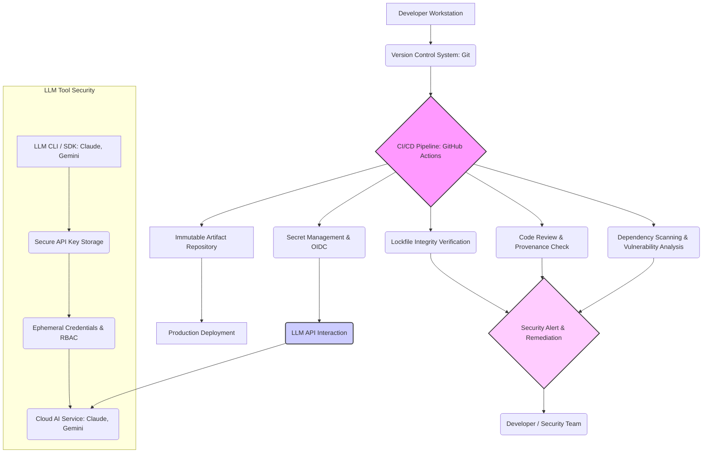

최신 소프트웨어 개발에서 오픈소스 종속성(open-source dependencies)은 필수불가결한 요소입니다. 그러나 이러한 편리함 뒤에는 공급망 공격(supply chain attacks)이라는 심각한 보안 위협이 잠재되어 있습니다. 최근 Microsoft의 오픈소스 도구가 해킹되어 AI 개발자들의 비밀번호 탈취에 악용된 사례는, 프로젝트에 통합된 모든 오픈소스 라이브러리와 AI 개발 툴(예: Claude Code, Gemini CLI, VS Code extensions)의 보안 상태를 정밀하게 점검해야 할 필요성을 명확히 보여줍니다. 본 문서에서는 오픈소스 종속성 공급망 보안을 강화하고 LLM(Large Language Model) 개발 툴의 안전성을 확보하기 위한 전략을 다룹니다.

## 오픈소스 공급망 공격의 위협

오픈소스 공급망 공격은 소프트웨어의 개발, 빌드, 배포 과정에 악성 코드를 주입하여 최종 사용자나 개발 환경을 침해하는 방식입니다. 공격자는 주로 다음 경로를 이용합니다:

*   **직접적인 코드 주입 (Direct Code Injection):** 인기 있는 오픈소스 프로젝트의 저장소를 직접 해킹하여 악성 코드를 커밋합니다.
*   **악성 종속성 주입 (Malicious Dependency Injection):** 정상 라이브러리와 유사한 이름의 악성 패키지(typosquatting)를 배포하거나, 사용되지 않는 취약한 종속성을 대상으로 합니다.
*   **업스트림 공격 (Upstream Attacks):** 핵심 라이브러리 또는 도구에 포함된 악성 코드가 이를 사용하는 모든 하위 프로젝트로 전파됩니다.
*   **자격 증명 탈취 (Credential Theft):** 개발 환경이나 CI/CD 파이프라인에서 사용되는 API 키, 토큰, 비밀번호 등을 탈취합니다.

Microsoft 사례는 특히 AI 개발 툴 및 클라우드 서비스 관련 프로젝트들이 공격의 대상이 되었으며, 이는 AI 기술 스택의 성장과 함께 관련 개발 환경의 보안이 더욱 중요해지고 있음을 시사합니다.

## 공급망 보안 강화 핵심 전략

### 1. 종속성 스캔 및 취약점 관리

모든 프로젝트의 오픈소스 종속성을 지속적으로 스캔하고 관리하는 것은 기본입니다. 이를 위해 자동화된 도구를 활용합니다.

*   **자동화된 취약점 스캐너:** Dependabot, Snyk, Trivy, GitHub Advanced Security와 같은 도구를 CI/CD 파이프라인에 통합하여 새로운 취약점이 발견될 때마다 알림을 받고, 심각도에 따라 빌드를 실패하도록 설정합니다.
*   **소프트웨어 구성 분석 (Software Composition Analysis, SCA):** 사용 중인 모든 오픈소스 라이브러리의 목록을 관리하고, 라이선스 준수 여부 및 알려진 취약점을 추적합니다.

### 2. 종속성 버전 고정 및 락 파일(Lockfile) 활용

종속성 버전을 `package.json`에서 `^1.2.3` 대신 `1.2.3`과 같이 정확히 고정하고, `package-lock.json`, `yarn.lock`, `pnpm-lock.yaml`과 같은 락 파일을 Git 저장소에 커밋하는 것은 매우 중요합니다. 락 파일은 종속성 트리의 정확한 상태를 기록하여, 모든 개발 환경과 CI/CD 환경에서 동일한 버전의 종속성이 설치되도록 보장합니다.

```yaml
name: Dependency Security Workflow

on: [push, pull_request]

jobs:
  audit-dependencies:
    runs-on: ubuntu-latest
    steps:
      - name: Checkout Code
        uses: actions/checkout@v4

      - name: Setup Node.js
        uses: actions/setup-node@v4
        with:
          node-version: '20'
          cache: 'npm'

      - name: Install dependencies from lockfile
        run: npm ci --prefer-offline --no-audit

      - name: Verify lockfile is up-to-date
        run: |
          npm install --package-lock-only
          git diff --exit-code package-lock.json || (echo "package-lock.json is not up-to-date. Run 'npm install' and commit the changes." && exit 1)

      - name: Run npm audit for critical vulnerabilities
        run: npm audit --audit-level=critical || exit 1

      - name: Snyk Open Source Scan
        uses: snyk/actions/node@master # Use fixed version or SHA for production
        env:
          SNYK_TOKEN: ${{ secrets.SNYK_TOKEN }}
        with:
          args: --file=package.json --org=${{ secrets.SNYK_ORG_ID }} --detection-depth=5
          fail-on: all # Fail on all vulnerabilities found
```

위 GitHub Actions 예시는 `npm audit`을 실행하고, Snyk을 이용해 종속성 취약점을 스캔하며, `package-lock.json` 파일이 최신 상태인지 검증하는 과정을 보여줍니다. `npm ci --prefer-offline --no-audit` 명령은 락 파일을 기반으로 종속성을 설치하여 일관성을 유지합니다.

### 3. CI/CD 파이프라인 강화

CI/CD 환경은 공급망 공격의 주요 표적이므로, 엄격한 보안 정책을 적용해야 합니다.

*   **최소 권한 원칙 (Principle of Least Privilege):** GitHub Actions의 `permissions` 블록을 명시적으로 선언하여, 각 Job이 필요한 최소한의 권한만 가지도록 설정합니다.
*   **OIDC (OpenID Connect) 활용:** 클라우드 서비스와 연동할 때 장기적인 자격 증명(long-lived credentials) 대신 OIDC를 통해 임시 자격 증명(ephemeral credentials)을 발행하여 사용합니다. 이는 API 키 유출 시의 위험을 크게 줄여줍니다.
*   **액션 버전 고정:** `actions/checkout@v4`와 같이 GitHub Marketplace 액션을 사용할 때, `v4`와 같은 메이저 버전 태그 대신 특정 커밋 SHA(예: `actions/checkout@8e5ad7ba5c1737f035f8e5ad7ba5c1737f035f8e`)를 사용하여 액션의 코드가 무단으로 변경되는 것을 방지합니다.

### 4. LLM 개발 툴 및 API 키 보안

Claude Code, Gemini CLI 등 LLM 개발 툴 사용 시 자격 증명 관리의 중요성이 증대되었습니다.

*   **보안 저장소 사용:** LLM API 키나 민감한 자격 증명을 환경 변수에 직접 저장하는 대신, HashiCorp Vault, AWS Secrets Manager, Azure Key Vault 또는 GitHub Secrets와 같은 보안 저장소를 사용합니다. 이들 저장소는 접근 제어와 감사 기능을 제공합니다.
*   **Ephemeral Credentials:** 가능하면 LLM API 호출에 임시 자격 증명을 사용합니다. 예를 들어, 클라우드 IAM 역할 기반으로 API 접근을 제어하여, 특정 CI/CD Job 또는 서비스 계정만 필요한 LLM 리소스에 접근하도록 합니다.
*   **접근 범위 검토:** AI 툴 또는 통합 서비스에 부여되는 OAuth 권한 범위를 정기적으로 검토하여, 과도한 권한이 부여되지 않았는지 확인합니다.

## 통합 보안 흐름



이 다이어그램은 개발자 워크스테이션에서 버전 관리 시스템을 통해 코드가 커밋되고, CI/CD 파이프라인에서 종속성 스캔, 코드 리뷰, 락 파일 검증, 그리고 LLM API와의 안전한 상호작용이 이루어지는 전반적인 보안 흐름을 보여줍니다. LLM 개발 툴의 자격 증명 관리 또한 핵심 요소로 통합됩니다.

## 트레이드오프

*   **개발 속도 vs. 보안 강화:** 엄격한 보안 정책(예: 모든 종속성 스캔, 버전 고정)은 초기 설정 및 변경 시 개발 워크플로우에 마찰을 발생시켜 개발 속도를 늦출 수 있습니다. 그러나 장기적으로는 취약점 발생 시 복구 비용과 법적/평판 리스크를 줄여 전체적인 안정성과 효율성을 높입니다.
*   **자동화 범위 vs. 수동 검토 필요성:** 대부분의 종속성 스캔 및 버전 관리는 자동화될 수 있지만, 복잡한 비즈니스 로직 취약점이나 제로데이 공격은 전문가의 수동 검토와 보안 감사(security audit)가 필수적입니다. 과도한 자동화에만 의존할 경우 중요한 사각지대가 발생할 수 있습니다.
*   **오픈소스 활용 이점 vs. 관리 부담:** 오픈소스는 개발 효율성과 혁신을 가속화하지만, 종속성 관리 및 모니터링에 지속적인 리소스가 투입되어야 합니다. 관리 부담을 최소화하면서 오픈소스의 이점을 최대한 활용하는 균형점을 찾는 것이 중요합니다.
*   **편의성 vs. 보안성 (LLM 툴 자격 증명):** LLM API 키를 환경 변수에 직접 저장하는 방식은 편리하지만 보안에 취약합니다. OIDC나 보안 저장소를 통한 관리는 초기 설정이 복잡하고 개발자에게 추가적인 학습 곡선을 요구하지만, 자격 증명 유출 위험을 현저히 낮춰줍니다.

## 실전 체크리스트

이 지식을 프로젝트에 적용할 때 다음 항목들을 검증하여 보안 수준을 향상시킬 수 있습니다.

*   - [ ] 모든 오픈소스 종속성에 대해 Snyk, Dependabot과 같은 자동화된 취약점 스캐너를 활성화하고, Critical/High 등급 취약점 발생 시 CI/CD 파이프라인 실패를 설정했는가?
*   - [ ] `package-lock.json`, `yarn.lock`, `pnpm-lock.yaml`과 같은 종속성 락 파일을 Git에 커밋하고, CI/CD에서 `npm ci --frozen-lockfile` (또는 해당 툴의 동등한 명령)을 사용하여 변경을 엄격히 통제하는가?
*   - [ ] GitHub Actions 워크플로우에 `permissions` 블록을 명시적으로 선언하고, 각 Job에 필요한 최소 권한만 부여했는가?
*   - [ ] LLM API 키(Claude, Gemini 등)를 환경 변수에 직접 저장하는 대신, HashiCorp Vault, AWS Secrets Manager 또는 GitHub Secrets와 같은 보안 저장소에서 런타임에 주입하는 방식을 채택했는가?
*   - [ ] `actions/checkout@v4`와 같이 널리 사용되는 GitHub Actions 마켓플레이스 액션의 버전을 `sha` 값을 사용하여 고정하고, 변조를 방지하는가?
*   - [ ] 모든 서드파티 통합 (AI 툴 포함)에 대해 OAuth 앱 승인 범위를 검토하고, 과도한 권한이 부여되지 않도록 정기적으로 감사하는 프로세스가 있는가?
*   - [ ] CI/CD 환경에서 임시 자격 증명(Ephemeral Credentials)을 사용하여 장기적인 접근 권한을 최소화하고, 모든 워크플로우 실행 후 자격 증명이 만료되도록 설정했는가?