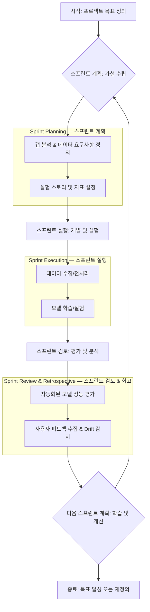

AI 프로젝트는 전통적인 소프트웨어 개발과 달리 데이터의 불확실성, 모델 성능의 비예측성, 지속적인 연구 개발 요소를 내포합니다. 이러한 고유한 특성을 효과적으로 관리하고 효율적인 반복 개발 주기를 확보하기 위해서는 애자일 방법론의 전략적 적용과 미세 조정이 필수적입니다. 특히 2026년 트렌드는 AI 시스템의 신뢰성, 설명 가능성, 지속적인 재학습(Continuous Learning)에 중점을 두므로, 스프린트 계획 단계부터 이러한 요소를 내재화해야 합니다.

## 핵심 개념: 불확실성 관리와 반복적 실험

### 갭 분석 및 가설 중심 개발 (Gap Analysis & Hypothesis-Driven Development)
AI 프로젝트의 초기 단계에서 "갭 분석"은 필수적입니다. 이는 현재 보유한 데이터, 모델, 인프라 역량과 목표하는 AI 솔루션 간의 격차를 식별하는 과정입니다. 이 갭을 바탕으로 각 스프린트는 특정 가설을 검증하는 실험의 연속으로 설계됩니다. 예를 들어, "이 데이터셋으로 특정 모델이 최소한 X%의 정확도를 달성할 것이다"와 같은 가설을 설정하고, 스프린트 목표는 이 가설의 검증으로 정의됩니다.

### 지표 기반의 성공 정의 (Metrics-Driven Success Definition)
AI 프로젝트에서는 기능적 요구사항 외에 "성능 지표(Performance Metrics)"가 성공의 핵심 척도가 됩니다. 스프린트 시작 전에 명확한 정량적 및 정성적 평가 지표(예: Precision, Recall, F1-Score, AUC, 또는 사용자 만족도 점수, A/B 테스트 결과)를 정의하고, 이를 스프린트 목표에 직접 연결해야 합니다. 2026년에는 LLM의 hallucination 방지 및 fairness, robustnes 지표가 더욱 중요해질 것입니다.

### 데이터 중심 접근 (Data-Centric Approach)
모델보다 데이터의 품질이 AI 시스템 성능에 더 큰 영향을 미친다는 인식이 확산되고 있습니다. 스프린트 계획 시 데이터 수집, 전처리, 증강, 레이블링 및 검증 단계를 명확히 포함해야 합니다. 데이터 파이프라인의 견고성과 데이터셋의 지속적인 업데이트는 AI 애자일 스프린트의 핵심 요소입니다.

## AI 프로젝트를 위한 스프린트 계획

### "사용자 스토리"에서 "실험 스토리"로 전환 (From User Stories to Experiment Stories)
전통적인 사용자 스토리(As a `user`, I want `goal` so that `reason`)는 AI 프로젝트에서 "실험 스토리(As a `data scientist/engineer`, I want to `experiment` to `validate hypothesis` so that `achieve business outcome`)"로 확장될 수 있습니다. 각 실험 스토리는 명확한 가설, 예상 결과, 성공 지표를 포함해야 합니다.

### 스파이크 스프린트 및 탐색 (Spike Sprints and Exploration)
높은 불확실성을 가진 AI 연구 개발 태스크는 별도의 '스파이크 스프린트'로 계획하여 기술적 타당성 검토, 알고리즘 비교, 새로운 데이터셋 탐색 등에 집중할 수 있습니다. 이는 메인 프로덕트 스프린트의 위험을 줄이고 학습 곡선을 가속화합니다.

### 백로그 리파인먼트: MLOps 고려사항 통합 (Backlog Refinement: Integrating MLOps Considerations)
백로그 리파인먼트 단계에서 단순히 기능 개발뿐 아니라, 모델 학습 파이프라인 자동화, 모델 배포 전략, 모니터링 시스템 구축, Drift Detection 등의 MLOps 요소를 함께 고려하고 우선순위를 정해야 합니다. 이는 AI 시스템의 지속적인 운영 가능성을 확보하는 데 필수적입니다.

## AI 프로젝트 스프린트 실행

### 실험 추적 및 버전 관리 (Experiment Tracking & Version Control)
각 스프린트에서 수행되는 수많은 실험(모델 아키텍처, 하이퍼파라미터, 데이터셋 버전 등)은 체계적으로 추적되고 버전 관리되어야 합니다. MLflow, Weights & Biases, Comet ML과 같은 도구는 이러한 프로세스를 효율적으로 지원합니다.

### 지속적인 평가 및 피드백 루프 (Continuous Evaluation & Feedback Loops)
모델 학습 후 자동화된 평가 파이프라인을 통해 정의된 지표에 따라 성능을 검증합니다. 이 평가는 단순히 모델의 현재 성능을 넘어서, 시간이 지남에 따른 성능 저하(Drift)를 감지하고, 실제 사용자 피드백을 수집하여 다음 스프린트 계획에 반영하는 피드백 루프를 구축해야 합니다.

## 코드 예제: 간단한 모델 평가 스크립트
```python
import pandas as pd
from sklearn.model_selection import train_test_split
from sklearn.ensemble import RandomForestClassifier
from sklearn.metrics import precision_score, recall_score, f1_score, roc_auc_score
import mlflow

def evaluate_model_sprint(data_path, target_col, experiment_name, run_name):
    df = pd.read_csv(data_path)
    X = df.drop(columns=[target_col])
    y = df[target_col]

    X_train, X_test, y_train, y_test = train_test_split(X, y, test_size=0.2, random_state=42)

    with mlflow.start_run(run_name=run_name) as run:
        # Model Training
        model = RandomForestClassifier(n_estimators=100, random_state=42)
        model.fit(X_train, y_train)
        predictions = model.predict(X_test)
        probabilities = model.predict_proba(X_test)[:, 1]

        # Evaluate Metrics
        precision = precision_score(y_test, predictions, average='binary')
        recall = recall_score(y_test, predictions, average='binary')
        f1 = f1_score(y_test, predictions, average='binary')
        roc_auc = roc_auc_score(y_test, probabilities)

        # Log parameters and metrics
        mlflow.log_param("n_estimators", 100)
        mlflow.log_metric("precision", precision)
        mlflow.log_metric("recall", recall)
        mlflow.log_metric("f1_score", f1)
        mlflow.log_metric("roc_auc", roc_auc)

        # Log model
        mlflow.sklearn.log_model(model, "random_forest_model")

        print(f"Sprint Run '{run_name}' completed. Metrics logged to MLflow.")
        print(f"Precision: {precision:.4f}, Recall: {recall:.4f}, F1-Score: {f1:.4f}, ROC-AUC: {roc_auc:.4f}")

# Example usage (assuming 'sample_data.csv' exists with a 'target' column)
# create a dummy csv for demonstration
# df_dummy = pd.DataFrame({'feature1': [1,2,3,4,5], 'feature2': [5,4,3,2,1], 'target': [0,1,0,1,0]})
# df_dummy.to_csv('sample_data.csv', index=False)
# evaluate_model_sprint('sample_data.csv', 'target', 'AI_Sprint_Evaluation', 'Sprint_001_Baseline')
```
이 예제는 MLflow를 활용하여 AI 모델의 각 스프린트별 평가 결과를 추적하는 기본적인 프로세스를 보여줍니다. 모델 학습 시 사용된 파라미터와 주요 성능 지표(Precision, Recall, F1-Score, ROC-AUC)를 기록하여, 후속 스프린트에서 다양한 실험 결과를 비교하고 최적의 모델을 선택하는 데 활용될 수 있습니다.

## AI 애자일 스프린트 주기


## 트레이드오프

*   **장점: 불확실성 관리 및 유연성**
    *   **언제 좋음:** 초기 단계에서 높은 불확실성을 가진 AI 프로젝트, 요구사항이 빠르게 변경될 수 있는 환경, 새로운 기술 탐색이 필요한 경우에 특히 효과적입니다. 위험 요소를 조기에 식별하고 관리하여 프로젝트의 실패 확률을 줄입니다.
    *   **언제 나쁨:** 명확하고 정형화된 문제 정의와 솔루션이 이미 확립된 프로젝트에서는 과도한 실험 추적 및 회의 오버헤드가 발생할 수 있습니다.

*   **장점: 빠른 피드백 루프 및 지속적인 가치 전달**
    *   **언제 좋음:** 사용자나 이해관계자에게 초기부터 작동하는 AI 구성요소를 제공하고, 실제 환경에서의 피드백을 빠르게 수집하여 제품 방향을 조기에 수정할 수 있을 때 유리합니다. 이는 시장의 변화에 민첩하게 대응하는 데 도움을 줍니다.
    *   **언제 나쁨:** 각 스프린트에서 '배포 가능한(deployable)' 결과물을 만들어내는 데 필요한 MLOps 인프라나 자동화가 부족한 경우, 가치 전달 주기가 길어지거나 불완전한 결과물이 반복될 수 있습니다.

*   **단점: 정의의 어려움과 오버헤드**
    *   **언제 좋음:** 팀이 AI 지표와 비즈니스 가치 간의 명확한 연결고리를 이해하고, '충분히 좋은' 모델의 기준을 명확히 설정할 수 있을 때 효과적입니다.
    *   **언제 나쁨:** '완료(Done)'의 기준이 모호하고, 실험의 성공 여부를 판단할 명확한 기준이 없을 경우 스프린트 목표 달성 여부가 불분명해지며, 무한한 실험의 반복으로 이어질 수 있습니다. 실험 추적, 문서화, 회의 등의 관리적 오버헤드가 발생할 수 있습니다.

*   **단점: 자원 및 전문성 요구**
    *   **언제 좋음:** 데이터 과학자, ML 엔지니어, 도메인 전문가, 제품 관리자 등 다양한 전문성을 가진 인력으로 구성된 교차 기능 팀(cross-functional team)이 긴밀하게 협력하고, MLOps 도구에 대한 숙련도가 높을 때 최상의 시너지를 낼 수 있습니다.
    *   **언제 나쁨:** 팀 내부에 AI/MLOps 전문성이 부족하거나, 각 역할 간의 책임 경계가 불분명하여 협업이 원활하지 않을 경우, 애자일 프로세스가 오히려 혼란을 가중시킬 수 있습니다.

## 실전 체크리스트

*   - [ ] 각 스프린트 목표는 측정 가능한 AI 성능 지표(예: Precision, Recall, F1-Score)와 비즈니스 성과 지표에 명확히 연결되어 있는가?
*   - [ ] 모든 AI 관련 태스크(데이터 수집, 전처리, 모델 학습, 평가)에 대해 Experiment Tracking 시스템(MLflow, W&B 등)이 설정되어 실험 결과가 체계적으로 기록되고 있는가?
*   - [ ] 스프린트 계획 시 기술적 타당성 검토 및 불확실성 해소를 위한 '스파이크 스프린트' 또는 '탐색 태스크'를 주기적으로 포함하고 있는가?
*   - [ ] 데이터 파이프라인의 견고성과 자동화 수준을 정기적으로 검토하고, 데이터셋 버전 관리 시스템이 구축되어 있는가?
*   - [ ] 모델 학습 및 배포 파이프라인이 자동화되어 있으며, 지속적인 통합/배포(CI/CD) 원칙이 적용되고 있는가?
*   - [ ] 배포된 모델의 성능 Drift를 감지하고 경고하는 모니터링 시스템이 구축되어 있으며, 이에 대한 대응 프로세스가 정의되어 있는가?
*   - [ ] 스프린트 리뷰 시 단순히 기능 시연을 넘어, 실제 AI 모델 성능 지표와 가설 검증 결과에 대한 심층적인 논의가 이루어지고 다음 스프린트에 반영되는가?