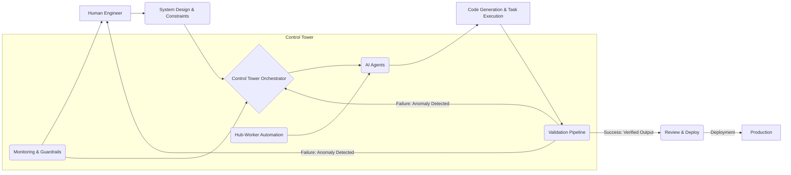

소프트웨어 엔지니어링 패러다임이 변화하고 있습니다. 과거에는 엔지니어가 직접 코드를 작성하는 것이 핵심 역량이었다면, 이제는 AI 에이전트가 대규모로 올바른 코드를 생성하도록 시스템을 설계하고 관리하는 역할로 진화하고 있습니다. 이는 마치 건축가가 설계도를 그리고 시공은 정교한 로봇 팀에 맡기는 것과 유사합니다. 이 변화의 중심에는 'AI 에이전트 중심의 시스템 설계'와 이를 효과적으로 통제하고 감독하는 '관제탑(Control Tower)' 기능의 강화가 있습니다.

## AI 에이전트 중심 아키텍처의 부상

AI 에이전트 중심 아키텍처는 코드 생성, 테스트, 배포 등 소프트웨어 개발 생명주기(SDLC)의 상당 부분을 AI 에이전트에게 위임하는 것을 의미합니다. Artemis와 같은 선도적인 프로젝트들은 이미 플랫폼의 모든 코드를 에이전트가 작성하고 있으며, 인간 엔지니어는 상위 수준의 시스템 설계, 제약 조건 설정, 그리고 최종 결과물 검토에 집중합니다. 이는 개발 속도를 혁신적으로 가속화하고, 반복적이고 오류에 취약한 작업을 자동화하여 엔지니어의 생산성을 극대화합니다.

이러한 전환의 핵심은 에이전트들이 자율적으로 작업을 수행하면서도 전체 시스템의 일관성과 품질을 유지하도록 하는 '관제탑' 역할의 중요성입니다. 관제탑은 에이전트의 활동을 모니터링하고, LLM 출력의 유효성을 검증하며, 배포 프로세스를 안전하게 고도화하는 핵심 기능을 수행합니다.

### 관제탑의 핵심 기능 요소

1.  **LLM 출력 검증 파이프라인 (LLM Output Validation Pipeline) 강화:** AI 에이전트가 생성한 코드나 문서 등 LLM 출력물은 단순히 생성되는 것에 그치지 않고, 엄격한 검증 단계를 거쳐야 합니다. 이는 코드 정합성, 보안 취약점, 비즈니스 로직 적합성 등을 다각도로 검증하는 파이프라인을 의미합니다. 정적/동적 분석, 테스트 케이스 실행, 시맨틱 검증, 그리고 심지어 다른 AI 에이전트의 상호 검증(cross-validation) 등을 포함할 수 있습니다.

2.  **허브-워커 복리 자동화 (Hub-Worker Compounding Automation)의 고도화:** 이 모델에서 '허브'는 상위 수준의 계획을 수립하고 '워커' 에이전트들에게 작업을 위임합니다. 관제탑은 이 워커 에이전트들의 작업을 통합하고, '리뷰 및 배포(Review and Deploy)' 단계를 자동화하는 것을 목표로 합니다. 여기에는 자동화된 코드 리뷰, 변경사항 병합, CI/CD 파이프라인 트리거, 그리고 배포 후 모니터링까지 포함됩니다. 인간의 개입은 예외 상황이나 중요한 의사결정 시점으로 최소화됩니다.

3.  **예측 및 가드레일 시스템 (Predictive & Guardrail Systems):** 에이전트의 자율성이 높아질수록 예상치 못한 결과나 비용 초과 등의 리스크도 커집니다. 관제탑은 에이전트의 행동을 실시간으로 모니터링하고, 설정된 예산이나 성능 임계값을 넘어서는 행위를 예측하여 사전에 경고하거나 자동으로 차단하는 가드레일 역할을 수행해야 합니다. 이는 'AI 에이전트 통제 및 책임성 가이드라인(AI Agent Control Accountability Guardrails)'과 밀접하게 연관됩니다.

### AI 에이전트 관제탑 아키텍처

아래 Mermaid 다이어그램은 AI 에이전트 중심 시스템에서 관제탑이 어떻게 작동하는지 보여줍니다.



## 코드 예제: LLM 출력 검증 파이프라인 스켈레톤 (Python)

관제탑 내 LLM 출력 검증 파이프라인의 핵심은 에이전트가 생성한 결과물을 다양한 기준으로 검증하는 것입니다. 다음은 가상의 `AgentOutputValidator` 클래스를 통해 코드 검토, 테스트 실행, 시맨틱 검증을 수행하는 파이프라인의 간략한 예시입니다.

```python
import json
import subprocess

class AgentOutputValidator:
    def __init__(self, config: dict):
        self.config = config

    def validate_code_syntax(self, code: str) -> bool:
        # Simulate syntax check using a linter (e.g., pylint for Python)
        try:
            # For real scenarios, integrate with actual linters
            process = subprocess.run(['python', '-m', 'py_compile', '-'], input=code.encode(), capture_output=True, text=True)
            if process.returncode != 0:
                print(f"Syntax error: {process.stderr}")
                return False
            return True
        except Exception as e:
            print(f"Linter execution error: {e}")
            return False

    def run_unit_tests(self, generated_tests: str, generated_code: str) -> bool:
        # Simulate running unit tests. In real world, this involves writing to temp files and executing test runner.
        try:
            # For demonstration, assume tests pass if no 'FAIL' in output
            print(f"Executing tests for generated code...\n{generated_tests}")
            # A robust implementation would involve isolated execution environments
            if "FAIL" in generated_tests.upper(): # Simple check for example
                return False
            return True
        except Exception as e:
            print(f"Test execution error: {e}")
            return False

    def semantic_validation(self, generated_output: str, expected_intent: str) -> bool:
        # Use another LLM or rule-based system for semantic understanding
        # This is a placeholder for complex semantic validation logic
        if expected_intent.lower() in generated_output.lower():
            return True
        print(f"Semantic mismatch. Expected '{expected_intent}' not found in output.")
        return False

    def validate_agent_output(self, output: dict) -> bool:
        output_type = output.get("type")
        content = output.get("content")
        intent = output.get("intent")

        if output_type == "code":
            if not self.validate_code_syntax(content):
                return False
            if not self.run_unit_tests(output.get("tests", ""), content):
                return False
        
        if not self.semantic_validation(content, intent):
            return False
        
        return True

# Example Usage
validator_config = {"linter_path": "/usr/bin/pylint"}
validator = AgentOutputValidator(validator_config)

# Example of agent generating code
agent_code_output = {
    "type": "code",
    "content": "def add(a, b):\n    return a + b\n",
    "intent": "Implement a function to add two numbers",
    "tests": "assert add(1, 2) == 3\nassert add(-1, 1) == 0"
}

if validator.validate_agent_output(agent_code_output):
    print("Agent code output validated successfully.")
else:
    print("Agent code output validation failed.")

# Example of agent generating a document
agent_doc_output = {
    "type": "document",
    "content": "This document outlines the new AI agent workflow.",
    "intent": "Summarize AI agent workflow changes"
}

if validator.validate_agent_output(agent_doc_output):
    print("Agent document output validated successfully.")
else:
    print("Agent document output validation failed.")
```

## 트레이드오프

AI 에이전트 중심 시스템 설계 및 관제탑 기능 강화는 많은 이점을 제공하지만, 고려해야 할 트레이드오프도 존재합니다.

*   **초기 설정 복잡성 vs. 장기적 효율성**: AI 에이전트 시스템과 관제탑을 구축하는 초기에는 상당한 설계 및 구현 노력이 필요합니다. 이 복잡성은 시스템이 커질수록 증가합니다. 하지만 일단 구축되면, 반복적인 작업에서 탁월한 효율성과 확장성을 제공하여 장기적으로 개발 및 운영 비용을 절감합니다.
    *   **언제 좋은가**: 대규모 프로젝트, 반복적인 코드 생성/수정/배포 작업이 많은 경우, 장기적인 ROI가 중요한 상황.
    *   **언제 나쁜가**: 소규모 프로젝트, 단기적인 PoC, 빈번하게 시스템 아키텍처가 변경되는 초기 단계 프로젝트.

*   **자율성 vs. 통제**: 에이전트에게 높은 자율성을 부여하면 빠른 실행이 가능하지만, 제어 불능 상태나 예상치 못한 부작용의 위험이 있습니다. 엄격한 관제탑과 가드레일은 이러한 위험을 완화하지만, 에이전트의 유연성과 창의성을 제한할 수 있습니다.
    *   **언제 좋은가**: 안정적인 도메인에서 예측 가능한 작업을 수행할 때, 높은 안정성과 보안이 요구되는 미션 크리티컬 시스템.
    *   **언제 나쁜가**: 탐색적 개발, 새로운 문제 해결이 필요한 창의적인 작업, 유연한 실험이 중요한 초기 연구 단계.

*   **비용 최적화 vs. 성능/정확도**: LLM 호출 및 에이전트 실행은 컴퓨팅 자원 및 API 비용을 발생시킵니다. 비용을 최적화하기 위해 추론 횟수를 줄이거나 더 작은 모델을 사용할 수 있지만, 이는 에이전트의 성능이나 출력 정확도 저하로 이어질 수 있습니다. 관제탑은 이러한 균형점을 찾아야 합니다.
    *   **언제 좋은가**: 비용이 주요 제약 사항인 경우, 허용 가능한 수준의 성능 저하가 있더라도 운영 예산을 절감해야 할 때.
    *   **언제 나쁜가**: 최고 수준의 성능과 정확도가 절대적으로 필요한 경우 (예: 의료, 금융 거래 시스템).

*   **투명성 vs. 블랙박스 문제**: AI 에이전트, 특히 LLM 기반 에이전트의 의사결정 과정은 때때로 불투명할 수 있습니다(블랙박스 문제). 관제탑은 에이전트의 행동 로그, 추론 경로, 검증 결과 등을 통해 투명성을 확보하려 하지만, 완전한 이해는 어려울 수 있습니다. 이는 디버깅 및 감사에 영향을 미칩니다.
    *   **언제 좋은가**: 결과의 정확성이 중요하지만, 세부적인 추론 과정이 법적/규제적 요구사항이 덜한 경우.
    *   **언제 나쁜가**: 규제 준수, 법적 책임, 또는 높은 수준의 설명 가능성(explainability)이 필수적인 도메인.

## 실전 체크리스트

AI 에이전트 중심 시스템 설계 및 관제탑 기능을 프로젝트에 적용할 때 다음 사항을 검증합니다.

- [ ] **LLM 출력 검증 파이프라인의 견고성**: AI 에이전트가 생성한 모든 코드 및 콘텐츠에 대해 최소 3가지 이상의 자동화된 검증 메커니즘(예: 정적 분석, 단위 테스트, 시맨틱 검증)이 적용되었는가?
- [ ] **리뷰 및 배포 자동화 수준**: 에이전트가 생성한 결과물이 인간의 수동 개입 없이 프로덕션 배포까지 자동화될 수 있는 '허브-워커 복리 자동화' 단계가 정의되어 있는가, 그리고 그 자동화율은 최소 80% 이상인가?
- [ ] **비용 및 성능 관제 시스템**: 에이전트의 LLM 호출 비용 및 작업 실행 시간을 실시간으로 모니터링하고, 설정된 임계값(예: 월 예산의 80%, 작업 시간 90th 퍼센타일) 초과 시 자동 알림 또는 작업 중단 메커니즘이 작동하는가?
- [ ] **보안 가드레일 구현**: AI 에이전트가 외부 시스템(API, DB, 파일 시스템)에 접근할 때 최소 권한 원칙(Principle of Least Privilege)이 적용되었으며, 잠재적인 보안 취약점(예: 프롬프트 인젝션)에 대한 방어 로직이 구현되어 있는가?
- [ ] **인간 개입 지점 명확화**: 에이전트 시스템에서 인간 엔지니어의 역할(시스템 설계, 제약 설정, 최종 검토 등)과 필수적인 수동 개입 지점 및 절차가 명확하게 문서화되어 있는가?
- [ ] **에이전트 행동 로그 및 감사 기능**: 모든 AI 에이전트의 의사결정 과정, 실행된 도구 사용, 생성된 출력물에 대한 상세한 로그가 기록되고, 필요시 언제든지 감사할 수 있는 시스템이 구축되어 있는가?
- [ ] **재학습 및 개선 루프**: 에이전트의 실패 사례나 비효율적인 작업 흐름을 식별하고, 이를 바탕으로 에이전트의 프롬프트, 도구, 또는 내부 로직을 개선하는 자동화된 또는 반자동화된 피드백 루프가 존재하는가?
