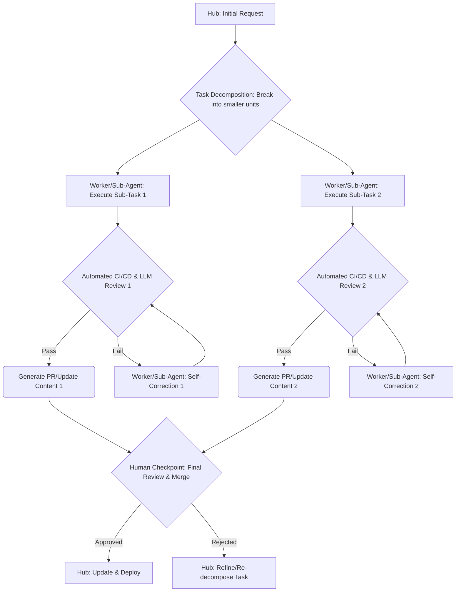

AI 에이전트의 활용이 증가하면서, 단순히 에이전트의 실행을 넘어 사람이 그 진행 상황을 모니터링하고 조율하는 과정이 새로운 병목 지점으로 부상하고 있다. 특히 복잡하고 장기적인 태스크에서 에이전트의 중간 결과물을 수동으로 검증하고 피드백하는 것은 확장성의 큰 걸림돌이 된다. 이러한 문제를 해결하기 위해, 에이전트 워크플로우를 자동화된 검증 체계와 결합하여 사람의 개입을 최소화하고 효율성을 극대화하는 전략이 필요하다.

## AI 에이전트 작업 분할 및 자동 검증 파이프라인

핵심 아이디어는 대규모 AI 에이전트 작업을 작은 단위로 분할하고, 각 단위에 대해 자동화된 CI/CD 및 리뷰 프로세스를 적용하는 것이다. 이는 기존 소프트웨어 개발에서 큰 프로젝트를 작은 Pull Request (PR) 단위로 나누고 CI(Continuous Integration)를 통해 검증하는 방식과 유사하다.

### 작업 분할의 중요성

AI 에이전트가 수행하는 큰 태스크(예: 코드베이스 리팩토링, 복잡한 기능 구현)는 여러 개의 하위 태스크로 나눌 수 있다. 예를 들어, `Labor0`의 사례처럼 각 하위 태스크의 결과물을 독립적인 `PR` 형태로 관리한다면, 실패 지점을 명확히 하고 재시도 비용을 줄일 수 있다. `Hub-Worker` 복리 자동화 로직에서는 `Worker`가 학습(`lesson`)하거나 오류(`error`)를 발생시켰을 때, 이를 `Hub`로 `dispatch`하여 새로운 소규모 태스크를 트리거하고 자동화된 `PR`을 생성하는 방식으로 적용할 수 있다.

### 자동화된 검증 파이프라인

각 소규모 태스크의 결과물(예: 생성된 코드, 업데이트된 문서, 데이터 스키마 변경)은 다음 단계를 거쳐 자동 검증된다.

1.  **정적 분석 및 린팅**: 에이전트가 생성한 코드나 문서에 대해 정적 코드 분석 도구, 린터, 스타일 가이드 검사기를 실행한다. 이는 코드 품질과 일관성을 보장한다.
2.  **단위 및 통합 테스트**: 에이전트가 생성한 코드에 대한 단위 테스트 및 통합 테스트를 자동 실행하여 기능적 정확성을 검증한다. 테스트 커버리지 도구를 활용하여 에이전트의 테스트 생성 능력도 평가할 수 있다.
3.  **LLM 기반 자체 수정 및 리뷰**: 에이전트는 `CI` 실패, 머지 충돌, 혹은 동료 리뷰어의 피드백을 감지하고, 이를 스스로 분석하여 수정하는 능력을 갖춘다. `Codex` 자동 리뷰와 같은 도구를 활용하여 초기 리뷰 단계를 자동화하고, 에이전트가 수정 사항을 반영하여 재커밋하는 과정을 반복한다.
4.  **LLM 출력 검증 파이프라인**: 특히 `LLM`의 비결정적 특성을 고려하여, `LLM`이 생성한 텍스트, 코드 스니펫, 데이터 구조 등에 대한 심층적인 검증 파이프라인을 구축한다. 이는 의미론적 일관성, 사실 관계 확인, 안전성(hallucination 방지) 등을 포함한다. `LLM output validation pipeline enhancement` 패턴을 적용하여, 에이전트가 생성한 `lesson/error dispatch` 콘텐츠의 품질을 자동으로 평가하고 개선하는 루프를 만든다.

이러한 자동화 체계는 사람의 개입을 필요한 최소한의 지점(예: 자동화된 검증을 모두 통과한 후 최종 머지 승인, 해결 불가능한 복합 오류 분석)으로 제한하여, 전체 워크플로우의 처리량을 크게 높인다.

### Hub-Worker 모델과의 통합

`playbook`의 `Hub-Worker` 아키텍처에서 이 전략을 적용하면, `Worker`가 `lesson` 또는 `error`를 `dispatch`했을 때 `Hub`가 이를 수신하고, 관련 태스크를 작은 단위로 분해하여 다른 `Worker` 또는 `Sub-Agent`에게 할당할 수 있다. 각 `Sub-Agent`는 할당된 태스크를 수행하고, 위에서 설명한 자동화된 검증 파이프라인을 거친 후 `Hub`에 결과를 보고한다. 모든 검증 단계를 통과한 결과물만이 `Hub`의 최종 승인 대기열로 이동하여 사람의 최종 검토를 기다리게 된다. 이는 `hub-worker-compounding-pattern`을 더욱 견고하게 만든다.

### 2026년 최신 트렌드 반영

2026년에는 `Autonomous Validation`이 더욱 고도화될 것으로 예측된다. `Explainable AI (XAI)` 기법을 활용하여 에이전트의 결정 과정과 생성 결과물에 대한 투명성을 높이고, 검증 과정 자체도 에이전트가 학습하고 개선하는 `Self-Healing Agents` 개념이 도입될 것이다. 또한, `Multi-Modal LLM`의 출력물(코드, 이미지, 오디오 등)에 대한 통합 검증 파이프라인 구축이 필수적인 트렌드로 자리 잡을 것이다.

## 트레이드오프

AI 에이전트 워크플로우 자동화 및 검증 체계 개선에는 다음과 같은 트레이드오프가 존재한다.

*   **초기 설정 복잡성 vs. 장기적 효율성**: 자동화된 검증 파이프라인과 작업 분할 체계를 구축하는 데는 상당한 초기 투자와 복잡성이 따른다. 언제 좋은가: 장기적으로 반복되는 대규모 에이전트 작업을 처리할 때 운영 비용과 시간을 크게 절감할 수 있다. 언제 나쁜가: 일회성 또는 매우 단순한 태스크에는 과도한 오버헤드가 발생할 수 있다.
*   **자동화 수준 vs. 유연성 및 통제**: 높은 수준의 자동화는 빠른 처리 속도와 일관성을 제공하지만, 예측 불가능하거나 미묘한 에이전트 오류에 대한 사람의 직관적 개입 여지를 줄일 수 있다. 언제 좋은가: 반복적이고 규칙 기반의 검증에 강점이 있으며, 예측 가능한 오류 유형에 대한 신속한 대응이 가능하다. 언제 나쁜가: 창의적이거나 매우 복잡하고 모호한 태스크에서 예상치 못한 문제가 발생했을 때, 자동화된 시스템이 이를 제대로 감지하거나 해결하지 못할 위험이 있다.
*   **LLM 호출 비용 vs. 인적 자원 절감**: 에이전트의 자체 수정 및 LLM 기반 자동 리뷰는 LLM API 호출 비용을 발생시킨다. 언제 좋은가: 사람의 수동 검토 및 수정에 드는 높은 인건비와 시간을 절약할 수 있다. 언제 나쁜가: LLM 사용량이 매우 많아지면 API 비용이 인적 자원 절감 효과를 상회할 수 있으며, 최적화되지 않은 프롬프트는 불필요한 비용을 발생시킬 수 있다.
*   **작업 단위의 세분화 vs. 오케스트레이션 복잡성**: 작업을 너무 작게 분할하면 각 단위 태스크의 독립성은 높아지지만, 전체 워크플로우를 오케스트레이션하고 상태를 관리하는 복잡성이 증가한다. 언제 좋은가: 오류 발생 시 영향 범위가 줄어들어 디버깅 및 복구가 용이하고, 병렬 처리를 통해 처리량을 높일 수 있다. 언제 나쁜가: 태스크 간 의존성 관리, 컨텍스트 전달, 그리고 각 서브태스크의 동기화에 더 많은 엔지니어링 리소스가 필요하다.

## 실전 체크리스트

AI 에이전트 워크플로우 자동화 및 검증 체계를 프로젝트에 적용하기 위한 체크리스트:

- [ ] **에이전트 태스크 분할 전략 정의**: 현재 AI 에이전트가 수행하는 대규모 태스크를 최소 3~5개 이상의 논리적인 서브 태스크로 분해 가능한지 확인하고, 각 서브 태스크의 입력과 출력을 명확히 정의했는가?
- [ ] **자동화된 CI/CD 파이프라인 구축**: 각 서브 태스크의 결과물(코드, 문서, 데이터 등)에 대해 정적 분석, 린팅, 단위/통합 테스트를 자동 실행하는 CI/CD 파이프라인을 구성했는가?
- [ ] **LLM 기반 자체 수정 및 리뷰 시스템 통합**: CI 실패, 코드 리뷰 피드백, 머지 충돌 등을 에이전트가 스스로 감지하고 수정 제안을 하거나 직접 수정 후 재커밋하는 메커니즘을 구현했는가?
- [ ] **LLM 출력 검증 파이프라인 구현**: 에이전트의 `LLM` 출력에 대해 의미론적 일관성, 사실성, 안전성, 의도 부합성 등을 검증하는 자동화된 파이프라인(예: 추가 `LLM` 검증, 외부 데이터 소스 비교)을 구축했는가?
- [ ] **Hub-Worker 피드백 루프 최적화**: `Worker`의 `lesson/error dispatch`가 `Hub`에서 새로운 서브 태스크로 자동 전환되고, 이 서브 태스크가 위 자동화된 검증 체계를 거쳐 `Hub`에 결과를 업데이트하는 엔드-투-엔드 흐름을 최적화했는가?
- [ ] **사람 개입 지점 최소화 및 명확화**: 자동화된 검증 단계를 모두 통과한 후에만 사람의 최종 승인이 필요한 지점을 명확히 정의하고, 사람 개입이 필요한 경우의 알림 및 인터페이스를 설계했는가?
- [ ] **비용 및 성능 모니터링 체계 구축**: 에이전트 워크플로우 실행에 따른 `LLM API` 호출 비용과 전체 태스크 처리 시간을 지속적으로 모니터링하고 최적화하기 위한 대시보드 및 알림 시스템을 마련했는가?