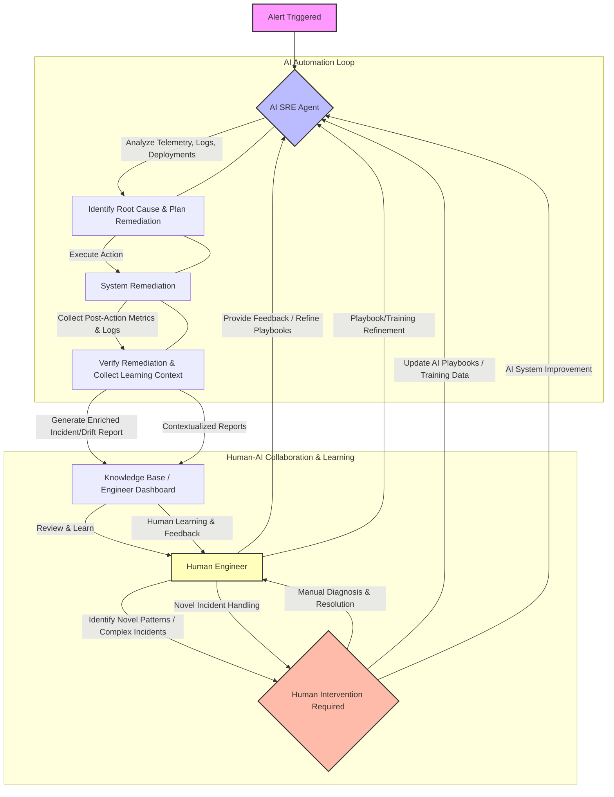

The integration of AI into Site Reliability Engineering (SRE) processes promises reduced Mean Time To Recovery (MTTR) and operational efficiency. However, this advancement introduces a critical challenge: as AI agents automate an increasing portion of incident response, from alert analysis to remediation, human engineers can lose their intuitive understanding of system behavior and failure modes. This degradation of system sense, or `system intuition drift`, makes engineers less capable of handling novel, complex incidents that AI cannot resolve autonomously.

## The Paradox of AI SRE Automation

Modern SRE teams leverage AI to streamline operations, often deploying `AI SRE agents` for tasks like:
*   Alert correlation and root cause analysis
*   Automated telemetry data querying
*   Change log correlation with incidents
*   Automated remediation playbook execution

While these automations significantly improve `MTTR (Mean Time To Recovery)` and `operational efficiency`, they inadvertently create a `knowledge gap` for human engineers. When engineers are routinely shielded from the low-to-medium complexity incidents, they miss out on critical opportunities to:
1.  **Observe**: How the system behaves under stress and various failure conditions.
2.  **Diagnose**: The logical steps an expert takes to pinpoint issues.
3.  **Learn**: The intricate dependencies and failure patterns unique to their specific services.

Consequently, when a truly novel or catastrophic incident occurs – one that the AI agent's training data or pre-defined playbooks cannot handle – human engineers are faced with an unfamiliar landscape, lacking the experiential knowledge to effectively intervene.

## Contextualized Automation Outputs: Bridging the Knowledge Gap

To counteract `system intuition drift`, AI automation must evolve beyond mere task execution. The solution lies in designing `AI automation systems` that not only perform actions but also explicitly capture and communicate the context, rationale, and learning points behind their decisions and actions. This `human-centric AI design` ensures that automated outputs serve as `learning artifacts` for engineers, preserving and even enhancing their system understanding.

A key strategy is to enrich existing `automation artifacts` like `incident reports` and `drift detection reports`. Instead of just stating "AI fixed X," the reports should include:
*   **Problem Statement**: What the AI detected.
*   **Hypothesis**: Why the AI believed this was the problem.
*   **Diagnostic Steps**: Which tools and data points the AI queried and why.
*   **Action Taken**: The specific remediation applied.
*   **Rationale**: The logic or rule set that guided the AI's decision.
*   **Learned Context**: Specific system behavior observed during the incident, anomalous patterns, or new correlations identified.

This enriched output acts as a `post-incident review (PIR)` for every automated fix, providing engineers with a detailed mental model of the incident's resolution, even if they weren't directly involved.

### Implementation: Integrating Learning Points into Reports

Consider a scenario where a `hub-worker AI automation system` identifies and resolves a `service drift` issue. The traditional output might simply be a "Service Drift Resolved" notification. With `human-understandability` in mind, the `drift detection report` or `incident summary` should be augmented.

Here's a conceptual Python example for enriching an automated incident report:

```python
import json
from datetime import datetime

def generate_enriched_incident_report(incident_id, ai_actions, ai_reasoning, system_telemetry_snapshot):
    """
    AI 에이전트의 작업, 추론, 시스템 상태 스냅샷을 포함하여 강화된 장애 보고서를 생성합니다.
    Generates an enriched incident report including AI agent actions, reasoning, and system telemetry snapshot.
    """
    report = {
        "incidentId": incident_id,
        "timestamp": datetime.now().isoformat(),
        "status": "Resolved by AI Automation",
        "description": f"AI agent resolved incident {incident_id} related to service drift.",
        "aiAnalysis": {
            "problemDetected": ai_reasoning["problem"],
            "initialHypothesis": ai_reasoning["hypothesis"],
            "diagnosticSteps": ai_reasoning["diagnostic_steps"],
            "observedAnomalies": ai_reasoning.get("anomalies", []),
            "remediationAction": ai_actions["action"],
            "actionRationale": ai_actions["rationale"],
            "postActionVerification": ai_actions["verification_results"]
        },
        "systemContextSnapshot": system_telemetry_snapshot,
        "humanLearningPoints": [
            "This incident highlighted a race condition in the `UserService` module under high load, leading to transient data inconsistency. AI applied a temporary rate limit.",
            "New correlation identified: High CPU on `AuthService` often precedes `DB Connection Pool Exhaustion` in `PaymentService` due to misconfigured retry logic."
        ]
    }
    return json.dumps(report, indent=2, ensure_ascii=False)

# Example usage
ai_reasoning_data = {
    "problem": "High latency in UserProfileService API endpoints, detected via Prometheus alerts.",
    "hypothesis": "Suspected database connection exhaustion in UserProfileDB due to recent deployment of new feature `SocialFeed`.",
    "diagnostic_steps": [
        "Queryed `DB_Connections_UserProfileDB` metric in Grafana.",
        "Checked recent `Kubernetes deployments` for `UserProfileService`.",
        "Analyzed `application logs` for `UserProfileService` via ELK stack for 'connection refused' errors."
    ],
    "anomalies": ["Increased `wait_timeout` errors in DB logs during peak hours."]
}

ai_actions_data = {
    "action": "Scaled up `UserProfileService` replicas from 3 to 5. Increased `DB_MAX_CONNECTIONS` for `UserProfileDB` by 20%.",
    "rationale": "Scaling replicas mitigates load. Database connection pool adjustment addresses observed exhaustion.",
    "verification_results": "Latency returned to normal within 2 minutes. `DB_Connections_UserProfileDB` metrics normalized."
}

telemetry_data = {
    "metrics": {"cpu_usage": "70%", "memory_usage": "60%", "latency_p99": "150ms -> 30ms"},
    "logs_summary": "No critical errors after remediation.",
    "deployment_info": {"service": "UserProfileService", "version": "v1.2.3", "previous_version": "v1.2.2"}
}

report_json = generate_enriched_incident_report("INC-20260720-001", ai_actions_data, ai_reasoning_data, telemetry_data)
print(report_json)
```

The `humanLearningPoints` array in the JSON output is crucial for explicit knowledge transfer. This can be further augmented by `LLM (Large Language Model)` agents summarizing complex `telemetry data` or `code changes` into digestible insights for engineers.

## Human-AI Learning Feedback Loop

A visual representation of how humans and AI can learn from each other in an SRE context, emphasizing the flow of contextual information.



This diagram illustrates the continuous learning loop, where `AI agents` handle routine incidents, generating `contextualized reports` that feed into a `knowledge base`. `Human engineers` review these reports, learn from `AI's reasoning`, provide feedback, and intervene for novel issues, thereby enriching both their own expertise and the `AI's capabilities`. This embodies the `human-in-the-loop` principle not just for oversight but for `mutual learning`.

### Advanced Techniques for Human Understanding

In 2026, further enhancements include:
*   **`Explainable AI (XAI)` Integration**: Technologies that explain why an AI made a particular decision, offering transparency into complex models. This moves beyond just "rationale" to "how the rationale was derived."
*   **`Knowledge Graph` for Incidents**: Building a graph database that links incidents, root causes, system components, deployments, and remediation actions. This allows engineers to query for similar past incidents and understand causal chains even if AI resolved them.
*   **`Agentic Self-Documentation`**: AI agents automatically documenting their processes, decisions, and observations in a structured, queryable format, contributing directly to the knowledge base without human overhead.

These techniques ensure that even as automation scales, the collective `system knowledge` grows, making both human engineers and AI agents more effective.

## 트레이드오프

`AI 자동화 시스템의 인간 이해도 유지 방안`을 마련하는 것은 여러 장단점을 동반합니다.

*   **정보 과부하 (Information Overload) vs. 충분한 컨텍스트 (Sufficient Context)**
    *   **언제 좋은가**: 자동화된 시스템의 복잡도가 높고, 엔지니어가 시스템의 미묘한 동작 방식을 심층적으로 이해해야 할 때 유용합니다. 특히 신규 입사자의 온보딩이나 특정 도메인 전문가 양성에 기여합니다.
    *   **언제 나쁜가**: 모든 자동화 결과물에 과도하게 상세한 정보를 포함하면, 엔지니어는 핵심 정보를 파악하기 어려워지고 오히려 인지 부하가 증가하여 피로도를 유발할 수 있습니다. 긴급 상황에서 빠른 의사 결정이 방해될 수도 있습니다.

*   **개발 및 유지보수 복잡성 (Development & Maintenance Complexity) vs. 장기적 지식 보존 (Long-term Knowledge Retention)**
    *   **언제 좋은가**: 시스템의 `lifecycle`이 길고, 지식 손실이 조직에 큰 위험이 될 수 있는 경우 장기적인 `system knowledge`를 축적하고 보존하는 데 필수적입니다. AI 에이전트의 `self-correction` 및 `adaptation` 능력 향상에도 기여합니다.
    *   **언제 나쁜가**: `AI 에이전트`가 생성하는 `contextual data`를 체계적으로 수집, 분석, 표현하는 시스템을 구축하고 유지보수하는 데 상당한 개발 리소스와 시간이 소요됩니다. 초기 단계의 `Proof of Concept (PoC)` 프로젝트에는 과도한 오버헤드가 될 수 있습니다.

*   **실시간 컨텍스트 생성 비용 (Real-time Context Generation Cost) vs. 학습 기회 (Learning Opportunities)**
    *   **언제 좋은가**: `critical system`의 `incident` 발생 시 `AI 에이전트`가 상세한 `trace`와 `reasoning path`를 제공함으로써, 사람이 놓칠 수 있는 미묘한 `interdependency`를 발견하고 학습하는 데 큰 도움이 됩니다.
    *   **언제 나쁜가**: 모든 자동화된 `operation`에 대해 `LLM`을 사용하여 `context`를 분석하고 `learning point`를 생성하는 것은 `inference cost`와 `latency`를 증가시킬 수 있습니다. 비용 효율성을 고려하지 않으면 운영 비용이 예상보다 훨씬 높아질 수 있습니다.

*   **표준화된 보고 vs. 유연한 학습 경로 (Standardized Reports vs. Flexible Learning Paths)**
    *   **언제 좋은가**: 일관된 형식의 `enriched report`는 조직 전체의 `system knowledge`를 통일된 방식으로 관리하고, 엔지니어 간의 `knowledge sharing`을 촉진합니다. `observability` 도구와의 통합도 용이합니다.
    *   **언제 나쁜가**: 모든 엔지니어의 `learning style`이나 필요한 `context depth`가 동일하지 않으므로, 지나치게 `standardized`된 보고서는 일부 엔지니어에게는 비효율적이거나 불충분할 수 있습니다. 개인화된 `insight generation`이 제한될 수 있습니다.

## 실전 체크리스트

AI 자동화 시스템에서 인간 이해도를 유지하기 위한 방안을 프로젝트에 적용할 때 다음 항목들을 검증합니다.

*   [ ] **자동화된 장애 보고서 `(Automated Incident Reports)`에 AI의 `진단 경로 (diagnostic path)` 및 `개입 근거 (intervention rationale)`가 포함되어 있는가?** (예: AI가 어떤 데이터로 어떤 가설을 세웠고, 왜 특정 조치를 취했는지 명시)
*   [ ] **`드리프트 감지 보고서 (Drift Detection Reports)`가 단순한 `변동 감지`를 넘어 `변동의 원인`과 `잠재적 영향`, `해결 과정`에 대한 `contextual insight`를 제공하는가?**
*   [ ] **AI 에이전트가 생성하는 `학습 포인트 (learning points)` 또는 `새로운 패턴 감지` 결과가 정기적으로 `지식 기반 (knowledge base)`에 통합되고, 엔지니어가 쉽게 검색하고 활용할 수 있는가?**
*   [ ] **`Mermaid` 또는 유사 도구를 활용하여 `AI 에이전트`의 `의사결정 흐름 (decision flow)`이나 `시스템 상호작용 (system interactions)`을 시각화하는 `아티팩트`가 생성되는가?**
*   [ ] **엔지니어들이 `AI 자동화 시스템`이 처리한 `incidents`에 대해 `정기적 피드백`을 제공할 수 있는 메커니즘이 존재하며, 이 피드백이 `AI 에이전트`의 `행동` 및 `보고서 품질` 개선에 반영되는가?**
*   [ ] **`AI 에이전트`의 `자동화 범위`가 확장될 때마다, 엔지니어의 `시스템 이해도` 변화를 측정하고 (`survey`, `incident response drill` 등) `knowledge gap` 발생 여부를 모니터링하는 지표가 있는가?**
*   [ ] **`XAI (Explainable AI)` 기술을 도입하여 `AI 에이전트`의 복잡한 `추론 과정`을 인간이 이해할 수 있는 수준으로 설명하는 기능을 검토하고 있는가?**