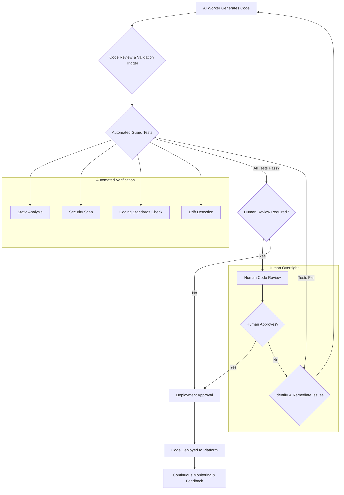

AI 생성 코드의 활용이 빠르게 증가하면서, 이로 인해 발생하는 책임성(Accountability) 문제는 새로운 중요성을 띠고 있습니다. 특히, 애플리케이션이나 서비스가 플랫폼 생태계(예: 앱 스토어, SaaS 마켓플레이스)에 배포될 경우, AI가 생성한 코드나 구성 요소가 플랫폼의 자동 심사 시스템에 의해 예상치 못한 방식으로 거부되거나 서비스가 정지될 위험이 커지고 있습니다. 이는 단순히 코드를 누가 만들었느냐의 문제를 넘어, 그 코드를 이해하고, 검토하며, 최종 배포 책임을 지는 주체가 누구인지에 대한 명확한 정의와 프로세스 강화를 요구합니다.

## AI 코드 책임성 강화의 필요성

AI 워커들이 복잡한 코드를 생성하고 배포하는 파이프라인(LLM Output Verification Pipeline)이 일반화됨에 따라, 생성된 코드의 품질, 보안, 그리고 규제 준수 여부를 지속적으로 검증하는 메커니즘이 필수적입니다. 플랫폼 사업자들이 자체적인 알고리즘 기반의 심사(Automated Review)를 강화하는 2026년 트렌드를 고려할 때, AI 생성 코드에 대한 선제적인 '가드 테스트(Guard Test)'는 리스크 관리의 핵심 요소가 됩니다. 이는 잠재적인 문제를 배포 전에 식별하고 수정하여, 서비스 정지나 평판 하락과 같은 치명적인 영향을 방지하는 데 기여합니다.

### 드리프트 감지 및 가드 테스트 적용

AI 모델의 출력은 지속적으로 변화할 수 있으며, 이를 '드리프트(Drift)'라고 합니다. 이 드리프트가 기존의 안전성(Safety) 기준이나 플랫폼 정책을 위반할 가능성이 있을 때, 이를 사전에 감지하고 차단하는 것이 가드 테스트의 주요 목표입니다. playbook의 ‘LLM 출력 검증 파이프라인’ 및 ‘드리프트 감지’ 기능을 고도화하여, AI 워커들이 생성하는 코드나 결과물이 플랫폼의 자동 심사로 인해 발생할 수 있는 잠재적 정지 위험을 선제적으로 식별하고 관리하는 체계를 구축해야 합니다. 특히, AI가 생성한 구성 요소에 대한 인간의 이해, 검토, 배포 책임 명확화 과정을 추가합니다.

코드 생성 단계부터 정적 분석(Static Analysis), 보안 취약점 검사(Vulnerability Scan), 코딩 표준 준수 여부(Coding Standard Compliance) 등을 자동으로 검증하는 가드 테스트를 통합합니다. 또한, AI가 생성한 구성 요소에 대한 인간의 이해, 검토, 배포 책임 명확화 과정을 추가하여 기술적 검증과 함께 인적 책임의 고리를 강화해야 합니다.

## AI 생성 코드 검증 파이프라인 예시

다음은 AI 워커가 생성한 코드를 검증하는 간단한 파이프라인의 코드 예시입니다. 이 예제는 Python을 사용하여 Linting, Security Scan, Unit Test Coverage Check 등 기본적인 가드 테스트를 수행하는 함수를 보여줍니다. 실제 시스템에서는 CI/CD 파이프라인에 통합되어 자동으로 실행됩니다.

```python
import subprocess
import os

def run_guard_tests(file_path: str) -> dict:
    """
    AI 생성 코드에 대한 가드 테스트를 실행합니다.
    - Linting (flake8)
    - Basic Security Scan (bandit)
    - Unit Test Coverage (pytest-cov)
    """
    results = {
        "lint_passed": False,
        "security_scan_passed": False,
        "coverage_sufficient": False,
        "errors": []
    }

    print(f"Running guard tests for {file_path}")

    # 1. Linting with Flake8
    try:
        lint_output = subprocess.run(
            ["flake8", file_path],
            capture_output=True, text=True, check=True
        )
        results["lint_passed"] = True
        print("Linting Passed.")
    except subprocess.CalledProcessError as e:
        results["errors"].append(f"Linting failed: {e.stdout}{e.stderr}")
        print("Linting Failed.")
    except FileNotFoundError:
        results["errors"].append("flake8 not found. Please install it.")

    # 2. Basic Security Scan with Bandit
    try:
        security_output = subprocess.run(
            ["bandit", "-r", file_path, "-f", "json"],
            capture_output=True, text=True, check=False
        )
        if "No issues found" in security_output.stdout or security_output.returncode == 0:
            results["security_scan_passed"] = True
            print("Security Scan Passed.")
        else:
            results["errors"].append(f"Security scan found issues: {security_output.stdout}")
            print("Security Scan Failed.")
    except FileNotFoundError:
        results["errors"].append("bandit not found. Please install it.")

    # 3. Unit Test Coverage Check (Example: checks if coverage.xml exists and meets a threshold)
    # This assumes unit tests are run separately and generate a coverage report.
    # For demonstration, let's assume if file exists, we pass a hypothetical threshold
    coverage_file = "coverage.xml" # Or a specific directory containing coverage data
    if os.path.exists(coverage_file):
        # A simple check; a real check would parse the XML/JSON report
        # For demonstration, let's assume if file exists, we pass a hypothetical threshold
        results["coverage_sufficient"] = True
        print("Coverage check: report found.")
    else:
        results["errors"].append("Coverage report not found. Ensure unit tests are run.")
        print("Coverage check: report NOT found.")

    return results

if __name__ == "__main__":
    # Create a dummy Python file for testing
    dummy_code = """
import os

def vulnerable_function(user_input):
    # Potential SQL Injection or command injection risk if not sanitized
    exec(user_input) 

def safe_function():
    print("This is a safe function.")

if __name__ == "__main__":
    vulnerable_function("'ls -la'")
    safe_function()
"""
    test_file_name = "ai_generated_code_test.py"
    with open(test_file_name, "w") as f:
        f.write(dummy_code)

    # Run tests
    test_results = run_guard_tests(test_file_name)
    print("\nFinal Guard Test Results:")
    for key, value in test_results.items():
        print(f"- {key}: {value}")

    # Clean up dummy file
    os.remove(test_file_name)
```

## AI 코드 검증 파이프라인 워크플로우

AI 생성 코드의 검증 워크플로우는 자동화된 가드 테스트와 필수적인 인간 개입을 결합합니다. 아래 Mermaid 다이어그램은 이러한 과정을 시각적으로 보여줍니다.



이 워크플로우는 AI 워커가 코드를 생성하면 즉시 다양한 가드 테스트를 거치게 됩니다. 테스트에 실패하면 문제를 식별하고 해결하기 위해 AI 워커 또는 인간 개발자에게 피드백이 제공됩니다. 모든 자동화된 테스트를 통과하더라도, 복잡하거나 비판적인 코드에 대해서는 인간의 검토(Human Code Review) 단계를 거쳐 최종 승인 후 배포됩니다.

## 트레이드오프

이러한 AI 생성 코드 책임성 강화 및 플랫폼 규제 대응 전략은 다음과 같은 트레이드오프를 가집니다.

*   **개발 속도 vs. 안정성 및 규제 준수**:
    *   **언제 좋나**: 고위험(High-Risk) 애플리케이션이나 엄격한 규제 환경에서 AI 생성 코드를 사용할 때, 예측 불가능한 플랫폼 제재를 회피하고 안정적인 서비스 운영을 보장하는 데 매우 효과적입니다. 초기 개발 단계의 오류 비용을 크게 줄일 수 있습니다.
    *   **언제 나쁜가**: 프로토타이핑이나 내부용 도구와 같이 빠른 실험과 배포가 중요한 환경에서는, 엄격한 가드 테스트와 인간 검토 프로세스가 개발 속도를 저하시켜 시장 출시 시기를 늦출 수 있습니다.
*   **구현 복잡성 vs. 위험 완화**:
    *   **언제 좋나**: 복잡한 검증 파이프라인과 드리프트 감지 시스템은 초기 구축에 상당한 공수(Effort)를 요구하지만, 장기적으로는 AI 생성 코드의 잠재적 위험(보안 취약점, 버그, 플랫폼 정책 위반 등)을 효과적으로 완화하여 기술 부채를 줄입니다.
    *   **언제 나쁜가**: 소규모 프로젝트나 제한된 리소스를 가진 팀에서는 이러한 복잡한 시스템을 구축하고 유지보수하는 것이 비현실적일 수 있으며, 오히려 오버헤드(Overhead)로 작용할 수 있습니다.
*   **비용(Cost) vs. 신뢰도**:
    *   **언제 좋나**: 가드 테스트와 인간 검토를 통해 생성된 코드의 신뢰도(Reliability)를 극대화할 수 있습니다. 이는 최종 사용자 만족도 및 기업 평판 향상으로 이어져 장기적인 사업적 가치를 창출합니다. 특히, 잘못된 AI 코드 하나로 대규모 서비스 중단이 발생할 수 있는 경우, 초기 투자 비용 이상의 가치를 제공합니다.
    *   **언제 나쁜가**: 자동화된 테스트 도구 라이선스, 클라우드 자원 사용, 그리고 인간 검토자의 시간 투입 등은 직접적인 비용 증가로 이어집니다. 특히, 수익 모델이 명확하지 않은 초기 서비스나 비용 효율성이 최우선인 경우 부담이 될 수 있습니다.
*   **자동화 범위 vs. 인간 책임의 명확성**:
    *   **언제 좋나**: 자동화된 가드 테스트는 반복적이고 표준화된 검증 작업을 효율적으로 처리하여 인간의 실수를 줄입니다. 동시에, 중요한 의사결정 지점에 인간 검토를 배치하여 AI의 한계를 보완하고 최종 책임 소재를 명확히 할 수 있습니다. 이는 AI의 자율성을 존중하면서도 통제력을 유지하는 균형 잡힌 접근 방식입니다.
    *   **언제 나쁜가**: 과도한 자동화는 인간 개발자의 책임감을 희석시키고, 반대로 과도한 수동 검토는 AI의 생산성 이점을 상쇄할 수 있습니다. 적절한 균형점을 찾지 못하면, 책임 전가(Blame Shifting) 문제나 병목 현상(Bottleneck)이 발생할 수 있습니다.

## 실전 체크리스트

AI 생성 코드 책임성 및 플랫폼 규제 대응 강화를 위한 실전 체크리스트는 다음과 같습니다.

- [ ] **LLM 출력 검증 파이프라인 구축 여부**: AI 워커가 생성하는 모든 코드에 대해 Linting, Static Analysis, Security Scan을 포함하는 자동화된 검증 파이프라인이 CI/CD에 통합되어 있는가?
- [ ] **드리프트 감지 시스템 적용 여부**: AI 모델 출력의 변경(Drift)을 주기적으로 감지하고, 이로 인한 잠재적 안전성 또는 규제 위반 가능성을 식별하는 시스템이 구현되어 있는가?
- [ ] **가드 테스트 커버리지 정의 및 확보**: 주요 플랫폼 규제(예: 데이터 보안, 개인정보 보호, 콘텐츠 정책)와 관련된 가드 테스트 시나리오가 명확하게 정의되어 있고, AI 생성 코드가 이를 충분히 커버하는가?
- [ ] **인간 검토 및 승인 절차 명확화**: AI가 생성한 핵심 코드 또는 고위험 로직에 대해, 인간 개발자가 검토하고 승인하는 절차(Human-in-the-Loop)가 워크플로우에 명확히 정의되어 있고 팀 내에서 공유되는가?
- [ ] **책임 주체 명확화**: AI가 생성한 코드로 인해 문제가 발생했을 때, 해당 코드의 이해, 검토, 배포에 대한 최종 책임자가 명확하게 지정되어 있는가?
- [ ] **플랫폼 규제 변경 모니터링 및 대응 프로세스**: 사용 중인 플랫폼(예: Google Play, Apple App Store)의 규제 및 정책 변경 사항을 주기적으로 모니터링하고, 이에 맞춰 가드 테스트 및 검증 로직을 업데이트하는 프로세스가 확립되어 있는가?
- [ ] **오류 및 피드백 루프 자동화**: 가드 테스트 실패 시 AI 워커 또는 관련 개발자에게 자동으로 알림이 가고, 문제 해결을 위한 명확한 피드백 루프가 작동하는가?