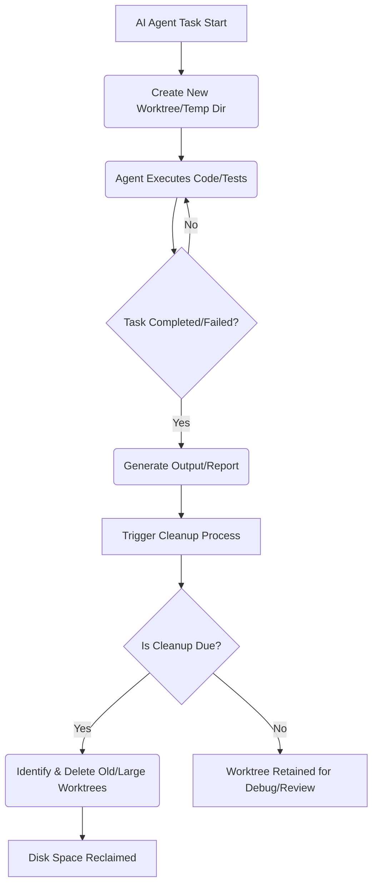

AI 코딩 에이전트, 특히 Claude Code와 같은 도구들은 복잡한 코드 생성 및 테스트 작업을 수행하면서 다수의 임시 작업 디렉토리(worktree)를 생성합니다. 이러한 worktree에는 개발 환경 구성을 위한 `node_modules`, `.next`, `target`, `.venv`와 같은 대용량 의존성 파일들이 포함되는 경우가 많습니다. 병렬 작업이 잦아질수록 이러한 임시 파일들은 빠르게 누적되어 시스템 디스크 공간을 고갈시키고, 궁극적으로 시스템 성능 저하 및 안정성 문제를 야기합니다. 따라서 AI 에이전트 운영 환경에서는 이러한 임시 작업 공간을 자동으로 정리하는 메커니즘을 도입하는 것이 필수적입니다. 이 엔트리에서는 Claude Code 하네스 또는 관련 CI/CD 워크플로에 통합될 수 있는 임시 작업 공간 자동 정리 전략과 구현 방안을 다룹니다.

## AI 에이전트 임시 Worktree 문제점

AI 코딩 에이전트는 코드 수정, 테스트, 빌드 등 다양한 태스크를 수행하기 위해 격리된 환경이 필요하며, 이를 위해 Git의 `worktree` 기능을 활용하거나 별도의 임시 디렉토리를 생성하는 경우가 많습니다. 각 작업이 완료된 후에도 해당 worktree가 적절히 정리되지 않으면, 다음과 같은 문제가 발생합니다:

### 디스크 공간 고갈 (Disk Space Exhaustion)
단일 worktree가 수 GB에 달하는 경우가 흔하며, 특히 JavaScript/TypeScript 프로젝트의 `node_modules`나 Java/Scala 프로젝트의 `target` 디렉토리는 매우 큽니다. 에이전트가 수십, 수백 개의 worktree를 생성하면 짧은 시간 내에 수백 GB에서 수 TB의 디스크 공간이 소비될 수 있습니다. 이는 개발 서버, CI/CD 러너, 또는 로컬 개발 환경 모두에 심각한 영향을 미칩니다.

### 시스템 성능 저하 (System Performance Degradation)
디스크 공간 고갈은 운영 체제의 스왑(swap) 사용을 증가시키고, 파일 시스템 I/O 성능을 저하시켜 전반적인 시스템 반응 속도를 느리게 만듭니다. 또한, 불필요한 파일들이 디스크 캐시를 오염시켜 필요한 데이터 로딩에 방해가 될 수 있습니다.

### 잠재적 보안 위험 (Potential Security Risks)
오래된 worktree에 민감한 정보(API 키, 개인 식별 정보 등)가 포함되어 있을 경우, 이는 잠재적인 보안 취약점이 될 수 있습니다. 주기적인 정리는 이러한 노출 위험을 줄이는 데 기여합니다.

## 자동 정리 시스템 설계 및 통합

AI 에이전트의 임시 worktree 자동 정리는 일반적으로 두 가지 주요 시나리오에서 고려될 수 있습니다: AI 에이전트 하네스 내부 로직에 통합하거나, 외부 CI/CD 워크플로 또는 시스템 크론 작업으로 구현하는 것입니다. 이 엔트리에서는 GitHub Actions를 예시로 한 CI/CD 워크플로 통합 방안을 중점적으로 다룹니다.

### 워크플로 개요



### 구현 전략

1.  **Worktree 식별**: AI 에이전트가 생성하는 worktree 또는 임시 디렉토리의 명명 규칙이나 저장 경로를 표준화합니다 (예: `~/.claude-worktrees/agent-{task-id}`).
2.  **정리 기준 정의**: 어떤 worktree를 정리할지 기준을 명확히 합니다.
    *   **사용 기간 (Age)**: 특정 기간 (예: 24시간, 7일) 이상 수정되지 않거나 접근되지 않은 worktree.
    *   **크기 (Size)**: 특정 크기 (예: 1GB)를 초과하는 worktree 중 오래된 것.
    *   **상태 (Status)**: 에이전트 태스크가 성공적으로 완료되었거나 실패 후 디버깅이 필요 없는 worktree.
3.  **정리 스크립트 작성**: 대상 worktree를 안전하게 식별하고 제거하는 스크립트를 작성합니다.
    *   `find` 명령어를 활용하여 특정 조건을 만족하는 디렉토리를 찾습니다.
    *   `rm -rf` 사용 시에는 **반드시 `--dry-run` 또는 로깅 기능을 먼저 구현**하여 안전성을 확보합니다.
    *   일반적으로 `node_modules`, `.next`, `.venv`, `target`과 같은 서브디렉토리만 제거하고, 전체 worktree는 일정 기간 보존하는 전략도 유효합니다.
4.  **스케줄링**: cleanup 스크립트를 주기적으로 실행하도록 스케줄링합니다.
    *   **GitHub Actions**: `schedule` 이벤트를 사용하여 특정 시간에 주기적으로 워크플로를 실행합니다.
    *   **Claude Code Harness**: 에이전트의 태스크 완료 후 후처리(post-processing) 훅(hook)에 cleanup 로직을 추가합니다.
    *   **Cron Job**: 서버에 직접 cron job을 설정하여 실행합니다.

### 예시: GitHub Actions 워크플로

다음은 특정 경로(`~/.claude-worktrees`)에 있는 24시간 이상 된 worktree를 자동으로 정리하는 GitHub Actions 워크플로 예시입니다. 여기서는 `node_modules`와 `target` 디렉토리만 제거하고, 전체 worktree는 보존하는 전략을 사용합니다.

```yaml
name: AI Agent Worktree Cleanup

on:
  schedule:
    - cron: '0 0 * * *' # 매일 자정(UTC)에 실행
  workflow_dispatch: # 수동 실행을 허용

jobs:
  cleanup-worktrees:
    runs-on: ubuntu-latest
    steps:
      - name: Configure Git for Worktrees
        run: |
          git config --global user.email "actions@github.com"
          git config --global user.name "GitHub Actions Bot"

      - name: List potential worktrees for cleanup (Dry Run)
        run: |
          find ~/.claude-worktrees -maxdepth 2 -type d -mtime +1 -print0 | xargs -0 -I {} bash -c '
            echo "--- Processing {} ---"
            if [ -d "{}/node_modules" ]; then
              echo "Would remove: {}/node_modules"
            fi
            if [ -d "{}/target" ]; then
              echo "Would remove: {}/target"
            fi
          '

      - name: Execute Cleanup (Remove specific large directories)
        run: |
          find ~/.claude-worktrees -maxdepth 2 -type d -mtime +1 -print0 | xargs -0 -I {} bash -c '
            echo "Cleaning up worktree: {}"
            if [ -d "{}/node_modules" ]; then
              echo "Removing {}/node_modules"
              rm -rf "{}/node_modules"
            fi
            if [ -d "{}/target" ]; then
              echo "Removing {}/target"
              rm -rf "{}/target"
            fi
            # Optional: Remove empty worktrees after cleaning specific dirs
            if [ -z "$(ls -A '{}')" ]; then
              echo "Removing empty worktree: {}"
              rmdir "{}"
            fi
          '

      - name: Report Disk Usage After Cleanup
        run: df -h
```

위 스크립트는 `~/.claude-worktrees` 디렉토리 하위에서 24시간(`-mtime +1`)이 지난 worktree들을 대상으로 `node_modules`와 `target` 디렉토리를 제거합니다. 전체 worktree를 제거해야 하는 경우, `rm -rf "{}"`를 직접 사용할 수 있으나, 안전을 위해 `--dry-run` 모드나 더 신중한 접근이 필요합니다.

## 트레이드오프

### 1. 디스크 공간 절약 및 시스템 안정성 증대 vs. 복잡성 증가 및 디버깅 지연
*   **언제 좋나**: 대규모 AI 에이전트 작업을 병렬로 수행하거나, 공유 CI/CD 러너 환경에서 디스크 공간이 빠르게 고갈되는 상황에서 필수적입니다. 시스템 안정성을 높여 에이전트 작업의 연속성을 보장합니다.
*   **언제 나쁜가**: 디버깅을 위해 작업 결과물이나 임시 빌드 파일을 오래 보존해야 하는 경우, 자동 정리가 완료된 후 해당 파일들이 사라져 디버깅 프로세스가 지연될 수 있습니다. 정리 로직이 복잡해질수록 관리 오버헤드가 증가합니다.

### 2. 비용 절감 (클라우드 환경) vs. 정리 작업 자체의 리소스 소모
*   **언제 좋나**: 클라우드 기반 CI/CD 러너(GitHub Actions, Jenkins Agents 등)를 사용할 때, 디스크 사용량에 따른 비용을 절감할 수 있습니다. 불필요한 스토리지 비용을 줄이고, 더 효율적인 리소스 할당을 가능하게 합니다.
*   **언제 나쁜가**: 정리 스크립트 자체가 CPU, 메모리, I/O 리소스를 소모합니다. 매우 빈번하게 실행되거나 비효율적으로 구현될 경우, 정리 작업이 주 작업의 성능에 영향을 주거나 추가 비용을 발생시킬 수 있습니다.

### 3. 보안 강화 및 데이터 노출 위험 감소 vs. 과도한 삭제 위험
*   **언제 좋나**: 임시 파일에 포함될 수 있는 민감 정보(예: API 키, 토큰)가 불필요하게 오래 남아있을 위험을 줄여 보안 수준을 높입니다. 특히 공유 환경에서 보안 가이드라인 준수에 도움이 됩니다.
*   **언제 나쁜가**: 잘못된 정리 기준이나 스크립트 오류로 인해 아직 필요한 중요한 데이터나 디버깅에 필수적인 로그가 삭제될 위험이 있습니다. 이는 복구 불가능한 손실로 이어질 수 있으므로 신중한 검증이 요구됩니다.

## 실전 체크리스트

프로젝트에 AI 에이전트 임시 작업 공간 자동 정리 로직을 적용할 때 다음 항목들을 검증해야 합니다.

- [ ] AI 에이전트가 생성하는 임시 worktree 또는 작업 디렉토리의 표준 경로와 명명 규칙을 정의했는가?
- [ ] 정리 대상 디렉토리(예: `node_modules`, `target`, `.venv`)와 전체 worktree에 대한 명확한 정리 정책(보존 기간, 크기 기준)을 수립했는가?
- [ ] 자동 정리 스크립트/코드에 `--dry-run` 또는 로깅 기능을 포함하여 실제 삭제 전 대상을 확인할 수 있도록 구현했는가?
- [ ] 정리 스크립트 실행 후 실제 디스크 공간 확보량과 시스템 리소스 사용량을 모니터링하여 효율성을 검증했는가?
- [ ] 정리 작업의 스케줄링(예: 매일 자정, 태스크 완료 후)이 에이전트의 작업 패턴 및 디버깅 요구 사항과 충돌하지 않는가?
- [ ] 중요한 데이터나 로그가 실수로 삭제되는 것을 방지하기 위한 백업 또는 복구 메커니즘을 고려했는가?
- [ ] 자동 정리 실패 시 관리자에게 알림을 보내는 경고(alerting) 시스템을 구축했는가?