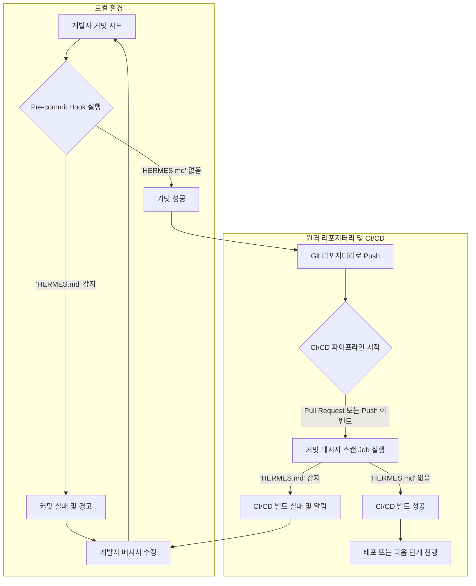

Claude Code 요청 시 특정 커밋 메시지 내용이 예기치 않은 추가 과금 경로를 유발하는 사례가 발견되었다. 특히 'HERMES.md' 문자열이 커밋 메시지에 포함될 경우, Claude Code는 일반적인 Max 플랜 쿼터 대신 extra usage 과금으로 라우팅되는 문제가 확인되었다. 이는 디스크상의 파일 존재 여부와 무관하게 커밋 메시지 자체의 내용에 의해 트리거된다. 이러한 잠재적 비용 증가 리스크를 관리하기 위해, 개발 워크플로우 전반에 걸쳐 커밋 메시지 감시 및 수정 자동화가 필수적이다.

## 문제 개요: 'HERMES.md' 트리거와 과금 메커니즘

Anthropic의 Claude Code는 코드 분석 및 생성에 특화된 강력한 LLM이다. 일반적으로 사용량은 설정된 플랜에 따라 관리되지만, 특정 문자열 패턴이 포함된 커밋 메시지가 시스템에 유입될 경우, 내부 라우팅 로직이 변경되어 고비용 경로로 처리될 수 있다. 'HERMES.md'는 이러한 특정 문자열 중 하나로 식별되었으며, 개발팀이 인지하지 못하는 사이에 불필요한 비용이 발생할 수 있는 취약점을 드러낸다. 이 문제는 특히 자동화된 커밋 메시지 생성 시스템(예: AI 기반 커밋 메시지 생성 도구, CI/CD 스크립트)을 사용하는 환경에서 더욱 심각하다.

## 커밋 메시지 감시 및 수정 전략

'HERMES.md'와 같은 잠재적 위험 문자열을 사전에 탐지하고 제거하기 위한 다단계 방어 전략이 필요하다. 이는 개발자의 로컬 환경부터 CI/CD 파이프라인에 이르기까지 전 워크플로우를 포괄해야 한다.

### 1. Pre-commit Hook을 통한 로컬 방어

개발자가 커밋을 생성하기 전에 클라이언트 측에서 메시지를 검증하는 `pre-commit` hook을 활용한다. 이는 가장 빠르고 효율적인 1차 방어선이다.

```bash
#!/bin/sh
# .git/hooks/pre-commit-message-check.sh

# 커밋 메시지 파일을 임시 변수에 저장
COMMIT_MSG_FILE=$(git rev-parse --git-dir)/COMMIT_EDITMSG

# 'HERMES.md' 문자열이 포함되어 있는지 검사
if grep -q "HERMES.md" "$COMMIT_MSG_FILE"; then
  echo "ERROR: Commit message contains 'HERMES.md' which can incur extra Claude Code charges."
  echo "Please revise your commit message to remove this string."
  exit 1
fi

# AI가 생성한 커밋 메시지 수정 로직 (옵션)
# 예를 들어, OpenAI API를 사용하여 'HERMES.md'를 우회하는 메시지로 자동 수정
# 이 예시에서는 간단히 경고 후 수동 수정을 유도
# (실제 구현 시 API 키 관리 및 네트워크 호출 오버헤드 고려 필요)

exit 0
```
이 스크립트는 `COMMIT_EDITMSG` 파일 내용을 검사하여 'HERMES.md'가 발견되면 커밋을 중단하고 사용자에게 경고한다. 개발자는 이 훅을 프로젝트 `.git/hooks` 디렉터리에 설치하거나, `husky`와 같은 도구를 활용하여 관리할 수 있다.

### 2. CI/CD 파이프라인 통합 검증

로컬 `pre-commit` 훅은 우회될 가능성이 있으므로, 서버 측에서 실행되는 CI/CD 파이프라인에서 최종 검증을 수행해야 한다. 이는 모든 푸시된 커밋에 대해 일관된 보안 정책을 적용한다.

```yaml
# .github/workflows/check-commit-messages.yml
name: Commit Message Scan for Claude Code Triggers

on:
  push:
    branches:
      - main
      - develop
  pull_request:
    types: [opened, synchronize, reopened, edited]

jobs:
  scan-commit-messages:
    runs-on: ubuntu-latest
    steps:
      - name: Checkout code
        uses: actions/checkout@v4
        with:
          fetch-depth: 0 # 모든 커밋 히스토리를 가져옴

      - name: Check latest commit message for 'HERMES.md'
        run: |
          LAST_COMMIT_MESSAGE=$(git log -1 --pretty=%B)
          if echo "$LAST_COMMIT_MESSAGE" | grep -q "HERMES.md"; then
            echo "::error::Commit message contains 'HERMES.md'. This may incur extra Claude Code charges. Please amend your commit."
            exit 1
          else
            echo "No 'HERMES.md' found in the latest commit message."
          fi

      - name: Check all commits in current push/PR for 'HERMES.md' (optional but recommended)
        if: github.event_name == 'push' || github.event_name == 'pull_request'
        run: |
          REF_SHA=${{ github.event_name == 'push' && github.sha || github.event.pull_request.head.sha }}
          if [[ "${{ github.event_name }}" == "pull_request" ]]; then
            # PR의 경우, 베이스 브랜치와 HEAD 간의 커밋을 검사
            COMMIT_RANGE="${{ github.event.pull_request.base.sha }}..${{ github.event.pull_request.head.sha }}"
          else
            # Push의 경우, 이전 푸시와의 차이를 검사 (또는 모든 푸시된 커밋)
            # 여기서는 마지막 푸시의 모든 커밋을 검사하도록 단순화
            COMMIT_RANGE="${{ github.event.before }}..${{ github.sha }}"
          fi
          
          echo "Scanning commits in range: $COMMIT_RANGE"
          COMMITS_WITH_HERMES=$(git log --pretty=%B "$COMMIT_RANGE" | grep "HERMES.md")

          if [ -n "$COMMITS_WITH_HERMES" ]; then
            echo "::error::Found 'HERMES.md' in one or more commit messages within this push/PR:"
            echo "$COMMITS_WITH_HERMES"
            echo "Please amend the relevant commits to remove this string."
            exit 1
          fi
          echo "No 'HERMES.md' found in any commit messages within the push/PR."
```

이 GitHub Actions 워크플로우는 `push` 또는 `pull_request` 이벤트 발생 시, 새로 푸시된 커밋 메시지에 'HERMES.md'가 포함되어 있는지 확인한다. 발견 시 빌드를 실패시키고, 개발자에게 해당 커밋을 수정하도록 지시하여 문제의 확산을 방지한다.

### 3. 자동화된 커밋 메시지 수정 (옵션)

명시적으로 'HERMES.md'와 같은 문자열을 포함하는 자동 생성 커밋 메시지가 많을 경우, AI 모델의 프롬프트를 수정하거나, Git의 `filter-branch` 또는 `git replace`와 같은 기능을 사용하여 히스토리의 특정 커밋 메시지를 수정하는 스크립트를 고려할 수 있다. 그러나 이 방법은 Git 히스토리를 변경하므로 신중하게 접근해야 하며, 팀 전체의 동의와 충분한 테스트가 필요하다. 일반적인 상황에서는 검증 실패 및 수동 수정 유도가 더 안전한 접근 방식이다.

## Mermaid 다이어그램: 커밋 메시지 검증 워크플로우



## 트레이드오프

### 1. 개발자 생산성 vs. 비용 절감 및 보안 강화
*   **언제 좋은가**: 'HERMES.md'와 같은 특정 문자열에 의한 예기치 않은 비용 발생 또는 보안 취약점 노출 위험이 높을 때 매우 효과적이다. 자동화된 검증은 장기적인 관점에서 개발팀이 비용 관리에 덜 신경 쓰고 핵심 개발에 집중할 수 있도록 돕는다.
*   **언제 나쁜가**: 너무 엄격하거나 오탐(false positive)이 잦은 검증 로직은 개발자의 커밋 플로우를 방해하고, 불필요한 메시지 수정 작업으로 이어져 단기적인 생산성을 저하시킬 수 있다.

### 2. 구현 복잡성 vs. 시스템 안정성
*   **언제 좋은가**: `pre-commit` 훅과 CI/CD 파이프라인 검증의 다단계 접근 방식은 높은 안정성과 포괄적인 방어를 제공한다. 한쪽이 우회되더라도 다른 쪽에서 문제를 감지할 수 있다.
*   **언제 나쁜가**: 훅과 CI/CD 설정을 배포하고 유지 관리하는 데 초기 비용과 지속적인 노력이 필요하다. 특히 복잡한 Git 히스토리 수정 스크립트 도입은 잠재적 위험(히스토리 손상, 팀원 간 동기화 문제)을 내포한다.

### 3. 즉각적 피드백 vs. 종합적 검증 범위
*   **언제 좋은가**: `pre-commit` 훅은 개발자에게 거의 즉각적인 피드백을 제공하여, 문제를 초기에 수정할 수 있도록 돕는다. 이는 개발 주기의 초기에 오류를 잡는 비용 효율적인 방법이다.
*   **언제 나쁜가**: `pre-commit` 훅만으로는 모든 시나리오(예: 훅을 우회하는 강제 푸시)를 커버하기 어렵다. CI/CD 파이프라인은 모든 푸시에 대해 종합적인 검증을 제공하지만, 피드백 주기가 로컬 검증보다 길 수 있다.

### 4. 고정된 문자열 필터링 vs. 동적 패턴 매칭
*   **언제 좋은가**: 'HERMES.md'와 같이 특정하고 고정된 문자열에 대한 필터링은 구현이 간단하고 오탐률이 낮다.
*   **언제 나쁜가**: 만약 Claude Code가 다른 민감한 문자열 패턴을 추가하거나, 패턴이 동적으로 변경될 경우, 고정된 문자열 필터링 방식은 빠르게 무용지물이 될 수 있다. 정규 표현식(regex) 등을 활용한 동적 패턴 매칭이 필요할 수 있지만, 이는 구현 복잡성을 증가시킨다.

## 실전 체크리스트

이 지식을 프로젝트에 적용할 때 다음 항목들을 검증해야 한다.

- [ ] **'HERMES.md' 문자열 감지 로직 구현**: `git log` 또는 커밋 메시지 파일에서 'HERMES.md'를 정확하게 탐지하는 스크립트가 준비되었는가? (대소문자 구분 여부, 주변 문자열 포함 여부 등 고려)
- [ ] **Pre-commit Hook 배포 전략 수립**: 모든 개발자가 로컬 환경에 해당 `pre-commit` 훅을 쉽게 설치하고 유지 관리할 수 있는 가이드라인 또는 자동화 도구(예: Husky)가 준비되었는가?
- [ ] **CI/CD 파이프라인 통합 및 테스트**: GitHub Actions, GitLab CI, Jenkins 등 현재 사용 중인 CI/CD 시스템에 커밋 메시지 검증 Job이 추가되었고, 의도대로 동작하는지 엔드투엔드 테스트를 완료했는가?
- [ ] **경고 및 알림 시스템 연동**: 커밋 메시지에서 문제 문자열 발견 시, 관련 개발자/팀에 명확한 경고 메시지 또는 알림이 전송되는가? (Slack, Email 등)
- [ ] **기존 Git 히스토리 검토 (선택 사항)**: 과거 커밋 히스토리에 'HERMES.md' 문자열이 포함된 경우가 있는지 검토하고, 필요한 경우 정책 수립(예: 해당 커밋 무시, 히스토리 재작성 여부)을 논의했는가?
- [ ] **정책 문서화 및 팀 공유**: 'HERMES.md' 감지 및 수정 정책, 발생 가능한 트레이드오프, 그리고 문제 발생 시 대응 절차가 명확하게 문서화되어 팀 전체에 공유되었는가?
- [ ] **모니터링 및 업데이트 계획 수립**: 유사한 미래의 잠재적 위험 문자열에 대비하여, 정기적인 정보 업데이트 모니터링 및 검증 로직을 쉽게 확장할 수 있는 아키텍처를 고려했는가?