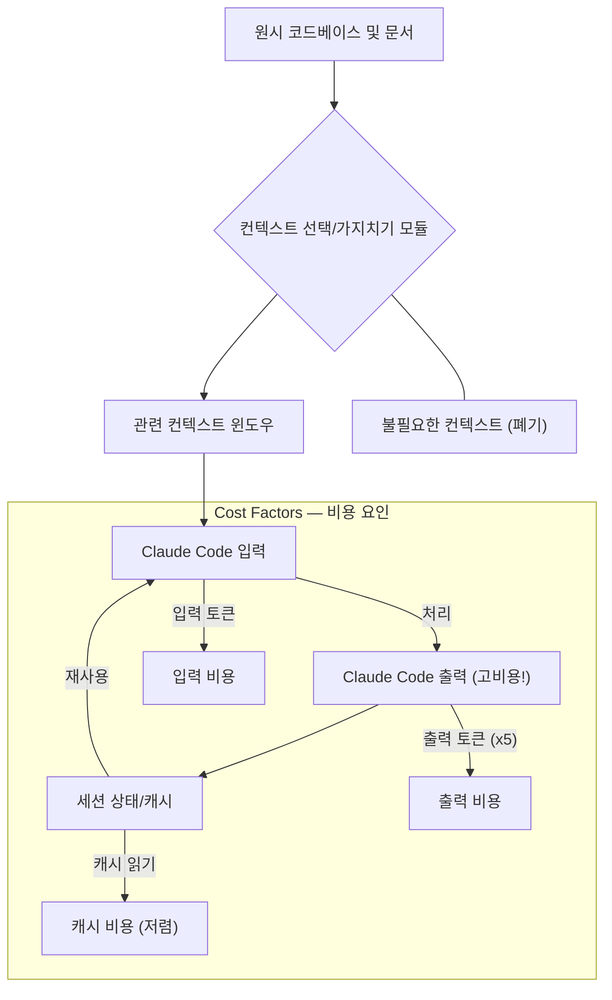

Claude Code는 개발 생산성을 혁신하는 강력한 도구이지만, 그 잠재력을 최대한 활용하려면 세션 비용 최적화가 필수적입니다. 불필요한 컨텍스트의 누적은 토큰 사용량을 기하급수적으로 증가시켜 예측 불가능한 비용을 초래할 수 있습니다. 효과적인 컨텍스트 관리와 토큰 효율성 전략은 Claude Code 세션의 가치를 극대화하고 장기적인 프로젝트 운영의 지속 가능성을 보장합니다.

## Claude Code 비용 구조 이해
Claude Code 세션의 비용은 주로 다음 요소에 의해 결정됩니다:

### 컨텍스트 크기 및 유지 턴(Turn) 수
Claude Code는 현재 세션의 모든 메시지를 컨텍스트로 사용합니다. 여기에는 이전 사용자 프롬프트와 Claude의 응답이 모두 포함됩니다. 컨텍스트의 크기가 커질수록, 즉 대화 턴 수가 늘어날수록 매 턴마다 더 많은 토큰이 소비됩니다. 특히, 파일 내용이나 코드베이스 전체를 컨텍스트에 포함시키는 경우 비용이 급격히 증가합니다.

### 입출력 토큰 가격 불균형
Anthropic의 LLM은 일반적으로 출력(Completion) 토큰이 입력(Prompt) 토큰보다 훨씬 비쌉니다. 대략 5배 이상의 비용 차이가 발생할 수 있습니다. 이는 Claude Code가 긴 코드 스니펫이나 상세한 설명을 생성할 때 비용 부담이 커진다는 의미입니다. 따라서 불필요하게 장황한 출력을 줄이는 전략이 중요합니다.

### 프롬프트 캐시 (Prompt Cache) 활용
동일하거나 유사한 프롬프트가 반복될 경우, LLM 공급자는 프롬프트 캐시를 활용하여 중복 계산을 줄이고 비용을 절감할 수 있습니다. 캐시된 입력에 대한 비용은 일반 입력 가격보다 훨씬 저렴하게 책정됩니다. 이는 반복적인 코드 분석, 특정 패턴 검색 등 정형화된 작업에서 큰 이점을 제공합니다.

### 병렬 컨텍스트 수
동일한 세션 내에서 여러 개의 독립적인 코드 분석 또는 생성 작업을 병렬로 수행하는 경우, 각각의 병렬 컨텍스트가 별도의 토큰 사용량을 발생시킬 수 있습니다. 효율적인 병렬화 전략은 총 비용에 큰 영향을 미칩니다.

## Claude Code 비용 최적화 전략

### 1. 불필요한 컨텍스트 제거 및 압축
가장 기본적인 최적화 방법은 세션에 필요한 정보만 유지하는 것입니다. 이는 다음과 같은 방식으로 구현될 수 있습니다.

*   **메시지 기록 관리**: 오래되었거나 관련 없는 대화 턴을 주기적으로 제거합니다. 이는 단순히 `N`개 턴 이후 메시지를 잘라내는 방식이 될 수도 있고, 더 정교하게는 특정 조건(예: 특정 작업 완료 후)에 따라 이전 컨텍스트를 요약하거나 아카이빙하는 방식이 될 수도 있습니다.
*   **파일 및 코드 스니펫 선택**: 코드베이스 전체를 컨텍스트에 넣기보다는, 현재 작업에 직접적으로 관련된 파일, 함수, 클래스만 선별하여 제공합니다. `git diff`를 활용하여 변경된 코드만 컨텍스트에 포함하는 것도 효과적입니다.
*   **요약 기법 활용**: 긴 문서나 코드 블록의 핵심 내용만을 추출하여 요약본을 컨텍스트에 포함합니다. 초기 컨텍스트 설정 시에도 요약된 README 파일이나 모듈 설명을 활용합니다.

### 2. 출력 토큰 최소화 유도
Claude의 출력이 비용에 미치는 영향을 고려하여, 프롬프트 엔지니어링 단계에서부터 명확하고 간결한 출력을 유도해야 합니다.

*   **명시적인 출력 형식 요청**: “간결하게 답변해달라”, “핵심 내용만 불릿 포인트로 정리해달라”, “코드만 제공하고 설명은 생략해달라”와 같이 출력 형식을 구체적으로 지시합니다.
*   **최대 토큰 제한**: API 호출 시 `max_tokens` 파라미터를 사용하여 Claude의 최대 출력 길이를 제한합니다. 이는 불필요하게 장황한 답변을 방지하는 효과적인 방법입니다.

### 3. 프롬프트 캐시 활용 극대화
Anthropic의 프롬프트 캐시는 자동적으로 작동하지만, 개발자는 캐시 적중률을 높이는 방식으로 프롬프트 설계를 할 수 있습니다.

*   **정형화된 프롬프트 템플릿 사용**: 반복적으로 사용하는 시스템 프롬프트나 지시사항은 일관된 템플릿을 사용하여 캐시 적중률을 높입니다.
*   **멱등성(Idempotency) 유지**: 동일한 입력에 대해 항상 같은 결과를 기대하는 작업 (예: 코드 검토 지침, 특정 패턴 검색)에서는 입력 프롬프트를 최대한 변경하지 않도록 관리합니다.

### 4. 세션 관리 로직 최적화
Claude Code 하네스(Harness) 내에서 세션 관리 로직을 구현할 때, 비용 효율성을 고려한 설계를 적용합니다.

*   **자동 컨텍스트 압축 트리거**: 특정 임계값(예: 토큰 수, 턴 수)에 도달하면 자동으로 컨텍스트를 압축하거나 가장 오래된 메시지를 제거하는 로직을 구현합니다.
*   **병렬 컨텍스트 통합**: 여러 병렬 작업의 결과를 효율적으로 통합하여 중복된 컨텍스트를 제거하고 다음 턴에 전달합니다. Mermaid 다이어그램은 이러한 컨텍스트 흐름을 시각화하는 데 유용합니다.

다음은 Python을 이용한 간단한 `ClaudeCodeSessionManager` 예제입니다. 이 예제는 메시지 기록을 관리하고 컨텍스트를 자동으로 가지치기하는 기본적인 로직을 보여줍니다.

```python
import anthropic

class ClaudeCodeSessionManager:
    def __init__(self, client: anthropic.Anthropic, model: str = "claude-3-opus-20240229"):
        self.client = client
        self.model = model
        self.messages = [] # 대화 이력 저장
        self.context_window_limit = 100000 # 모델별 컨텍스트 윈도우 한계

    def _prune_context(self, max_tokens: int) -> None:
        """
        토큰 한계 내에서 세션 컨텍스트를 가지치기합니다.
        최신 메시지와 필수 시스템 프롬프트를 우선시합니다.
        """
        # 현재 토큰 수 계산 (간단한 공백 기준 분리)
        current_tokens = sum(len(message.get("content", "").split()) for message in self.messages)
        if current_tokens <= max_tokens:
            return

        pruned_messages = []
        tokens_after_pruning = 0
        
        # 시스템 프롬프트가 있다면 유지
        system_message = None
        if self.messages and self.messages[0].get("role") == "system":
            system_message = self.messages[0]
            pruned_messages.append(system_message)
            tokens_after_pruning += len(system_message.get("content", "").split())
            
        # 최신 메시지부터 추가하며 한계에 도달할 때까지 유지
        # 버퍼를 위해 max_tokens의 90%만 사용
        start_index = 1 if system_message else 0
        for message in reversed(self.messages[start_index:]):
            message_tokens = len(message.get("content", "").split())
            if tokens_after_pruning + message_tokens < max_tokens * 0.9:
                # 최신 메시지가 앞에 오도록 삽입
                pruned_messages.insert(start_index, message)
                tokens_after_pruning += message_tokens
            else:
                break
        
        self.messages = pruned_messages
        print(f"Context pruned. Current tokens: {tokens_after_pruning}")

    def send_message(self, user_message: str, system_prompt: str = None) -> str:
        if system_prompt and not self.messages:
            self.messages.append({"role": "system", "content": system_prompt})
        
        self.messages.append({"role": "user", "content": user_message})
        
        # 전송 전에 컨텍스트를 가지치기하여 입력이 맞는지 확인하고 과도한 비용 방지
        self._prune_context(self.context_window_limit)

        try:
            response = self.client.messages.create(
                model=self.model,
                max_tokens=2048, # 최대 출력 토큰 제한
                messages=self.messages
            )
            assistant_response = response.content[0].text
            self.messages.append({"role": "assistant", "content": assistant_response})
            print(f"Input tokens: {response.usage.input_tokens}, Output tokens: {response.usage.output_tokens}")
            return assistant_response
        except Exception as e:
            print(f"Error sending message: {e}")
            return "An error occurred."

# 실제 사용 예시:
# client = anthropic.Anthropic(api_key="YOUR_ANTHROPIC_API_KEY")
# session_manager = ClaudeCodeSessionManager(client)
# session_manager.send_message("Explain the concept of dependency injection in Spring Boot.", system_prompt="You are a helpful programming assistant.")
```

### Claude Code 세션 컨텍스트 흐름 다이어그램
컨텍스트 흐름과 가지치기 지점을 시각화하면 최적화 전략을 더 명확하게 이해할 수 있습니다.



## 트레이드오프

### 1. 컨텍스트 압축 vs. 정확도 손실
*   **언제 좋음**: 복잡하지 않은 코드나 문서에서 핵심 정보만으로 충분할 때, 대화 길이가 길어져 비용이 부담될 때 유용합니다. 비용 절감 효과가 큽니다.
*   **언제 나쁨**: 미묘한 뉘앙스나 넓은 범위의 참조가 필요한 복잡한 코드 분석/생성 작업 시, 컨텍스트 압축이 과도하면 LLM의 이해도가 떨어져 결과의 정확도나 품질이 저하될 수 있습니다.

### 2. 출력 간소화 vs. 정보 부족
*   **언제 좋음**: 정해진 형식의 코드 스니펫이나 요약된 답변이 필요할 때, 불필요한 설명을 제거하여 비용을 절감하고 파싱을 용이하게 합니다.
*   **언제 나쁨**: 상세한 설명, 대안 제시, 트러블슈팅 가이드 등 풍부한 정보가 필요한 경우, 출력을 과도하게 제한하면 유용성이 떨어질 수 있습니다.

### 3. 프롬프트 캐시 활용 vs. 프롬프트 유연성 제한
*   **언제 좋음**: 반복적이고 정형화된 작업에서 일관된 프롬프트 템플릿을 사용하여 비용을 절감하고 응답 속도를 향상시킬 수 있습니다.
*   **언제 나쁨**: 창의적이고 탐색적인 작업에서 매번 프롬프트가 동적으로 변경되어야 할 경우, 캐시 활용을 위한 프롬프트 고정은 유연성을 저해하고 작업 효율을 낮출 수 있습니다.

### 4. 실시간 컨텍스트 가지치기 vs. 구현 복잡성
*   **언제 좋음**: 장시간의 대화 세션이나 대규모 코드베이스 분석에서 컨텍스트 윈도우 오버플로우를 방지하고, 지속적인 비용 모니터링 및 제어가 필요할 때 좋습니다.
*   **언제 나쁨**: 간단한 단발성 질의응답이나 소규모 프로젝트에서는 과도한 컨텍스트 관리 로직 구현이 초기 개발 비용과 유지보수 복잡성을 증가시킬 수 있습니다.

## 실전 체크리스트

프로젝트에 Claude Code 세션 비용 최적화 전략을 적용할 때 다음 항목들을 검증해야 합니다.

- [ ] **컨텍스트 토큰 사용량 모니터링 시스템 구축**: 각 Claude Code 세션의 입력 및 출력 토큰 사용량을 실시간으로 추적하고 대시보드에서 시각화하고 있습니까?
- [ ] **자동 컨텍스트 가지치기 로직 구현 및 테스트**: 정의된 임계값(예: 턴 수, 토큰 임계치)에 따라 오래되거나 덜 중요한 컨텍스트가 자동으로 제거되는 로직이 정확하게 작동하는지 테스트 완료했습니까?
- [ ] **핵심 작업별 프롬프트 출력 길이 최적화**: 코드 생성, 요약, 분석 등 주요 사용 사례별로 `max_tokens` 설정을 분석하여 불필요한 출력 토큰을 최소화하고 있습니까?
- [ ] **프롬프트 캐시 적중률 분석 및 템플릿 개선**: 반복되는 프롬프트 패턴이 프롬프트 캐시에 얼마나 효과적으로 적중하는지 주기적으로 분석하고, 캐시 적중률을 높이기 위한 프롬프트 템플릿 개선 방안을 모색하고 있습니까?
- [ ] **비용 알림 및 예산 설정**: Claude Code 사용량이 예상 임계값을 초과할 경우 팀에 자동으로 알림이 전송되고, 월별/주별 예산이 설정되어 관리되고 있습니까?
- [ ] **관련성 높은 파일만 컨텍스트에 포함**: 코드 편집기 확장 기능이나 하네스 로직을 통해 현재 작업 중인 코드와 직접적인 관련이 있는 파일/모듈만 동적으로 컨텍스트에 추가하는 메커니즘을 사용하고 있습니까?
- [ ] **출력 압축 및 정규화**: Claude의 응답이 클라이언트 애플리케이션에 전달되기 전에 후처리 로직(예: JSON 파싱, 불필요한 설명 제거)을 통해 최종 출력 데이터 크기를 줄이고 있습니까?