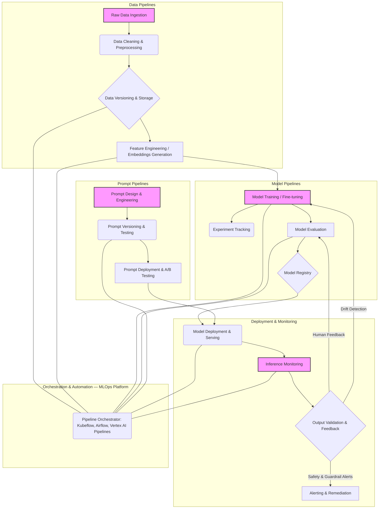

The unique characteristics of Generative AI (GenAI) models, such as their sensitivity to input data, rapid evolution, and often subjective evaluation metrics, demand a specialized approach to MLOps. Traditional MLOps pipelines, while robust for discriminative models, often fall short in managing the complexities introduced by large language models (LLMs) or multi-modal generative models. This entry outlines advanced MLOps pipeline design patterns tailored to the GenAI lifecycle, focusing on enabling robust deployment, continuous improvement, and responsible operation.

## 생성형 AI MLOps 파이프라인의 핵심 과제 (Key Challenges in Generative AI MLOps Pipelines)

생성형 AI 프로젝트는 기존 ML 프로젝트와 다른 MLOps 챌린지를 가집니다.
*   **데이터 드리프트 (Data Drift) 및 컨셉 드리프트 (Concept Drift)**: 사용자 상호작용 및 외부 환경 변화에 따라 모델이 생성하는 결과물의 품질이나 의도가 급격히 변할 수 있습니다. 특히 RAG(Retrieval Augmented Generation) 시스템에서는 검색 데이터 소스의 변화가 직접적인 영향을 미칩니다.
*   **프롬프트 민감성 (Prompt Sensitivity) 및 버전 관리 (Versioning)**: 프롬프트는 모델의 "코드"와 같으며, 작은 변화가 큰 출력 차이를 만들 수 있습니다. 프롬프트의 체계적인 버전 관리, 테스트, 그리고 배포 전략이 필수적입니다.
*   **주관적인 평가 (Subjective Evaluation) 및 휴먼 피드백 루프 (Human Feedback Loop)**: 생성형 모델의 출력은 정량적인 지표만으로 품질을 완전히 평가하기 어렵습니다. BLEU, ROUGE 같은 전통적인 메트릭스는 한계가 있으며, 인간 평가(Human-in-the-Loop, HiTL)가 통합된 평가 파이프라인이 중요합니다.
*   **자원 효율성 (Resource Efficiency) 및 비용 관리 (Cost Management)**: 대규모 모델의 학습 및 추론은 막대한 컴퓨팅 자원을 요구합니다. 효율적인 자원 할당, 모델 압축 (quantization, distillation), 그리고 서빙 최적화가 필요합니다.
*   **윤리 및 안전 (Ethics and Safety)**: 유해하거나 편향된 콘텐츠 생성 가능성이 항상 존재합니다. 가드레일 (guardrails), 필터링, 그리고 지속적인 안전 모니터링이 MLOps 파이프라인에 내재되어야 합니다.

## 핵심 디자인 패턴 (Core Design Patterns)

생성형 AI MLOps 파이프라인은 크게 다음 세 가지 핵심 영역을 중심으로 설계됩니다: 데이터, 모델, 프롬프트.

### 1. 데이터 중심 MLOps (Data-Centric MLOps)

생성형 AI에서 데이터는 모델의 성능을 결정하는 가장 중요한 요소입니다. 특히 파인튜닝 (fine-tuning) 또는 RAG 시스템의 지식 기반 구축 시 고품질 데이터 파이프라인이 필수적입니다.

#### 데이터 수집 및 정제 파이프라인 (Data Ingestion & Refinement Pipeline)
*   **데이터 소스 관리 (Data Source Management)**: 정형, 비정형 데이터 소스에서 필요한 데이터를 수집합니다. 웹 크롤링, 데이터베이스 통합, API 연동 등 다양한 전략이 사용됩니다.
*   **자동화된 정제 (Automated Refinement)**: 수집된 데이터는 중복 제거, 비속어 필터링, 형식 통일화, 개인정보 비식별화 (PII scrubbing) 등의 정제 과정을 거칩니다. LLM을 활용한 데이터 증강 (data augmentation) 및 품질 검증도 가능합니다.
*   **데이터셋 버전 관리 (Dataset Versioning)**: DVC (Data Version Control) 또는 MLflow Artifacts와 같은 도구를 사용하여 데이터셋의 변경 이력을 추적하고 재현성을 보장합니다.

```python
# 예시: LLM 기반 데이터 정제 및 PII 필터링 파이프라인
from transformers import pipeline
import pandas as pd
import re

# PII 탐지 및 대체 함수 (간소화된 예시)
def detect_and_redact_pii(text):
    # 실제 구현에서는 더 복잡한 NER 모델 또는 정교한 정규식 사용
    text = re.sub(r"\b\d{3}[-.]?\d{3}[-.]?\d{4}\b", "[PHONE_NUMBER]", text) # 전화번호
    text = re.sub(r"\b[A-Za-z0-9._%+-]+@[A-Za-z0-9.-]+\.[A-Za-z]{2,}\b", "[EMAIL_ADDRESS]", text) # 이메일
    return text

def run_data_refinement_pipeline(raw_data_path, refined_data_path):
    df = pd.read_csv(raw_data_path)

    # 1. 중복 제거
    df.drop_duplicates(inplace=True)

    # 2. PII 필터링
    df['text'] = df['text'].apply(detect_and_redact_pii)

    # 3. LLM을 활용한 텍스트 품질 검증 (예시: 불완전한 문장 검출)
    # 실제 LLM 호출은 비용 및 지연 시간 고려 필요
    # nlp_qa_model = pipeline("text-classification", model="distilbert-base-uncased-finetuned-sst-2-english")
    # df['is_complete'] = df['text'].apply(lambda x: nlp_qa_model(x)['label'] == 'POSITIVE') # 긍정적인 문장일수록 완전하다고 가정
    # df = df[df['is_complete']] # 불완전하다고 판단된 문장 제거

    # 정제된 데이터 저장
    df.to_csv(refined_data_path, index=False)
    print(f"Data refined and saved to {refined_data_path}")

# run_data_refinement_pipeline("raw_customer_feedback.csv", "refined_customer_feedback.csv")
```

### 2. 모델 중심 MLOps (Model-Centric MLOps)

모델의 학습, 서빙, 그리고 버전 관리는 GenAI MLOps의 핵심입니다.

#### 지속적 학습 및 배포 (Continuous Training & Deployment, CT/CD)
*   **실험 관리 (Experiment Management)**: MLflow, Weights & Biases 같은 도구를 사용하여 모델 학습 실험을 추적하고, 하이퍼파라미터, 메트릭, 아티팩트 등을 기록합니다.
*   **모델 레지스트리 (Model Registry)**: 학습된 모델은 메타데이터와 함께 중앙 레지스트리에 등록됩니다. 이를 통해 모델의 라이프사이클 (스테이징, 프로덕션) 관리가 용이해집니다.
*   **CI/CD 파이프라인 (CI/CD Pipeline)**: 새로운 모델이 학습되면, 자동화된 테스트 (단위 테스트, 통합 테스트, 성능 테스트)를 거쳐 스테이징 환경에 배포됩니다. 검증 후에는 점진적 배포 (Canary Deployment, Blue/Green Deployment) 전략을 통해 프로덕션에 배포됩니다.

### 3. 프롬프트 중심 MLOps (Prompt-Centric MLOps)

프롬프트는 생성형 AI의 핵심 제어 메커니즘이므로, 소프트웨어 개발의 코드처럼 관리되어야 합니다.

#### 프롬프트 엔지니어링 및 버전 관리 (Prompt Engineering & Versioning)
*   **프롬프트 레지스트리 (Prompt Registry)**: 모든 프롬프트는 버전 관리 시스템 (Git, DVC for prompts)을 통해 관리되며, 변경 이력과 평가 결과가 함께 기록됩니다.
*   **자동화된 프롬프트 테스트 (Automated Prompt Testing)**: 다양한 입력에 대해 프롬프트가 예상대로 동작하는지, 유해한 출력을 생성하지 않는지 등을 평가하는 테스트 스위트를 구축합니다. 이는 LLM 기반 평가 (LLM as a judge) 또는 휴먼 평가를 통합할 수 있습니다.
*   **A/B 테스팅 및 최적화 (A/B Testing & Optimization)**: 여러 버전의 프롬프트를 동시에 배포하여 실제 사용자 피드백을 기반으로 최적의 프롬프트를 식별합니다.

### 4. 평가 및 모니터링 (Evaluation & Monitoring)

생성형 AI 모델의 성능을 지속적으로 측정하고 개선하기 위한 파이프라인은 필수적입니다.

#### 지속적 평가 및 모니터링 (Continuous Evaluation & Monitoring)
*   **정량적/정성적 평가 (Quantitative/Qualitative Evaluation)**: ROUGE, BERTScore, Perplexity 같은 전통적인 지표와 더불어, 사용자 만족도, 유용성, 안전성 등 정성적 평가를 위한 HiTL (Human-in-the-Loop) 시스템을 구축합니다.
*   **드리프트 탐지 (Drift Detection)**: 입력 데이터 드리프트 (Data Drift), 모델 출력 드리프트 (Output Drift), 그리고 사용자의 상호작용 방식 변화로 인한 컨셉 드리프트를 지속적으로 모니터링합니다. 이는 모델 재학습의 트리거가 됩니다.
*   **가드레일 및 안전 모니터링 (Guardrails & Safety Monitoring)**: 특정 키워드 필터링, 프롬프트 인젝션 방어, 유해 콘텐츠 생성 방지 등 안전 메커니즘을 배포하고, 관련 메트릭을 지속적으로 모니터링합니다.

## 생성형 AI MLOps 파이프라인 다이어그램



## 2026년 생성형 AI MLOps 최신 트렌드

*   **에이전트 기반 MLOps (Agentic MLOps)**: AI 에이전트가 데이터 전처리, 모델 튜닝, 평가, 심지어 배포 결정을 자율적으로 수행하는 방향으로 발전합니다. 자율 에이전트가 MLOps 워크플로우를 최적화하고 문제를 사전에 감지하고 해결하는 시나리오가 보편화될 것입니다.
*   **멀티모달 MLOps (Multimodal MLOps)**: 텍스트, 이미지, 오디오 등 다양한 모달리티를 통합하는 GenAI 모델의 증가로, 각 모달리티의 특성을 고려한 데이터 파이프라인, 평가 메트릭, 그리고 모니터링 시스템이 더욱 중요해집니다.
*   **실시간 피드백 루프 (Real-time Feedback Loops) 및 적응형 모델 (Adaptive Models)**: 사용자 상호작용 데이터를 실시간으로 수집하고, 이를 바탕으로 모델을 즉시 업데이트하거나 동적으로 프롬프트를 조정하는 adaptive learning 시스템이 대중화됩니다. 이는 빠른 시장 변화에 대응하고 사용자 경험을 극대화하는 핵심 전략이 될 것입니다.
*   **보안 및 규제 준수 강화 (Enhanced Security & Compliance)**: 생성형 AI의 확산에 따라 AI Act와 같은 규제 프레임워크가 강화되고 있습니다. MLOps 파이프라인은 모델의 투명성, 설명 가능성 (XAI), 그리고 데이터 프라이버시 (differential privacy)를 보장하는 메커니즘을 내재해야 합니다.

## 트레이드오프 (Trade-offs)

### 1. 자동화된 MLOps 파이프라인 vs 수동 개입 (Automated MLOps Pipeline vs Manual Intervention)
*   **언제 좋은가?**: 대규모, 반복적인 작업 (예: 정기적인 모델 재학습, 데이터 정제)에 이상적입니다. 일관성을 보장하고 인적 오류를 줄이며, 배포 속도를 향상시킵니다.
*   **언제 나쁜가?**: 초기 단계의 탐색적인 GenAI 프로젝트나, 창의적이고 주관적인 판단이 많이 필요한 프롬프트 엔지니어링 과정에서는 과도한 자동화가 오히려 민첩성을 저해할 수 있습니다. 예상치 못한 모델 동작이나 복잡한 윤리적 문제 발생 시 신속한 수동 개입이 어려울 수 있습니다.

### 2. 단일 통합 MLOps 플랫폼 vs 분산형 도구 체인 (Unified MLOps Platform vs Decentralized Toolchain)
*   **언제 좋은가?**: 단일 플랫폼 (예: AWS SageMaker, Google Vertex AI)은 초기 설정이 간편하고, 모든 구성 요소가 긴밀하게 통합되어 있습니다. 팀 간 협업이 용이하고 관리 오버헤드가 적습니다.
*   **언제 나쁜가?**: 특정 벤더에 종속될 수 있으며, 커스터마이징의 유연성이 떨어집니다. 각 컴포넌트별로 최적의 도구를 선택하려는 경우 (예: 데이터 버전 관리는 DVC, 실험 관리는 MLflow) 분산형 접근이 더 나을 수 있지만, 통합에 더 많은 노력이 필요합니다.

### 3. 강력한 버전 관리 vs 빠른 실험 속도 (Rigorous Versioning vs Rapid Experimentation)
*   **언제 좋은가?**: 프로덕션 환경에서 모델 안정성과 재현성이 중요한 경우 (규제 준수, 장기 운영) 데이터, 모델, 프롬프트의 엄격한 버전 관리가 필수적입니다.
*   **언제 나쁜가?**: 연구 개발 초기 단계나 신규 아이디어 탐색 시, 빠른 프로토타이핑과 실험이 더 중요합니다. 과도한 버전 관리 오버헤드는 개발 속도를 늦출 수 있습니다. 균형점 찾기가 중요합니다.

### 4. 인간 평가 (Human-in-the-Loop) vs 자동화된 평가 (Automated Evaluation)
*   **언제 좋은가?**: 생성형 AI의 출력 품질이 주관적이고 복잡한 경우 (창의성, 공감 능력, 유해성 판단) 인간 평가가 필수적입니다. 미묘한 품질 저하를 탐지하고 모델 개선 방향을 제시하는 데 효과적입니다.
*   **언제 나쁜가?**: 대규모 평가가 필요하거나 실시간 피드백이 중요한 경우 인간 평가 비용과 지연 시간이 과도할 수 있습니다. 자동화된 메트릭은 빠른 1차 필터링 및 대략적인 성능 추이를 파악하는 데 유용합니다.

## 실전 체크리스트 (Practical Checklist)

생성형 AI 프로젝트에 MLOps 파이프라인을 적용할 때 다음 항목들을 검증합니다.

*   [ ] **데이터셋 재현성 확보**: 학습 데이터셋의 모든 변경 사항이 DVC 또는 유사 도구로 버전 관리되며, 특정 모델 버전을 학습시킨 데이터셋을 정확히 재현할 수 있는가?
*   [ ] **프롬프트 버전 관리 체계 구축**: 모든 프롬프트 (시스템 프롬프트, 사용자 프롬프트 템플릿)가 Git과 같은 코드 저장소에 버전 관리되고, 변경 이력이 명확히 추적되는가?
*   [ ] **자동화된 모델 평가 스위트 구현**: 새로운 모델 학습 시 ROUGE, BERTScore 등의 정량적 메트릭과 최소 3개 이상의 LLM 기반 평가 (예: 일관성, 유해성)가 자동으로 실행되고 결과가 기록되는가?
*   [ ] **드리프트 탐지 시스템 운영**: 입력 데이터 분포 변화, 프롬프트 사용 패턴 변화, 모델 출력 특성 변화를 감지하는 드리프트 탐지기가 프로덕션 환경에 배포되어 있으며, 임계치 초과 시 알림을 발생시키는가?
*   [ ] **지속적 통합/배포 (CI/CD) 파이프라인 구축**: 모델 학습 완료 후 자동화된 테스트를 거쳐 스테이징 환경으로 배포되고, 승인 시 프로덕션으로 점진적 배포 (Canary/Blue-Green)가 가능한가?
*   [ ] **휴먼 피드백 루프 (Human Feedback Loop) 설계**: 사용자 피드백 (좋아요/싫어요, 명시적 수정)을 수집하고, 이를 모델 재학습 또는 프롬프트 개선에 활용하는 파이프라인이 존재하는가?
*   [ ] **자원 사용량 및 비용 모니터링**: GPU 사용량, API 호출 비용 등 모델 학습 및 추론에 드는 자원과 비용이 실시간으로 모니터링되고 있으며, 비효율적인 부분이 감지될 경우 경고하는 시스템이 있는가?
