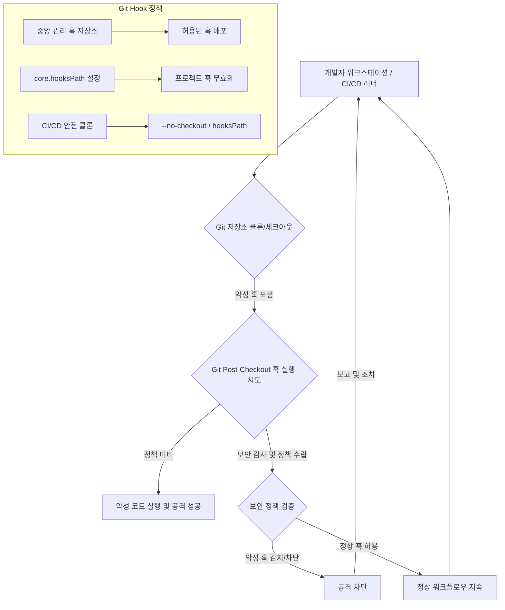

Git `post-checkout` 훅은 Git 저장소에서 브랜치를 체크아웃하거나 변경할 때마다 자동으로 실행되는 스크립트입니다. 개발 워크플로우를 자동화하고 특정 작업을 수행하는 데 유용하지만, 동시에 심각한 보안 취약점이 될 수 있습니다. `.git/hooks` 디렉터리에 위치한 이러한 스크립트는 클라이언트 측에서 실행되므로, 악의적인 의도를 가진 공격자에게는 자격 증명 탈취, 백도어 설치, 민감 데이터 유출 등 다양한 형태의 공격 벡터로 활용될 수 있습니다.

최근 Frank Wiles를 대상으로 한 공격 시도는 `post-checkout` 훅의 위험성을 명확히 보여줍니다. 공격자는 교육 기술 웹 앱 개발 문의를 위장하여 Wiles에게 악성 코드를 포함한 프로젝트 자료를 Dropbox를 통해 전달했습니다. 이 자료에는 `.git/hooks/post-checkout` 파일이 포함되어 있었고, Wiles가 해당 저장소를 클론하거나 브랜치를 체크아웃하는 순간, 악성 스크립트가 실행되어 공격자의 의도에 따라 임의 코드가 실행될 수 있었습니다. 이는 개발자의 워크스테이션 환경이 공급망 공격(Supply Chain Attack)의 한 축이 될 수 있음을 시사합니다.

### Git `post-checkout` 훅의 작동 방식 및 공격 벡터

`post-checkout` 훅은 다음 Git 명령어 실행 후 트리거됩니다:
*   `git checkout`
*   `git switch`
*   `git clone` (최초 체크아웃 시)

이 훅은 일반적으로 `.git/hooks/post-checkout` 파일로 존재하며, 실행 권한이 있다면 해당 파일 내의 스크립트가 실행됩니다. 공격자는 이 스크립트를 통해 다음과 같은 작업을 시도할 수 있습니다:
*   **자격 증명 탈취 (Credential Harvesting)**: `.ssh`, `.aws`, `.kube` 등 민감한 설정 파일이나 환경 변수를 읽어 외부 서버로 전송합니다.
*   **백도어 설치**: 시스템에 영구적인 접근 권한을 확보하기 위한 악성 스크립트를 설치합니다.
*   **임의 코드 실행**: 추가 악성 페이로드를 다운로드하거나, 로컬 개발 환경을 손상시킬 수 있는 명령어를 실행합니다.
*   **개발 환경 조작**: `.bashrc`, `.zshrc`와 같은 셸 설정 파일을 변경하여 지속적인 감염을 시도합니다.

특히 GitHub 저장소나 자체 호스팅 CI/CD 러너 환경에서는 `.git/hooks` 디렉터리가 개발자 워크스테이션과 유사한 위험에 노출될 수 있습니다. CI/CD 파이프라인이 저장소를 클론할 때, 해당 저장소에 포함된 악성 훅이 실행될 수 있기 때문입니다.

### Git Hook 보안 감사 절차

Git Hook의 보안 취약점을 완화하기 위한 첫 단계는 철저한 감사입니다.

#### 1. `.git/hooks` 디렉터리 검토
모든 개발자의 로컬 환경과 CI/CD 러너에서 사용되는 Git 저장소의 `.git/hooks` 디렉터리를 즉시 검사합니다.

```bash
# 로컬 환경에서 Git Hook 파일 목록 확인
find .git/hooks -type f -exec ls -l {} +

# 각 훅 파일의 내용 검토 (예: post-checkout)
cat .git/hooks/post-checkout
```

#### 2. 실행 권한 및 소유권 확인
불필요한 Git Hook 파일에 실행 권한이 부여되어 있는지 확인하고, 비정상적인 소유자나 권한이 설정되어 있다면 즉시 수정합니다.

#### 3. 스크립트 내용 분석
각 훅 스크립트의 내용을 수동 또는 자동화된 도구로 분석하여 의심스러운 명령(예: `curl`, `wget`을 통한 외부 파일 다운로드, `ssh` 관련 파일 접근, `send` 명령어)이 있는지 확인합니다.

```bash
# 의심스러운 패턴 검색 예시
grep -E "curl|wget|nc|sshpass|cat ~/.ssh" .git/hooks/*
```

#### 4. CI/CD 환경 감사
GitHub Actions와 같은 CI/CD 환경에서 `.git/hooks` 디렉터리가 어떻게 처리되는지 확인합니다. 많은 경우 CI/CD 환경은 `git clone` 시 `--no-checkout` 옵션을 사용하지 않는 한, 저장소 내의 모든 파일을 가져옵니다.

### Git Hook 사용 정책 수립

보안 감사 결과에 따라 다음과 같은 정책을 수립하여 Git Hook 관련 보안 위협을 최소화해야 합니다.

#### 1. 불필요한 Git Hook 제거
기본적으로 `.git/hooks` 디렉터리에 커밋되는 어떤 파일도 존재해서는 안 됩니다. Git은 `.git/hooks/` 경로를 `.git/hooks.sample`에서 자동으로 복사하여 채우므로, 이 샘플 파일 외에 추가된 모든 훅은 엄격하게 검토되어야 합니다.

#### 2. 중앙 집중식 Git Hook 관리
조직 내에서 Git Hook이 필요한 경우, 중앙에서 관리되는 표준화된 훅만 허용합니다. 이 훅들은 별도의 보안 검토를 거쳐 버전 관리 시스템에 안전하게 저장되어야 합니다. 예를 들어, 특정 Lint 검사나 테스트를 강제하는 `pre-commit` 훅은 유용할 수 있지만, `post-checkout`과 같은 훅은 특별한 이유 없이는 금지되어야 합니다.

#### 3. `core.hooksPath` 활용
Git의 `core.hooksPath` 설정을 사용하여 Git Hook이 실행될 경로를 명시적으로 지정할 수 있습니다. 이를 통해 프로젝트 저장소의 `.git/hooks` 대신, 개발자 환경에 안전하게 관리되는 전역 훅 디렉터리를 사용하도록 강제할 수 있습니다.

```bash
# 전역 Git 설정에서 안전한 훅 경로 지정
git config --global core.hooksPath /usr/local/share/git-core/templates/hooks
```
이 방식은 프로젝트 레벨의 악성 훅이 실행되는 것을 방지합니다.

#### 4. CI/CD 환경에서의 `--no-checkout` 및 `hooksPath` 옵션 사용
CI/CD 파이프라인에서 `git clone` 시 `--no-checkout` 옵션을 사용하여 모든 파일을 가져오기 전에 수동으로 안전한 파일만 체크아웃하거나, `git config core.hooksPath`를 사용하여 훅 실행을 제어합니다.

```bash
# CI/CD 파이프라인 예시: 안전하게 저장소 클론 및 훅 경로 재정의
git clone <repo_url> repo_name
cd repo_name
git config core.hooksPath /dev/null # 훅 실행 경로를 무효화
git checkout main # 또는 필요한 브랜치
```

#### 5. 정기적인 보안 교육 및 인식 제고
개발자들에게 Git Hook의 잠재적 위험성과 안전한 사용법에 대한 정기적인 교육을 제공하여, 의심스러운 파일이나 요청에 대한 경각심을 높입니다.

### Git Hook 보안 워크플로우



---

## 트레이드오프

### 1. 개발 유연성 vs. 보안 통제
*   **언제 좋고**: 개발자가 로컬 환경에서 특정 작업을 자동화하기 위해 커스텀 훅을 자유롭게 사용할 수 있어 생산성이 향상됩니다.
*   **언제 나쁜지**: 중앙 통제가 없는 커스텀 훅은 악성 코드 삽입의 잠재적 진입점이 되어 보안 위험을 크게 증가시킵니다. 개발자마다 다른 훅을 사용하면 일관된 보안 정책 적용이 어렵습니다.

### 2. 성능 vs. 철저한 감사
*   **언제 좋고**: 간단한 정적 분석이나 파일 목록 확인만으로 빠르게 보안 감사를 수행하여 개발 워크플로우의 지연을 최소화합니다.
*   **언제 나쁜지**: 심층적인 코드 분석, 행동 모니터링, 샌드박스 환경에서의 테스트가 누락되면 정교하게 숨겨진 악성 훅을 놓칠 수 있습니다. 이는 잠재적으로 치명적인 보안 사고로 이어질 수 있습니다.

### 3. 개발자 편의성 vs. 중앙 집중식 관리
*   **언제 좋고**: 개발자가 직접 필요한 훅을 구성하고 관리함으로써 즉각적인 요구 사항을 충족하고 개발 환경을 최적화할 수 있습니다.
*   **언제 나쁜지**: 모든 개발자가 각자의 방식으로 훅을 관리하면 보안 표준 준수 여부를 확인하기 어렵고, 취약점이 발생했을 때 전사적인 대응이 지연될 수 있습니다. 중앙 집중식 관리는 초기 설정 비용이 높고, 개발자의 자유를 제한할 수 있습니다.

### 4. 즉각적인 문제 해결 vs. 장기적인 정책 수립
*   **언제 좋고**: 발생한 보안 이슈에 대해 즉시 해당 훅을 제거하거나 비활성화하여 당장의 위협을 빠르게 제거합니다.
*   **언제 나쁜지**: 임시방편적인 해결책만으로는 근본적인 보안 문제를 해결할 수 없습니다. 장기적인 관점에서 체계적인 정책과 프로세스를 수립하지 않으면 유사한 문제가 반복될 가능성이 높습니다. 장기적인 정책은 초기 수립에 시간과 자원이 많이 소요됩니다.

---

## 실전 체크리스트

프로젝트에 Git Post-Checkout Hook 보안을 적용할 때 다음 항목들을 검증합니다.

- [ ] 모든 개발자의 로컬 환경과 CI/CD 러너의 `.git/hooks` 디렉터리에 `post-checkout`을 포함한 불필요한 Git Hook 파일이 존재하지 않는가? (`find .git/hooks -type f` 결과 확인)
- [ ] CI/CD 파이프라인에서 `git clone` 또는 `git checkout` 명령 실행 시 `core.hooksPath`를 `/dev/null`로 설정하거나 `--no-checkout` 옵션을 사용하여 Git Hook 실행을 명시적으로 비활성화하는가?
- [ ] 조직 내에서 Git Hook 사용이 필요한 경우, 모든 허용된 훅 스크립트가 중앙 관리되는 저장소에 버전 관리되며, 정기적인 보안 코드 리뷰를 거치는가?
- [ ] `.git/hooks` 디렉터리 내의 모든 파일에 대해 비정상적인 실행 권한(예: `chmod +x`가 불필요하게 부여된 경우) 또는 소유자 변경이 없는지 정기적으로 감사를 수행하는가?
- [ ] 의심스러운 외부 통신(curl, wget 등) 또는 민감한 파일(예: `.ssh`, `.aws`, `.kube`) 접근 시도를 감지할 수 있는 로컬 또는 CI/CD 수준의 보안 모니터링 시스템이 구축되어 있는가?
- [ ] 신규 프로젝트 시작 시 기본 Git 템플릿에 `core.hooksPath` 설정을 포함하여 기본적으로 Git Hook이 비활성화되도록 정책을 적용하는가?
- [ ] 개발자들을 대상으로 Git Hook의 보안 위험성 및 안전한 사용법에 대한 연 1회 이상의 필수 보안 교육을 시행하고, 교육 이수율을 추적 관리하는가?