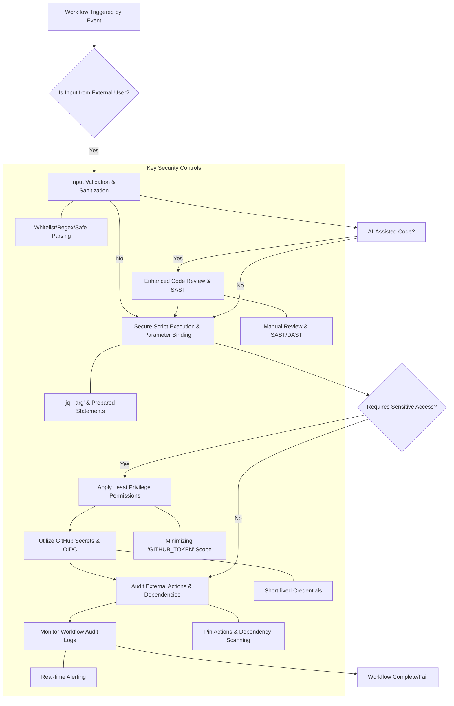

GitHub Actions는 소프트웨어 개발 라이프사이클 전반에 걸쳐 빌드, 테스트, 배포를 자동화하는 핵심 CI/CD 도구이다. 그 편리함과 강력한 기능 뒤에는 잠재적인 보안 위험이 존재하며, 이는 곧 전체 공급망 공격(Supply Chain Attack)의 진입점이 될 수 있다. 최근 Snowflake Jira 침해 사례는 GitHub Issues의 제목과 같은 외부 입력이 GitHub Actions 워크플로우 내에서 부적절하게 처리될 경우, 임의 명령 실행 및 민감 정보(예: Jira 자격 증명) 탈취로 이어질 수 있음을 명확히 보여주었다. 특히, AI가 생성하거나 보조하는 코드 스니펫의 증가는 이러한 취약점 노출 위험을 한층 더 높이고 있다. 본 문서는 GitHub Actions 워크플로우의 보안 취약점을 감사하고 강화하기 위한 실질적인 전략과 모범 사례를 제시한다.

## 환경 변수 및 민감 정보 보안 강화 (Environment Variables and Sensitive Data Protection)
GitHub Actions에서 환경 변수(`env:`)는 워크플로우 스크립트에 필요한 값을 전달하는 주요 메커니즘이다. 그러나 외부 입력(예: `github.event.issue.title`, `github.event.pull_request.body`)을 `env:` 블록을 통해 직접 주입하고 이를 셸 스크립트에서 안전하게 처리하지 않으면 명령 주입(Command Injection) 공격의 위험이 증대된다. 공격자는 이슈 제목 등에 악성 셸 명령어를 삽입하여 워크플로우 컨텍스트 내에서 실행할 수 있다.

**안전하지 않은 사례:**
```yaml
# .github/workflows/vulnerable.yml
name: Vulnerable Workflow
on:
  issues:
    types: [opened]
jobs:
  exploit-env:
    runs-on: ubuntu-latest
    steps:
      - name: Process Issue Title (Vulnerable)
        env:
          ISSUE_TITLE: ${{ github.event.issue.title }} # Attacker controlled
        run: |
          echo "Processing title: ${ISSUE_TITLE}"
          # If ISSUE_TITLE is 'My title"; rm -rf /; echo "'
          # This becomes: eval "do_something --title My title"; rm -rf /; echo "'"
          # leading to arbitrary command execution
          eval "some_internal_command --title \"${ISSUE_TITLE}\"
```

**보안 강화된 사례:**
외부 입력은 반드시 신뢰할 수 있는 방식으로 처리되어야 한다. `jq --arg`와 같이 인자 바인딩을 지원하는 도구를 사용하거나, 스크립트 내에서 `github.event` 컨텍스트 객체에 직접 접근하여 안전하게 파싱하고 이스케이프 처리하는 것이 권장된다. 이는 셸의 파싱 메커니즘을 우회하여 입력값을 데이터로만 인식하게 한다.

```yaml
# .github/workflows/secure.yml
name: Secure Workflow
on:
  issues:
    types: [opened]
jobs:
  secure-env:
    runs-on: ubuntu-latest
    steps:
      - name: Process Issue Title (Secure)
        run: |
          # Direct access to context and safe parsing with jq
          ISSUE_TITLE_SAFE=$(echo '${{ toJSON(github.event.issue) }}' | jq -r .title)
          echo "Securely processing title: ${ISSUE_TITLE_SAFE}"
          # Using jq --arg to bind the value, preventing shell injection
          jq --arg title "$ISSUE_TITLE_SAFE" '.payload.title = $title' <<<'{}' | some_api_client_that_accepts_json
          # Or pass as explicit argument to a robust command
          safe_command_parser "$ISSUE_TITLE_SAFE"
```

민감 정보(API 키, 클라우드 자격 증명, `GITHUB_TOKEN` 등)는 `GitHub Secrets`에 저장하고, 워크플로우 내에서 `secrets.MY_SECRET` 형태로 접근해야 한다. 이들은 자동으로 마스킹되어 로그에 노출되지 않도록 보호된다. 또한, 액션 로그에 민감 정보가 실수로 출력되지 않도록 `::add-mask::` 명령어를 활용하는 습관을 들여야 한다.

## 외부 입력 검증 및 이스케이프 (External Input Validation and Escaping)
GitHub Actions 워크플로우는 `issue_comment`, `pull_request` 등의 이벤트를 통해 외부 사용자의 입력을 직접 처리할 수 있다. 이러한 입력은 악의적인 페이로드(payload)를 포함할 수 있으므로, 반드시 유효성 검증과 이스케이프 처리가 선행되어야 한다. 특히 파일 경로, URL, 명령어 인자 등으로 사용되는 입력은 경로 조작(Path Traversal)이나 명령어 주입에 취약할 수 있다.

**검증 및 이스케이프 예시:**
```bash
# 안전한 파일명 사용 예시
- name: Sanitize Filename from PR Title
  run: |
    PR_TITLE="${{ github.event.pull_request.title }}"
    # Remove any characters that are not alphanumeric, hyphen, or underscore
    SANITIZED_FILENAME=$(echo "$PR_TITLE" | sed 's/[^a-zA-Z0-9_-]/_/g')
    echo "Using sanitized filename: $SANITIZED_FILENAME.txt"
    touch "$SANITIZED_FILENAME.txt" # Now safer
```
이러한 방식은 외부 입력이 파일 시스템이나 셸에 직접적인 영향을 미치는 것을 방지한다.

## AI 생성 코드 보안 검토 (Security Review for AI-Generated Code)
GitHub Copilot과 같은 AI 코딩 도구는 개발 생산성을 극대화하지만, 생성된 코드에 보안 취약점이 포함될 위험을 내포한다. AI 모델은 학습 데이터에 포함된 기존의 보안 결함을 복제하거나, 특정 컨텍스트에서 안전하지 않은 패턴을 제안할 수 있다. 특히 외부 입력 처리 로직, 파일 시스템 접근, 네트워크 통신, 그리고 민감 정보의 사용과 같은 보안 민감 영역에서 AI 생성 코드는 더욱 엄격한 검토가 필요하다.

AI 생성 코드에 대해서는 다음을 포함한 다층적인 보안 검토 절차를 적용해야 한다.
*   **정적 애플리케이션 보안 테스트 (SAST)**: 워크플로우 코드 및 스크립트에 대한 자동화된 취약점 스캐닝.
*   **동적 애플리케이션 보안 테스트 (DAST)**: 배포된 애플리케이션에 대한 런타임 취약점 테스트.
*   **수동 코드 리뷰**: 숙련된 보안 엔지니어 또는 개발자가 AI의 로직과 잠재적 취약점을 직접 검토.

## 최소 권한 원칙 적용 (Principle of Least Privilege)
GitHub Actions 워크플로우는 기본적으로 `GITHUB_TOKEN`이라는 임시 토큰을 통해 저장소에 대한 광범위한 읽기/쓰기 권한을 가진다. 이는 편리하지만, 워크플로우가 침해될 경우 공격 범위가 넓어지는 치명적인 단점이 있다. `permissions` 키워드를 사용하여 워크플로우 또는 특정 작업(`job`)에 부여되는 `GITHUB_TOKEN`의 권한을 필요한 최소한으로 제한해야 한다.

```yaml
# .github/workflows/least-privilege.yml
name: Least Privilege Example
on: [push]
jobs:
  build:
    runs-on: ubuntu-latest
    permissions:
      contents: read # Only read repository contents
      pull-requests: write # Only write to pull requests (e.g., add comments)
      issues: none # No access to issues
    steps:
      - uses: actions/checkout@v4
      - name: Build project
        run: npm install && npm run build
      # This job cannot modify issues or other repository settings.

  deploy:
    runs-on: ubuntu-latest
    permissions:
      contents: read
      id-token: write # Required for OIDC authentication
      deployments: write # Only write deployment statuses
    steps:
      - uses: actions/checkout@v4
      - name: Deploy to Cloud
        # Use OIDC to authenticate to cloud provider, no long-lived secrets here
        run: |
          aws configure sso --profile my-profile --region us-east-1
          aws s3 sync ./build s3://my-prod-bucket
```
`id-token: write` 권한은 OpenID Connect(OIDC)를 활용하여 클라우드 서비스(AWS, GCP, Azure 등)에 직접 인증할 수 있게 한다. 이는 장기적인 클라우드 자격 증명(Access Key)을 GitHub Secrets에 저장하는 대신, 임시적이고 제한된 권한의 토큰을 사용하여 보안을 대폭 강화하는 방법이다.

## 외부 액션 및 종속성 감사 (Auditing External Actions and Dependencies)
GitHub Marketplace에는 수많은 재사용 가능한 액션이 존재한다. 이들을 사용하면 워크플로우를 빠르게 구성할 수 있지만, 신뢰할 수 없는 액션을 사용하거나 특정 버전으로 고정하지 않으면 새로운 취약점에 노출될 수 있다.

*   **액션 버전 고정**: 항상 `actions/checkout@v4` 대신 `actions/checkout@v4.1.6`와 같이 특정 태그 또는 SHA 값으로 액션 버전을 고정한다. 이는 액션 개발자가 예기치 않은 변경사항을 푸시하여 워크플로우를 손상시키거나 보안 취약점을 도입하는 것을 방지한다.
*   **정기적인 감사**: 사용 중인 모든 외부 액션의 소스 코드를 주기적으로 감사하고, 업데이트된 버전의 보안 권고를 확인해야 한다. Dependabot 같은 도구를 활용하여 종속성 취약점을 자동으로 감지하고 알림을 받을 수 있다.
*   **신뢰할 수 있는 소스**: 가능한 한 공식 GitHub 액션 또는 검증된 오픈 소스 프로젝트의 액션만 사용한다.

## Mermaid Diagram: GitHub Actions 보안 강화 워크플로우



## 트레이드오프

*   **보안 강화 vs. 개발 속도 및 복잡성**:
    *   **언제 좋은가**: 금융, 의료 등 높은 보안 규제가 요구되는 산업, 민감 데이터를 처리하는 시스템, 또는 외부 공개 저장소에서 잠재적 공격 노출이 큰 프로젝트에 적합하다. 보안 침해로 인한 잠재적 손실이 개발 속도 저하로 인한 비용보다 훨씬 큰 경우에 효율적이다.
    *   **언제 나쁜가**: 초기 프로토타이핑, 비공개 내부 프로젝트, 혹은 보안 리스크가 낮은 일반적인 유틸리티성 워크플로우에는 과도한 보안 검증 절차가 개발자의 생산성을 저해하고 워크플로우 설정을 불필요하게 복잡하게 만들 수 있다.
*   **자동화된 보안 도구 vs. 수동 코드 리뷰**:
    *   **언제 좋은가**: 대규모 코드베이스에서 반복적인 취약점 패턴(예: SQL Injection, XSS)을 효율적으로 탐지하고, 일관된 보안 기준을 적용하는 데 효과적이다. AI 생성 코드의 초기 스크리닝에 유용하다.
    *   **언제 나쁜가**: 복잡한 비즈니스 로직에 내재된 논리적 취약점, 특정 도메인 지식을 요구하는 고급 보안 결함은 자동화 도구만으로는 탐지하기 어렵다. AI 생성 코드의 미묘하거나 새로운 유형의 취약점은 숙련된 개발자/보안 전문가의 수동 리뷰가 필수적이다.
*   **최소 권한 원칙 vs. 워크플로우 유지보수 오버헤드**:
    *   **언제 좋은가**: 보안 침해 발생 시 공격자가 탈취할 수 있는 권한 범위를 최소화하여 피해 확산을 제한한다. 각 작업에 필요한 정확한 권한만 부여하여 공격 표면을 줄이는 핵심적인 보안 원칙이다.
    *   **언제 나쁜가**: 워크플로우의 각 작업(`job`)과 단계(`step`)에 대해 세밀하게 권한을 설정하는 것은 초기 설정 및 변경 시 `.github/workflows` YAML 파일의 복잡성을 증가시킨다. 이는 유지보수 비용을 높이고, 잘못된 권한 설정으로 인해 정당한 작업이 실패하는 'Access Denied' 오류를 유발할 수 있다.
*   **OIDC 기반 인증 vs. Secret 직접 관리**:
    *   **언제 좋은가**: 클라우드 리소스에 접근할 때 장기적인 자격 증명(예: AWS Access Key ID, Secret Access Key)의 저장 및 관리 필요성을 제거하여 자격 증명 유출 위험을 근본적으로 줄인다. 자격 증명 순환(rotation) 부담이 없어 운영 복잡성을 낮춘다.
    *   **언제 나쁜가**: OIDC 연동 설정은 클라우드 환경(IAM)과 GitHub Actions 간의 신뢰 관계 설정이 필요하므로 초기 구성이 복잡할 수 있으며, 관련 지식 습득에 시간이 소요된다. 소규모 프로젝트나 단순한 배포 환경에서는 GitHub Secrets를 통한 직접 관리가 더 간단하게 느껴질 수 있다.

## 실전 체크리스트

- [ ] 모든 `run` 스크립트 블록에서 `github.event` 또는 `github.context` 객체로부터 직접 파생된 외부 입력이 사용되는 경우, `jq --arg`와 같은 안전한 인자 바인딩 방식 또는 정규식/화이트리스트 기반 유효성 검증 로직이 적용되었는지 확인한다.
- [ ] AI 도구(예: GitHub Copilot)가 생성했거나 보조한 코드를 포함하는 Pull Request는 최소 2인 이상의 숙련된 개발자에 의한 보안 코드 리뷰를 필수적으로 거치도록 CI/CD 파이프라인에 정책을 반영하고 준수 여부를 모니터링한다.
- [ ] GitHub Actions 워크플로우의 최상위 `permissions` 블록 또는 각 `job`의 `permissions` 블록이 `contents: write`와 같은 넓은 권한 대신, 해당 워크플로우 또는 작업에 필요한 최소한의 권한(예: `contents: read`, `pull-requests: write`, `id-token: write`)만 부여하도록 설정되었는지 검토한다.
- [ ] `GitHub Secrets`에 저장된 민감 정보가 `echo "SECRET: ${{ secrets.MY_SECRET }}"`와 같이 로그에 직접 출력되지 않도록 `::add-mask::` 명령어를 활용하여 마스킹되었는지 확인하고, 셸 스크립트에서 `set +x` 명령어를 적절히 사용하여 디버그 로그에 노출되지 않도록 방지한다.
- [ ] 워크플로우에서 사용되는 모든 외부 액션(`uses: <owner>/<repo>@<version>`)은 `v4` 대신 `v4.1.6` 또는 특정 커밋 SHA와 같이 명시적인 버전으로 고정되었는지 확인하고, 주기적으로 해당 액션의 보안 취약점 업데이트 및 공지사항을 검토한다.
- [ ] 워크플로우에 정의된 모든 사용자 정의 환경 변수(`env:`) 중 외부 입력에 기반한 변수가 있다면, 해당 변수가 예측 가능한 안전한 값만 포함하도록 엄격한 정규식 필터링(`[[ "$VAR" =~ ^[a-zA-Z0-9_-]+$ ]]`) 또는 화이트리스트 검증 로직을 포함하는지 확인한다.
- [ ] `id-token: write` 권한을 사용하여 OIDC 기반 인증을 사용하는 경우, 클라우드 제공자(AWS, GCP, Azure 등)에 설정된 OIDC 신뢰 정책(Trust Policy)이 적절한 `audience` 및 `subject` 제한 조건을 포함하여 특정 GitHub 저장소, 브랜치, 또는 워크플로우에만 접근을 허용하는지 검증한다.