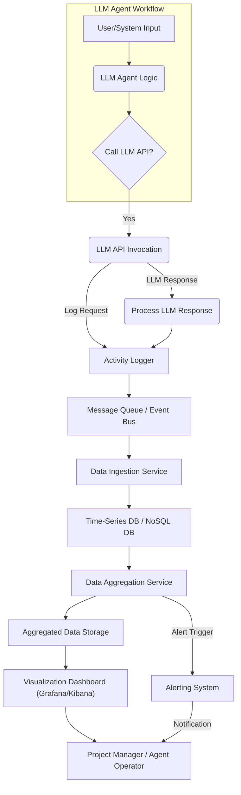

LLM(Large Language Model) 에이전트의 활용이 보편화됨에 따라, 에이전트의 작업 활동을 효과적으로 추적하고 관리하는 기능의 중요성이 커지고 있다. 특히 다수의 에이전트가 다양한 프로젝트에서 동시에 활동하는 경우, 각 에이전트의 기여도, 사용량, 비용 효율성, 그리고 전반적인 작업 흐름을 파악하기 위한 중앙 집중식 관제 시스템은 필수적이다. Porch와 같은 애플리케이션에서 영감을 얻어, LLM 작업 활동 추적 기능은 프로젝트별 LLM 세션 데이터의 기록, 집계, 시각화를 통해 이러한 요구사항을 충족시킨다. 이는 에이전트 활용 현황을 투명하게 공개하고, 비효율적인 프로세스를 식별하여 LLM 기반 워크플로우를 최적화하는 데 핵심적인 역할을 한다. 2026년 현재, LLM 에이전트의 자율성 증대와 함께 이러한 모니터링 및 관제 시스템은 LLM Operations(LLM Ops)의 핵심 구성 요소로 자리매김하고 있다. 개발팀은 이를 통해 LLM 에이전트의 행동을 이해하고, 예측 불가능한 비용 증가를 방지하며, LLM 기반 시스템의 안정성과 신뢰성을 확보할 수 있다.

## LLM 작업 활동 추적 시스템 아키텍처

LLM 작업 활동 추적 시스템은 크게 데이터 수집(Data Ingestion), 데이터 저장(Data Storage), 데이터 처리 및 집계(Data Processing & Aggregation), 그리고 데이터 시각화(Data Visualization)의 네 가지 주요 구성 요소로 나눌 수 있다.

### 1. 데이터 수집

LLM 에이전트의 모든 상호작용은 추적 대상이 된다. 여기에는 프롬프트(Prompt) 입력, LLM 응답(Response) 출력, 사용된 모델(Model ID), 토큰 사용량(Input/Output Tokens), API 호출 비용(Cost), 작업 시작 및 종료 시간(Timestamp), 관련 프로젝트 ID(Project ID), 에이전트 ID(Agent ID), 사용된 도구(Tool Use) 정보 등이 포함된다. 이러한 데이터는 LLM API 호출 레이어 또는 에이전트 프레임워크에 훅(Hook)을 설정하여 실시간으로 수집된다.

```python
import openai
import time
import uuid
from datetime import datetime

def log_llm_activity(project_id: str, agent_id: str, model: str, prompt: str, response: str, usage: dict, cost: float, start_time: float, end_time: float):
    duration = end_time - start_time
    activity_log = {
        "session_id": str(uuid.uuid4()),
        "timestamp": datetime.now().isoformat(),
        "project_id": project_id,
        "agent_id": agent_id,
        "model": model,
        "prompt_text": prompt,
        "response_text": response,
        "input_tokens": usage.get("prompt_tokens"),
        "output_tokens": usage.get("completion_tokens"),
        "total_tokens": usage.get("total_tokens"),
        "cost": cost,
        "duration_seconds": duration
    }
    # 실제 환경에서는 Kafka, RabbitMQ 등의 메시지 큐 또는 직접 DB에 저장
    print(f"LLM Activity Log: {activity_log}")
    return activity_log

def call_llm_with_tracking(project_id: str, agent_id: str, model: str, prompt: str):
    start_time = time.time()
    # 실제 LLM API 호출 (예: OpenAI API)
    try:
        response_obj = openai.chat.completions.create(
            model=model,
            messages=[{"role": "user", "content": prompt}]
        )
        end_time = time.time()
        response_content = response_obj.choices[0].message.content
        usage = response_obj.usage.model_dump()
        # 간단한 비용 계산 (실제 비용 모델은 더 복잡할 수 있음)
        cost_per_token_input = 0.0000005 # 예시 값
        cost_per_token_output = 0.0000015 # 예시 값
        cost = (usage["prompt_tokens"] * cost_per_token_input) + (usage["completion_tokens"] * cost_per_token_output)
        log_llm_activity(project_id, agent_id, model, prompt, response_content, usage, cost, start_time, end_time)
        return response_content
    except Exception as e:
        end_time = time.time()
        log_llm_activity(project_id, agent_id, model, prompt, f"Error: {e}", {}, 0.0, start_time, end_time)
        raise

# 사용 예시
# if __name__ == "__main__":
#     api_key = "YOUR_OPENAI_API_KEY"
#     openai.api_key = api_key
#     try:
#         result = call_llm_with_tracking("project-alpha", "agent-001", "gpt-3.5-turbo", "Explain quantum computing in simple terms.")
#         print(f"LLM Result: {result[:100]}...")
#     except Exception as e:
#         print(f"An error occurred: {e}")
```

### 2. 데이터 저장

수집된 활동 로그는 시간 시리즈 데이터베이스(Time-Series Database) 또는 NoSQL 데이터베이스(예: Elasticsearch, MongoDB)에 저장하는 것이 일반적이다. 이는 대량의 로그 데이터를 효율적으로 저장하고 빠른 쿼리 성능을 제공한다. 데이터는 프로젝트 ID, 에이전트 ID, 타임스탬프를 기준으로 인덱싱되어야 한다.

### 3. 데이터 처리 및 집계

저장된 원시(Raw) 데이터는 주기적으로 또는 실시간으로 집계되어 대시보드 및 보고서에 활용 가능한 형태로 변환된다. 집계 항목에는 일별/주별/월별 프로젝트별 토큰 사용량, 총 비용, 평균 응답 시간, 특정 에이전트의 활동 빈도 등이 포함될 수 있다. Apache Flink, Kafka Streams와 같은 스트림 처리(Stream Processing) 기술을 사용하여 실시간으로 데이터를 집계하거나, Apache Spark, Presto와 같은 배치 처리(Batch Processing) 도구를 활용할 수 있다.

### 4. 데이터 시각화

집계된 데이터는 Grafana, Kibana, Tableau와 같은 BI(Business Intelligence) 도구 또는 커스텀 대시보드를 통해 시각화된다. 시각화는 프로젝트 관리자가 LLM 활용 현황을 한눈에 파악하고 의사결정을 내릴 수 있도록 돕는다. 예를 들어, 특정 프로젝트의 비용이 예상치를 초과하는 경우, 즉시 이상 징후를 감지하고 조치를 취할 수 있다.



## 2026년 최신 트렌드 반영

2026년 LLM 작업 활동 추적 기능은 다음과 같은 트렌드를 반영하여 고도화되고 있다:

*   **멀티 에이전트 및 멀티 LLM 환경 지원**: 단일 LLM을 넘어 여러 에이전트가 다양한 LLM(Claude, GPT, Gemini 등)을 사용하는 복합적인 워크플로우를 통합적으로 추적한다. 각 LLM의 비용 모델, 성능 특성을 고려한 추적이 필수적이다.
*   **세션 지속성 및 컨텍스트 관리**: 장기 실행(Long-running) 에이전트 세션의 컨텍스트(Context)를 추적하여, 에이전트가 어떤 지식을 기반으로 의사결정을 내렸는지, 얼마나 많은 컨텍스트를 유지했는지 파악한다.
*   **Code-level 추적 및 Git 연동**: LLM 에이전트가 생성하거나 수정한 코드 변경사항을 Git 커밋(Commit)과 연동하여, LLM 활동이 실제 코드베이스에 미친 영향을 정확히 파악한다. 이는 `context-engineering/ai-agent-codebase-wiki-contextual-enhancement`와 같은 개념과 시너지를 낸다.
*   **예측 분석을 통한 비용 및 성능 최적화**: 과거 데이터를 기반으로 미래의 LLM 사용량과 비용을 예측하고, 이상 징후를 자동으로 감지하여 선제적으로 대응한다. 이는 `agents/ai-agent-runaway-cost-prevention-control-systems`의 핵심 목표와 일치한다.
*   **AI Agent Harness 및 Control Tower 통합**: LLM 작업 활동 추적 기능은 독립적인 시스템이 아닌, `project-ops/ai-sre-principles-project-control-tower-enhancement`와 같은 전반적인 AI Agent Harness에 통합되어 에이전트의 배포, 모니터링, 관리의 일관성을 제공한다.

## 트레이드오프

### 1. 세부 추적 수준(Granularity) vs. 저장 및 처리 비용(Storage & Processing Cost)
*   **언제 좋고**: 모든 LLM 호출의 상세한 입력/출력, 토큰 사용량, 지연 시간(Latency) 등을 추적하면 에이전트의 행동을 심층적으로 분석하고 디버깅하는 데 매우 유용하다. `agents/llm-agent-observability-spanlens-trace-monitoring`에 기여한다.
*   **언제 나쁜지**: 너무 많은 데이터를 수집하고 저장하면 데이터베이스 스토리지 비용과 데이터 처리 파이프라인의 부하가 기하급수적으로 증가한다. 특히 대규모 운영 환경에서는 비용 효율성을 심각하게 저해할 수 있다.

### 2. 실시간 처리(Real-time Processing) vs. 배치 처리(Batch Processing)
*   **언제 좋고**: LLM 활동을 실시간으로 추적하고 집계하면 비용 초과, 성능 저하와 같은 문제를 즉시 감지하고 대응할 수 있다. `harness-engineering/realtime-llm-app-performance-monitoring-optimization`에 필수적이다.
*   **언제 나쁜지**: 실시간 데이터 처리는 복잡한 인프라(메시지 큐, 스트림 처리 엔진)와 높은 운영 비용을 요구한다. 모든 시나리오에서 실시간 모니터링이 필요한 것은 아니며, 단순 통계나 일별 리포팅에는 배치 처리가 더 효율적일 수 있다.

### 3. 커스텀 개발(Custom Development) vs. 상용/오픈소스 솔루션 활용(Off-the-shelf Solutions)
*   **언제 좋고**: 특정 프로젝트의 고유한 요구사항(예: 커스텀 메트릭, 복잡한 에이전트 워크플로우)에 맞춰 커스텀 개발을 하면 완벽한 제어와 최적화를 달성할 수 있다. `project-ops/software-factory-playbook-architecture-enhancement`에 더 유연하다.
*   **언제 나쁜지**: 개발 및 유지보수 비용이 매우 높고, 시간과 리소스가 많이 소요된다. 기존의 MLOps 플랫폼이나 LLM Observability 도구(예: LangChain Hub, Phoenix, OpenReplay)를 활용하면 개발 부담을 줄이고 검증된 기능을 빠르게 도입할 수 있다.

### 4. 성능 오버헤드(Performance Overhead) vs. 가시성(Visibility) 심층도
*   **언제 좋고**: LLM 호출 전후로 정교한 로깅 및 메트릭 수집 로직을 통합하면 시스템의 투명성을 극대화하여 에이전트의 모든 의사결정 과정을 추적할 수 있다. 이는 `context-engineering/ai-agent-context-management-project-memory` 구축에 필수적이다.
*   **언제 나쁜지**: 로깅 및 메트릭 수집 자체도 컴퓨팅 리소스와 시간을 소모한다. 과도한 추적 로직은 LLM 에이전트의 응답 시간을 지연시키거나 전체 시스템의 처리량을 감소시킬 수 있다. 특히 저지연(Low-latency)이 요구되는 애플리케이션에서는 신중한 설계가 필요하다.

## 실전 체크리스트

LLM 작업 활동 추적 기능을 프로젝트에 성공적으로 통합하기 위한 검증 항목들:

- [ ] **필수 메트릭 정의**: 추적할 핵심 메트릭(토큰 사용량, 비용, 응답 시간, LLM 모델 ID, 프로젝트 ID, 에이전트 ID)이 명확하게 정의되었는가?
- [ ] **LLM 호출 로깅 통합**: 모든 LLM 호출 지점에 활동 로깅 로직이 성공적으로 통합되었으며, 누락 없이 데이터가 수집되는가?
- [ ] **데이터 스토리지 및 보존 정책**: 수집된 대량의 로그 데이터를 효율적으로 저장하고, 검색할 수 있는 데이터베이스 솔루션이 마련되었으며, 데이터 보존 정책이 수립되었는가?
- [ ] **데이터 집계 파이프라인 구축**: 원시 데이터를 프로젝트별/일별/주별 등으로 집계하여 유의미한 통계를 생성하는 파이프라인이 안정적으로 동작하는가?
- [ ] **시각화 대시보드 구현**: 프로젝트 관리자 및 개발자가 LLM 활용 현황을 직관적으로 파악할 수 있는 시각화 대시보드(비용, 사용량, 성능 트렌드)가 구현되었는가?
- [ ] **비용 및 성능 임계치 기반 알림 설정**: LLM 사용 비용이 예상치를 초과하거나, 에이전트의 성능이 저하될 경우 자동으로 알림을 전송하는 시스템이 구축되었는가?
- [ ] **데이터 보안 및 프라이버시 준수**: LLM 활동 로그에 포함될 수 있는 민감 정보에 대한 보안(암호화) 및 프라이버시(접근 제어, 마스킹) 조치가 적절하게 구현되었는가?