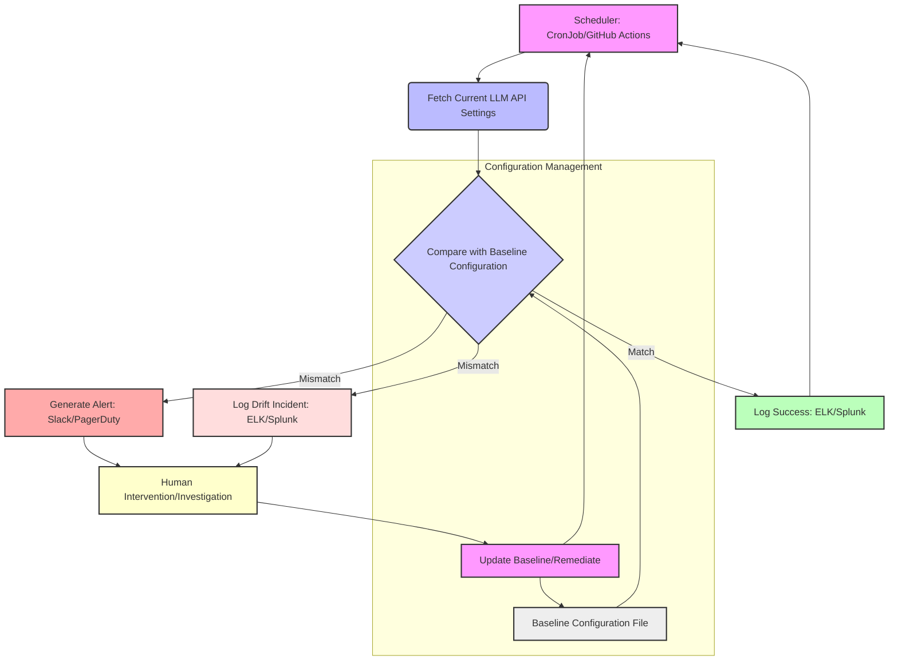

LLM (Large Language Model) 기반 애플리케이션의 운영에서 가장 간과하기 쉬우면서도 치명적인 위험 중 하나는 '프라이버시 설정 드리프트 (Privacy Setting Drift)'이다. 이는 LLM 서비스 제공자(예: OpenAI, Google Gemini)의 API에서 데이터 학습 허용 여부와 같은 민감한 설정이 사용자 의도와 다르게 변경되는 현상을 의미한다. 긱뉴스에서 보고된 사례처럼, 명확히 비활성화했던 설정이 어느 시점엔가 다시 활성화되어 민감한 데이터가 LLM 모델 학습에 사용될 수 있는 위험에 노출될 수 있다. 이러한 무의식적인 설정 변경은 데이터 프라이버시 침해, 규제 위반, 그리고 기업 신뢰도 하락으로 이어질 수 있으므로, 자동화된 감지 및 모니터링 시스템 구축은 2026년 AI 프로젝트 운영의 필수 요소이다.

## 프라이버시 설정 드리프트의 위험성

LLM API는 사용자의 질의(prompt)와 응답(completion) 데이터를 모델 개선을 위한 학습에 활용할 수 있다. 대부분의 서비스는 이러한 데이터 활용 여부를 사용자가 제어할 수 있는 프라이버시 설정을 제공한다. 예를 들어, `data_retention_policy`나 `opt_out_of_data_collection`과 같은 설정이 이에 해당한다. 그러나 이러한 설정이 개발자의 인지 없이 변경되거나, API 업데이트 과정에서 기본값이 변경되어 의도치 않게 활성화될 경우, 기업의 민감 데이터나 사용자 개인 정보가 LLM 제공자 측으로 전송되어 학습에 사용될 수 있다. 이러한 '자동 재활성화'는 시스템의 사각지대에서 발생하며, 보안 및 규제 준수(Compliance) 측면에서 심각한 문제를 야기한다.

## 자동화된 드리프트 감지 및 모니터링 시스템 구축

이러한 위험을 방지하기 위해서는 LLM API의 핵심 프라이버시 설정을 주기적으로 확인하고, 예상치 못한 변경이 발생할 경우 즉시 알림을 발생시키는 자동화된 시스템이 필요하다. 핵심은 현재의 '기준 설정 (Baseline Configuration)'을 정의하고, 주기적인 '현행 설정 (Current Configuration)'과 비교하여 불일치(Drift)를 감지하는 것이다. Gemini API를 예로 들어, Python 기반의 스크립트와 스케줄러를 활용한 모니터링 로직은 다음과 같이 구성될 수 있다.

### 감지 로직 구현 예시 (Python)

```python
import os
import json
import requests
import hashlib
from datetime import datetime

# 환경 변수에서 API 키 로드
GEMINI_API_KEY = os.environ.get("GEMINI_API_KEY")
GEMINI_API_BASE_URL = "https://generativelanguage.googleapis.com/v1beta"

# 알림 채널 설정 (예: Slack Webhook URL)
SLACK_WEBHOOK_URL = os.environ.get("SLACK_WEBHOOK_URL")

# 기준 설정 파일 경로
BASELINE_FILE = "./gemini_privacy_baseline.json"

def get_gemini_privacy_settings():
    """Gemini API에서 현재 프라이버시 관련 설정을 가져옵니다.
       이것은 예시이며, 실제 API는 특정 프라이버시 엔드포인트가 다를 수 있습니다.
    """
    # 실제 Gemini API는 'privacy settings'를 직접 조회하는 엔드포인트가 없을 수 있습니다.
    # 여기서는 account settings, data retention policies 등을 가정합니다.
    # 이 예시에서는 가상의 엔드포인트를 사용합니다.
    headers = {"x-goog-api-key": GEMINI_API_KEY}
    # 가상의 API 엔드포인트 예시
    # 실제로는 'projects/{project_id}/models/{model_id}:get' 같은 엔드포인트에서
    # 반환되는 설정 필드 중 privacy 관련 필드를 추출해야 합니다.
    # 또는 Google Cloud IAM 정책, Data Loss Prevention (DLP) 설정 등을 통합적으로 조회해야 할 수 있습니다.
    try:
        # 이 부분은 실제 API 명세에 따라 구현되어야 합니다.
        # 예를 들어, 특정 모델의 데이터 처리 정책을 조회하는 API를 호출한다고 가정합니다.
        response = requests.get(f"{GEMINI_API_BASE_URL}/users/me/privacySettings", headers=headers, timeout=10)
        response.raise_for_status()
        settings = response.json()

        # 예시로 'data_retention_enabled'와 'training_opt_in' 같은 필드를 추출
        # 실제 API 응답 구조에 맞춰 필드를 선택해야 합니다.
        relevant_settings = {
            "data_retention_enabled": settings.get("dataRetention", {}).get("enabled", True),
            "training_opt_in": settings.get("dataUsage", {}).get("optInForTraining", False),
            "last_checked": datetime.utcnow().isoformat()
        }
        return relevant_settings
    except requests.exceptions.RequestException as e:
        print(f"Error fetching Gemini privacy settings: {e}")
        return None

def save_baseline_settings(settings):
    """기준 설정을 파일에 저장합니다."""
    with open(BASELINE_FILE, "w", encoding="utf-8") as f:
        json.dump(settings, f, indent=4, ensure_ascii=False)
    print(f"Baseline settings saved to {BASELINE_FILE}")

def load_baseline_settings():
    """저장된 기준 설정을 로드합니다."""
    if os.path.exists(BASELINE_FILE):
        with open(BASELINE_FILE, "r", encoding="utf-8") as f:
            return json.load(f)
    return None

def send_slack_notification(message):
    """Slack으로 알림을 보냅니다."""
    if not SLACK_WEBHOOK_URL:
        print("SLACK_WEBHOOK_URL is not set. Skipping Slack notification.")
        return
    try:
        payload = {"text": message}
        response = requests.post(SLACK_WEBHOOK_URL, json=payload, timeout=5)
        response.raise_for_status()
        print("Slack notification sent.")
    except requests.exceptions.RequestException as e:
        print(f"Error sending Slack notification: {e}")

def monitor_privacy_settings():
    """프라이버시 설정을 모니터링하고 드리프트를 감지합니다."""
    current_settings = get_gemini_privacy_settings()
    if not current_settings:
        send_slack_notification(":alert: Gemini 프라이버시 설정 조회 실패! 즉시 확인이 필요합니다.")
        return

    baseline_settings = load_baseline_settings()

    if not baseline_settings:
        print("No baseline settings found. Saving current settings as baseline.")
        save_baseline_settings(current_settings)
        send_slack_notification(":information_source: Gemini 프라이버시 기준 설정이 초기화되었습니다. 현재 설정으로 baseline을 저장했습니다.")
        return
    
    # 'last_checked' 필드는 비교에서 제외하여 실제 설정 변경만 감지
    current_settings_comparable = {k: v for k, v in current_settings.items() if k != 'last_checked'}
    baseline_settings_comparable = {k: v for k, v in baseline_settings.items() if k != 'last_checked'}

    if current_settings_comparable != baseline_settings_comparable:
        drift_message = f":warning: *Gemini 프라이버시 설정 드리프트 감지!*\n"
        drift_message += f"*변경 시점:* {datetime.now().isoformat()}\n"
        drift_message += f"*이전 기준 설정:* {json.dumps(baseline_settings_comparable, indent=2, ensure_ascii=False)}\n"
        drift_message += f"*현재 설정:* {json.dumps(current_settings_comparable, indent=2, ensure_ascii=False)}\n"
        drift_message += "즉시 확인하고 필요한 조치를 취하십시오!"
        send_slack_notification(drift_message)
        
        # 드리프트 발생 시, 새로운 현재 설정을 다음번 비교를 위한 기준으로 저장할지 결정
        # (수동 검토 후 업데이트하는 것을 권장)
        # save_baseline_settings(current_settings)
        print("Privacy setting drift detected and alerted.")
    else:
        print("Gemini privacy settings are consistent with baseline.")

if __name__ == "__main__":
    monitor_privacy_settings()
```

이 스크립트는 `GEMINI_API_KEY`와 `SLACK_WEBHOOK_URL` 환경 변수를 사용하여 LLM 서비스의 가상 프라이버시 설정을 조회하고, 미리 저장된 기준(baseline) 설정과 비교한다. 불일치(Drift)가 감지되면, Slack과 같은 알림 채널을 통해 즉시 경고를 발생시킨다. `baseline` 설정은 첫 실행 시 현재 설정을 저장하거나, 혹은 수동으로 `gemini_privacy_baseline.json` 파일을 생성하여 관리할 수 있다. 실제 프로덕션 환경에서는 이 스크립트를 Jenkins, GitHub Actions, Kubernetes CronJob 등 스케줄링 도구를 이용해 주기적으로 실행해야 한다.

### 모니터링 시스템 아키텍처 다이어그램



이 흐름은 스케줄러가 주기적으로 현재 LLM API의 프라이버시 설정을 가져오고, 저장된 기준 설정과 비교하여 불일치 시 알림을 발생시키고 로그를 기록하는 과정을 보여준다. 인간 개입 후에는 기준 설정을 업데이트하거나 문제를 해결하는 단계로 이어진다.

## 트레이드오프

### 1. 자동화된 설정 드리프트 감지 (Automated Drift Detection)
*   **언제 좋은가 (When Good)**: LLM API의 프라이버시 설정이 예고 없이 변경될 위험이 높은 환경, 규제 준수(Compliance) 요구사항이 엄격한 산업, 수동 모니터링의 한계가 명확한 대규모 시스템에서 유리하다. 초기 발견을 통해 잠재적 데이터 유출 및 법적 문제를 예방하는 데 효과적이다.
*   **언제 나쁜가 (When Bad)**: 감지 로직 구현 및 초기 기준 설정(baseline) 정의에 많은 리소스가 소요될 수 있다. 또한, API 응답 구조의 변경이나 서비스 제공자의 문서화 부족으로 인해 유지보수 비용이 높을 수 있으며, 잘못된 설정으로 인한 False Positive 알림이 발생할 수 있다.

### 2. API 기반 설정 모니터링 (API-Based Configuration Monitoring)
*   **언제 좋은가 (When Good)**: 서비스 제공자가 제공하는 최신 상태의 설정을 가장 정확하게 반영할 수 있으며, 실제 적용된 설정을 직접 검증하여 신뢰성이 높다. 실시간에 가까운 모니터링이 가능하여 빠른 대응을 지원한다.
*   **언제 나쁜가 (When Bad)**: LLM 제공자의 API 안정성과 기능 제공 여부에 전적으로 의존한다. API 변경(Breaking Changes)에 취약하며, 특정 프라이버시 설정을 직접 조회하는 API가 없을 경우 다른 우회적인 방법(예: 계정 설정, IAM 정책)을 찾아야 하므로 구현 복잡성이 증가한다.

### 3. 알림 시스템 통합 (Alert System Integration)
*   **언제 좋은가 (When Good)**: 드리프트 발생 시 즉각적으로 담당자에게 알리고, 기존 인시던트 관리 워크플로우에 통합하여 신속한 대응을 가능하게 한다. 팀 내에서 문제 인지 및 책임감을 높이는 데 기여한다.
*   **언제 나쁜가 (When Bad)**: 부적절하게 구성된 알림은 '알림 피로(Alert Fatigue)'를 유발하여 중요한 경고를 놓치게 할 수 있다. 다양한 알림 채널(Slack, PagerDuty, Email) 간의 연동 및 중복 방지 로직 설계가 필요하며, 알림 메시지의 명확성(Clarity)과 실행 가능성(Actionability)이 떨어진다면 오히려 혼란을 초래할 수 있다.

### 4. 지속적인 감사 로그 기록 (Persistent Audit Logging)
*   **언제 좋은가 (When Good)**: 모든 설정 변경 및 감지 이력을 상세하게 기록하여, 사후 감사(Audit) 및 규제 준수 입증에 필수적인 증거 자료를 제공한다. 문제 발생 시 원인 분석 및 책임 소재 규명에 결정적인 역할을 한다.
*   **언제 나쁜가 (When Bad)**: 로그 저장 및 관리 비용이 발생하며, 대량의 로그 데이터에서 유의미한 정보를 추출하기 위한 복잡한 로그 분석 시스템(ELK Stack, Splunk 등)이 필요할 수 있다. 민감한 정보가 로그에 포함되지 않도록 PII (Personally Identifiable Information) 마스킹 등 추가적인 보안 고려사항이 요구된다.

## 실전 체크리스트

프로젝트에 LLM 프라이버시 설정 드리프트 감지 및 모니터링 시스템을 적용할 때 다음 항목들을 확인해야 한다:

- [ ] 사용 중인 모든 LLM API (예: Gemini, OpenAI)의 `데이터 학습 허용` 또는 유사한 프라이버시 관련 설정에 대한 API 엔드포인트 및 문서화된 최신 가이드를 확인하고 정의했는가?
- [ ] 현재 LLM 프라이버시 설정의 '기준 스냅샷 (Baseline Snapshot)'을 저장하고, 이를 주기적으로 조회되는 '현행 설정 (Current Configuration)'과 비교하는 자동 감지 로직을 구현했는가?
- [ ] 예상치 못한 설정 변경 발생 시, 지정된 채널(Slack, PagerDuty, Email 등)로 즉각적인 알림을 보낼 수 있는 시스템과 연동을 완료했는가?
- [ ] 감지 로직의 실행 주기를 프로덕션 환경의 민감도와 LLM API 호출 비용을 고려하여 정의하고 (예: 1시간, 1일), CronJob 또는 CI/CD 파이프라인을 통해 스케줄링했는가?
- [ ] 모든 LLM을 사용하는 프로젝트 및 서비스에 프라이버시 설정 모니터링이 적용되었는지 그 범위를 확인하고 누락된 부분이 없는가?
- [ ] 설정 변경 이력, 감지 알림, 그리고 관련 대응 조치에 대한 상세한 감사 로그(Audit Log)를 기록하고 안전하게 보관하는 시스템을 구축했는가?
- [ ] 드리프트 감지 시 담당자의 역할과 책임, 그리고 문제 해결을 위한 구체적인 대응 절차(Standard Operating Procedure, SOP)를 수립하고 팀원들에게 공유했는가?