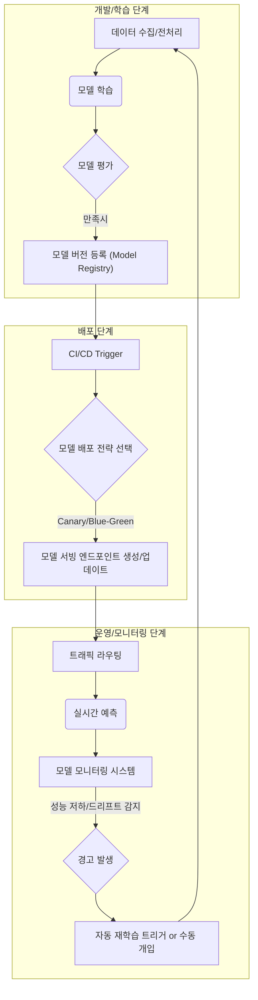

## AI 모델 배포 및 모니터링 파이프라인 개요

AI 프로젝트의 성공은 모델 개발을 넘어, 프로덕션 환경에서의 지속적인 운영 안정성과 성능 관리에 달려 있습니다. MLOps(Machine Learning Operations)는 AI 모델의 개발부터 배포, 운영, 모니터링, 그리고 재학습에 이르는 전체 라이프사이클을 자동화하고 관리하는 일련의 방법론과 도구를 의미합니다. 특히 모델 배포 및 모니터링 파이프라인은 AI 모델이 실제 비즈니스 가치를 창출하고 유지하는 핵심 단계입니다.

### MLOps 파이프라인의 핵심 구성 요소

효과적인 모델 배포 및 모니터링 파이프라인은 다음 구성 요소들을 통합하여 작동합니다.

*   **Model Registry (모델 레지스트리)**: 학습된 모델 아티팩트, 메타데이터, 버전 정보 등을 중앙에서 관리하는 저장소입니다. 배포할 모델의 추적 가능성을 보장하고, 특정 버전의 모델을 쉽게 검색하고 배포할 수 있도록 합니다.
*   **CI/CD for ML (ML을 위한 지속적 통합/지속적 배포)**: 일반 소프트웨어 CI/CD와 유사하나, 코드뿐만 아니라 데이터, 모델 가중치, 환경 설정 등 ML 특유의 아티팩트들을 함께 관리하고 배포합니다.
    *   **CI (Continuous Integration)**: 코드 변경 시 자동 테스트, 모델 학습 및 평가.
    *   **CD (Continuous Delivery/Deployment)**: 검증된 모델을 스테이징 또는 프로덕션 환경으로 자동 배포.
*   **Feature Store (피처 스토어)**: 모델 학습과 서빙에 사용되는 피처(Feature)들을 일관된 형태로 저장, 관리, 제공하는 시스템입니다. 피처 정합성을 보장하여 학습-서빙 스큐(skew)를 방지합니다.
*   **Automated Deployment Strategies (자동화된 배포 전략)**:
    *   **Blue/Green Deployment**: 구 버전(Blue)과 신 버전(Green)을 동시에 운영하다가, 신 버전 검증 후 트래픽을 일괄 전환합니다. 안정적이지만 리소스 비용이 더 듭니다.
    *   **Canary Deployment**: 신 버전 모델을 소수의 사용자에게 먼저 배포하고, 모니터링 후 점진적으로 트래픽을 늘려갑니다. 위험을 최소화하며 점진적 롤아웃이 가능합니다.
*   **Monitoring (모니터링)**: 배포된 모델의 성능, 데이터 품질, 시스템 상태 등을 지속적으로 관찰합니다.
    *   **Model Performance Monitoring**: 예측 정확도, 재현율, F1-Score, latency 등 모델의 비즈니스 지표를 추적합니다.
    *   **Data Drift Detection**: 모델 학습 시 사용된 데이터 분포와 프로덕션 데이터 분포의 변화를 감지합니다.
    *   **Concept Drift Detection**: 입력 데이터의 통계적 특성은 유지되나, 입력-출력 관계 자체가 변하는 현상을 감지합니다.
    *   **Explainable AI (XAI) Monitoring**: 모델 예측의 근거를 분석하고, 특정 예측에 대한 설명력을 모니터링하여 공정성 및 신뢰성을 확보합니다.

### MLOps 파이프라인 아키텍처 예시

다음 Mermaid 다이어그램은 일반적인 AI 모델 배포 및 모니터링 파이프라인의 흐름을 보여줍니다.



### 2026년 최신 트렌드 및 기술 반영

2026년 AI 모델 배포 및 모니터링 분야는 더욱 자동화되고 지능화될 것입니다.

*   **Generative AI MLOps**: 거대 언어 모델(LLM) 및 생성형 AI 모델의 특성을 고려한 특화된 MLOps 파이프라인이 중요해집니다. 프롬프트 버전 관리, 응답 품질 평가 자동화(RAGas, LLM-Evals), Guardrails 모니터링 등이 핵심 요소입니다.
*   **Low-Code/No-Code MLOps Platforms**: 데이터 과학자와 엔지니어가 더 빠르게 모델을 배포하고 관리할 수 있도록, 클라우드 기반의 완전 관리형 MLOps 플랫폼(예: Vertex AI MLOps, SageMaker MLOps, Azure Machine Learning)이 더욱 발전하고 보편화됩니다.
*   **Automated Governance & Compliance**: AI 모델의 공정성(Fairness), 투명성(Transparency), 책임성(Accountability)을 보장하기 위한 자동화된 거버넌스 및 감사(Audit) 기능이 파이프라인에 통합됩니다. 이는 규제 준수(e.g., EU AI Act) 측면에서 필수적입니다.
*   **Real-time Feature Stores**: 실시간 데이터 스트림으로부터 피처를 생성하고 서빙하는 능력이 강화되어, 더욱 동적이고 개인화된 AI 서비스를 가능하게 합니다.

### Python 기반의 모니터링 및 재학습 예시

다음은 간단한 데이터 드리프트 감지 및 경고 로직의 pseudo-code 예시입니다. 실제 시스템에서는 `evidently.ai`, `Fiddler`, `Arize` 등 전문적인 라이브러리나 플랫폼을 활용합니다.

```python
import pandas as pd
from scipy.stats import wasserstein_distance # EMD (Earth Mover's Distance)
import logging
from datetime import datetime

# 로깅 설정
logging.basicConfig(level=logging.INFO, format='%(asctime)s - %(levelname)s - %(message)s')

class ModelMonitor:
    def __init__(self, reference_data: pd.DataFrame, feature_columns: list, threshold: float = 0.1):
        self.reference_data = reference_data[feature_columns]
        self.feature_columns = feature_columns
        self.drift_threshold = threshold
        logging.info("ModelMonitor 초기화: 기준 데이터 설정 완료.")

    def detect_data_drift(self, production_data: pd.DataFrame) -> dict:
        current_data = production_data[self.feature_columns]
        drift_results = {}

        for col in self.feature_columns:
            if col in self.reference_data.columns and col in current_data.columns:
                # 통계적 거리 측정 (예: Wasserstein Distance)
                distance = wasserstein_distance(
                    self.reference_data[col].dropna(),
                    current_data[col].dropna()
                )
                drift_results[col] = {
                    "distance": distance,
                    "is_drifted": distance > self.drift_threshold
                }
                if distance > self.drift_threshold:
                    logging.warning(f"데이터 드리프트 감지됨! 컬럼 '{col}': 거리 {distance:.4f} > 임계치 {self.drift_threshold}")
                else:
                    logging.info(f"데이터 드리프트 없음: 컬럼 '{col}': 거리 {distance:.4f}")
            else:
                logging.warning(f"경고: 컬럼 '{col}'이 기준 데이터 또는 현재 데이터에 없습니다.")
        return drift_results

    def trigger_retraining_if_needed(self, drift_results: dict):
        total_drifted_features = sum(1 for res in drift_results.values() if res["is_drifted"])
        if total_drifted_features > 0:
            logging.info(f"드리프트된 피처 {total_drifted_features}개 감지. 재학습 워크플로우를 트리거합니다.")
            # 실제 재학습 트리거 로직 (예: Airflow, Kubeflow, MLOps 플랫폼 API 호출)
            print(f"[{datetime.now()}] 재학습 파이프라인 시작 요청됨!")
        else:
            logging.info("데이터 드리프트가 심각하지 않아 재학습이 필요 없습니다.")

# 예시 사용
if __name__ == "__main__":
    # 가상 기준 데이터
    ref_data = pd.DataFrame({
        'feature_A': [1.0, 2.0, 3.0, 4.0, 5.0, 6.0],
        'feature_B': [10, 11, 12, 13, 14, 15],
        'feature_C': [0.1, 0.2, 0.3, 0.4, 0.5, 0.6]
    })

    monitor = ModelMonitor(reference_data=ref_data, feature_columns=['feature_A', 'feature_B'], threshold=0.5)

    # 가상 프로덕션 데이터 (드리프트 없음)
    prod_data_no_drift = pd.DataFrame({
        'feature_A': [1.1, 2.1, 3.1, 4.1, 5.1, 6.1],
        'feature_B': [10.2, 11.2, 12.2, 13.2, 14.2, 15.2],
        'feature_C': [0.1, 0.2, 0.3, 0.4, 0.5, 0.6]
    })
    logging.info("--- 드리프트 없는 데이터 테스트 ---")
    results_no_drift = monitor.detect_data_drift(prod_data_no_drift)
    monitor.trigger_retraining_if_needed(results_no_drift)

    # 가상 프로덕션 데이터 (드리프트 있음)
    prod_data_with_drift = pd.DataFrame({
        'feature_A': [5.0, 6.0, 7.0, 8.0, 9.0, 10.0], # A에 드리프트
        'feature_B': [10.2, 11.2, 12.2, 13.2, 14.2, 15.2],
        'feature_C': [0.1, 0.2, 0.3, 0.4, 0.5, 0.6]
    })
    logging.info("--- 드리프트 있는 데이터 테스트 ---")
    results_with_drift = monitor.detect_data_drift(prod_data_with_drift)
    monitor.trigger_retraining_if_needed(results_with_drift)
```

## 트레이드오프

AI 모델 배포 및 모니터링 파이프라인을 구축할 때는 다양한 트레이드오프를 고려해야 합니다.

*   **자동화 수준 (Automation Level) : 완전 자동화 vs. 수동 검증 단계**
    *   **언제 좋은가**: 변화가 잦고 빠른 배포가 요구되는 비즈니스 도메인 (예: 추천 시스템, 광고 최적화)에서는 CI/CD의 완전 자동화가 개발 속도를 극대화합니다. 간단한 모델이나 실험적인 프로젝트에 적합합니다.
    *   **언제 나쁜가**: 금융, 의료 등 규제 준수(Compliance)가 중요하거나 모델 오류의 파급 효과가 큰 도메인에서는 반드시 수동 검토 및 승인 단계를 포함해야 합니다. 복잡하거나 중요한 모델에 대한 예상치 못한 배포 오류 위험을 줄일 수 있습니다.
*   **모니터링 깊이 (Monitoring Depth) : 단순 지표 vs. 심층 분석/XAI**
    *   **언제 좋은가**: 리소스 제약이 있거나 초기 단계 프로젝트의 경우, 모델 성능(Accuracy, F1-Score) 및 기본 시스템 지표(Latency, Throughput)만으로도 충분한 인사이트를 얻을 수 있습니다. 최소한의 비용으로 핵심 문제를 파악합니다.
    *   **언제 나쁜가**: 모델의 결정에 대한 설명이 필요한 경우(예: 대출 승인, 질병 진단) 또는 문제 발생 시 근본 원인 분석이 중요한 경우, XAI 기반의 심층 모니터링이 필수적입니다. 더 많은 리소스와 복잡성을 요구하지만, 문제 해결 시간 단축과 신뢰성 향상에 기여합니다.
*   **인프라 선택 (Infrastructure Choice) : 클라우드 MLOps 플랫폼 vs. 온프레미스/커스텀 스택**
    *   **언제 좋은가**: 빠른 구축, 관리 용이성, 높은 확장성이 필요한 스타트업이나 클라우드 친화적인 기업에는 Vertex AI, SageMaker, Azure ML과 같은 완전 관리형 클라우드 MLOps 플랫폼이 효과적입니다. 인프라 관리에 드는 노력을 줄여 모델 개발에 집중할 수 있습니다.
    *   **언제 나쁜가**: 엄격한 보안 요구사항, 데이터 주권 문제, 특정 하드웨어 활용 또는 벤더 종속성을 피하고 싶은 경우, 온프레미스 또는 Kubernetes 기반의 커스텀 MLOps 스택(예: Kubeflow, MLflow) 구축이 유리합니다. 초기 구축 및 운영 비용과 복잡성이 높지만, 높은 수준의 제어와 유연성을 제공합니다.
*   **모델 업데이트 주기 (Model Update Frequency) : 빈번한 재배포 vs. 안정성 우선**
    *   **언제 좋은가**: 데이터 분포가 빠르게 변하거나, 최신 트렌드를 반영해야 하는 모델(예: 뉴스 추천, 광고 클릭률 예측)은 빈번한 재학습 및 재배포를 통해 성능을 최적화할 수 있습니다. 시장 변화에 빠르게 적응할 수 있습니다.
    *   **언제 나쁜가**: 안정성이 최우선이며, 모델 변경으로 인한 부작용이 큰 모델(예: 사기 탐지, 로봇 제어)은 모델 업데이트 주기를 길게 가져가고 엄격한 검증 절차를 거치는 것이 중요합니다. 예측 불가능한 행동이나 시스템 장애 위험을 최소화합니다.

## 실전 체크리스트

AI 모델 배포 및 모니터링 파이프라인 구축 및 개선 시 다음 항목들을 검증하십시오.

*   [ ] 모든 모델 아티팩트 (코드, 가중치, 환경 설정 등)가 버전 관리 시스템과 연동되어 추적 가능하며, 배포 가능한 형태로 패키징되는가?
*   [ ] CI/CD 파이프라인이 모델 학습, 평가, 스테이징/프로덕션 배포 단계를 자동화하고, 문제 발생 시 즉각적인 롤백(Rollback) 메커니즘을 포함하는가?
*   [ ] 프로덕션 환경에서 모델의 비즈니스 성능 지표(Accuracy, Click-Through Rate 등) 및 기술적 지표(Latency, Throughput)를 실시간으로 모니터링하는 대시보드가 구축되어 있으며, 담당 팀에 경고가 자동으로 전달되는가?
*   [ ] 데이터 드리프트(Data Drift) 및 개념 드리프트(Concept Drift)를 주기적으로 탐지하고, 미리 정의된 임계치를 초과할 경우 재학습(Retraining) 트리거 또는 담당자 알림을 자동화했는가?
*   [ ] 모델 재학습 및 재배포 워크플로우가 완전 또는 부분 자동화되어 있으며, 특정 조건(예: 성능 저하, 데이터 드리프트 임계치 초과)에 따라 자동으로 실행되도록 설정되어 있는가?
*   [ ] 배포된 모델의 Input 및 Output 데이터를 영구적으로 로깅하고 있으며, 이 데이터가 모델 재평가, 디버깅, 그리고 미래 학습 데이터셋 생성에 활용될 수 있도록 접근 가능한 저장소에 구성되어 있는가?
*   [ ] 새로운 모델 버전의 배포 시, A/B 테스트, Canary Deployment 또는 Blue/Green Deployment와 같은 점진적 배포 전략을 지원하여 위험을 최소화하고 모델 성능을 비교 검증할 수 있는가?
*   [ ] 모델의 예측 결과에 대한 설명 가능성(Explainability)을 제공하는 모니터링 도구가 통합되어 있어, 문제 발생 시 예측의 근거를 분석하고 디버깅할 수 있는가?