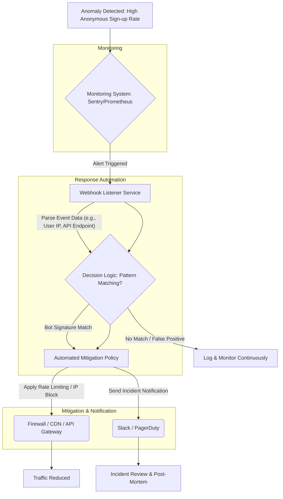

운영 중인 서비스의 안정성은 비즈니스의 지속 가능성과 직결됩니다. 특히 1인 개발자 또는 소규모 팀 환경에서는 예기치 못한 비상 상황이 발생했을 때 시스템 전체에 치명적인 영향을 줄 수 있습니다. 익명 가입 API를 표적으로 한 봇 공격이나 DDoS와 유사한 비정상 트래픽 유입과 같은 사건은 시스템 부하를 가중시키고, 서비스 품질 저하를 넘어 데이터 유출이나 서비스 중단으로 이어질 수 있습니다. 이와 같은 위협에 효과적으로 대응하기 위해 선제적으로 관리 도구를 강화하는 것은 선택이 아닌 필수입니다.

## 비상 관리 도구의 핵심 구성 요소

견고한 비상 관리 도구는 단순한 모니터링을 넘어 이상 징후 감지, 자동화된 대응, 그리고 사후 분석을 위한 체계적인 로깅 기능을 포함해야 합니다.

### 실시간 모니터링 및 이상 징후 감지 (Real-time Monitoring & Anomaly Detection)

문제 발생의 징후를 조기에 포착하는 것이 중요합니다. API 호출 성공률, 응답 시간, 오류율, 사용자 세션 수, 서버 리소스(CPU, 메모리, 네트워크) 사용량 등 핵심 지표(Key Metrics)를 실시간으로 모니터링해야 합니다. 2026년의 최신 트렌드는 AI/ML 기반의 이상 징후 감지 시스템을 통합하여, 단순 임계치(Threshold) 기반의 알림이 놓칠 수 있는 복합적인 패턴의 위협을 식별하는 데 집중합니다. 이는 오탐(False Positive)을 줄이고 실제 위협에 대한 대응력을 높이는 데 기여합니다.

### 자동화된 비상 대응 시스템 (Automated Emergency Response Systems)

알림만으로는 충분하지 않습니다. 위협이 감지되었을 때 즉각적으로 대응할 수 있는 자동화된 로직이 필수적입니다. 이는 비정상 IP 차단, 특정 API에 대한 Rate Limiting 적용, 트래픽 우회, 또는 서비스의 일시적인 기능 저하(Graceful Degradation)와 같은 조치를 포함할 수 있습니다. Sentry와 같은 에러 모니터링 도구의 Webhook 기능을 활용하여 외부 스크립트나 서버리스 함수(Serverless Function)를 트리거하는 방식으로 자동화된 대응 체계를 구축할 수 있습니다.

### 중앙 집중식 관리 대시보드 (Centralized Management Dashboards)

긴급 상황 발생 시 여러 시스템을 오가며 정보를 확인하는 것은 비효율적이며 혼란을 야기합니다. 모든 핵심 지표와 제어 기능이 통합된 중앙 집중식 대시보드는 운영자가 현재 상황을 한눈에 파악하고 신속하게 의사결정 및 수동 개입을 할 수 있도록 돕습니다. Moneyballscore의 Sentry 훅과 Blog-autopilot의 발행 추적 기능을 확장하여 자동화된 비상 대응 로직을 추가하는 것은 이러한 대시보드에서 통합 관리될 때 시너지를 발휘합니다.

### 포렌식 및 사후 분석을 위한 감사 로그 (Audit Logs for Forensics & Post-Mortem)

모든 시스템 이벤트, 사용자 활동, 그리고 자동화된 대응 조치에 대한 상세하고 불변(Immutable)한 감사 로그는 비상 상황 발생 후 원인을 분석하고 재발 방지 대책을 수립하는 데 결정적인 역할을 합니다. 로그는 중앙 집중식으로 수집 및 보관되어야 하며, 보안 침해 사고 발생 시 법적 증거 자료로 활용될 수 있도록 무결성이 유지되어야 합니다.

## Sentry Webhook을 활용한 자동화된 비상 대응 예시

Sentry는 애플리케이션의 에러 및 성능을 모니터링하는 강력한 도구입니다. Sentry의 Webhook 기능을 활용하여 특정 유형의 에러나 이벤트 발생 시 외부 시스템으로 알림을 보내고, 이를 기반으로 자동화된 대응 로직을 실행할 수 있습니다.

다음은 Python Flask 애플리케이션에서 Sentry Webhook을 받아 특정 봇 활동을 감지하고 대응을 제안하는 예시입니다.

```python
# app.py
from flask import Flask, request, jsonify
import logging

app = Flask(__name__)
logging.basicConfig(level=logging.INFO)

@app.route('/sentry-webhook', methods=['POST'])
def sentry_webhook():
    data = request.json
    event = data.get('event')
    
    # Sentry 이벤트 페이로드에서 필요한 정보 추출
    if event and event.get('level') == 'error': # 에러 레벨 이벤트에 반응
        message = event.get('message', 'No message')
        transaction = event.get('transaction', 'Unknown transaction')
        user_ip = event.get('user', {}).get('ip_address', 'N/A')
        
        logging.error(f"Sentry Error Alert: {message} in {transaction}, from IP: {user_ip}")

        # 예시: 특정 봇 활동 패턴 감지 (SafeClick 사례처럼 익명 가입 API 타겟)
        if "anonymous signup API" in message.lower() and user_ip != 'N/A':
            logging.warning(f"Potential bot activity detected from {user_ip}. Initiating mitigation.")
            # 이곳에서 방화벽 API 또는 IP 차단 서비스와 연동하여 실제 조치 실행
            # 예: block_ip_via_firewall(user_ip)
            # send_alert_to_slack(f"Bot attack detected and IP {user_ip} blocked.")
            return jsonify({"status": "Bot activity logged and mitigation suggested"}), 200
    
    return jsonify({"status": "Webhook received, no specific action taken"}), 200

# if __name__ == '__main__':
#     app.run(port=5000)
```

이 코드는 Sentry에서 `error` 레벨 이벤트가 발생했을 때 Webhook을 통해 수신하고, 이벤트 메시지에 "anonymous signup API"와 같은 특정 키워드가 포함되어 있고 유효한 IP 주소가 있다면, 이를 봇 활동으로 간주하여 경고 로그를 남기고 추가적인 완화(Mitigation) 조치를 취하도록 설계되었습니다. 실제 환경에서는 `block_ip_via_firewall(user_ip)`와 같은 함수를 통해 방화벽 규칙을 동적으로 업데이트하거나, CDN(Content Delivery Network) 또는 API Gateway의 보안 정책을 조정하는 방식으로 연동할 수 있습니다.

### 비상 대응 워크플로우 (Emergency Response Workflow)



이 다이어그램은 이상 징후 감지부터 자동화된 완화 조치, 그리고 사후 분석까지의 비상 대응 워크플로우를 보여줍니다. 모니터링 시스템에서 이상이 감지되면 Webhook 리스너 서비스가 호출되고, 이는 결정 로직을 통해 위협 여부를 판단한 후 자동화된 완화 정책을 실행합니다. 동시에 관련 팀에 알림이 전송되어 상황 인지 및 수동 개입 준비를 돕습니다. 최종적으로는 트래픽이 감소하고, 인시던트에 대한 검토 및 분석이 이루어집니다.

## 트레이드오프

관리 도구를 강화하는 과정에는 다양한 트레이드오프가 존재하며, 프로젝트의 특성과 운영 환경에 따라 적절한 균형점을 찾는 것이 중요합니다.

*   **커스텀 솔루션 vs. 상용 솔루션 (Custom Solution vs. Commercial Off-the-Shelf, COTS)**
    *   **언제 좋은가**: 비즈니스 로직이 고유하거나 기존 상용 솔루션으로 커버할 수 없는 특정 요구사항이 많을 때, 또는 비용 효율적인 소규모 운영에서 내부 리소스를 활용할 때 유리합니다.
    *   **언제 나쁜가**: 빠른 도입과 검증된 안정성이 우선시될 때, 또는 자체 개발 및 유지보수에 투입할 리소스와 전문성이 부족할 때 적합하지 않습니다.
*   **완전 자동화 vs. 수동 개입 (Full Automation vs. Manual Intervention)**
    *   **언제 좋은가**: 명확한 패턴의 반복적인 위협(예: 알려진 IP 대역의 봇 공격)에 대해 신속하고 일관된 대응이 필요할 때 운영 효율성을 극대화합니다.
    *   **언제 나쁜가**: 복잡하거나 예측 불가능한 이상 상황(예: 새로운 유형의 공격 패턴)에서 오탐(False Positive)으로 인해 정당한 사용자에게 피해를 주거나 서비스 장애를 유발할 위험이 높을 때 신중해야 합니다.
*   **과도한 모니터링 vs. 핵심 지표 집중 (Over-monitoring vs. Key Metrics Focus)**
    *   **언제 좋은가**: 시스템 초기 단계에서 전체적인 이해가 필요하거나, 잠재적 문제를 조기에 발견하여 선제적으로 대응할 수 있을 때 유리합니다.
    *   **언제 나쁜가**: 모니터링 데이터의 홍수 속에서 실제 중요한 경고를 놓치기 쉽고, 모니터링 인프라 구축 및 유지보수에 과도한 리소스가 낭비될 수 있습니다. 노이즈가 많아 피로도가 증가할 수 있습니다.
*   **보안 강화 vs. 사용자 경험 (Security Enhancement vs. User Experience)**
    *   **언제 좋은가**: 심각한 보안 위협이 감지되어 시스템 보호가 최우선이거나, 규제 준수(Compliance) 요구사항이 높을 때 필수적입니다.
    *   **언제 나쁜가**: 과도한 보안 조치(예: 잦은 CAPTCHA 요청, 엄격한 로그인 제한)는 정당한 사용자에게 불편을 주어 서비스 이탈로 이어질 수 있으며, 평상시 또는 경미한 위협에 일괄 적용 시 사용자 경험을 해칠 수 있습니다.

## 실전 체크리스트

프로젝트의 운영 안정성을 위해 비상 관리 도구를 구축하거나 강화할 때 다음 체크리스트를 활용하여 준비 상태를 점검할 수 있습니다.

*   - [ ] 모든 Critical 서비스에 대한 핵심 지표(Key Performance Indicators, KPI) 및 상태 지표(Health Indicators)가 정의되고 실시간으로 모니터링되고 있는가? (API 호출 성공률, 응답 시간, 오류율, 사용자 세션 수, 리소스 사용량)
*   - [ ] 이상 징후 감지 시, 심각도(Severity)에 따른 명확한 알림 정책과 전파 채널(Slack, PagerDuty, SMS 등)이 설정되어 있으며, 담당자가 즉시 인지하고 대응할 수 있는가?
*   - [ ] 봇 공격이나 비정상적인 트래픽 등 빈번하게 발생하는 비상 상황에 대해 IP 차단, Rate Limiting, 캡챠(CAPTCHA) 도입 등 자동화된 완화(Mitigation) 로직 또는 플레이북이 구축되어 있는가?
*   - [ ] 모든 관리 도구 및 시스템에 대한 접근 제어(Access Control)가 최소 권한(Least Privilege) 원칙에 따라 철저히 관리되고 있으며, 2FA(Two-Factor Authentication)가 적용되어 있는가?
*   - [ ] 비상 상황 발생 시 빠른 진단 및 사후 분석을 위해 시스템 전반에 걸친 감사 로그(Audit Log)가 상세하고 불변(Immutable)하게 기록되고, 중앙 집중식으로 관리되는가?
*   - [ ] 주기적으로 비상 대응 훈련(Incident Response Drill)을 실시하여 자동화된 로직과 수동 개입 절차가 예상대로 작동하는지 검증하고, 팀의 대응 역량을 강화하고 있는가?
*   - [ ] 관리자 대시보드가 현재 시스템 상태를 한눈에 파악할 수 있는 시각화(Visualization) 기능을 제공하며, 긴급 상황 시 필요한 핵심 정보와 제어 기능을 신속하게 제공하는가?
