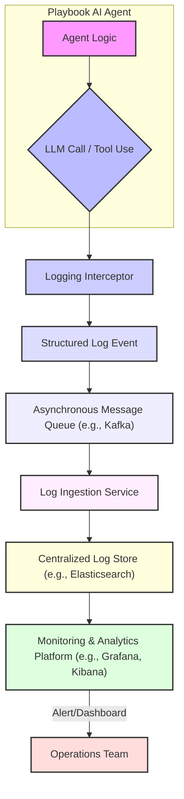

AI 에이전트 기반 시스템, 특히 Playbook과 같이 LLM 호출 및 다양한 에이전트 동작으로 구성된 환경에서 통합 로깅 시스템은 핵심적인 인프라 요소입니다. LLM의 비결정론적 특성으로 인해 발생하는 드리프트(drift)를 감지하고, 복잡한 에이전트 동작의 문제를 진단하기 위해서는 시스템의 모든 LLM 호출(Claude Code 하네스, Gemini retry 등)과 AI 에이전트의 입력, 출력, 그리고 중간 프로세스까지 투명하게 기록하는 것이 필수적입니다. 이러한 통합 로깅은 에이전트의 안정성, 성능, 그리고 예측 가능성을 확보하는 기반이 됩니다.

## 통합 로깅의 중요성

AI 에이전트의 동작은 블랙박스와 같을 수 있으며, 특히 여러 LLM과 외부 도구를 연동하는 복잡한 Playbook 환경에서는 문제가 발생했을 때 근본 원인을 파악하기 어렵습니다. 통합 로깅 시스템은 다음과 같은 문제를 해결합니다:

*   **드리프트 감지 (Drift Detection):** 프롬프트 변경, 모델 업데이트, 혹은 외부 API의 변화로 인해 에이전트의 응답 품질이나 동작 방식이 미묘하게 변화하는 것을 식별합니다. 이는 입력 프롬프트, LLM 응답, 사용된 툴 및 그 결과를 정기적으로 분석함으로써 가능합니다.
*   **문제 진단 및 디버깅:** 에이전트가 예상대로 동작하지 않거나 오류를 발생시킬 때, LLM 호출의 전체 스택, 중간 추론 과정, 툴 사용 내역을 시계열로 추적하여 문제 발생 지점을 정확히 파악합니다.
*   **성능 최적화:** 각 LLM 호출의 지연 시간, 토큰 사용량, API 비용 등을 기록하여 성능 병목 지점을 식별하고 비용 효율적인 운영 전략을 수립합니다.
*   **규제 준수 및 감사:** 에이전트의 모든 결정과 상호작용을 기록하여 규제 요구사항을 충족하고 보안 감사에 대비합니다.

## 시스템 아키텍처 및 핵심 구성 요소

Playbook AI 동작 통합 로깅 시스템은 일반적으로 다음과 같은 구성 요소로 이루어집니다.

1.  **로깅 인터셉터/데코레이터 (Logging Interceptor/Decorator):** LLM 호출, 툴 사용, 에이전트 상태 전이 등 핵심 AI 동작 지점에 삽입되어 로그 데이터를 캡처합니다. 이는 최소한의 오버헤드로 데이터를 수집하도록 설계됩니다.
2.  **구조화된 로그 형식 (Structured Logging Format):** JSON과 같이 기계가 파싱하기 쉬운 형식으로 로그를 생성하여, 추후 분석 및 쿼리 효율성을 높입니다. `correlation_id`를 통해 여러 로그 이벤트를 하나의 에이전트 세션 또는 트랜잭션으로 묶는 것이 중요합니다.
3.  **비동기 로깅 파이프라인 (Asynchronous Logging Pipeline):** 에이전트의 실시간 동작에 영향을 주지 않도록, 수집된 로그 데이터를 비동기적으로 전송 및 처리하는 큐잉 시스템 (예: Kafka, AWS SQS)을 활용합니다.
4.  **중앙 집중식 로그 스토어 (Centralized Log Store):** 수집된 로그 데이터를 저장하고 인덱싱하는 시스템 (예: Elasticsearch, Loki, S3 + Data Lake)입니다. 대용량 데이터를 효율적으로 저장하고 검색할 수 있어야 합니다.
5.  **시각화 및 모니터링 대시보드 (Visualization & Monitoring Dashboards):** Grafana, Kibana, Datadog과 같은 도구를 사용하여 로그 데이터를 시각화하고, 주요 메트릭 (오류율, 지연 시간, 토큰 사용량, 드리프트 지표)을 모니터링하며, 이상 징후 발생 시 알림을 발생시킵니다.



## 실제 코드 예제 (Python)

아래 Python 코드는 LLM 호출 및 에이전트 툴 사용을 추적하기 위한 간단한 로깅 데코레이터 예제입니다. 실제 프로덕션 환경에서는 더 정교한 로깅 프레임워크와 비동기 처리가 필요합니다.

```python
import json
import logging
from functools import wraps
from datetime import datetime
import asyncio

# Configure basic logging for demonstration
logging.basicConfig(level=logging.INFO, format='%(message)s')
logger = logging.getLogger('playbook_ai_logger')

def log_ai_action(action_type: str, agent_id: str):
    """AI 에이전트의 특정 동작을 로깅하는 데코레이터"""
    def decorator(func):
        @wraps(func)
        async def wrapper(*args, **kwargs):
            start_time = datetime.now()
            input_data = {
                "args": [str(arg) for arg in args], # 인자 로깅 (문자열로 간소화)
                "kwargs": {k: str(v) for k, v in kwargs.items()} # 키워드 인자 로깅 (문자열로 간소화)
            }
            log_entry = {
                "timestamp": start_time.isoformat(),
                "agent_id": agent_id,
                "action_type": action_type,
                "function_name": func.__name__,
                "input": input_data,
                "status": "started"
            }
            
            try:
                result = await func(*args, **kwargs)
                end_time = datetime.now()
                log_entry.update({
                    "status": "completed",
                    "output": str(result), # 결과 로깅 (문자열로 간소화)
                    "duration_ms": (end_time - start_time).total_seconds() * 1000
                })
                logger.info(json.dumps(log_entry))
                return result
            except Exception as e:
                end_time = datetime.now()
                log_entry.update({
                    "status": "failed",
                    "error": str(e),
                    "duration_ms": (end_time - start_time).total_seconds() * 1000
                })
                logger.error(json.dumps(log_entry))
                raise
        return wrapper
    return decorator

# Playbook 에이전트 예시
class PlaybookAgent:
    def __init__(self, agent_id: str):
        self.agent_id = agent_id

    @log_ai_action("llm_call", "claude_code_harness_001")
    async def invoke_llm(self, prompt: str, model: str = "claude-3-opus-20240229"):
        """LLM 호출 시뮬레이션"""
        await asyncio.sleep(0.1) # Simulate API call latency
        if "fail_on_purpose" in prompt:
            raise ValueError("Simulated LLM API failure")
        return f"LLM response for prompt: '{prompt[:30]}...'"

    @log_ai_action("tool_use", "agent_tool_executor_001")
    async def execute_external_tool(self, tool_name: str, params: dict):
        """외부 도구 실행 시뮬레이션"""
        await asyncio.sleep(0.05) # Simulate tool execution latency
        print(f"[{self.agent_id}] Executing tool '{tool_name}' with params: {params}")
        return {"tool_name": tool_name, "status": "success", "output_len": len(json.dumps(params))}

async def main():
    agent = PlaybookAgent("my_playbook_instance")
    print("\n--- Successful LLM Call ---")
    await agent.invoke_llm("Generate a detailed plan for building a microservice.")
    
    print("\n--- Successful Tool Use ---")
    await agent.execute_external_tool("code_interpreter", {"language": "python", "code": "print('Hello AI!')"})

    print("\n--- Failed LLM Call ---")
    try:
        await agent.invoke_llm("Generate content and then fail_on_purpose.")
    except ValueError as e:
        print(f"Caught expected error: {e}")

# Run the main asynchronous function
# asyncio.run(main())
```

## 트레이드오프

통합 로깅 시스템 구축 시 고려해야 할 주요 트레이드오프는 다음과 같습니다.

*   **심층 로깅 vs. 성능 오버헤드:**
    *   **언제 좋고:** 모든 입력, 출력, 중간 상태를 상세히 기록하면 드리프트 감지 및 문제 진단에 매우 유용합니다. 비정상적인 동작의 미세한 변화까지 포착할 수 있습니다.
    *   **언제 나쁜지:** 로깅 자체가 에이전트의 응답 시간을 증가시키고, 처리량(throughput)을 저하시킬 수 있습니다. 특히 대규모 병렬 처리 환경에서는 누적된 오버헤드가 상당합니다.
*   **중앙 집중식 로깅 vs. 분산형 처리:**
    *   **언제 좋고:** 모든 로그를 한 곳에 모으면 전체 시스템의 상황을 한눈에 파악하고, 여러 에이전트 간의 상호작용을 쉽게 추적할 수 있습니다. 단일 대시보드에서 분석하기 용이합니다.
    *   **언제 나쁜지:** 중앙 집중식 스토어에 대한 네트워크 부하가 커지고, 단일 실패 지점(Single Point of Failure)이 될 수 있습니다. 또한, 데이터 주권(Data Sovereignty) 또는 규제 요구사항이 엄격한 경우 데이터 이동에 제약이 있을 수 있습니다.
*   **실시간 로깅 vs. 배치 처리:**
    *   **언제 좋고:** 실시간으로 로그를 수집하고 처리하면 문제 발생 시 즉각적인 알림 및 대응이 가능하며, 드리프트를 초기에 감지하여 큰 문제로 확산되는 것을 방지합니다.
    *   **언제 나쁜지:** 실시간 처리 파이프라인은 인프라 구축 및 운영 비용이 높고, 복잡도가 증가합니다. 대량의 로그 데이터를 실시간으로 처리하기 위한 자원이 많이 요구됩니다.
*   **원시 로그 보존 vs. 집계 메트릭:**
    *   **언제 좋고:** 원시(raw) 로그를 보존하면 특정 이슈 발생 시 상세한 포렌식 분석이 가능하며, 예기치 않은 패턴을 발견할 수 있습니다. LLM의 비정형 출력 분석에 필수적입니다.
    *   **언제 나쁜지:** 원시 로그는 엄청난 저장 공간을 필요로 하며, 쿼리 및 분석에 시간이 오래 걸릴 수 있습니다. 집계된 메트릭만으로는 세부적인 맥락을 파악하기 어렵습니다.
*   **PII (개인 식별 정보) 마스킹 vs. 디버깅 용이성:**
    *   **언제 좋고:** PII를 적절히 마스킹하거나 제거하면 개인정보보호 규제(GDPR, CCPA 등)를 준수하고, 데이터 유출 위험을 줄일 수 있습니다.
    *   **언제 나쁜지:** PII 마스킹은 때때로 문제의 특정 컨텍스트를 제거하여 디버깅을 어렵게 만들 수 있습니다. 특히 사용자 입력을 분석해야 하는 경우 제약이 될 수 있습니다.

## 실전 체크리스트

Playbook AI 통합 로깅 시스템을 구축할 때 다음 항목들을 확인하여 성공적인 구현을 보장합니다.

- [ ] **로깅 표준 정의:** 모든 LLM 호출 및 에이전트 동작에 대한 필수 로깅 필드(예: `correlation_id`, `agent_id`, `action_type`, `timestamp`, `input_tokens`, `output_tokens`, `latency_ms`, `status`, `error_message`)를 정의하고 표준화합니다.
- [ ] **구조화된 로깅 구현:** 모든 로그가 JSON과 같은 구조화된 형식으로 출력되도록 하여, 파싱 및 분석의 용이성을 확보합니다.
- [ ] **비동기 로깅 파이프라인 구축:** 에이전트의 핵심 경로(critical path)에서 로깅으로 인한 지연을 최소화하기 위해 메시지 큐(e.g., Kafka, SQS)를 통한 비동기 전송 방식을 적용합니다.
- [ ] **드리프트 감지 지표 설정:** LLM 응답 품질, 툴 사용 패턴, 토큰 사용량, API 오류율 등 주요 지표에 대한 드리프트 임계값을 설정하고, 이에 대한 알림 시스템을 구성합니다.
- [ ] **중앙 집중식 로깅 플랫폼 통합:** Elasticsearch, Splunk, Datadog 등 전문 로깅 및 모니터링 플랫폼과 연동하여 로그 수집, 저장, 검색 및 시각화를 중앙에서 관리합니다.
- [ ] **PII 마스킹/필터링 정책 수립:** 로그 데이터에 포함될 수 있는 PII에 대한 명확한 마스킹, 필터링, 또는 암호화 정책을 정의하고 구현하여 규제 준수를 보장합니다.
- [ ] **로그 데이터 보존 정책:** 비용 및 규제 요구사항을 고려하여 다양한 로그 유형에 대한 보존 기간을 정의하고, 자동으로 아카이빙 또는 삭제되는 시스템을 구축합니다.