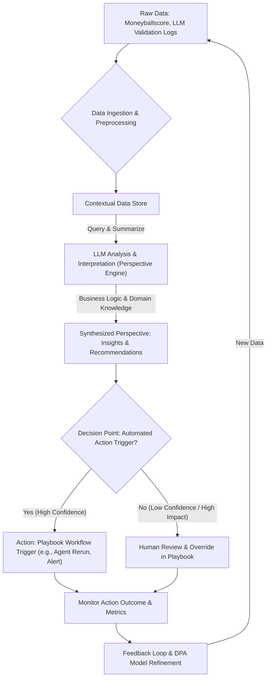

기술 팀의 성공은 단순한 데이터 파이프라인, 스키마, 대시보드의 생산량에 있지 않습니다. 진정한 가치는 조직의 의사결정 변화와 비즈니스 성과 향상에서 비롯됩니다. 이를 위해서는 raw 데이터와 실제 '행동(Action)' 사이에 '관점(Perspective)'이라는 중요한 해석 계층이 필요합니다. '데이터-관점-행동(Data-Perspective-Action, DPA)' 프레임워크는 이러한 간극을 메워, 플레이북을 단순한 정보 기록소를 넘어선 지능적인 '프로젝트 관제탑'이자 '지식 허브'로 변모시킵니다. 이 엔트리에서는 DPA 프레임워크를 플레이북에 효과적으로 도입하는 방안을 다룹니다.

## DPA 프레임워크 이해

DPA 프레임워크는 데이터 팀이 비즈니스 가치를 창출하는 핵심적인 단계를 구조화합니다. 플레이북에 이 프레임워크를 적용함으로써, 우리는 워커 에이전트(예: moneyballscore, blog-autopilot)로부터 수집된 데이터와 LLM 출력 검증 결과를 단순히 나열하는 것을 넘어, 비즈니스 맥락에 따라 해석하고 의미 있는 관점을 도출하여 구체적인 행동으로 이어지도록 자동화 워크플로를 고도화할 수 있습니다.

### Data (데이터)

데이터는 DPA 프레임워크의 기반입니다. 플레이북의 맥락에서는 다음과 같은 형태의 데이터를 포함합니다:

*   **워커 에이전트 생성 데이터**: `moneyballscore`와 같은 지표는 특정 콘텐츠의 품질 점수를 제공하며, `blog-autopilot` 에이전트의 실행 로그는 블로그 콘텐츠 생성 과정의 효율성과 오류율을 나타냅니다. 이들은 정량적, 정성적 원시 데이터를 제공합니다.
*   **LLM 출력 검증 결과**: LLM이 생성한 콘텐츠나 코드에 대한 자동화된 검증(Validation) 및 평가(Evaluation) 결과는 LLM의 성능, 일관성, 의도 부합 여부를 측정하는 중요한 데이터입니다. 예를 들어, 생성된 콘텐츠의 특정 가이드라인 위반 여부, 코드의 컴파일 오류 유무 등이 여기에 해당합니다.
*   **사용자 피드백 및 운영 데이터**: 실제 시스템 운영 중 발생하는 사용자 피드백, 에러 로그, 서비스 지표 등도 중요한 데이터 소스입니다. 이 데이터는 LLM 에이전트의 행동이 실제 비즈니스에 미치는 영향을 직접적으로 보여줍니다.

이러한 데이터는 신뢰할 수 있고 일관된 방식으로 수집되어야 하며, `context-engineering/ai-agent-context-layer-data-warehousing`와 같은 패턴을 통해 효율적으로 관리될 수 있습니다.

### Perspective (관점)

관점은 DPA 프레임워크의 핵심이자 가장 도전적인 부분입니다. 원시 데이터를 비즈니스 맥락에 맞춰 해석하고 의미를 부여하는 단계입니다. LLM은 이 과정에서 강력한 도구로 활용될 수 있습니다. LLM은 방대한 데이터를 분석하여 패턴을 식별하고, 특정 이벤트의 근본 원인을 추론하며, 비즈니스 목표에 비추어 의미 있는 인사이트를 도출합니다.

예를 들어:

*   **Raw Data**: `moneyballscore`가 지난 7일간 평균 20% 하락했습니다. 동시에 `blog-autopilot` 에이전트의 프롬프트 검증 실패율이 15% 증가했습니다.
*   **Perspective (LLM 생성)**: "`moneyballscore` 하락은 `blog-autopilot` 에이전트의 프롬프트 유효성 검사 로직 약화와 연관된 것으로 보입니다. 이는 최신 트렌드 반영 미흡 또는 내부 가이드라인 업데이트 불일치로 인해 콘텐츠 품질이 저하되었을 가능성을 시사합니다. 특히, 최근 배포된 프롬프트 템플릿의 변경사항이 기존 검증 로직과의 충돌을 일으켰을 수 있습니다."

이처럼 관점은 단순한 데이터 요약을 넘어, '왜' 이런 현상이 발생했는지에 대한 가설과 함께 비즈니스적 의미를 제시합니다. 이는 `evaluation/llm-output-validation-automation-failure-prevention` 같은 방식으로 LLM의 해석 능력을 지속적으로 검증하며 고도화될 수 있습니다.

### Action (행동)

행동은 도출된 관점을 바탕으로 취해지는 구체적이고 측정 가능한 조치입니다. 플레이북에 DPA를 통합함으로써, 이러한 행동은 수동적인 지시를 넘어 자동화된 워크플로로 트리거될 수 있습니다. 행동은 비즈니스 목표를 달성하거나 문제를 해결하기 위한 직접적인 개입이 됩니다.

예를 들어, 위의 관점에서 도출될 수 있는 행동은 다음과 같습니다:

*   **Automated Action**: "`blog-autopilot` 에이전트의 프롬프트 유효성 검사 체인을 롤백하고, 최신 가이드라인과의 정합성을 검토하기 위한 `context-engineering/agentic-closed-loop-self-repair-workflow-bug-discovery-fix` 워크플로를 트리거합니다."
*   **Manual Action Suggestion**: "콘텐츠 담당 팀에게 `moneyballscore` 하락 원인에 대한 LLM의 관점을 공유하고, 수동 검토 및 개선을 요청하는 슬랙 알림을 보냅니다."

이러한 행동은 `agents/autonomous-agent-multi-stage-decision-making-patterns`나 `harness-engineering/closed-loop-automation-design-philosophy-feedback-dimension`과 같은 패턴을 통해 더욱 정교하게 설계될 수 있습니다.

## 플레이북 내 DPA 워크플로 구현

플레이북은 DPA 프레임워크를 통합하여 데이터 수집, 관점 도출, 행동 실행의 전 과정을 자동화하고 기록하는 중앙 허브 역할을 합니다.



위 다이어그램은 DPA 프레임워크가 플레이북 내에서 어떻게 동작하는지 보여줍니다. Raw Data는 정제되어 Contextual Data Store에 저장되며, LLM Perspective Engine은 이를 분석하여 관점을 도출합니다. 이 관점은 자동화된 행동을 트리거하거나, 인간의 개입을 요청하여 최종 행동으로 이어집니다. 이후 행동의 결과는 다시 데이터로 수집되어 피드백 루프를 형성, DPA 시스템의 지속적인 개선을 가능하게 합니다.

### 코드 예시: DPA Workflow 스켈레톤 (Python)

다음은 DPA 워크플로의 핵심 단계를 보여주는 Python 의사 코드입니다.

```python
import json
from datetime import datetime

# Placeholder for external systems/agents
def fetch_moneyball_score_data(time_period):
    # Simulate fetching data from moneyballscore worker
    print(f