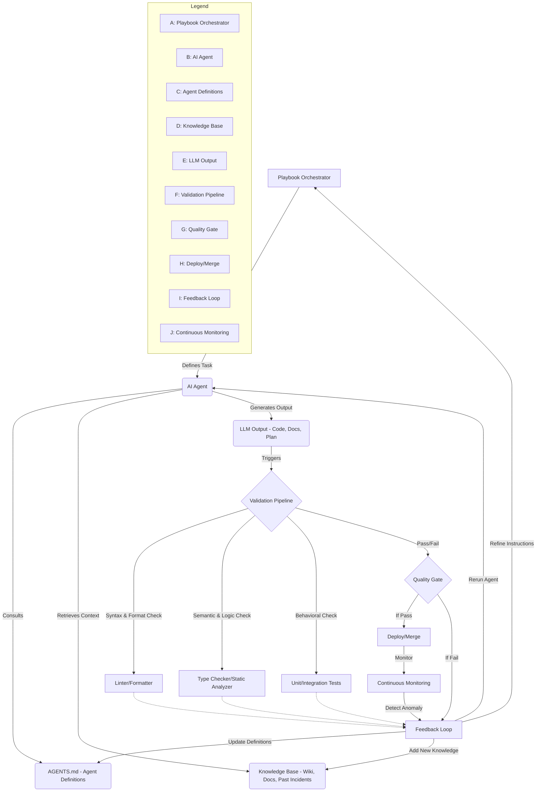

소프트웨어 엔지니어링의 패러다임이 변화하면서, 코드 작성 행위를 넘어 시스템 전체를 `Software Factory` 관점으로 구축하고 관리하는 역할이 중요해지고 있습니다. 이 `Software Factory`는 코드 생성, 테스트, 배포, 유지보수 등 소프트웨어 생명주기 전체를 아우르는 자동화된 시스템을 의미하며, 그 중심에는 `Playbook` 아키텍처가 핵심적인 관제탑(Control Tower) 역할을 수행합니다. `Playbook`은 일련의 자동화된 작업 흐름을 정의하고, 이를 통해 AI 에이전트(Agent)의 행동을 조율하며, 최종적으로 고품질의 소프트웨어 산출물을 보장하는 메커니즘을 제공합니다.

## 핵심 개념: 플레이북, 소프트웨어 팩토리의 관제탑

`Playbook`은 소프트웨어 팩토리의 청사진이자 운영 매뉴얼입니다. 이는 단순히 작업을 나열하는 것을 넘어, 에이전트들이 복잡한 의사결정 경로를 탐색하고, 예상치 못한 상황에 대응하며, 지속적으로 시스템을 개선해 나갈 수 있도록 가이드라인을 제공합니다. 2026년에는 이 `Playbook`이 더욱 지능화되어, 단순 스크립트 실행을 넘어 동적으로 에이전트의 목표와 행동을 조정하는 AI 기반의 오케스트레이터(Orchestrator)로 진화하고 있습니다.

`Playbook`의 궁극적인 목표는 소프트웨어 개발 및 운영의 전 과정에서 인간의 개입을 최소화하면서도, 견고하고 신뢰할 수 있는 결과물을 일관되게 생산하는 것입니다. 이를 위해 `Playbook`은 `AGENTS.md`와 같은 에이전트 정의 파일, 광범위한 지식 베이스(Knowledge Base), 그리고 엄격한 LLM 출력 검증 파이프라인과 긴밀하게 통합됩니다.

## AGENTS.md와 지식 베이스를 통한 에이전트 안내

에이전트의 행동을 효과적으로 제어하고 안내하기 위해 `AGENTS.md` 파일은 에이전트의 역할, 목표, 사용 가능한 도구, 그리고 특정 시나리오에서의 행동 규칙을 명시적으로 정의합니다. 이는 마치 소프트웨어 팩토리 내 각 작업자의 직무 기술서와 같습니다. `Playbook`은 이 `AGENTS.md`를 참조하여 특정 작업에 적합한 에이전트를 활성화하고 그들의 행동 범위를 제한하거나 확장할 수 있습니다.

```markdown
# AGENTS.md

## Agent: CodeReviewer
- **Role**: Review code for style, bugs, security vulnerabilities.
- **Goals**:
  - Ensure code adheres to coding standards.
  - Identify potential security flaws.
  - Provide actionable feedback for code improvement.
- **Tools**:
  - `git diff`
  - `eslint`, `mypy`
  - `bandit` (security linter)
- **Behavior**: Prioritize security and critical bug fixes. Suggest refactoring for readability.

## Agent: DocGenerator
- **Role**: Generate and update technical documentation.
- **Goals**:
  - Create clear and concise API documentation.
  - Maintain up-to-date system architecture diagrams.
- **Tools**:
  - `sphinx`
  - `mermaid-cli`
  - `docusaurus`
- **Behavior**: Extract information from code comments, READMEs, and existing wiki entries. Use `Playbook` for context.
```

지식 베이스는 에이전트가 당면한 문제에 대한 깊이 있는 이해를 돕는 핵심 자원입니다. 기존 프로젝트 문서, 과거 인시던트 보고서, 기술 스택별 가이드, API 문서 등이 여기에 포함됩니다. Karpathy LLM Wiki 패턴에서 제안하듯이, 에이전트는 이 지식 베이스를 `Retrieval Augmented Generation` (RAG) 방식으로 활용하여 컨텍스트를 풍부하게 하고, 보다 정확하고 관련성 높은 결정을 내릴 수 있습니다. `Playbook`은 작업 실행 전 에이전트에 필요한 지식을 동적으로 주입하여(Ambient Knowledge Injection) 의사결정의 품질을 향상시킵니다.

## LLM 출력 검증 파이프라인 (LLM Output Validation Pipeline)

아무리 정교하게 설계된 에이전트라도 LLM의 출력은 때때로 오류를 포함하거나 예상치 못한 결과를 초래할 수 있습니다. `Software Factory`의 신뢰성을 보장하기 위해 LLM 출력에 대한 엄격한 검증 파이프라인은 필수적입니다. 이 파이프라인은 다음과 같은 단계를 포함할 수 있습니다.

1.  **구문 및 형식 검증 (Syntax & Format Validation)**: 생성된 코드가 해당 언어의 구문 규칙을 따르는지, JSON 응답이 올바른 형식인지 확인합니다.
2.  **의미론적 검증 (Semantic Validation)**: 생성된 코드가 의도한 로직을 정확히 구현하는지, 특정 비즈니스 규칙을 위반하지 않는지 검증합니다.
3.  **정적 분석 (Static Analysis)**: 린터(Linter), 타입 체커(Type Checker) 등을 활용하여 잠재적인 버그, 코드 스멜, 보안 취약점을 탐지합니다.
4.  **단위 및 통합 테스트 (Unit & Integration Tests)**: 생성된 코드가 기존 테스트 스위트를 통과하는지 확인하고, 필요한 경우 새로운 테스트 케이스를 동적으로 생성하여 실행합니다.
5.  **인간 검수 및 피드백 루프 (Human Review & Feedback Loop)**: 중요한 변경사항이나 실패 사례에 대해서는 인간 검수자의 최종 승인을 거치고, 그 결과는 지식 베이스와 `AGENTS.md`를 업데이트하는 피드백 루프로 이어집니다.

이러한 다단계 검증 시스템은 에이전트의 자율성을 극대화하면서도, 생성된 소프트웨어 산출물의 품질과 안정성을 최상으로 유지하는 데 기여합니다.

```python
# validation_pipeline.py

import json
import subprocess
from typing import Dict, Any

def validate_llm_code_output(code: str, expected_lang: str) -> Dict[str, Any]:
    results = {"success": True, "errors": []}

    # 1. Syntax Validation (simplified example for Python)
    if expected_lang == "python":
        try:
            compile(code, "<string>", "exec")
        except SyntaxError as e:
            results["success"] = False
            results["errors"].append(f"Syntax Error: {e}")

        # 2. Basic Linting with Pylint (requires pylint installed)
        try:
            with open("temp_code.py", "w") as f:
                f.write(code)
            lint_result = subprocess.run(
                ["pylint", "--rcfile=.pylintrc", "temp_code.py"],
                capture_output=True, text=True, check=False
            )
            if lint_result.returncode != 0 and "No config file found" not in lint_result.stderr:
                results["success"] = False
                results["errors"].append(f"Linting Issues:\n{lint_result.stdout}")
        except FileNotFoundError:
            results["errors"].append("Pylint not found, skipping linting.")
        finally:
            subprocess.run(["rm", "-f", "temp_code.py"], check=False)

    # Further validation logic (e.g., type checking, security scan, unit tests) would go here
    # For brevity, these are omitted in this example.

    return results

# Example usage in a playbook step:
# generated_code = agent_output["code"]
# validation_status = validate_llm_code_output(generated_code, "python")
# if not validation_status["success"]:
#     raise ValueError(f"Validation failed: {validation_status['errors']}")
```

### 소프트웨어 팩토리 플레이북 아키텍처 흐름



## 트레이드오프

소프트웨어 팩토리 관점의 `Playbook` 아키텍처 강화는 상당한 이점을 제공하지만, 몇 가지 트레이드오프를 고려해야 합니다.

*   **초기 복잡성 vs. 장기적 효율성**: 초기 `Playbook` 설계, `AGENTS.md` 정의, 지식 베이스 구축, 검증 파이프라인 구현에 많은 시간과 리소스가 필요합니다. 하지만 일단 시스템이 안정화되면 반복적인 수동 작업을 대폭 줄이고 개발 속도와 품질을 향상시킬 수 있습니다. 즉, **언제 좋고**: 반복적이고 표준화된 작업이 많으며 장기적인 생산성 향상이 목표일 때 좋습니다. **언제 나쁜지**: 단기 프로젝트이거나 요구사항이 매우 유동적인 초기 단계에는 오버헤드가 될 수 있습니다.
*   **표준화 vs. 유연성**: `Playbook`과 `AGENTS.md`를 통해 프로세스를 표준화하면 일관성과 예측 가능성이 높아집니다. 그러나 과도한 표준화는 급변하는 요구사항이나 창의적인 문제 해결에 필요한 유연성을 저해할 수 있습니다. 즉, **언제 좋고**: 고품질의 일관된 산출물이 중요하고 예측 가능한 워크플로우를 가질 때 좋습니다. **언제 나쁜지**: 혁신적이고 탐색적인 개발이 필요한 R&D 단계나 빠른 프로토타이핑 환경에는 부적합할 수 있습니다.
*   **자동화된 에이전트 자율성 vs. 인간 통제**: 에이전트에게 높은 자율성을 부여하면 생산성이 극대화되지만, 통제 불능(Runaway Agent) 상태나 예기치 않은 부작용 발생 시 위험이 커집니다. 엄격한 검증 파이프라인과 `Human-in-the-Loop` 메커니즘으로 균형을 잡아야 합니다. 즉, **언제 좋고**: 잘 정의된 범위 내에서 예측 가능한 작업을 수행할 때 좋습니다. **언제 나쁜지**: 고위험 작업이나 미지의 영역을 탐색하는 작업에는 인간의 직접적인 감독과 개입이 더 중요합니다.
*   **시스템 이해 증진 vs. 코드 작성 필요성**: `Playbook`이 시스템을 자동으로 개선할 수 있도록 돕지만, 여전히 근본적인 시스템 문제를 진단하고 `Playbook` 자체를 개선하기 위해서는 인간 엔지니어가 직접 코드를 이해하고 작성할 필요가 있습니다. 즉, **언제 좋고**: 고수준의 아키텍처 설계 및 `Playbook` 메타 레벨의 개선에 집중할 때 좋습니다. **언제 나쁜지**: 에이전트가 처리할 수 없는 복잡한 버그 디버깅이나 핵심 로직 변경 시에는 인간의 직접적인 코딩이 불가피합니다.

## 실전 체크리스트

소프트웨어 팩토리 관점의 `Playbook` 아키텍처를 프로젝트에 적용할 때 다음 항목들을 검토해야 합니다.

- [ ] `Playbook` 버전 관리 시스템이 구축되어 변경 사항 추적 및 롤백이 가능한가?
- [ ] `AGENTS.md` 파일이 모든 활성 에이전트의 역할, 목표, 사용 가능한 도구, 행동 규칙을 명확하게 정의하고 있는가?
- [ ] 지식 베이스가 최신 상태로 유지되며, 에이전트가 필요한 정보에 효과적으로 접근할 수 있는가 (예: RAG 파이프라인의 효율성)?
- [ ] LLM 출력 검증 파이프라인이 구문/형식, 의미론, 정적 분석, 단위/통합 테스트 단계를 모두 포함하고 각 단계의 커버리지(Coverage)가 충분한가?
- [ ] 검증 실패 시 `Playbook`이 적절한 피드백 루프(예: 에이전트 재실행, 인간 개입 요청, 지식 베이스 업데이트)를 트리거하는가?
- [ ] 에이전트 실행 및 LLM 호출 비용을 모니터링하고 예산 초과를 방지하는 제어 시스템이 작동하고 있는가?
- [ ] `Playbook` 실행 로그 및 에이전트 활동 기록이 상세하게 남아 디버깅 및 감사(Auditing)에 활용될 수 있는가?
